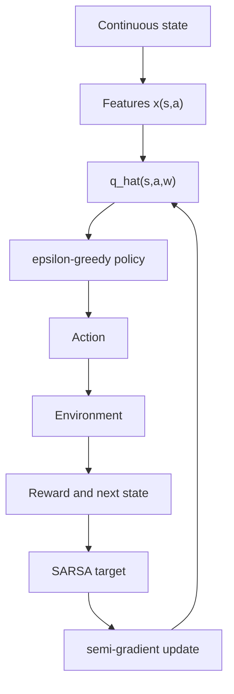

# On-policy Control with Approximation

On-policy control with approximation learns action values or policies when tabular storage is no longer practical. The agent improves the same policy it uses to collect data, often through semi-gradient SARSA. This is the natural approximate counterpart of tabular SARSA: it learns from trajectories generated by the current exploratory policy and updates a parameterized $\hat q(s,a,\mathbf{w})$.

Sutton and Barto use examples such as mountain car to show why approximation is not optional. Continuous states require generalization across nearby situations. The chapter also introduces average reward as a continuing-task objective, which becomes important when discounting is an awkward way to express long-run performance.

## Definitions

An approximate action-value function is

$$
\hat q(s,a,\mathbf{w}) \approx Q_\pi(s,a).
$$

The one-step semi-gradient SARSA update is

$$
\mathbf{w}_{t+1}
=
\mathbf{w}_t
+ \alpha
\left[
R_{t+1}+\gamma \hat q(S_{t+1},A_{t+1},\mathbf{w}_t)
-\hat q(S_t,A_t,\mathbf{w}_t)
\right]
\nabla \hat q(S_t,A_t,\mathbf{w}_t).
$$

The n-step version replaces the one-step target with an n-step action-value return:

$$
G_{t:t+n} =
R_{t+1}+\cdots+\gamma^{n-1}R_{t+n}
+\gamma^n\hat q(S_{t+n},A_{t+n},\mathbf{w}_{t+n-1}).
$$

For continuing problems, the average reward objective uses the long-run average reward rate

$$
r(\pi) = \lim_{h\to\infty}\frac{1}{h}\sum_{t=1}^{h}\mathbb{E}[R_t \mid \pi].
$$

Differential returns compare rewards to the average reward:

$$
G_t = R_{t+1}-r(\pi)+R_{t+2}-r(\pi)+\cdots.
$$

Differential semi-gradient SARSA learns action values relative to an estimated average reward $\bar R$.

## Key results

Semi-gradient SARSA is on-policy, so the target action $A_{t+1}$ is selected by the same behavior policy that is being improved. When the policy is $\epsilon$-greedy with respect to $\hat q$, the learned values reflect the consequences of exploration. This can be desirable in domains where exploratory moves have real costs.

Linear action-value approximation often uses features of both state and action:

$$
\hat q(s,a,\mathbf{w})=\mathbf{w}^\top\mathbf{x}(s,a).
$$

For discrete actions and continuous states, a common construction gives each action its own block of features. Updating one action then changes only that action's weights, while features still generalize across nearby states for the same action.

n-step semi-gradient SARSA can learn faster than one-step SARSA because it propagates reward information over multiple steps. In mountain car, for example, rewards are delayed until the car reaches the goal. Multi-step returns can move useful information farther back along trajectories.

Average-reward control avoids discounting in continuing tasks where there is no natural episode and no reason to prefer earlier reward except through the long-run rate. The differential TD error for action values has the form

$$
\delta_t =
R_{t+1}-\bar R_t+\max_a \hat q(S_{t+1},a,\mathbf{w}_t)
-\hat q(S_t,A_t,\mathbf{w}_t)
$$

for a control variant, with a separate update for $\bar R_t$. In the on-policy SARSA form, the next action value is $\hat q(S_{t+1},A_{t+1},\mathbf{w}_t)$.

Mountain car illustrates why local generalization and multi-step credit assignment matter together. The agent often must move away from the goal to build momentum, so immediate reward and greedy one-step intuition are misleading. A representation such as tile coding lets successful experience near one position-velocity pair influence nearby pairs, while n-step SARSA can propagate the eventual success signal back through the momentum-building sequence.

Control also amplifies approximation errors because the policy depends on the estimates being learned. A small value error can change which action is greedy, which changes the future data distribution, which changes later updates. On-policy methods keep this feedback loop somewhat aligned by learning about the same exploratory policy that generates the data. This does not remove all instability, but it avoids the extra mismatch introduced by off-policy learning.

In average-reward problems, adding a constant to all rewards changes differential values less directly than it changes discounted returns. What matters is reward relative to the long-run rate. This is often a better conceptual fit for continuing control tasks such as queueing, routing, or ongoing resource management.

## Visual



| Setting | Objective | Typical update | Why it matters |
|---|---|---|---|
| Episodic discounted | Expected discounted return | Semi-gradient SARSA | Natural for tasks with terminal goals |
| Episodic n-step | n-step return | Semi-gradient n-step SARSA | Propagates sparse rewards faster |
| Continuing discounted | Discounted return from each time | Discounted TD control | Sometimes mathematically convenient |
| Continuing average reward | Reward rate | Differential SARSA | Better when no start or terminal state matters |

## Worked example 1: Linear action-value SARSA update

Problem: Let $\hat q(s,a,\mathbf{w})=\mathbf{w}^\top\mathbf{x}(s,a)$. Current weights are $\mathbf{w}=(1,0,-1)$. The current feature vector is $\mathbf{x}(s,a)=(1,2,0)$ and the next feature vector is $\mathbf{x}(s',a')=(0,1,1)$. Reward is $3$, $\gamma=0.5$, and $\alpha=0.1$. Compute the one-step semi-gradient SARSA update.

Step 1: Current action-value estimate:

$$
\hat q(s,a)=1(1)+0(2)+(-1)(0)=1.
$$

Step 2: Next action-value estimate:

$$
\hat q(s',a')=1(0)+0(1)+(-1)(1)=-1.
$$

Step 3: SARSA target:

$$
3+0.5(-1)=2.5.
$$

Step 4: TD error:

$$
\delta = 2.5-1=1.5.
$$

Step 5: Gradient is the current feature vector:

$$
\mathbf{w}_{new}
=(1,0,-1)+0.1(1.5)(1,2,0).
$$

Step 6: Compute components:

$$
\mathbf{w}_{new}=(1,0,-1)+(0.15,0.30,0)=(1.15,0.30,-1).
$$

Check: Only weights attached to active current features changed.

## Worked example 2: Differential reward update

Problem: A continuing task uses an average reward estimate $\bar R=1.5$. A transition gives reward $R_{t+1}=2.0$. The current estimate is $\hat q(S_t,A_t)=4.0$ and the next selected action has $\hat q(S_{t+1},A_{t+1})=4.8$. Use $\alpha=0.1$ for the value update and $\beta=0.05$ for the average reward update. Compute the differential SARSA TD error and updates for a scalar active feature of $1$.

Step 1: Differential SARSA error:

$$
\delta = R_{t+1}-\bar R+\hat q(S_{t+1},A_{t+1})-\hat q(S_t,A_t).
$$

Step 2: Substitute:

$$
\delta = 2.0-1.5+4.8-4.0=1.3.
$$

Step 3: Value parameter update with feature $1$:

$$
w_{new}=w+\alpha\delta(1)=w+0.13.
$$

Step 4: Average reward update:

$$
\bar R_{new} = 1.5+\beta\delta = 1.5+0.05(1.3)=1.565.
$$

Check: The reward and next value were better than expected relative to the current average reward, so both the active value parameter and average reward estimate increase.

## Code

```python
import torch

torch.manual_seed(1)
n_states, n_actions = 6, 2
gamma, epsilon = 0.95, 0.1

q_net = torch.nn.Linear(n_states, n_actions, bias=False)
optimizer = torch.optim.SGD(q_net.parameters(), lr=0.1)

def one_hot(s):
    x = torch.zeros(1, n_states)
    x[0, s] = 1.0
    return x

def step(s, a):
    ns = min(5, s + 1) if a == 1 else max(0, s - 1)
    reward = 1.0 if ns == 5 else -0.01
    done = ns == 5
    return ns, reward, done

def choose(s):
    if torch.rand(()) < epsilon:
        return int(torch.randint(n_actions, ()).item())
    with torch.no_grad():
        return int(torch.argmax(q_net(one_hot(s))).item())

for episode in range(100):
    s = 0
    a = choose(s)
    done = False
    while not done:
        ns, r, done = step(s, a)
        na = choose(ns)
        q = q_net(one_hot(s))[0, a]
        with torch.no_grad():
            target = torch.tensor(r) if done else torch.tensor(r) + gamma * q_net(one_hot(ns))[0, na]
        loss = 0.5 * (target - q).pow(2)
        optimizer.zero_grad()
        loss.backward()
        optimizer.step()
        s, a = ns, na

with torch.no_grad():
    print(torch.round(q_net(torch.eye(n_states)) * 1000) / 1000)
```

## Common pitfalls

- Updating the gradient at the next state instead of the current state-action pair. Semi-gradient SARSA differentiates $\hat q(S_t,A_t,\mathbf{w})$.
- Forgetting that on-policy control learns values for the exploratory policy, not an idealized greedy policy during learning.
- Using one shared feature vector for all actions unintentionally. If action identity is omitted, the approximator may be unable to distinguish action values.
- Applying discounted episodic intuition to continuing tasks where average reward is the intended objective.
- Choosing tile widths or feature scales without considering the dynamics. Bad features can make nearby states generalize when they should not.
- Expecting function approximation to fix sparse rewards by itself. n-step targets, traces, and exploration still matter.

## Connections

- [On-policy prediction with approximation](/cs/reinforcement-learning/on-policy-prediction-approximation)
- [Eligibility traces](/cs/reinforcement-learning/eligibility-traces)
- [Policy gradient methods](/cs/reinforcement-learning/policy-gradient-methods)
- [Deep learning](/cs/deep-learning/)
- [Linear algebra](/math/linear-algebra/)
