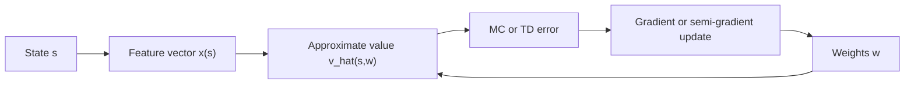

# On-policy Prediction with Approximation

Tabular methods store one value per state or state-action pair. That is impossible when states are numerous, continuous, or described by rich observations. On-policy prediction with approximation replaces the table with a parameterized function $\hat v(s,\mathbf{w})$. The learning problem becomes one of adjusting weights so predictions of return are accurate for states encountered under a policy.

Sutton and Barto present approximation as more than a scaling trick. It changes the objective, the stability questions, and the role of features. With linear methods, tile coding, radial basis functions, Fourier bases, and neural networks, value learning becomes a bridge between reinforcement learning and supervised learning, but the targets are still generated by interaction and bootstrapping.

## Definitions

An approximate state-value function is written

$$
\hat v(s,\mathbf{w}) \approx V_\pi(s),
$$

where $\mathbf{w}\in\mathbb{R}^d$ is a weight vector. In linear approximation,

$$
\hat v(s,\mathbf{w}) = \mathbf{w}^\top \mathbf{x}(s),
$$

where $\mathbf{x}(s)$ is a feature vector.

A common prediction objective is mean squared value error under a state distribution $\mu$:

$$
\overline{\mathrm{VE}}(\mathbf{w})
=
\sum_s \mu(s)\left[V_\pi(s)-\hat v(s,\mathbf{w})\right]^2.
$$

If the true value target were available, a stochastic gradient update would be

$$
\mathbf{w}_{t+1}
=
\mathbf{w}_t
+ \alpha\left[V_\pi(S_t)-\hat v(S_t,\mathbf{w}_t)\right]
\nabla \hat v(S_t,\mathbf{w}_t).
$$

Because $V_\pi(S_t)$ is unknown, Monte Carlo uses $G_t$ as a sampled target:

$$
\mathbf{w}_{t+1}
=
\mathbf{w}_t
+ \alpha\left[G_t-\hat v(S_t,\mathbf{w}_t)\right]
\nabla \hat v(S_t,\mathbf{w}_t).
$$

Semi-gradient TD uses the one-step TD target but treats the target as fixed when differentiating:

$$
\mathbf{w}_{t+1}
=
\mathbf{w}_t
+ \alpha\left[
R_{t+1}+\gamma\hat v(S_{t+1},\mathbf{w}_t)-\hat v(S_t,\mathbf{w}_t)
\right]\nabla \hat v(S_t,\mathbf{w}_t).
$$

## Key results

The "semi" in semi-gradient matters. The TD target contains $\mathbf{w}_t$ through $\hat v(S_{t+1},\mathbf{w}_t)$, but the update does not include the derivative of the target. This is not ordinary gradient descent on mean squared error. It is a practical bootstrapping method that is stable for important on-policy linear cases but can fail in more general off-policy settings.

For linear approximation, the gradient is simply

$$
\nabla \hat v(s,\mathbf{w}) = \mathbf{x}(s),
$$

so semi-gradient TD becomes

$$
\mathbf{w}_{t+1} =
\mathbf{w}_t + \alpha\delta_t\mathbf{x}(S_t),
$$

with

$$
\delta_t =
R_{t+1}+\gamma\mathbf{w}_t^\top\mathbf{x}(S_{t+1})
-\mathbf{w}_t^\top\mathbf{x}(S_t).
$$

Feature construction is crucial. Coarse coding activates broad overlapping regions. Tile coding uses multiple offset grids to create sparse binary features with local generalization. Fourier bases represent smooth functions through cosine features. Radial basis functions use distance to centers. Neural networks learn features and values together but bring nonlinear optimization issues.

Approximation creates generalization. Updating one state changes predictions for other states with overlapping features or shared network parameters. This can be beneficial when the representation captures meaningful similarity, but harmful when unrelated states interfere.

The distribution $\mu$ in the objective is not neutral. On-policy learning emphasizes states visited by the policy. States rarely visited under $\pi$ have little influence on the learned weights, even if their value errors are large.

The approximation objective also reveals why there may be no weight vector that represents the true value exactly. If the feature space cannot express $V_\pi$, learning must choose a compromise. With linear features, the learned value is constrained to a subspace spanned by the feature vectors. With neural networks, the function class is larger but optimization is nonconvex and still shaped by data distribution. Approximation error is therefore not a bug in the algorithm; it is part of the problem definition once tables are abandoned.

Step-size choice becomes more delicate under approximation. In a table, updating one state's entry changes only that state. With shared features, a large update can disrupt many predictions at once. Sparse binary features such as tile coding help because the number of active features is controlled, making reasonable step-size scaling easier. Dense features or neural networks usually require more careful normalization and optimizer choices.

Least-squares and memory-based methods in the chapter show that gradient descent is not the only possible approximation tool. The common thread is still prediction of return under a policy; the difference is how the function approximator represents and fits those predictions.

This is also where notation begins to matter more. The estimate $\hat v(s,\mathbf{w})$ is a deterministic function of weights, while $S_t$ and rewards are random variables generated by interaction. Keeping those roles separate prevents many derivation errors.

## Visual



| Representation | Feature shape | Generalization pattern | Typical strength | Typical weakness |
|---|---|---|---|---|
| Aggregation | One active group | Same value inside group | Very simple | Blocky approximation |
| Coarse coding | Overlapping receptive fields | Nearby states share features | Smooth local generalization | Needs coverage design |
| Tile coding | Sparse binary tilings | Local and computationally efficient | Strong tabular-to-continuous bridge | Many implementation details |
| Fourier basis | Global cosine features | Smooth global functions | Compact for smooth values | Poor for sharp discontinuities |
| RBFs | Distance-to-center features | Smooth local bumps | Intuitive geometry | Center and width selection |
| Neural network | Learned nonlinear features | Data-driven | Flexible | Stability and tuning |

## Worked example 1: Linear semi-gradient TD update

Problem: A value approximator has weights $\mathbf{w}=(1, -2)$ and features $\mathbf{x}(s)=(2,1)$, $\mathbf{x}(s')=(0,3)$. The reward is $R_{t+1}=4$, $\gamma=0.5$, and $\alpha=0.1$. Compute the semi-gradient TD update.

Step 1: Current prediction:

$$
\hat v(s,\mathbf{w}) = (1)(2)+(-2)(1)=0.
$$

Step 2: Next prediction:

$$
\hat v(s',\mathbf{w}) = (1)(0)+(-2)(3)=-6.
$$

Step 3: TD target:

$$
R_{t+1}+\gamma\hat v(s',\mathbf{w}) = 4 + 0.5(-6) = 1.
$$

Step 4: TD error:

$$
\delta = 1 - 0 = 1.
$$

Step 5: Linear gradient is $\mathbf{x}(s)=(2,1)$, so

$$
\mathbf{w}_{new}
=
(1,-2)+0.1(1)(2,1)
=
(1.2,-1.9).
$$

Check: Since the current prediction was too low relative to the target, weights move in the direction that increases $\hat v(s,\mathbf{w})$.

## Worked example 2: Feature overlap and generalization

Problem: A linear value function uses three binary features. State $A$ has $\mathbf{x}(A)=(1,1,0)$ and state $B$ has $\mathbf{x}(B)=(0,1,1)$. Initial weights are $\mathbf{w}=(0,0,0)$. A Monte Carlo update from state $A$ has target $G=10$ and $\alpha=0.2$. How does this update affect predictions for both $A$ and $B$?

Step 1: Prediction for $A$ before the update:

$$
\hat v(A,\mathbf{w})=0.
$$

Step 2: Error:

$$
G-\hat v(A,\mathbf{w})=10-0=10.
$$

Step 3: Weight update:

$$
\mathbf{w}_{new}
=
(0,0,0)+0.2(10)(1,1,0)
=(2,2,0).
$$

Step 4: New prediction for $A$:

$$
\hat v(A,\mathbf{w}_{new})=(2)(1)+(2)(1)+(0)(0)=4.
$$

Step 5: New prediction for $B$:

$$
\hat v(B,\mathbf{w}_{new})=(2)(0)+(2)(1)+(0)(1)=2.
$$

Check: Updating $A$ also changed $B$ because both states share the second feature. This is the central benefit and risk of approximation.

## Code

```python
import torch

torch.manual_seed(0)
gamma = 0.9
alpha = 0.05

# Five states on a line, represented by one scalar feature s / 4.
values = torch.nn.Linear(1, 1, bias=True)
optimizer = torch.optim.SGD(values.parameters(), lr=alpha)

transitions = [
    (0.0, 0.0, 1.0, False),
    (1.0, 0.0, 2.0, False),
    (2.0, 0.0, 3.0, False),
    (3.0, 1.0, 4.0, True),
]

for epoch in range(200):
    for s, r, sp, done in transitions:
        s_tensor = torch.tensor([[s / 4.0]])
        sp_tensor = torch.tensor([[sp / 4.0]])
        v = values(s_tensor)
        with torch.no_grad():
            target = torch.tensor([[r]]) if done else torch.tensor([[r]]) + gamma * values(sp_tensor)
        loss = 0.5 * (target - v).pow(2)
        optimizer.zero_grad()
        loss.backward()
        optimizer.step()

with torch.no_grad():
    grid = torch.arange(5, dtype=torch.float32).view(-1, 1) / 4.0
    print(values(grid).view(-1).round(decimals=3))
```

## Common pitfalls

- Treating function approximation as a table with compression. Shared parameters mean every update can affect many states.
- Forgetting that semi-gradient TD is not true gradient descent on the usual value-error objective.
- Using features with wildly different scales without adjusting step sizes.
- Assuming better supervised-learning fit always means better control. Prediction accuracy under one state distribution may not support policy improvement elsewhere.
- Ignoring the on-policy state distribution. The approximator learns most about states visited by the policy.
- Expecting nonlinear neural networks to inherit all tabular convergence guarantees.

## Connections

- [Temporal-difference learning](/cs/reinforcement-learning/temporal-difference-learning)
- [On-policy control with approximation](/cs/reinforcement-learning/on-policy-control-approximation)
- [Off-policy methods with approximation](/cs/reinforcement-learning/off-policy-approximation)
- [Deep learning](/cs/deep-learning/)
- [Linear algebra](/math/linear-algebra/)
