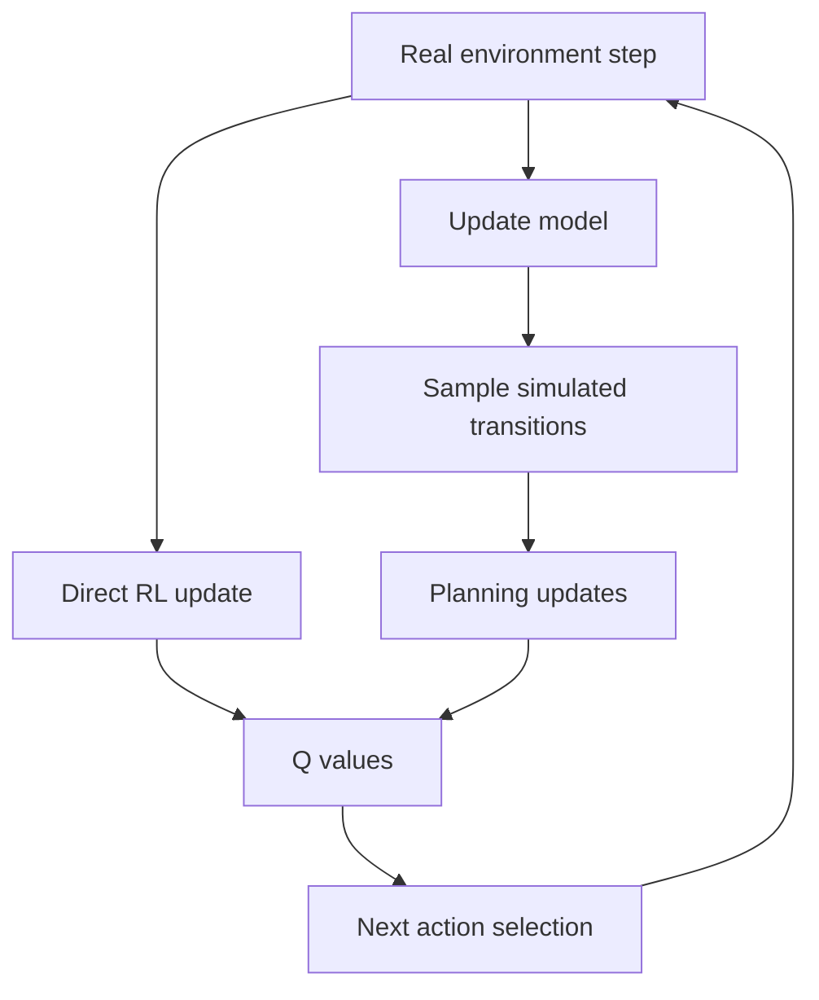

# Planning and Learning with Tabular Methods

Planning and learning meet when an agent uses both real experience and a model. A model may be given, learned, deterministic, stochastic, exact, or approximate. Sutton and Barto's Dyna architecture makes the relationship concrete: real interaction updates values and the model, then simulated experience from the model performs additional value updates.


*Figure: The agent-environment interface is the basic situation that defines reinforcement learning. Image: [Wikimedia Commons](https://commons.wikimedia.org/wiki/File:Agent-environment-diagram-rl.svg), Martin Thoma, CC0.*

This chapter expands the view of reinforcement learning beyond pure trial and error. Dynamic programming is planning from a complete model. TD learning is learning from real experience. Dyna, prioritized sweeping, trajectory sampling, real-time dynamic programming, heuristic search, rollout, and Monte Carlo tree search occupy the space between them. The central question is how to spend limited computation to improve decisions.

## Definitions

A model predicts environment responses. A sample model takes $(s,a)$ and returns a sampled $(s',r)$. A distribution model returns probabilities over possible next states and rewards. In tabular Dyna-Q, the learned model often stores the last observed next state and reward for each experienced state-action pair.

The direct RL update in Dyna-Q is the ordinary Q-learning update from real experience:

$$
Q(S_t,A_t) \leftarrow Q(S_t,A_t) +
\alpha\left[
R_{t+1} + \gamma\max_a Q(S_{t+1},a)-Q(S_t,A_t)
\right].
$$

The planning update uses simulated experience from the model:

$$
S,A \sim \text{previously observed pairs},\qquad
(S',R) \sim \text{Model}(S,A),
$$

then applies the same Q-learning update to $(S,A,R,S')$.

Prioritized sweeping focuses planning backups where they are likely to matter. A priority can be based on the absolute TD error:

$$
P = \left|R+\gamma\max_a Q(S',a)-Q(S,A)\right|.
$$

Predecessor states whose values may be affected are then inserted into a priority queue.

Rollout algorithms use simulations from a current state to evaluate actions under a base policy. Monte Carlo tree search builds a partial search tree from simulated trajectories, balancing exploitation of high-value branches with exploration of under-sampled branches.

## Key results

Planning backups and learning backups can be mathematically identical. The difference is the source of the transition. Real experience comes from the environment; simulated experience comes from the model. This is the key unifying insight of Dyna.

Even a simple model can greatly improve sample efficiency. If each real step is followed by many planning updates, a single transition can influence many related value estimates before the agent acts again. This is useful when real interaction is expensive and computation is relatively cheap.

Model error changes the problem. A wrong model can propagate incorrect values quickly, especially under many planning updates. Dyna-Q+ responds to changing environments by adding an exploration bonus for state-action pairs not tried recently, encouraging the agent to check whether old model predictions have become stale.

Prioritized sweeping is efficient because not all backups are equally useful. If a transition produces a large value change, predecessors of that state may now have inaccurate targets. Backing them up first can spread important information faster than uniform random planning.

Expected updates and sample updates trade computation for variance. An expected update averages over all next states under a distribution model. A sample update draws one next state. Expected updates can be more accurate per backup but more expensive when many next states are possible.

Decision-time planning differs from background planning. In background planning, the agent updates value estimates independently of the immediate action. In decision-time planning, computation is focused on the current state and candidate actions, as in heuristic search or MCTS.

Dyna is especially important because it treats real and simulated experience uniformly after the transition has been produced. The value update does not care whether $(S,A,R,S')$ came from the world or from the model. This makes the architecture modular: better models, better search-control rules, and better value updates can be substituted without changing the overall loop.

Search control is the problem of choosing which simulated backups to perform. Uniform random selection is simple, but it ignores the current planning need. Prioritized sweeping is a search-control method based on expected usefulness. Trajectory sampling is another: by simulating from states likely under the current policy, planning focuses on reachable parts of the state space. Decision-time MCTS focuses even more narrowly on the current root state.

## Visual



| Method | Model use | Search focus | Strength | Risk |
|---|---|---|---|---|
| Dyna-Q | Learned sample model | Random past pairs | Simple integration of learning and planning | Can reinforce wrong model |
| Dyna-Q+ | Learned model plus time bonus | Random past pairs | Adapts better to changes | Bonus needs tuning |
| Prioritized sweeping | Learned predecessors and model | Large-error backups | Efficient propagation | More bookkeeping |
| Trajectory sampling | Model rollouts | On-policy or exploratory trajectories | Focuses reachable states | May neglect rare important states |
| Rollout | Simulated action evaluations | Current decision | Improves a base policy | Computationally expensive |
| MCTS | Partial tree from simulations | Current decision tree | Strong anytime planning | Needs many simulations in hard domains |

## Worked example 1: One Dyna-Q real and planning update

Problem: Current $Q(s,a)=0$. The agent takes action $a$ in state $s$, receives $r=1$, and reaches $s'$. At $s'$, the current action values are $Q(s',0)=2$ and $Q(s',1)=3$. Let $\alpha=0.5$ and $\gamma=0.9$. First perform the real Q-learning update. Then suppose a planning step samples the same transition again; perform that update too.

Step 1: Compute the real target:

$$
\text{target}=1+0.9\max(2,3)=1+2.7=3.7.
$$

Step 2: Real update from $0$:

$$
Q_{\text{after real}}(s,a)=0+0.5(3.7-0)=1.85.
$$

Step 3: Store the model entry:

$$
\text{Model}(s,a)=(s',1).
$$

Step 4: Planning samples $(s,a)$ and predicts $(s',1)$. The target is still $3.7$ because $Q(s',\cdot)$ has not changed in this example.

Step 5: Planning update:

$$
\begin{aligned}
Q_{\text{after plan}}(s,a)
&=1.85+0.5(3.7-1.85)\\
&=1.85+0.925\\
&=2.775.
\end{aligned}
$$

Check: Planning moved the same value closer to the same target without another real environment step. The checked final value is $2.775$.

## Worked example 2: Priority from a TD error

Problem: A predecessor pair $(p,b)$ predicts next state $s$. Its model reward is $R=0$. Current values are $Q(p,b)=4$, $\gamma=0.9$, and $\max_a Q(s,a)=10$. Compute the prioritized-sweeping priority based on absolute TD error.

Step 1: Compute the backup target:

$$
\text{target}=0+0.9(10)=9.
$$

Step 2: Compute the TD error:

$$
\delta = \text{target}-Q(p,b)=9-4=5.
$$

Step 3: Take absolute value:

$$
P=|\delta|=5.
$$

Step 4: Interpret. If the priority queue threshold is, for example, $\theta=0.1$, then priority $5$ is large and this predecessor should be scheduled for backup.

Check: The predecessor value is far below its current target, so a high priority is expected.

## Code

```python
import numpy as np

rng = np.random.default_rng(4)
n_states, n_actions = 6, 2
Q = np.zeros((n_states, n_actions))
model = {}
alpha, gamma, epsilon = 0.2, 0.95, 0.1
planning_steps = 10

def step(s, a):
    # action 1 moves toward terminal 5, action 0 moves left
    ns = min(5, s + 1) if a == 1 else max(0, s - 1)
    reward = 1.0 if ns == 5 else 0.0
    return ns, reward, ns == 5

def choose(s):
    if rng.random() < epsilon:
        return int(rng.integers(n_actions))
    return int(rng.choice(np.flatnonzero(Q[s] == Q[s].max())))

for episode in range(50):
    s, done = 0, False
    while not done:
        a = choose(s)
        ns, r, done = step(s, a)
        Q[s, a] += alpha * (r + gamma * np.max(Q[ns]) * (not done) - Q[s, a])
        model[(s, a)] = (ns, r, done)

        keys = list(model.keys())
        for _ in range(planning_steps):
            ps, pa = keys[int(rng.integers(len(keys)))]
            pns, pr, pdone = model[(ps, pa)]
            target = pr + gamma * np.max(Q[pns]) * (not pdone)
            Q[ps, pa] += alpha * (target - Q[ps, pa])
        s = ns

print(np.round(Q, 3))
print("Greedy actions:", np.argmax(Q, axis=1).tolist())
```

## Common pitfalls

- Assuming model-based means model-perfect. Dyna often learns a model from the same limited experience as the value function.
- Counting planning updates as new evidence from the real environment. They are computational use of a model, and model bias can be repeated many times.
- Planning uniformly forever when only a few state-action pairs have changed. Prioritization can be much more efficient.
- Ignoring changed environments. A once-correct model can become wrong, and the agent may need explicit exploration to discover that.
- Confusing rollout with value iteration. Rollout estimates action quality from simulated trajectories under a base policy; it need not compute global value convergence.
- Treating MCTS as a tabular value-learning algorithm only. It is primarily decision-time planning that grows a search tree from simulations.

## Connections

- [Dynamic programming](/cs/reinforcement-learning/dynamic-programming)
- [Temporal-difference learning](/cs/reinforcement-learning/temporal-difference-learning)
- [n-step bootstrapping](/cs/reinforcement-learning/n-step-bootstrapping)
- [Applications and frontiers](/cs/reinforcement-learning/applications-and-frontiers)
- [Machine learning](/cs/machine-learning/)
