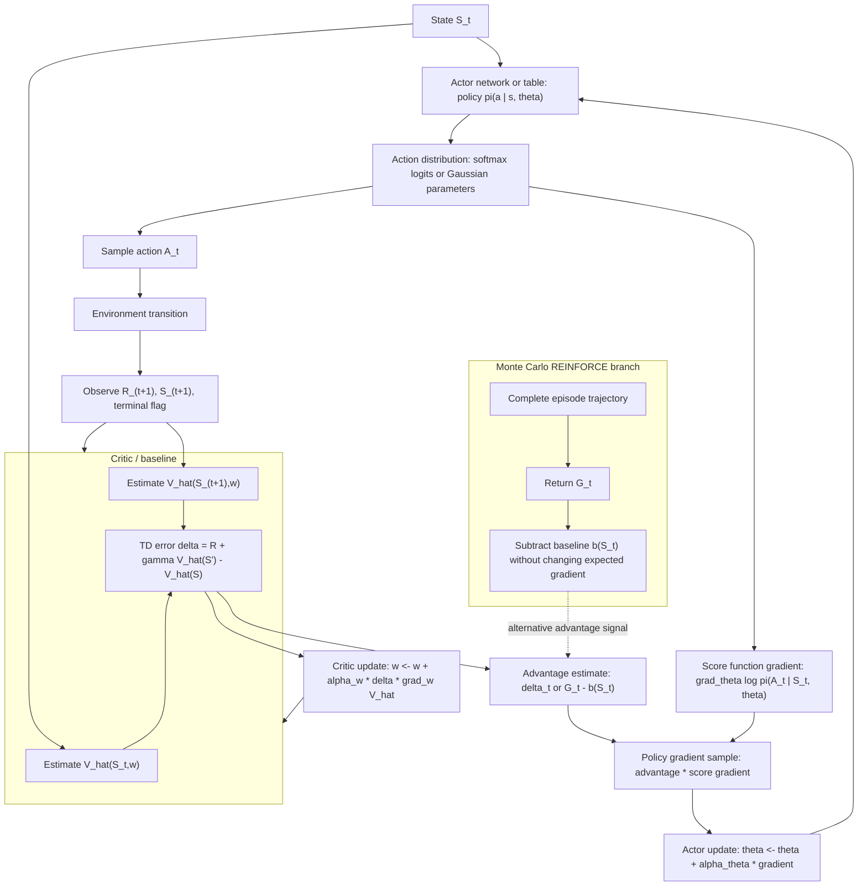

# Policy Gradient Methods

Policy gradient methods optimize a parameterized policy directly. Instead of learning action values and then choosing greedily, the agent adjusts policy parameters in a direction that increases expected return. Sutton and Barto present this as a major alternative to value-based control, especially useful for stochastic policies, continuous action spaces, and settings where smooth changes in behavior are desirable.


*Figure: Cart-pole is a standard control and reinforcement-learning benchmark. Image: [Wikimedia Commons](https://commons.wikimedia.org/wiki/File:Cartpole.gif), Condordellanebbia, CC BY-SA 4.0.*

The basic REINFORCE algorithm uses complete returns to estimate the gradient. Baselines reduce variance without changing the expected gradient. Actor-critic methods combine policy gradients with learned value functions, using the critic's TD error as a lower-variance learning signal for the actor. These methods connect the gradient bandit idea from Chapter 2 to full sequential decision making.

## Definitions

A parameterized policy is written

$$
\pi(a\mid s,\boldsymbol{\theta}),
$$

where $\boldsymbol{\theta}$ are policy parameters. The objective $J(\boldsymbol{\theta})$ is expected return from a start distribution in episodic tasks, or average reward in continuing tasks.

The policy gradient theorem states, in one common episodic form, that

$$
\nabla J(\boldsymbol{\theta})
\propto
\sum_s \mu(s)\sum_a q_\pi(s,a)
\nabla \pi(a\mid s,\boldsymbol{\theta}),
$$

which is often written using the log-derivative trick:

$$
\nabla J(\boldsymbol{\theta})
=
\mathbb{E}_\pi\left[
G_t \nabla \log \pi(A_t\mid S_t,\boldsymbol{\theta})
\right]
$$

for Monte Carlo REINFORCE-style estimates.

The REINFORCE update is

$$
\boldsymbol{\theta}_{t+1}
=
\boldsymbol{\theta}_t
+\alpha G_t
\nabla \log \pi(A_t\mid S_t,\boldsymbol{\theta}_t).
$$

With a baseline $b(S_t)$, the update becomes

$$
\boldsymbol{\theta}_{t+1}
=
\boldsymbol{\theta}_t
+\alpha \left(G_t-b(S_t)\right)
\nabla \log \pi(A_t\mid S_t,\boldsymbol{\theta}_t).
$$

The baseline may depend on the state but not on the action. A learned state-value function is a common baseline.

Actor-critic methods maintain an actor, the policy parameters $\boldsymbol{\theta}$, and a critic, often a value estimate $\hat v(s,\mathbf{w})$. The critic estimates returns or advantages; the actor updates the policy.

## Key results

The log-derivative identity is the algebraic engine:

$$
\nabla \pi(a\mid s,\boldsymbol{\theta})
=
\pi(a\mid s,\boldsymbol{\theta})
\nabla \log \pi(a\mid s,\boldsymbol{\theta}).
$$

It allows gradients of expected returns to be estimated from sampled actions. If an action produced better-than-expected return, increase the log probability of that action in that state; if it produced worse-than-expected return, decrease it.

Baselines reduce variance without biasing the policy gradient. The reason is that

$$
\sum_a b(s)\nabla \pi(a\mid s,\boldsymbol{\theta})
=
b(s)\nabla \sum_a \pi(a\mid s,\boldsymbol{\theta})
=
b(s)\nabla 1
=
0.
$$

Thus subtracting $b(s)$ changes the sample variance but not the expected gradient.

Softmax policies over action preferences are common for discrete actions:

$$
\pi(a\mid s,\boldsymbol{\theta})=
\frac{\exp(h(s,a,\boldsymbol{\theta}))}
\sum_b \exp(h(s,b,\boldsymbol{\theta}))}.
$$

For continuous actions, policies can be parameterized as distributions such as Gaussians, with neural networks outputting means and sometimes variances.

Actor-critic methods trade some bias for lower variance and online learning. A one-step actor-critic update can use

$$
\delta_t=R_{t+1}+\gamma\hat v(S_{t+1},\mathbf{w})-\hat v(S_t,\mathbf{w})
$$

as an estimate of advantage, then update

$$
\boldsymbol{\theta}_{t+1}
=
\boldsymbol{\theta}_t+\alpha_\theta \delta_t
\nabla\log\pi(A_t\mid S_t,\boldsymbol{\theta}_t).
$$

Policy parameterization shapes what improvement is possible. A softmax over preferences can represent any stochastic policy over a finite action set if the preferences are free enough. A Gaussian policy for continuous actions represents a family of probability densities, and learning may adjust the mean, the variance, or both. If the policy class cannot express a good behavior, gradient ascent can only find the best behavior inside that class.

The policy gradient theorem is powerful because it avoids differentiating the state distribution directly. Changing the policy changes which states will be visited in the future, so a naive derivative of expected return appears to require differentiating through the entire Markov chain. The theorem packages those effects into action-value weighting under the on-policy distribution. This is why sampled trajectories can produce usable gradient estimates.

Entropy and stochasticity are not just implementation details. Sutton and Barto emphasize stochastic policies as first-class objects, and policy gradient methods naturally support them. Stochastic policies can explore, represent mixed strategies, and handle action preferences smoothly, whereas greedy value methods often need a separate exploration rule.

Policy gradient methods also make constraints on actions easier to encode. If the policy distribution is defined only over legal actions, the gradient changes probabilities inside that legal set instead of learning values for impossible choices.

## Visual



This policy-gradient diagram exposes the actor, action distribution, sampled action, critic, advantage estimate, score-function gradient, and separate actor/critic parameter updates. Actor-critic uses the TD error as a low-variance advantage estimate, while the REINFORCE branch shows the Monte Carlo return-with-baseline alternative. The score-gradient path makes the central computation visible: increase the log probability of actions whose advantage is positive and decrease it when advantage is negative.

| Method | Policy update signal | Needs value function? | Bias/variance pattern |
|---|---|---|---|
| REINFORCE | Full return $G_t$ | No | Unbiased, high variance |
| REINFORCE with baseline | $G_t-b(S_t)$ | Baseline optional/learned | Same expectation, lower variance |
| Actor-critic | TD error or advantage estimate | Yes | Lower variance, may introduce bias |
| Continuing actor-critic | Differential TD error | Yes | Fits average-reward tasks |
| Gaussian policy gradient | Return times score of density | Often | Handles continuous actions |

## Worked example 1: Softmax policy gradient direction

Problem: In one state, a softmax policy has two action preferences $h_1=0$ and $h_2=1$. Action 2 is selected and the return advantage is $G-b=3$. With step size $\alpha=0.1$, compute the preference update for a tabular softmax policy.

Step 1: Compute action probabilities:

$$
\pi_1=\frac{e^0}{e^0+e^1}=\frac{1}{1+2.718}\approx0.269,
$$

$$
\pi_2=\frac{e^1}{e^0+e^1}=\frac{2.718}{3.718}\approx0.731.
$$

Step 2: For a selected action $A=2$, the tabular softmax score gradients are

$$
\frac{\partial \log\pi_2}{\partial h_2}=1-\pi_2\approx0.269,
$$

and

$$
\frac{\partial \log\pi_2}{\partial h_1}=0-\pi_1\approx-0.269.
$$

Step 3: Multiply by $\alpha(G-b)=0.1(3)=0.3$:

$$
\Delta h_2 = 0.3(0.269)=0.0807,
$$

$$
\Delta h_1 = 0.3(-0.269)=-0.0807.
$$

Check: Because the selected action had positive advantage, its preference increases and the other preference decreases.

## Worked example 2: Baseline leaves expected gradient unchanged

Problem: A state has two actions with probabilities $\pi(a_1)=0.25$ and $\pi(a_2)=0.75$. A baseline $b(s)=7$ is subtracted. Show that the expected baseline contribution to the policy gradient is zero.

Step 1: The baseline contribution is

$$
\sum_a \pi(a\mid s)b(s)\nabla\log\pi(a\mid s).
$$

Step 2: Use $\pi(a)\nabla\log\pi(a)=\nabla\pi(a)$:

$$
b(s)\sum_a \nabla\pi(a\mid s).
$$

Step 3: Move gradient outside the sum:

$$
b(s)\nabla\sum_a\pi(a\mid s).
$$

Step 4: Since probabilities sum to one:

$$
b(s)\nabla 1 = 0.
$$

Check: The numerical probabilities do not matter as long as they form a normalized differentiable policy and the baseline does not depend on the sampled action.

## Code

```python
import torch

torch.manual_seed(2)
n_states, n_actions = 4, 2
policy = torch.nn.Linear(n_states, n_actions, bias=False)
optimizer = torch.optim.Adam(policy.parameters(), lr=0.05)
gamma = 0.9

def one_hot(s):
    x = torch.zeros(n_states)
    x[s] = 1.0
    return x

def step(s, a):
    ns = min(3, s + 1) if a == 1 else max(0, s - 1)
    reward = 1.0 if ns == 3 else -0.02
    done = ns == 3
    return ns, reward, done

for episode in range(200):
    log_probs, rewards = [], []
    s, done = 0, False
    while not done and len(rewards) < 20:
        logits = policy(one_hot(s))
        dist = torch.distributions.Categorical(logits=logits)
        a = dist.sample()
        ns, r, done = step(s, int(a.item()))
        log_probs.append(dist.log_prob(a))
        rewards.append(r)
        s = ns

    G = 0.0
    returns = []
    for r in reversed(rewards):
        G = r + gamma * G
        returns.append(G)
    returns.reverse()
    returns = torch.tensor(returns)
    baseline = returns.mean()
    loss = -sum(lp * (G - baseline) for lp, G in zip(log_probs, returns))
    optimizer.zero_grad()
    loss.backward()
    optimizer.step()

with torch.no_grad():
    for s in range(n_states):
        probs = torch.softmax(policy(one_hot(s)), dim=0)
        print(s, torch.round(probs * 1000) / 1000)
```

## Common pitfalls

- Differentiating through the sampled action as if it were a continuous deterministic output. Policy gradient uses the score $\nabla\log\pi(A_t\mid S_t)$.
- Using a baseline that depends on the action. That can bias the gradient unless handled as an action-dependent control variate with extra care.
- Forgetting the negative sign when implementing gradient ascent with optimizers that minimize losses.
- Expecting REINFORCE to be low variance. Full returns can be noisy, especially for long episodes.
- Treating the critic as ground truth. Actor-critic methods depend on critic quality and can become biased if the critic is poor.
- Collapsing exploration too early by allowing policy probabilities to become nearly deterministic before learning is reliable.

## Connections

- [Multi-armed bandits](/cs/reinforcement-learning/multi-armed-bandits)
- [On-policy control with approximation](/cs/reinforcement-learning/on-policy-control-approximation)
- [Eligibility traces](/cs/reinforcement-learning/eligibility-traces)
- [Deep learning](/cs/deep-learning/)
- [Probability and random variables](/math/probability-and-random-variables/)
