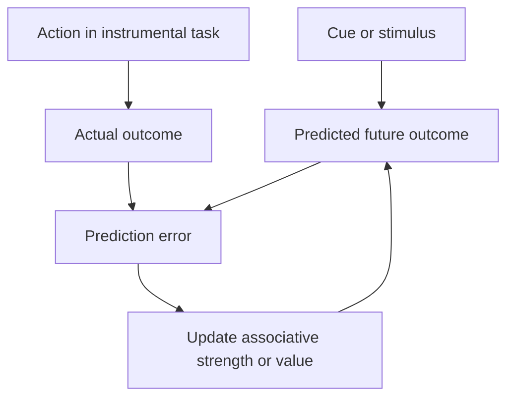

# Psychology Connections

Sutton and Barto connect reinforcement learning to psychology because many RL ideas were shaped by animal learning, conditioning, and theories of delayed reinforcement. The connection is not just metaphorical. Prediction errors, temporal credit assignment, habitual control, and model-based behavior all have psychological counterparts. RL provides formal tools for asking what a learner could infer from reward and stimulus sequences.

The psychology chapter focuses on classical conditioning, instrumental conditioning, delayed reinforcement, cognitive maps, and the distinction between habitual and goal-directed behavior. These topics broaden the meaning of reinforcement learning: it is not only an engineering framework for agents, but also a mathematical language for learning from consequences.

## Definitions

Classical conditioning studies how predictive relationships between stimuli and biologically significant outcomes are learned. A conditioned stimulus can come to predict an unconditioned stimulus. In RL notation, the learner estimates future reward or future outcome from present cues.

The Rescorla-Wagner model updates associative strength using a prediction error:

$$
\Delta V_i = \alpha_i\beta\left(\lambda-\sum_j V_j\right),
$$

where $V_i$ is the associative strength of cue $i$, $\lambda$ represents the outcome magnitude supported by the unconditioned stimulus, and the sum is the current total prediction.

The TD model of conditioning extends this idea through time:

$$
\delta_t = R_{t+1} + \gamma V(S_{t+1}) - V(S_t).
$$

This error can move predictive value backward from the time of reward to earlier cues.

Instrumental conditioning studies how actions are learned because of their consequences. This is closer to RL control: the organism does something, receives consequences, and changes future action tendencies.

A cognitive map is an internal representation of relationships among states or places that can support flexible planning. In RL terms, it resembles a model of the environment or a learned representation useful for model-based control.

Habitual behavior is relatively automatic and stimulus-response-like. Goal-directed behavior is more sensitive to current outcome value and action-outcome knowledge. This resembles the distinction between cached value-based control and model-based planning, though the mapping is not exact.

## Key results

Prediction error is a shared organizing idea. In Rescorla-Wagner learning, surprise is the difference between obtained outcome and predicted outcome. In TD learning, surprise is the difference between reward plus next value and current value. The TD version handles temporally extended predictions, making it better suited to delayed outcomes.

Blocking is a classic demonstration. If cue A already predicts food, then presenting A together with a new cue B followed by food may produce little learning about B. The total prediction from A leaves little prediction error for B. This is naturally expressed by error-correction learning.

Higher-order conditioning also fits a prediction view. A cue can become predictive not by direct pairing with reward, but by pairing with another cue that already predicts reward. TD methods can move value backward through chains of cues.

Instrumental learning requires action selection. Classical conditioning can be modeled as prediction without choice, but instrumental conditioning asks which action an agent should take. RL control algorithms add policies and action values to prediction-error learning.

Delayed reinforcement is one of RL's central problems. Psychological learning cannot be explained only by immediate reward following an action; organisms often learn from consequences separated by time. Returns, value functions, TD errors, and traces formalize ways to assign credit across delays.

The habitual versus goal-directed distinction maps to two computational strategies. Cached action values can produce efficient habits but adapt slowly when outcome value changes. Model-based planning can adapt flexibly by recomputing consequences, but it is computationally more expensive.

The psychological perspective also sharpens the distinction between prediction and control. A conditioning experiment may ask whether a cue predicts food, shock, or another cue; no deliberate action is required from the learner. An instrumental task asks whether pressing a lever, turning left, or waiting changes what happens. Sutton and Barto use both kinds of evidence because RL contains both prediction algorithms and control algorithms, and the same prediction-error machinery can participate in each.

Delayed reinforcement is the point where simple stimulus-response accounts become strained. If an action is followed by many neutral events and only later by reward, a learner needs some way to connect early behavior with later consequence. Eligibility traces, TD errors, and value functions are formal answers. Psychology supplies phenomena that make this problem concrete; RL supplies algorithms that specify exactly how the credit could be assigned.

Cognitive maps emphasize that learned behavior need not be only cached action preference. If an organism knows something about the structure of a maze, it may adapt quickly when a goal location changes. In RL language, that flexibility suggests a model or representation that can support planning, not merely a table of past action returns.

The psychology material also gives historical context for why reinforcement learning is not simply optimization with delayed labels. Many concepts in RL, including prediction errors and reinforcement, were influenced by attempts to explain behavior. The algorithms are mathematical, but the questions they answer are partly behavioral: what is learned, when is it expressed, and how do consequences alter future action?

That historical link helps explain the book's emphasis on online learning. Animals do not usually receive a finished dataset and then train offline; they act, observe, and adapt while consequences unfold. This is exactly the setting where TD learning and traces are most natural.

## Visual



| Psychology topic | RL analogue | Main idea | Sutton-Barto connection |
|---|---|---|---|
| Classical conditioning | Value prediction | Cues predict future outcomes | TD error moves predictions through time |
| Blocking | Error correction | No surprise means little learning | Rescorla-Wagner and TD prediction |
| Instrumental conditioning | Control | Actions change consequences | Policies and action values |
| Delayed reinforcement | Return and credit assignment | Consequences arrive later | TD, n-step methods, traces |
| Cognitive maps | Models and state representations | Internal structure supports planning | Model-based RL |
| Habits | Cached values | Fast learned responses | Model-free control |
| Goal-directed behavior | Planning with a model | Flexible consequence evaluation | Model-based control |

## Worked example 1: Rescorla-Wagner blocking calculation

Problem: Cue A has already learned associative strength $V_A=0.9$. A new cue B has $V_B=0$. The outcome has $\lambda=1$. Let $\alpha_B\beta=0.2$. On a compound trial AB followed by the outcome, compute the change in $V_B$.

Step 1: Compute total prediction:

$$
V_A+V_B=0.9+0=0.9.
$$

Step 2: Compute prediction error:

$$
\lambda-(V_A+V_B)=1-0.9=0.1.
$$

Step 3: Apply the update for cue B:

$$
\Delta V_B = 0.2(0.1)=0.02.
$$

Step 4: New value for B:

$$
V_B \leftarrow 0+0.02=0.02.
$$

Check: B learns very little because A already predicted most of the outcome. If A had $V_A=0$, the same trial would give $\Delta V_B=0.2$, ten times larger.

## Worked example 2: TD error moving value to an earlier cue

Problem: A two-state cue sequence has $S_0=\text{tone}$, $S_1=\text{food delivery}$, then reward $R_2=1$ and termination. Initially $V(\text{tone})=0$ and $V(\text{food delivery})=0.8$. Let reward after tone be $R_1=0$, $\gamma=1$, and $\alpha=0.1$. Compute the TD update at the tone.

Step 1: TD target at the tone:

$$
R_1+\gamma V(S_1)=0+1(0.8)=0.8.
$$

Step 2: Current tone prediction:

$$
V(S_0)=0.
$$

Step 3: TD error:

$$
\delta_0=0.8-0=0.8.
$$

Step 4: Update the tone value:

$$
V_{\text{new}}(\text{tone})=0+0.1(0.8)=0.08.
$$

Check: The tone gained predictive value even though no reward occurred immediately after it. TD learning moved value backward from the later food-predictive state.

## Code

```python
import numpy as np

alpha = 0.1
gamma = 1.0
V = np.zeros(5)
reward_time = 4

history = []
for trial in range(50):
    states = [0, 1, 2, 3, 4]
    rewards = [0, 0, 0, 0, 1]
    deltas = []
    for t in range(len(states) - 1):
        s, sp = states[t], states[t + 1]
        delta = rewards[t] + gamma * V[sp] - V[s]
        V[s] += alpha * delta
        deltas.append(delta)
    terminal_delta = rewards[-1] - V[states[-1]]
    V[states[-1]] += alpha * terminal_delta
    deltas.append(terminal_delta)
    history.append(deltas)

print("Learned predictions before reward:", np.round(V, 3))
print("Last trial TD errors:", np.round(history[-1], 3))
```

## Common pitfalls

- Treating psychological terms as exact synonyms for RL terms. The analogies are useful, but experiments and algorithms are not identical.
- Modeling conditioning as immediate reward only. Many conditioning effects depend on predictions over time.
- Forgetting that Rescorla-Wagner is not a control algorithm. It predicts associative strength; it does not choose actions.
- Assuming habits are bad and planning is good. Habits can be efficient, while planning can be slow or based on wrong models.
- Ignoring state representation. A conditioning model's predictions depend on how cues and contexts are encoded as states or features.
- Overclaiming biological or psychological realism from a simple TD equation. The formal match is informative but incomplete.

## Connections

- [Temporal-difference learning](/cs/reinforcement-learning/temporal-difference-learning)
- [Eligibility traces](/cs/reinforcement-learning/eligibility-traces)
- [Planning and learning with tabular methods](/cs/reinforcement-learning/planning-and-learning)
- [Neuroscience connections](/cs/reinforcement-learning/neuroscience-connections)
- [Machine learning](/cs/machine-learning/)
