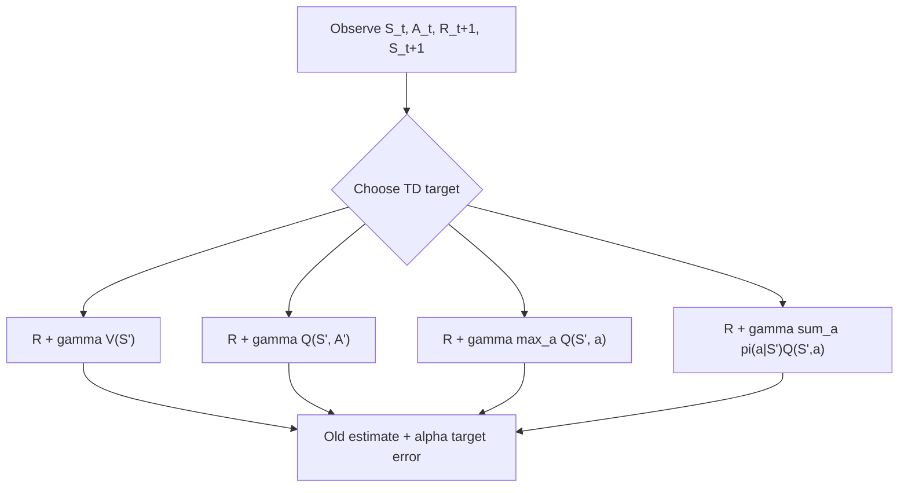

# Temporal-Difference Learning

Temporal-difference learning combines two ideas that earlier appeared separately: sampling from Monte Carlo methods and bootstrapping from dynamic programming. A TD method learns from actual experience, but it does not wait for the final return. It updates a value estimate toward a target that includes the observed reward plus the current estimate of the next state's value.

This makes TD learning central in Sutton and Barto's account. TD(0), SARSA, Q-learning, Expected SARSA, and Double Q-learning are compact algorithms that explain much of tabular RL practice. They also introduce themes that continue through approximation: bootstrapping bias, online learning, off-policy control, and maximization bias.

## Definitions

TD(0) prediction for a fixed policy $\pi$ updates

$$
V(S_t) \leftarrow V(S_t) +
\alpha\left[
R_{t+1} + \gamma V(S_{t+1}) - V(S_t)
\right].
$$

The quantity

$$
\delta_t = R_{t+1} + \gamma V(S_{t+1}) - V(S_t)
$$

is the TD error. It measures the discrepancy between the current value and a one-step bootstrapped target.

SARSA is on-policy TD control. Its name comes from the transition tuple

$$
S_t,A_t,R_{t+1},S_{t+1},A_{t+1}.
$$

The update is

$$
Q(S_t,A_t) \leftarrow Q(S_t,A_t) +
\alpha\left[
R_{t+1}+\gamma Q(S_{t+1},A_{t+1})-Q(S_t,A_t)
\right].
$$

Q-learning is off-policy TD control:

$$
Q(S_t,A_t) \leftarrow Q(S_t,A_t) +
\alpha\left[
R_{t+1}+\gamma \max_a Q(S_{t+1},a)-Q(S_t,A_t)
\right].
$$

Expected SARSA replaces the sampled next action value with the expectation under the current policy:

$$
Q(S_t,A_t) \leftarrow Q(S_t,A_t) +
\alpha\left[
R_{t+1}+\gamma \sum_a \pi(a \mid S_{t+1})Q(S_{t+1},a)-Q(S_t,A_t)
\right].
$$

Double Q-learning maintains two value estimates and uses one to select the maximizing action while the other evaluates it, reducing maximization bias.

## Key results

TD methods can learn before an episode ends. This is a major operational advantage over Monte Carlo learning for long or continuing tasks. A single transition gives a valid TD update because the target uses $R_{t+1}$ and the current estimate for the remaining return.

TD(0) has a bias-variance tradeoff relative to Monte Carlo prediction. The TD target is biased when $V(S_{t+1})$ is inaccurate, but it often has lower variance because it does not include all future random rewards. Monte Carlo targets are unbiased samples of the return but can have high variance.

For tabular prediction under a fixed policy, TD(0) converges to $V_\pi$ under standard stochastic approximation conditions, such as sufficient state visitation and decreasing step sizes satisfying

$$
\sum_t \alpha_t = \infty,\qquad \sum_t \alpha_t^2 < \infty.
$$

SARSA learns the value of the policy it actually follows. If the behavior policy is $\epsilon$-greedy, SARSA's learned action values reflect the costs of exploratory actions. This matters in tasks where exploration can be dangerous or costly.

Q-learning learns the greedy target policy while following an exploratory behavior policy, provided sufficient exploration continues. This is off-policy control: the update target uses $\max_a Q(S_{t+1},a)$ rather than the action actually taken next.

Expected SARSA can reduce variance relative to SARSA because it uses an expectation over next actions instead of a sample. It can also be off-policy if the expectation is taken under a target policy different from the behavior policy.

Maximization bias occurs because the maximum of noisy estimates tends to overestimate the maximum true value. Double learning reduces this by decoupling selection from evaluation.

TD learning is often described as learning from a guess, but the phrase should be read carefully. The update target is partly a guess because it includes $V(S_{t+1})$ or $Q(S_{t+1},a)$, yet it is anchored by a real observed reward and transition. This makes TD updates local in time and cheap to compute. The cost is that early errors can bootstrap into other estimates, which is why step size, exploration, and sufficient revisitation remain important.

The cliff-walking example in Sutton and Barto is a useful interpretation of SARSA versus Q-learning. SARSA's values include the possibility that the current exploratory policy may choose a bad action near the cliff, so it tends to learn a safer path when exploration continues. Q-learning learns the value of the greedy path, even while exploratory behavior sometimes falls. Neither update is universally "better"; they answer different questions about the relationship between behavior and target policy.

Expected SARSA is a reminder that sampling is optional in parts of the target when probabilities are known. If the next policy distribution is available, averaging over actions can remove action-selection noise. This is a small version of the expected-backup versus sample-backup tradeoff that also appears in dynamic programming and planning.

## Visual



| Method | Target uses | Policy relation | Learns online? | Typical use |
|---|---|---|---|---|
| TD(0) | $R+\gamma V(S')$ | Prediction for fixed $\pi$ | Yes | State-value prediction |
| SARSA | $R+\gamma Q(S',A')$ | On-policy | Yes | Control with exploration costs included |
| Q-learning | $R+\gamma\max_a Q(S',a)$ | Off-policy | Yes | Greedy optimal control |
| Expected SARSA | $R+\gamma\sum_a \pi(a\mid S')Q(S',a)$ | On- or off-policy | Yes | Lower-variance TD control |
| Double Q-learning | Cross-evaluated max | Off-policy | Yes | Reducing maximization bias |

## Worked example 1: TD(0) prediction update

Problem: In state $s$, the current estimate is $V(s)=4.0$. The agent receives reward $R_{t+1}=2$, moves to $s'$, and $V(s')=5.0$. Let $\gamma=0.9$ and $\alpha=0.1$. Compute the TD error and updated value.

Step 1: Compute the TD target:

$$
\begin{aligned}
\text{target} &= R_{t+1}+\gamma V(s') \\
&= 2 + 0.9(5.0) \\
&= 2 + 4.5 \\
&= 6.5.
\end{aligned}
$$

Step 2: Compute the TD error:

$$
\delta_t = 6.5 - V(s) = 6.5 - 4.0 = 2.5.
$$

Step 3: Apply the update:

$$
\begin{aligned}
V_{\text{new}}(s) &= 4.0 + 0.1(2.5) \\
&= 4.0 + 0.25 \\
&= 4.25.
\end{aligned}
$$

Check: The target is above the old estimate, so the value should increase. It does, from $4.0$ to $4.25$.

## Worked example 2: Comparing SARSA and Q-learning targets

Problem: A transition has $R_{t+1}=-1$, $\gamma=1$, and old $Q(S_t,A_t)=3$. In next state $s'$, action values are

$$
Q(s',\text{safe})=2,\qquad Q(s',\text{risky})=10.
$$

The behavior policy actually selects safe as $A_{t+1}$. With $\alpha=0.5$, compute the SARSA and Q-learning updates for $Q(S_t,A_t)$.

Step 1: SARSA target uses the actually selected next action:

$$
\text{target}_{\text{SARSA}} = -1 + 1 \cdot Q(s',\text{safe}) = -1 + 2 = 1.
$$

Step 2: SARSA update:

$$
\begin{aligned}
Q_{\text{new}} &= 3 + 0.5(1-3) \\
&= 3 - 1 \\
&= 2.
\end{aligned}
$$

Step 3: Q-learning target uses the greedy next action:

$$
\text{target}_{Q} = -1 + \max(2,10) = 9.
$$

Step 4: Q-learning update:

$$
\begin{aligned}
Q_{\text{new}} &= 3 + 0.5(9-3) \\
&= 3 + 3 \\
&= 6.
\end{aligned}
$$

Check: The updates move in opposite directions because SARSA evaluates the exploratory behavior that chose safe, while Q-learning evaluates a greedy target that would choose risky.

## Code

```python
import numpy as np

rng = np.random.default_rng(3)
n_states, n_actions = 5, 2
Q = np.zeros((n_states, n_actions))
alpha, gamma, epsilon = 0.2, 0.9, 0.1

def step(s, a):
    # Simple chain. action 1 moves right, action 0 moves left.
    ns = min(4, s + 1) if a == 1 else max(0, s - 1)
    reward = 1.0 if ns == 4 else -0.01
    done = ns == 4
    return ns, reward, done

def eps_greedy(s):
    if rng.random() < epsilon:
        return int(rng.integers(n_actions))
    return int(rng.choice(np.flatnonzero(Q[s] == Q[s].max())))

for episode in range(200):
    s = 0
    a = eps_greedy(s)
    done = False
    while not done:
        ns, r, done = step(s, a)
        na = eps_greedy(ns)
        target = r if done else r + gamma * Q[ns, na]
        Q[s, a] += alpha * (target - Q[s, a])
        s, a = ns, na

print(np.round(Q, 3))
print("Greedy actions:", np.argmax(Q, axis=1).tolist())
```

## Common pitfalls

- Calling any one-step update "TD" without identifying the target. SARSA, Q-learning, and Expected SARSA differ exactly in the next-value part of the target.
- Forgetting to zero out the next value at terminal states.
- Treating Q-learning's behavior as greedy during training. It can follow an exploratory behavior policy while learning a greedy target policy.
- Assuming TD is always better than Monte Carlo. TD often learns faster, but bootstrapping can introduce bias and instability with approximation.
- Ignoring maximization bias. A max over noisy estimates can be overly optimistic even if each estimate is unbiased.
- Using too large a step size and mistaking oscillation for exploration.

## Connections

- [Monte Carlo methods](/cs/reinforcement-learning/monte-carlo-methods)
- [n-step bootstrapping](/cs/reinforcement-learning/n-step-bootstrapping)
- [Eligibility traces](/cs/reinforcement-learning/eligibility-traces)
- [Off-policy methods with approximation](/cs/reinforcement-learning/off-policy-approximation)
- [Machine learning](/cs/machine-learning/)
