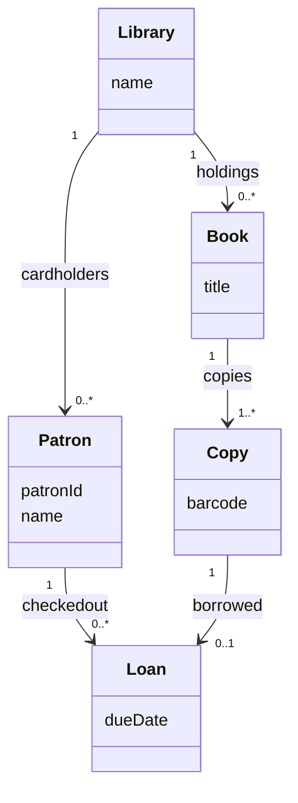

# Formal Specifications and OCL

Formal notations use mathematically defined syntax or semantics to state software behavior precisely. Gustafson's final chapter introduces formal specifications, preconditions, postconditions, invariants, and the Object Constraint Language (OCL). The chapter's motivation is direct: natural language is ambiguous, while mathematical notions such as sets and sequences have precise meanings.


*Figure: Git is a practical substrate for collaboration, branching, review, and release workflows. Image: [Wikimedia Commons](https://commons.wikimedia.org/wiki/File:Git-logo.svg), Jason Long, CC BY 3.0.*

Formal methods can reduce errors by making requirements and design constraints explicit. Their cost is difficulty: formal specifications require skill, careful modeling, and agreement about how software concepts map to mathematical concepts. OCL is presented as a practical formal notation connected to UML object models. It uses class context, navigation through associations, collection operations, invariants, and pre/postconditions.

## Definitions

A **formal notation** is a notation whose syntax or semantics has a mathematical foundation. Formality can apply to structure, meaning, or both.

A **formal specification** uses a formally defined model to state software behavior. For example, a stack can be specified by mapping stack operations to operations on a mathematical sequence. `push` appends an item to the sequence; `pop` removes and returns the last item if the sequence is nonempty.

A **precondition** is a statement associated with a function that must be true before execution. There are two common styles:

| Style | Interpretation |
|---|---|
| Do not specify error handling | if the precondition is false, the implementation handles or rejects the call outside the formal operation |
| Specify all error handling | the operation specification includes behavior for error cases, so callers need not satisfy the normal precondition |

A **postcondition** states what must be true when a function completes. It describes the relationship between the before-state, after-state, parameters, and result.

An **invariant** is a statement that must be true before and after every operation. It may be temporarily false inside an operation while fields are being updated, but it should be restored before control returns.

**OCL**, the Object Constraint Language, is part of UML. It writes constraints in the context of a class, operation, or model element. The expression `self` refers to the current instance of the context class.

**Navigation** in OCL follows associations from one object to related objects using dot notation. If multiplicity is many, the result is a collection. If multiplicity is `0..1` or `1`, the result is a single object or optional object.

OCL collection operations include `size`, `count`, `includes`, `includesAll`, `sum`, `select`, and `forAll`. The source chapter specifically mentions operations such as `size`, `count(object)`, `includes(object)`, `sum`, and `includesall(collection)`.

The OCL notation `@pre` refers to a value before an operation. The keyword `result` refers to the operation result.

## Key results

Formal specifications are useful because they answer questions precisely. Natural language requirements can hide disagreement. "A patron may not check out too many books" is ambiguous. An invariant or precondition can state `self.checkedout->size < 10`, which is at least precise enough to discuss whether the limit is 9, 10, or "less than or equal to 10."

Preconditions define caller responsibility or operation scope. If `pop` has precondition `not stack.isEmpty`, then callers must not pop an empty stack under that operation's normal specification. If empty-pop behavior must be specified, then the operation needs an explicit error postcondition instead of relying only on the precondition.

Postconditions define effects. A useful postcondition does not simply repeat the function name. It relates old and new values. For example, after borrowing a book, the number of checked-out loans for a patron may be one greater than before:

$$
checkedout_{after}.size = checkedout_{before}.size + 1
$$

In OCL, that idea uses `@pre`.

Invariants protect object consistency. A stack count must stay between zero and capacity. A loan must refer to exactly one patron and one copy. A reservation's checkout date must not precede its checkin date. These rules should hold across operations.

OCL navigation depends on the object model. The same expression can mean a single object or a collection depending on multiplicity. If a library has many cardholders, `self.cardholders` is a collection. If a loan has exactly one patron, `self.patron` is a single object.

Type-correct OCL can still be false as a business rule. The source gives the idea that one expression may be type-correct but claim all copies are checked out. Formal notation removes ambiguity, but it does not guarantee the rule is true or desirable. The modeler still needs domain judgment.

Formal constraints connect strongly to testing. Preconditions generate invalid-call tests or caller obligations. Postconditions generate expected results. Invariants generate checks after each operation.

OCL is especially useful where a diagram is structurally correct but semantically incomplete. A class diagram can show that a patron has many loans, but it does not by itself state a maximum checkout count. It can show that a copy is associated with a loan, but it may not state that a copy can have at most one active loan or that a returned loan should no longer appear in the active checkout collection. OCL fills that gap by attaching precise constraints to the UML model.

Formal specification also improves reviews. Reviewers can challenge a constraint directly: is the checkout limit less than 10 or less than or equal to 10? Should a reservation invariant allow checkout date to equal checkin date? Should a failed `borrow` operation leave all associations unchanged? These questions are far easier to answer when the rule is explicit than when it is buried in prose.

## Visual



| Constraint kind | Time of truth | Example |
|---|---|---|
| Precondition | before operation | patron has fewer than 10 loans before borrow |
| Postcondition | after operation | checked-out count increased by one |
| Invariant | before and after every operation | no copy has more than one active loan |
| Navigation | expression over associations | `self.cardholders.checkedout` |
| Collection operation | calculation over collection | `self.checkedout->size` |

## Worked example 1: Stack formal specification

**Problem.** Specify a bounded stack with operations `push(x)` and `pop()` using preconditions, postconditions, and invariants. The stack has capacity `MAX` and an internal sequence `items`.

**Method.** State the invariant first, then operation contracts.

1. Invariant: size is never negative and never greater than capacity.

$$
0 \le items.size \le MAX
$$

2. Precondition for `push(x)`: stack is not full.

$$
items.size < MAX
$$

3. Postcondition for `push(x)`: the new sequence is the old sequence with `x` appended.

$$
items_{after} = items_{before} \mathbin{+\!\!+} [x]
$$

Here `++` means sequence concatenation.

4. Precondition for `pop()`: stack is not empty.

$$
items.size > 0
$$

5. Postcondition for `pop()`: the result is the last old item, and the new sequence is the old sequence without that last item.

$$
\begin{aligned}
result &= last(items_{before}) \\
items_{after} &= allButLast(items_{before})
\end{aligned}
$$

**Checked answer.** The invariant is preserved. If `push` starts with size less than `MAX`, appending one item gives size at most `MAX`. If `pop` starts with size greater than zero, removing one item gives size at least zero. The contracts are precise enough to test normal behavior and define caller obligations for full or empty stacks.

## Worked example 2: OCL constraints for library borrowing

**Problem.** In a library model, a `Patron` has association `checkedout` to `Loan`. Write OCL-style constraints stating that a patron may not have more than 10 loans after borrowing, and that borrowing increases the number of loans by one.

**Method.** Use operation context, precondition, postcondition, and `@pre`.

1. Context:

```ocl
context Patron::borrow(copy: Copy) : Loan
```

2. The patron must have fewer than 10 loans before borrowing if the postcondition will enforce at most 10 after:

```ocl
pre: self.checkedout->size < 10
```

3. The copy should not already be borrowed:

```ocl
pre: copy.borrowed->isEmpty
```

4. After borrowing, checked-out count increases by one:

```ocl
post: self.checkedout->size = self.checkedout@pre->size + 1
```

5. The result should be among the patron's checked-out loans:

```ocl
post: self.checkedout->includes(result)
```

**Checked answer.** The precondition `< 10` plus the `+ 1` postcondition implies the after-size is at most 10. The result membership postcondition connects the returned loan to the model. The copy precondition prevents creating a second active loan for the same copy.

## Code

```python
class BoundedStack:
    def __init__(self, capacity):
        self.capacity = capacity
        self.items = []
        self._check_invariant()

    def _check_invariant(self):
        assert 0 <= len(self.items) <= self.capacity

    def push(self, value):
        assert len(self.items) < self.capacity, "precondition failed: stack full"
        before = list(self.items)
        self.items.append(value)
        assert self.items == before + [value], "postcondition failed: push append"
        self._check_invariant()

    def pop(self):
        assert len(self.items) > 0, "precondition failed: stack empty"
        before = list(self.items)
        result = self.items.pop()
        assert result == before[-1], "postcondition failed: pop result"
        assert self.items == before[:-1], "postcondition failed: pop removal"
        self._check_invariant()
        return result
```

## Common pitfalls

- Writing formal constraints that restate implementation steps instead of specifying externally meaningful behavior.
- Forgetting to define whether failed preconditions are caller errors or specified error cases.
- Treating invariants as necessarily true at every internal line of code. They must hold before and after operations.
- Navigating through associations without checking multiplicity, leading to confusion between single objects and collections.
- Assuming type-correct OCL is domain-correct.
- Omitting `@pre` when a postcondition must compare old and new values.
- Writing constraints disconnected from the UML/object model context.

## Connections

- [Requirements engineering](/cs/software-engineering/requirements-engineering)
- [Software design](/cs/software-engineering/software-design)
- [Software testing](/cs/software-engineering/software-testing)
- [Object-oriented development](/cs/software-engineering/object-oriented-development)
- [Object-oriented testing](/cs/software-engineering/object-oriented-testing)
