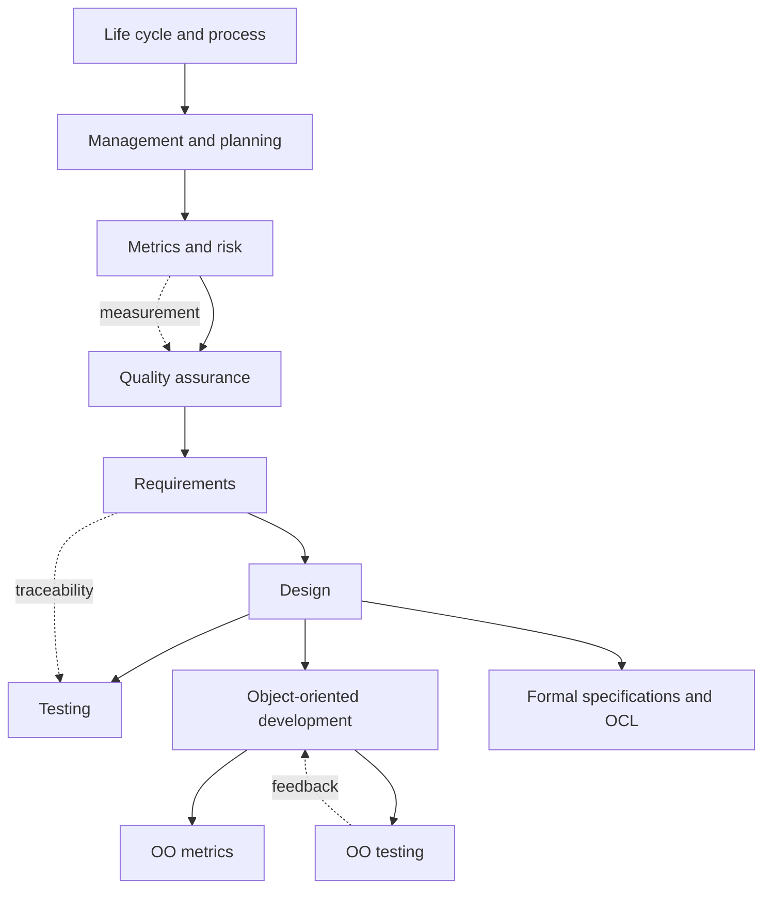

# Software Engineering

These notes summarize and expand the scope of **Schaum's Outline of Theory and Problems of Software Engineering** by David A. Gustafson. The source is a practice-oriented software engineering text: it is not only a survey of terms, but a collection of techniques, diagrams, calculations, review rules, and worked problems for students learning how software projects are specified, designed, measured, tested, and controlled.


*Figure: Pair programming makes collaboration and review practices concrete. Image: [Wikimedia Commons](https://commons.wikimedia.org/wiki/File:Pair_Programming.jpg), Calqui, CC BY-SA 3.0.*


*Figure: Kanban boards turn process state into a visible project-management surface. Image: [Wikimedia Commons](https://commons.wikimedia.org/wiki/File:Openproject_kanban.PNG), OpenProject contributors, CC0.*


*Figure: Git is a practical substrate for collaboration, branching, review, and release workflows. Image: [Wikimedia Commons](https://commons.wikimedia.org/wiki/File:Git-logo.svg), Jason Long, CC BY 3.0.*

The book's structure is broad but compact. It starts with life cycle models, then moves through process modeling, project management, planning, metrics, risk, quality assurance, requirements, design, testing, object-oriented development, object-oriented metrics, object-oriented testing, and formal notation with OCL. The pages in this section mirror that sequence so the notes can be read as a course path or used independently as reference pages.

## Definitions

**Software engineering** is the disciplined development and evolution of software systems using explicit processes, models, artifacts, measurements, reviews, and validation activities. The phrase is important because large software is not just programming. It includes deciding what should be built, coordinating people, managing uncertainty, designing maintainable structures, proving or checking properties, and preserving usefulness after delivery.

A **software process** is the set of activities, roles, artifacts, and decisions used to produce software. A process can be descriptive, showing what happened, or prescriptive, showing what should happen.

A **software artifact** is a work product such as a requirements specification, object model, test plan, source code file, defect report, project schedule, quality plan, or user manual.

A **model** is an abstraction used to reason about some part of a system or project. The textbook uses many models: life cycle diagrams, data flow diagrams, Petri nets, UML-style object models, use cases, sequence diagrams, state diagrams, control flow graphs, PERT networks, risk decision trees, traceability matrices, and OCL constraints.

A **metric** maps a software object or process to a number for a stated purpose. Metrics in the source include LOC, cyclomatic complexity, Halstead measures, Henry-Kafura information flow, productivity, earned value indicators, reliability estimates, review effectiveness, and object-oriented metrics.

A **quality activity** is a planned action that improves confidence in the product or process. Examples include formal inspection, testing, statistical quality assurance, problem reporting, configuration control, and postmortem review.

The generated detail pages are:

| Position | Page | Source chapter focus |
|---:|---|---|
| 2 | [Software life cycle models](/cs/software-engineering/software-life-cycle-models) | activities, documents, waterfall, prototype, incremental, spiral |
| 3 | [Software process models and diagrams](/cs/software-engineering/software-process-models-and-diagrams) | process models, DFDs, Petri nets, UML-style diagrams, state and lattice models |
| 4 | [Project management and process improvement](/cs/software-engineering/project-management-and-process-improvement) | team approaches, CMM, PSP, earned value, error tracking, postmortems |
| 5 | [Project planning and estimation](/cs/software-engineering/project-planning-and-estimation) | WBS, PERT, critical path, slack, LOC, COCOMO, function points |
| 6 | [Software metrics](/cs/software-engineering/software-metrics) | measurement theory, product metrics, process metrics, GQM |
| 7 | [Risk analysis and management](/cs/software-engineering/risk-analysis-and-management) | risk identification, exposure, decision trees, mitigation, risk plans |
| 8 | [Software quality assurance](/cs/software-engineering/software-quality-assurance) | inspections, checklists, reliability, statistical SQA, SQA plans |
| 9 | [Requirements engineering](/cs/software-engineering/requirements-engineering) | object models, DFDs, behavior models, data dictionaries, IEEE SRS outline |
| 10 | [Software design](/cs/software-engineering/software-design) | data, architecture, interfaces, abstraction, cohesion, coupling, traceability |
| 11 | [Software testing](/cs/software-engineering/software-testing) | functional, structural, data flow, random, operational-profile, and boundary testing |
| 12 | [Object-oriented development](/cs/software-engineering/object-oriented-development) | object discovery, inheritance, reuse, associations, existence dependency, multiplicity |
| 13 | [Object-oriented metrics](/cs/software-engineering/object-oriented-metrics) | CK metrics and MOOD metrics |
| 14 | [Object-oriented testing](/cs/software-engineering/object-oriented-testing) | method-message testing and function pair coverage |
| 15 | [Formal specifications and OCL](/cs/software-engineering/formal-specifications-and-ocl) | formal specs, preconditions, postconditions, invariants, OCL navigation |

## Key results

The first organizing result is that software engineering work becomes manageable when artifacts and milestones are explicit. A life cycle phase is useful only when its output can be inspected. A milestone is useful only when the team can tell whether it has actually happened. This principle appears again in requirements reviews, design traceability, test reports, earned value analysis, and postmortems.

The second result is that different diagrams answer different questions. A data flow diagram is good for asking what data a process needs. A state diagram is good for asking which transitions are allowed. A sequence diagram is good for asking what messages happen in a scenario. A PERT network is good for asking which tasks control the schedule. A traceability matrix is good for asking whether every requirement is reflected in design.

The third result is that measurement requires interpretation. Cyclomatic complexity, LOC, defect density, review yield, CBO, LCOM, and earned value all help only when the team knows what decision the metric supports. A number without a decision is noise; a decision without evidence is guesswork.

The fourth result is that quality must be planned earlier than testing. Requirements need validation before design. Designs need inspection before implementation. Code needs review and tests. Reliability estimates need representative data. Defects need tracking and verification. The SQA plan connects these activities to roles and evidence.

The fifth result is that object-oriented software shifts some complexity from procedure bodies into relationships among classes and methods. That is why the source includes separate chapters for OO development, OO metrics, and OO testing. Small methods do not guarantee a simple design if inheritance, dynamic dispatch, coupling, and call sequences are hard to reason about.

The final result is that formal notation can make ambiguity visible. Preconditions, postconditions, invariants, and OCL expressions force precise statements about behavior. They do not remove the need for domain judgment, but they make disagreements concrete enough to review and test.

## Visual



| Learning thread | Pages to read together | What you get |
|---|---|---|
| Project control | life cycle, management, planning, metrics, risk | how to plan, track, and adjust work |
| Requirements to design | process models, requirements, design, formal specs | how to move from domain behavior to implementable contracts |
| Quality and testing | SQA, testing, OO testing, metrics | how to find defects and interpret evidence |
| Object-oriented modeling | process diagrams, OO development, OO metrics, OCL | how to model classes, associations, constraints, and design risk |

## Worked example 1: Choosing a study route

**Problem.** A student has two weeks before an exam. The exam emphasizes worked techniques: PERT, earned value, risk exposure, cyclomatic complexity, functional testing, object modeling, and OCL. Which pages should be studied first, and why?

**Method.** Match exam tasks to pages and order prerequisites.

1. PERT belongs to planning. Read [Project planning and estimation](/cs/software-engineering/project-planning-and-estimation) for WBS, PERT, critical path, slack, LOC, COCOMO, and function points.

2. Earned value belongs to project management. Read [Project management and process improvement](/cs/software-engineering/project-management-and-process-improvement) after life cycle basics so PV, EV, AC, SV, CV, SPI, and CPI are tied to project tracking.

3. Risk exposure belongs to risk analysis. Read [Risk analysis and management](/cs/software-engineering/risk-analysis-and-management) after planning because risk estimates often depend on schedule, cost, and technical uncertainty.

4. Cyclomatic complexity belongs to metrics and testing. Read [Software metrics](/cs/software-engineering/software-metrics), then [Software testing](/cs/software-engineering/software-testing).

5. Functional testing belongs to the testing page, but good tests require specification understanding. Read [Requirements engineering](/cs/software-engineering/requirements-engineering) before testing if scenario and SRS questions are likely.

6. Object modeling belongs to [Object-oriented development](/cs/software-engineering/object-oriented-development), with support from [Software process models and diagrams](/cs/software-engineering/software-process-models-and-diagrams).

7. OCL belongs to [Formal specifications and OCL](/cs/software-engineering/formal-specifications-and-ocl), and it depends on understanding object models and associations.

**Checked answer.** A practical order is: life cycle overview, planning, management, risk, metrics, requirements, testing, process diagrams, OO development, OO metrics, OO testing, and formal OCL. This order is checked by prerequisites: OCL needs object models, testing needs specifications, and earned value needs a project baseline.

## Worked example 2: Tracing one feature through the course

**Problem.** A library system must let a patron borrow an available copy of a book and reject the request if no copy is available. Trace this feature across the major software engineering activities.

**Method.** For each activity, name the artifact or decision that would contain the feature.

1. Life cycle and requirements: the SRS states the functional requirement: "The system shall create a loan for a patron and an available copy when the patron requests to borrow a book; if no copy is available, it shall report unavailability."

2. Object model: domain classes include `Patron`, `Book`, `Copy`, and `Loan`. Associations connect patron to loans and copy to an active loan.

3. Scenario: a patron requests a title, the system searches copies, finds an available copy, creates a loan, marks the copy unavailable, and returns the due date. An alternative scenario reports no copy available.

4. Design: the interface might be `borrow_book(patron_id, isbn) -> BorrowResult`, with success and failure statuses.

5. Traceability: the requirement maps to design elements such as `CatalogService`, `LoanService`, `CopyRepository`, and `BorrowResult`.

6. Testing: functional tests include available copy, no available copy, unknown patron, and invalid ISBN. Boundary or state tests check that the same copy cannot be loaned twice.

7. Metrics: complexity and coupling of `LoanService` can be reviewed if the borrow operation grows too large or touches too many classes.

8. SQA: the requirements and design are inspected, tests are recorded, and defects are tracked.

9. OCL: an invariant can state that a copy has at most one active loan; a postcondition can state that successful borrowing increases the patron's checked-out loan count by one.

**Checked answer.** The feature is complete only if it appears in requirements, model, design, traceability, tests, quality evidence, and constraints. If any artifact is missing, the team has a visibility gap.

## Code

```python
pages = {
    "plan": ["/cs/software-engineering/project-planning-and-estimation"],
    "measure": ["/cs/software-engineering/software-metrics"],
    "test": [
        "/cs/software-engineering/requirements-engineering",
        "/cs/software-engineering/software-testing",
    ],
    "oo": [
        "/cs/software-engineering/object-oriented-development",
        "/cs/software-engineering/object-oriented-metrics",
        "/cs/software-engineering/object-oriented-testing",
    ],
    "formal": ["/cs/software-engineering/formal-specifications-and-ocl"],
}

def route_for(goal):
    return pages.get(goal, ["Start with /cs/software-engineering/software-life-cycle-models"])

for goal in ["plan", "test", "oo", "formal"]:
    print(goal)
    for page in route_for(goal):
        print(" ", page)
```

## Common pitfalls

- Studying terminology without practicing the calculations and diagrams. The source is problem-oriented, so the worked examples matter.
- Treating life cycle, planning, testing, and quality as separate silos. They are linked by artifacts, traceability, metrics, and feedback.
- Memorizing metric formulas without knowing when the metric is valid or what decision it supports.
- Drawing UML-style diagrams without checking multiplicities, domain significance, or legal transitions.
- Writing tests from code only and forgetting that functional tests come from the specification.
- Treating formal notation as automatically correct. A precise constraint can still be the wrong domain rule.

## Connections

- [Software life cycle models](/cs/software-engineering/software-life-cycle-models)
- [Software process models and diagrams](/cs/software-engineering/software-process-models-and-diagrams)
- [Project management and process improvement](/cs/software-engineering/project-management-and-process-improvement)
- [Project planning and estimation](/cs/software-engineering/project-planning-and-estimation)
- [Software metrics](/cs/software-engineering/software-metrics)
- [Risk analysis and management](/cs/software-engineering/risk-analysis-and-management)
- [Software quality assurance](/cs/software-engineering/software-quality-assurance)
- [Requirements engineering](/cs/software-engineering/requirements-engineering)
- [Software design](/cs/software-engineering/software-design)
- [Software testing](/cs/software-engineering/software-testing)
- [Object-oriented development](/cs/software-engineering/object-oriented-development)
- [Object-oriented metrics](/cs/software-engineering/object-oriented-metrics)
- [Object-oriented testing](/cs/software-engineering/object-oriented-testing)
- [Formal specifications and OCL](/cs/software-engineering/formal-specifications-and-ocl)
