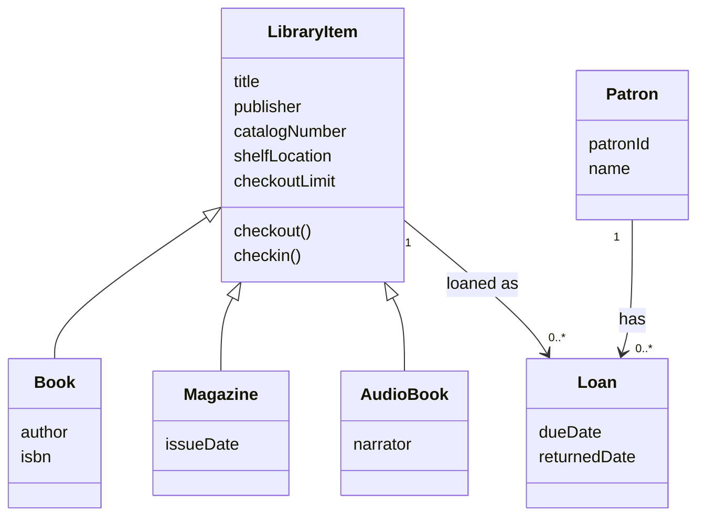
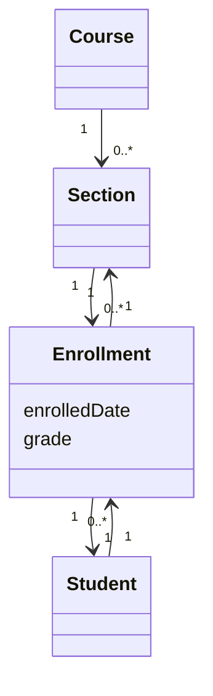

# Object-Oriented Development

Object-oriented development models a problem in terms of objects, classes, attributes, operations, and relationships. Gustafson's chapter on object-oriented development covers inheritance, polymorphism, object identification, noun-in-text analysis, domain analysis for reuse, use-case-driven object discovery, association identification, existence dependency, and multiplicity. The chapter is practical: it shows how to move from a problem statement to candidate objects and relationships.

The central challenge is deciding what should become an object, what should become an attribute, and what is merely an external entity or relationship. A grocery store, family tree, library, college, bed-and-breakfast, and dental office appear in the examples because they expose common modeling choices: inheritance versus aggregation, relationship objects, multiplicity, and reuse.

## Definitions

An **object** is an entity with identity, state, and behavior. In analysis, objects are often domain concepts. In design and implementation, they may become classes, records, services, or persistent entities.

A **class** is a type or template for objects. It defines attributes and methods common to instances.

An **attribute** is a characteristic or data value of an object. A person may be an object; the person's height is usually an attribute. The distinction can be domain-dependent.

**Inheritance** is an "a-kind-of" relationship. A derived class specializes a base class and inherits common attributes and operations. A Ford automobile is a kind of car; an engine is not a kind of car, because it is part of a car.

**Aggregation** is a "part-of" relationship. A car has an engine; a library has copies and patrons; a family tree has persons and family relationships.

An **association** is a domain relationship between objects. It may be named and may have roles at each end. Associations determine what access one object needs to another in the implementation.

**Polymorphism** means an operation can work with multiple forms, often a base type and derived types. A `checkout` operation may apply to many library item subclasses while specialized cataloging differs for books, newspapers, CDs, and videos.

The **noun-in-text approach** identifies nouns in a problem statement, groups equivalent nouns, removes external or irrelevant nouns, and selects object candidates. Some nouns become objects, some become attributes, and some are discarded.

**Domain analysis** studies a problem domain to find common objects and functions that can be reused across systems. Reuse usually requires intentional design; it rarely appears automatically.

**Existence dependency** holds when a child object depends on exactly one parent object: the parent exists before the child is created, and the child is deleted before the parent is deleted.

**Multiplicity** restricts how many instances may participate in an association, such as `1`, `0..1`, `1..*`, or `0..*`.

## Key results

Object identification is not mechanical. The noun-in-text method is a useful starting point, but it can mislead. In a family tree problem, words like uncle, aunt, and cousin are relationship roles, not necessarily object subclasses. An uncle is a person in a relationship, not a kind of person with inherited uncle attributes.

Inheritance should be used for stable commonality and substitutability. A base class should contain shared attributes and operations. Derived classes should be usable where the base class is expected. Using inheritance only to share a few fields can produce a brittle hierarchy.

Associations should come from domain relationships and required functionality. If a college system must print all sections a student is taking, there must be a way to navigate from student to sections. If sections and students have a many-to-many relationship, a separate enrollment object may be needed, especially when the relationship has attributes such as grade or enrollment date.

Existence dependency helps discover missing objects. If a section cannot be existence-dependent on a student and a student cannot be existence-dependent on a section, then the enrollment relation should become its own object. This turns a vague many-to-many link into a model that can hold relationship-specific information.

Multiplicity converts informal domain rules into model constraints. A book copy may participate in at most one active loan at a time. A patron may have zero or many loans. A loan must refer to exactly one copy and exactly one patron. These multiplicities guide database constraints, validation rules, and tests.

Reuse requires domain-level thinking. If the team wants reuse across grocery inventory systems, it must identify reusable concepts such as item, shipment, supplier, inventory transaction, spoilage adjustment, and sale. Designing only for the immediate screen flow usually hides potential reusable abstractions.

Use cases and scenarios can reveal objects missed by noun extraction. A scenario about a customer checkout may reveal membership card, purchase transaction, receipt, and inventory adjustment even if the short problem statement did not list them clearly.

## Visual



| Modeling choice | Meaning | Example |
|---|---|---|
| Inheritance | is a kind of | magazine is a library item |
| Aggregation | is part of | engine is part of car |
| Association | is related to | patron has loan |
| Attribute | describes object | patron phone number |
| Relationship object | association with identity or data | enrollment, loan, reservation |
| Multiplicity | cardinality rule | copy has 0..1 active loan |

## Worked example 1: Noun-in-text object discovery

**Problem.** Identify object candidates from this statement: "A dental office has patients, appointments, a calendar, patient records, reminder call lists, daily schedules, and weekly schedules. The receptionist can schedule and cancel appointments. The system answers queries by patient name and by date."

**Method.** Extract nouns, group them, remove external actors when appropriate, and choose objects.

1. Nouns: dental office, patients, appointments, calendar, patient records, reminder call lists, daily schedules, weekly schedules, receptionist, system, queries, patient name, date.

2. Group equivalents or related nouns:

   `patients` and `patient records` are related. `daily schedules` and `weekly schedules` are schedule reports. `patient name` and `date` are attributes or query keys.

3. Remove external or non-domain nouns:

   The receptionist is an actor outside the system unless staff management is in scope. The system itself is not a domain object inside the system.

4. Candidate objects:

   `DentalOffice`, `Patient`, `Appointment`, `Calendar`, `ReminderCallList`, and `ScheduleReport`.

5. Candidate attributes:

   Patient has name and phone numbers. Appointment has date, time, purpose, status, and comments.

6. Candidate operations:

   Schedule appointment, cancel appointment, query appointments by patient name, query appointments by date, print reminder list, print daily schedule, print weekly schedule.

**Checked answer.** The object list is checked by scenario support. A returning patient appointment can be represented by `Patient` plus `Appointment`. Reminder calls can be produced from appointments and patient phone data. Daily and weekly schedules can be reports over calendar appointments.

## Worked example 2: Multiplicity for college enrollment

**Problem.** A college has courses. Each course has many sections. Students enroll in sections. A student may enroll in many sections, and a section may have many students. Grades are recorded per student per section. Model the association and multiplicities.

**Method.** Look for many-to-many relationships and relationship attributes.

1. Course to Section:

   A course can have zero or many sections in a given term. Each section belongs to exactly one course.

2. Student to Section:

   The relationship is many-to-many. A student has many sections; a section has many students.

3. Grade belongs to the relationship, not to `Student` alone and not to `Section` alone. The same student has different grades in different sections; the same section has different grades for different students.

4. Introduce `Enrollment` as a relationship object.

5. Multiplicities:

   Student `1` to Enrollment `0..*`; Section `1` to Enrollment `0..*`; each Enrollment has exactly one Student and exactly one Section.

**Checked answer.**



The model is checked by asking where grade is stored. It belongs naturally on `Enrollment`, confirming that the relationship object is needed.

## Code

```python
from collections import Counter
import re

STOP = {"a", "an", "the", "and", "by", "with", "of", "to", "in", "can", "has"}

def noun_text_candidates(text):
    words = re.findall(r"[A-Za-z]+", text.lower())
    candidates = [w for w in words if w not in STOP and len(w) > 2]
    return Counter(candidates).most_common()

statement = """
A dental office has patients, appointments, a calendar, patient records,
reminder call lists, daily schedules, and weekly schedules. The receptionist
can schedule and cancel appointments.
"""

for word, count in noun_text_candidates(statement):
    print(f"{word}: {count}")
```

## Common pitfalls

- Treating every noun as an object without grouping synonyms or removing external entities.
- Modeling roles such as uncle or customer as subclasses when they are relationships or temporary roles.
- Using inheritance for "part of" relationships.
- Forgetting relationship objects for many-to-many associations with their own data.
- Omitting multiplicities, then discovering cardinality rules late in database design or validation.
- Expecting reuse without domain analysis and intentional reusable design.
- Letting implementation classes replace domain understanding too early.

## Connections

- [Software process models and diagrams](/cs/software-engineering/software-process-models-and-diagrams)
- [Requirements engineering](/cs/software-engineering/requirements-engineering)
- [Software design](/cs/software-engineering/software-design)
- [Object-oriented metrics](/cs/software-engineering/object-oriented-metrics)
- [Object-oriented testing](/cs/software-engineering/object-oriented-testing)
