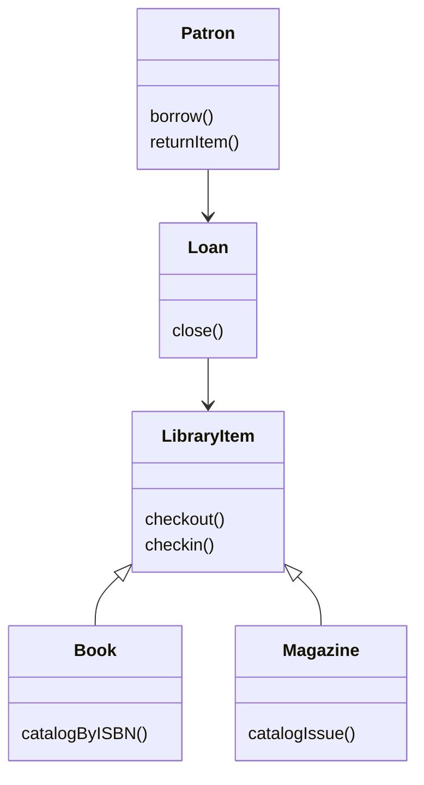

# Object-Oriented Metrics

Object-oriented metrics measure properties of class-based software that traditional control-flow metrics do not capture well. Gustafson's chapter explains why McCabe and Halstead-style metrics are not enough for OO systems: methods are often small, while complexity appears in inheritance, coupling, dynamic dispatch, and relationships among classes. The chapter presents the Chidamber and Kemerer metrics suite and the MOOD metrics.

The subject remains partly research-oriented in the source. The chapter does not claim final consensus; it presents metrics that were influential and useful for reasoning about OO designs. The key engineering lesson is to measure the structural properties that actually create maintenance and testing risk: too many methods, deep inheritance, excessive children, high coupling, large response sets, low cohesion, weak encapsulation, and uncontrolled polymorphism.

## Definitions

The **Chidamber and Kemerer (CK) metrics suite** includes six class-level design metrics:

| Metric | Name | Basic meaning |
|---|---|---|
| WMC | Weighted Methods per Class | sum or count of method complexities in a class |
| DIT | Depth of Inheritance Tree | maximum path length from class to root |
| NOC | Number of Children | immediate subclasses of a class |
| CBO | Coupling Between Object Classes | number of other classes coupled to this class |
| RFC | Response For a Class | number of methods that may execute in response to a message |
| LCOM | Lack of Cohesion in Methods | degree to which methods do not share attributes |

**WMC** is the sum of weights for methods in a class. If every method has weight 1, WMC is the number of methods. Weights may be cyclomatic complexity or another local complexity measure.

**DIT** is the length of the inheritance path from a class to the root. Deeper inheritance can increase reuse but also makes behavior harder to understand because inherited features may come from several levels.

**NOC** counts immediate subclasses. High NOC can indicate reuse through inheritance, but it can also mean the base class is a fragile dependency for many children.

**CBO** counts the number of other classes to which a class is coupled. Coupling exists when methods or attributes in another class are used.

**RFC** is the size of the response set: methods in the class plus methods directly called by those methods. It estimates how much behavior may be triggered by one message.

**LCOM** measures lack of method cohesion. In the CK description, let $I_i$ be the set of instance variables used by method $i$. Let $P$ be method pairs with no shared instance variables and $Q$ be method pairs with shared variables. Then:

$$
LCOM = \max(|P| - |Q|, 0)
$$

The **MOOD metrics** measure system-level OO properties: encapsulation, inheritance, coupling, and polymorphism. The source covers method hiding factor (MHF), attribute hiding factor (AHF), method inheritance factor (MIF), attribute inheritance factor (AIF), coupling factor (CF), and polymorphism factor (PF).

## Key results

OO metrics should match OO abstractions. A class with tiny methods can still be hard to maintain if it is coupled to many classes, inherits behavior from a deep hierarchy, and has a large response set. Traditional control-flow metrics may see simple methods and miss design complexity.

WMC signals class responsibility size. A class with many methods, or several complex methods, may be doing too much. However, teams should be careful with trivial getters and setters; counting them fully can inflate WMC without reflecting real behavioral complexity.

DIT and NOC must be interpreted together. Deep inheritance increases the number of places a reader must inspect to understand behavior. Many children increase the cost of changing a parent because many subclasses may be affected. But shallow inheritance is not always better; a well-designed hierarchy can express stable domain commonality.

CBO is a maintainability warning. If class A uses class B's methods or instance variables, changes in B may affect A. Since coupling is symmetric in the CK definition, a high CBO class is entangled with many other classes and should receive careful review.

RFC estimates test surface. A message to an object may trigger not only one method but a chain of method calls. A large response set suggests many possible behaviors and interactions to test.

LCOM should be low. A high LCOM means methods operate on disjoint attributes, suggesting that the class may contain unrelated responsibilities. However, a class with deliberately independent utility methods may be better modeled differently rather than judged mechanically.

MOOD metrics are system-level factors. MHF and AHF increase when methods and attributes are hidden from other classes. MIF and AIF describe inheritance use. CF describes non-inheritance coupling density. PF describes realized overriding relative to possible overriding. These factors help compare versions or systems, but they require consistent counting rules.

Class-level and system-level metrics answer different questions. A high CBO value on one class points to a local redesign candidate. A high coupling factor for the whole system says the architecture may be broadly entangled. Similarly, one high-LCOM class may need to be split, while a trend of rising LCOM across releases may indicate that responsibilities are drifting as features are added. The source chapter stresses that OO measurement is still an evolving area, so the safest use is comparative and diagnostic: compare similar classes, compare versions of the same system, and use outliers to guide review rather than treating the metric as a final verdict.

Metrics should be interpreted with design intent. A framework base class may have high NOC because many stable plugins derive from it. That can be healthy if the parent interface is narrow and tested. A domain service may have high RFC because it coordinates a workflow. That can be acceptable if the calls are explicit and cohesive. The metric raises the question; the design review answers it.

## Visual



| Metric | High value may mean | Possible action |
|---|---|---|
| WMC | too many or too complex methods | split responsibilities or simplify methods |
| DIT | behavior spread through hierarchy | review inheritance depth and documentation |
| NOC | parent has many dependents | stabilize parent interface and tests |
| CBO | broad interclass dependency | introduce interfaces or reduce knowledge |
| RFC | large behavior response set | add interaction tests and simplify call chains |
| LCOM | unrelated methods in class | split class by responsibility |
| MHF/AHF | strong hiding | verify needed operations remain accessible |
| CF | dense system coupling | refactor dependencies |

## Worked example 1: CK metrics for a small class model

**Problem.** Consider class `ReservationService` with methods `searchVacancy`, `createReservation`, `cancelReservation`, and `printSchedule`. Each method has weight 1. The class uses `Calendar`, `Reservation`, `Customer`, and `PaymentGateway`. `createReservation` calls `PaymentGateway.authorize`, and `printSchedule` calls `Calendar.weekView`. There is no inheritance. Compute WMC, DIT, NOC, CBO, and a simple RFC.

**Method.** Apply each definition directly.

1. WMC with unit weights:

$$
WMC = 1 + 1 + 1 + 1 = 4
$$

2. DIT is 0 or 1 depending on convention for root counting. State the convention. Using "no inheritance below root = 0":

$$
DIT = 0
$$

3. NOC is the number of immediate subclasses. None are listed:

$$
NOC = 0
$$

4. CBO counts other classes used:

$$
CBO = |\{Calendar, Reservation, Customer, PaymentGateway\}| = 4
$$

5. RFC includes class methods plus directly called external methods:

$$
RS = \{searchVacancy, createReservation, cancelReservation, printSchedule, authorize, weekView\}
$$

$$
RFC = |RS| = 6
$$

**Checked answer.** WMC is 4, DIT is 0 under the stated convention, NOC is 0, CBO is 4, and RFC is 6. The check is that every counted external class or method is explicitly named.

## Worked example 2: LCOM from shared attributes

**Problem.** A class has three methods and three attributes. Method `m1` uses `{name, phone}`. Method `m2` uses `{phone}`. Method `m3` uses `{balance}`. Compute LCOM using method-pair intersections.

**Method.** List all method pairs and classify each as sharing or not sharing an attribute.

1. Pair `(m1, m2)`:

$$
\{name, phone\} \cap \{phone\} = \{phone\}
$$

This pair shares an attribute, so it belongs to $Q$.

2. Pair `(m1, m3)`:

$$
\{name, phone\} \cap \{balance\} = \emptyset
$$

This pair belongs to $P$.

3. Pair `(m2, m3)`:

$$
\{phone\} \cap \{balance\} = \emptyset
$$

This pair belongs to $P$.

4. Counts:

$$
|P| = 2,\quad |Q| = 1
$$

5. LCOM:

$$
LCOM = \max(2 - 1, 0) = 1
$$

**Checked answer.** LCOM is 1. The result suggests mild lack of cohesion: `balance` behavior may belong with billing rather than with contact data. The answer is checked by verifying that there are exactly three method pairs for three methods.

## Code

```python
from itertools import combinations

def lcom(method_attributes):
    p = 0
    q = 0
    for left, right in combinations(method_attributes, 2):
        if set(left).intersection(right):
            q += 1
        else:
            p += 1
    return max(p - q, 0), p, q

methods = [
    {"name", "phone"},
    {"phone"},
    {"balance"},
]

value, p_count, q_count = lcom(methods)
print("P:", p_count)
print("Q:", q_count)
print("LCOM:", value)
```

## Common pitfalls

- Applying procedural metrics to OO code and assuming they capture design complexity.
- Counting trivial methods the same as complex methods without explaining the weighting rule.
- Treating high inheritance as automatically good because it suggests reuse.
- Treating high hiding factors as automatically good when needed behavior becomes inaccessible or awkward.
- Comparing OO metrics across projects with different counting rules.
- Ignoring coupling created by attributes, callbacks, events, or framework dependencies.
- Using LCOM mechanically without looking at the domain responsibility of the class.

## Connections

- [Software metrics](/cs/software-engineering/software-metrics)
- [Object-oriented development](/cs/software-engineering/object-oriented-development)
- [Software design](/cs/software-engineering/software-design)
- [Object-oriented testing](/cs/software-engineering/object-oriented-testing)
- [Formal specifications and OCL](/cs/software-engineering/formal-specifications-and-ocl)
