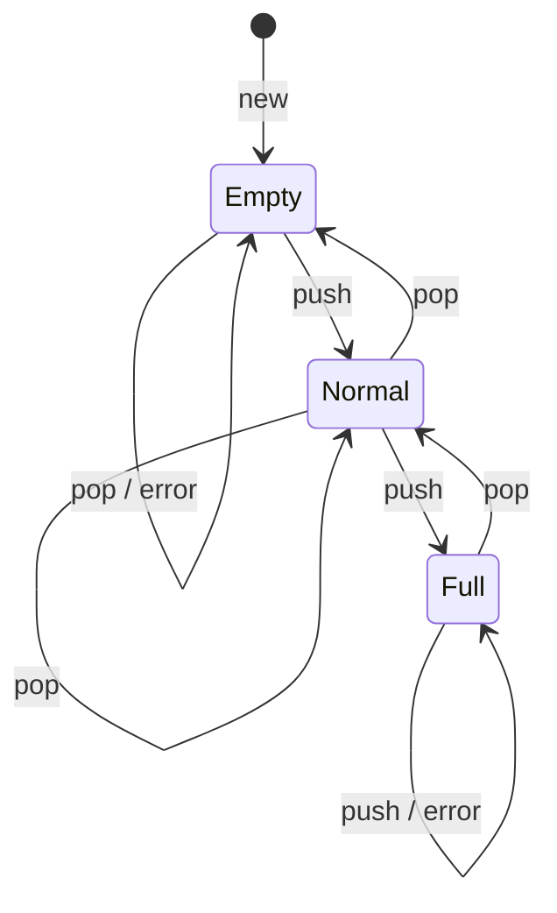

# Object-Oriented Testing

Object-oriented testing keeps the usual goals of software testing but adds criteria that fit object interaction. Gustafson's chapter covers method-message testing and function pair coverage. The key observation is that OO complexity often lives in messages among methods and objects rather than in long procedural control structures. A method can have simple internal statements while still triggering a complicated chain of calls.

The chapter does not replace functional, statement, branch, or data-flow testing. It adds OO-specific coverage ideas. Functional testing still checks specified behavior. Statement coverage remains a minimal expectation. Method-message testing ensures that method calls are actually exercised. Function pair coverage then checks adjacent method-call sequences, often using a state machine or regular expression to define legal behavior.

## Definitions

**Object-oriented testing** is testing of class-based software with attention to object state, method calls, inheritance, polymorphism, and collaborations among objects.

**Functional testing of OO software** is essentially the same as functional testing of conventional software: derive tests from the specification and expected behavior. A `Stack` still needs tests for push, pop, full, empty, and error cases regardless of implementation style.

**Statement coverage** requires each executable statement to run at least once. It is still useful in OO programs, but it may miss interactions if methods are small and dispatch is complex.

**Method-message (MM) testing** requires every method call to another method to be tested at least once. If a method calls the same target method multiple times in the same call sequence, each distinct call site should be considered, but repeated identical calls in a fixed sequence do not necessarily require separate test logic beyond execution.

MM testing does **not** subsume statement coverage. A code block with no method calls could remain unexecuted even if every method call elsewhere has been exercised.

**Function pair coverage** requires that every possible adjacent pair of method executions be tested. The source describes this using state machine diagrams or regular expressions. Since a regular expression can be mapped to a finite state machine, the two approaches are equivalent for defining sequences.

A **method-call sequence** is an ordered list of methods executed during a scenario. For example, `rectanglelist.totalArea -> linklistnode.getRectangle -> rectangle.area -> rectangle.length`.

A **regular expression model** describes legal sequences of method calls. A loop may be represented by `*`, meaning zero or more repetitions.

A **state-machine model** describes legal object states and method-triggered transitions. It is especially useful for stateful objects such as stacks, files, iterators, transactions, reservations, and network sessions.

## Key results

OO testing should be layered. Start with functional tests from the requirements. Add class-level tests for methods and state changes. Add interaction tests for collaborations among classes. Then apply coverage criteria such as statement, branch, MM, and function pair coverage to find holes.

MM testing is the most basic OO-specific interaction criterion in the chapter. It ensures that every method call site has been exercised. In the linked-list-of-rectangles example, adding a rectangle and then computing total area executes constructor calls, list-node calls, setter calls, getter calls, area calls, and point coordinate calls. A test that only constructs the list without computing area would miss much of the call graph.

MM testing is not enough for stateful behavior. A stack might achieve MM testing with `new`, `push`, and `pop`, but that does not prove that `pop` after empty, `push` into full, or `push` after a normal `pop` behave correctly. Function pair coverage addresses adjacent combinations and therefore catches more state-transition interactions.

Function pair coverage can be generated from a state machine. For a finite stack, pairs include `new -> pop(empty error)`, `new -> push`, `push(empty to normal) -> push`, `push(normal to full) -> push(error)`, `pop(normal to empty) -> pop(error)`, and so on. The point is not only to call each function, but to call it after meaningful previous calls.

Regular expressions provide another way to reason about method pairs. For a list, `totalArea (getRectangle area getNext)*` says that the loop body may occur zero or more times. Function pair tests should include zero iterations, one iteration, multiple iterations, and transitions before and after the loop.

Inheritance and polymorphism complicate testing because the method invoked by a call can depend on runtime type. A test suite should exercise overridden methods through base-class references when that is how the system uses them. Otherwise, the dynamic dispatch behavior may remain untested.

Constructors and setup methods deserve attention in OO coverage. Many collaborations are established before the method under test runs: dependencies are created, list nodes are linked, observers are registered, and initial state is chosen. If tests bypass normal construction with unrealistic fixtures, they may miss method-message calls that occur in real object creation. Conversely, if every test relies only on full integration construction, failures can be hard to localize. A practical suite uses focused unit tests for class behavior and a smaller set of interaction tests that exercise real construction and message chains.

Function pair coverage is strongest when paired with a state model. Adjacent method pairs mean different things in different states: `push -> pop` from a one-element stack is not the same as `push -> pop` from a full stack. The state model gives those pairs their interpretation.

## Visual



| Coverage criterion | Requires | Does it cover interactions? | Main gap |
|---|---|---|---|
| Functional | specified behavior cases | partly | may miss implementation call paths |
| Statement | every statement executes | weakly | does not require call combinations |
| MM testing | every method call executes | yes, one call at a time | does not cover adjacent sequences |
| Function pair | every adjacent method pair executes | stronger | may still miss longer histories |
| State transition | every modeled transition executes | strong for stateful classes | depends on model completeness |

## Worked example 1: MM testing for an order service

**Problem.** An `OrderService.placeOrder` method calls `Inventory.reserve`, `Payment.authorize`, `OrderRepository.save`, and `Email.sendConfirmation`. The `cancelOrder` method calls `OrderRepository.find`, `Payment.refund`, `Inventory.release`, and `OrderRepository.save`. Identify an MM coverage test set.

**Method.** List method call sites and choose tests that execute all of them.

1. Call sites in `placeOrder`:

   `Inventory.reserve`, `Payment.authorize`, `OrderRepository.save`, and `Email.sendConfirmation`.

2. Call sites in `cancelOrder`:

   `OrderRepository.find`, `Payment.refund`, `Inventory.release`, and `OrderRepository.save`.

3. One successful place-order test can execute all `placeOrder` calls if inventory is available and payment succeeds.

4. One successful cancel-order test can execute all `cancelOrder` calls if the order exists and is refundable.

5. If failure branches include additional method calls, such as `Inventory.release` after failed payment, they must be included too. The problem statement does not list them, so the minimal MM set has two scenarios.

**Checked answer.**

| Test | Setup | Expected MM calls covered |
|---|---|---|
| T1 place valid order | item in stock, payment approved | reserve, authorize, save, sendConfirmation |
| T2 cancel paid order | existing paid order | find, refund, release, save |

The answer is checked by comparing the union of calls covered by T1 and T2 with the full call-site list. Every listed call appears at least once.

## Worked example 2: Function pair coverage for a finite stack

**Problem.** A finite stack has methods `new`, `push`, and `pop`. States are Empty, Normal, and Full. `pop` on Empty is an error; `push` on Full is an error. Give a compact function-pair test set that covers important adjacent pairs.

**Method.** Use the state machine and build sequences that include adjacent method pairs in different states.

1. Start with empty error:

   `new, pop` covers `new -> pop(empty error)`.

2. Cover normal push and pop:

   `new, push, pop` covers `new -> push` and `push(empty to normal) -> pop`.

3. Cover multiple pushes into full and full error. Assume capacity is 2:

   `new, push, push, push` covers `push(empty to normal) -> push(normal to full)` and `push(normal to full) -> push(full error)`.

4. Cover popping from full and then popping into empty:

   `new, push, push, pop, pop, pop` covers `push(normal to full) -> pop`, `pop(full to normal) -> pop(normal to empty)`, and `pop(normal to empty) -> pop(empty error)`.

5. Cover push after pop into empty:

   The sequence in step 4 can be extended to `push` after the stack becomes empty, or use `new, push, pop, push`.

**Checked answer.** A compact suite is:

1. `new, pop`
2. `new, push, pop, push`
3. `new, push, push, push`
4. `new, push, push, pop, pop, pop`

The suite is checked by mapping adjacent pairs to the state machine. It covers errors on empty pop and full push, normal push/pop combinations, and state-changing pairs around empty, normal, and full states.

## Code

```python
def adjacent_pairs(sequence):
    return list(zip(sequence, sequence[1:]))

tests = [
    ["new", "pop"],
    ["new", "push", "pop", "push"],
    ["new", "push", "push", "push"],
    ["new", "push", "push", "pop", "pop", "pop"],
]

covered = set()
for test in tests:
    for pair in adjacent_pairs(test):
        covered.add(pair)

for pair in sorted(covered):
    print(pair)
```

## Common pitfalls

- Assuming functional tests automatically cover OO method interactions.
- Treating statement coverage as enough when behavior depends on object collaborations.
- Believing MM testing subsumes statement coverage. It does not cover statements with no method calls.
- Exercising each method once but never testing meaningful call order.
- Ignoring zero-iteration and multi-iteration cases in regular-expression models.
- Testing subclasses only directly and not through base-class references where polymorphism occurs.
- Building function pair coverage from an incomplete state model.

## Connections

- [Software testing](/cs/software-engineering/software-testing)
- [Object-oriented development](/cs/software-engineering/object-oriented-development)
- [Object-oriented metrics](/cs/software-engineering/object-oriented-metrics)
- [Software design](/cs/software-engineering/software-design)
- [Formal specifications and OCL](/cs/software-engineering/formal-specifications-and-ocl)
