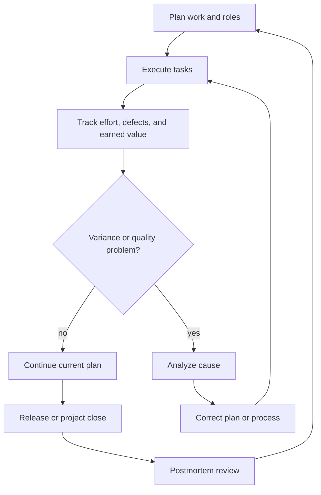

# Project Management and Process Improvement

Software project management is the discipline of making technical work coordinated, measurable, and correctable. Gustafson's project management chapter covers management approaches, team organization, critical practices, the Capability Maturity Model, the Personal Software Process, earned value analysis, error tracking, and postmortem reviews. The emphasis is not only on planning before work begins but also on feedback while work is underway.


*Figure: Kanban boards turn process state into a visible project-management surface. Image: [Wikimedia Commons](https://commons.wikimedia.org/wiki/File:Openproject_kanban.PNG), OpenProject contributors, CC0.*

The chapter sits between life cycle theory and detailed planning. A life cycle tells us what kinds of activities exist; project management asks who will do them, how the team will know whether work is on track, what practices deserve special attention, and how the organization learns from completed projects. It also introduces earned value analysis, which connects planned cost, actual cost, and completed work into objective progress indicators.

## Definitions

**Software project management** is the application of planning, organizing, monitoring, and corrective action to software development. It covers people, tasks, artifacts, estimates, risks, defects, reviews, and process improvement.

A **management approach** is a way of coordinating work and authority. Highly centralized approaches put decisions in a small leadership group. More decentralized approaches give teams or individuals more autonomy. The right approach depends on project size, risk, team experience, domain volatility, and communication cost.

A **team approach** defines how developers and related roles collaborate. The textbook discusses chief programmer teams, where a strong technical lead is supported by specialists. The central idea is role clarity: different people may focus on architecture, coding, testing, documentation, or administrative support.

**Critical practices** are practices that strongly influence project success. They are not magic rules; they are management habits that reduce common failures, such as unclear ownership, unmanaged requirements changes, poor defect tracking, and late integration.

The **Capability Maturity Model (CMM)** is a staged model for organizational process maturity. Its classic levels move from ad hoc work toward repeatable, defined, managed, and optimizing processes. The purpose is to help organizations improve their software process over time.

The **Personal Software Process (PSP)** focuses on individual discipline. It asks engineers to estimate, measure, review, and improve their own work using personal data such as time, size, and defects.

**Earned value analysis (EVA)** is a project control technique. It compares planned value, earned value, and actual cost to measure schedule and cost performance. It is useful because it distinguishes "money spent" from "work actually completed."

**Error tracking** records defects, failures, or dissatisfaction with system behavior so the team can prioritize, correct, verify, and learn from them.

A **postmortem review** is a structured review after a project or release. It identifies what worked, what failed, and what process changes should be made.

## Key results

Management has to make progress observable. A project can appear busy while producing little earned value, accumulating defects, or pushing key decisions into the future. The solution is not more status meetings by itself. The solution is a set of artifacts, measures, and review points that expose true project state.

Team structure affects communication paths. A chief programmer team can work well when a strong lead has enough domain and technical knowledge to make coherent decisions. It can fail when the lead becomes a bottleneck or when the system is too broad for one technical center. Larger projects often need modular ownership and explicit interfaces so that teams can work in parallel without constant renegotiation.

Process maturity is about repeatability and learning. At low maturity, success depends heavily on individual heroics. At higher maturity, the organization can repeat good practices, measure outcomes, and improve based on evidence. The CMM idea is not that every project must be bureaucratic; it is that unmanaged processes are difficult to predict and difficult to improve.

PSP complements organizational process by making individual estimation and defect prevention visible. If a developer records that most defects are interface errors found during compilation, then the developer can add a design review checklist or unit tests around interfaces. Personal data supports personal improvement.

Earned value analysis gives three core quantities:

| Measure | Meaning |
|---|---|
| Planned value (PV) | budgeted value of work scheduled by a point in time |
| Earned value (EV) | budgeted value of work actually completed |
| Actual cost (AC) | actual cost spent to perform the work |
| Schedule variance (SV) | $EV - PV$ |
| Cost variance (CV) | $EV - AC$ |
| Schedule performance index (SPI) | $EV / PV$ |
| Cost performance index (CPI) | $EV / AC$ |

If $SV \lt  0$, the project has earned less value than planned and is behind schedule in earned-value terms. If $CV \lt  0$, the project has spent more than the earned value of completed work and is over budget in earned-value terms. These formulas do not replace engineering judgment, but they prevent confusing activity with completion.

Error tracking should support analysis as well as repair. A defect record should include reproduction steps, severity, priority, affected version, owner, status, resolution, and verification evidence. Over time, defect data can show whether inspections are working, whether certain modules are unstable, and whether late defects are escaping early reviews.

Postmortems close the loop. A postmortem that merely assigns blame is harmful. A useful review turns project experience into process changes, checklist updates, estimation calibration, training, or architectural guidelines.

## Visual



| Maturity idea | Observable behavior | Risk when absent |
|---|---|---|
| Repeatable process | plans and estimates use past experience | every project starts from guesses |
| Defined process | standard activities and artifacts are documented | teams invent incompatible workflows |
| Managed process | measurements guide control | problems remain anecdotal |
| Optimizing process | process changes are tested and institutionalized | lessons are forgotten after each release |

## Worked example 1: Earned value analysis

**Problem.** A project has a planned budget of 100 person-days for the first month. At the month checkpoint, the plan says 40 percent of the budgeted work should be complete. The team has actually completed work worth 30 person-days and spent 36 person-days. Compute PV, EV, AC, SV, CV, SPI, and CPI. Interpret the result.

**Method.** Convert the statement into earned-value quantities.

1. Planned value is the budgeted value of scheduled work. The planned budget for the whole baseline is 100 person-days, and 40 percent should be complete:

$$
PV = 100 \times 0.40 = 40
$$

2. Earned value is given directly: completed work is worth 30 person-days.

$$
EV = 30
$$

3. Actual cost is given directly:

$$
AC = 36
$$

4. Schedule variance:

$$
SV = EV - PV = 30 - 40 = -10
$$

5. Cost variance:

$$
CV = EV - AC = 30 - 36 = -6
$$

6. Schedule performance index:

$$
SPI = \frac{EV}{PV} = \frac{30}{40} = 0.75
$$

7. Cost performance index:

$$
CPI = \frac{EV}{AC} = \frac{30}{36} \approx 0.83
$$

**Checked answer.** The project is behind schedule and over cost. It has earned only 75 percent of the value planned for this point, and each person-day spent is producing about 0.83 budgeted person-days of earned value. The check is consistent: both variances are negative and both performance indexes are below 1.

## Worked example 2: Turning defect data into a management action

**Problem.** A team logs 80 defects during system testing. The defect categories are: 30 interface mismatches, 20 missing requirements, 18 boundary-condition failures, and 12 cosmetic issues. What management action should be taken first?

**Method.** Separate symptom count from process cause.

1. Interface mismatches are the largest category: $30/80 = 37.5\%$ of defects.

2. Missing requirements are also severe because they indicate upstream requirements or validation weakness: $20/80 = 25\%$.

3. Boundary-condition failures suggest test design and coding issues: $18/80 = 22.5\%$.

4. Cosmetic issues are visible but less structurally threatening: $12/80 = 15\%$.

5. The two largest serious categories are interface mismatches and missing requirements. Both are expensive to find during system testing because they should be caught during requirements review, interface design, or integration planning.

**Checked answer.** The first management action should be to add or strengthen an **interface review and requirements validation checkpoint** before implementation and before integration. The team should require reviewed interface specifications, trace interface assumptions to requirements, and add early integration tests for the most common mismatch patterns. The answer is checked by verifying that it targets 50 of 80 defects, or 62.5 percent of the observed failures, rather than optimizing a smaller cosmetic category.

## Code

```python
def earned_value_report(planned_value, earned_value, actual_cost):
    schedule_variance = earned_value - planned_value
    cost_variance = earned_value - actual_cost
    spi = earned_value / planned_value if planned_value else None
    cpi = earned_value / actual_cost if actual_cost else None
    return {
        "PV": planned_value,
        "EV": earned_value,
        "AC": actual_cost,
        "SV": schedule_variance,
        "CV": cost_variance,
        "SPI": spi,
        "CPI": cpi,
    }

report = earned_value_report(planned_value=40, earned_value=30, actual_cost=36)
for key, value in report.items():
    if isinstance(value, float):
        print(f"{key}: {value:.2f}")
    else:
        print(f"{key}: {value}")
```

## Common pitfalls

- Reporting percent spent as percent complete. A project can spend 60 percent of its budget and earn much less than 60 percent of planned value.
- Treating process maturity as a documentation contest. The goal is predictable, improvable work, not binders of unused procedures.
- Making one technical leader the bottleneck for every decision on a large system.
- Recording defects without enough information to reproduce, classify, assign, fix, and verify them.
- Running postmortems too late or turning them into blame sessions. Useful reviews focus on causes and process changes.
- Comparing teams by raw defect counts without normalizing for size, complexity, phase, and detection effort.

## Connections

- [Software life cycle models](/cs/software-engineering/software-life-cycle-models)
- [Project planning and estimation](/cs/software-engineering/project-planning-and-estimation)
- [Software metrics](/cs/software-engineering/software-metrics)
- [Risk analysis and management](/cs/software-engineering/risk-analysis-and-management)
- [Software quality assurance](/cs/software-engineering/software-quality-assurance)
