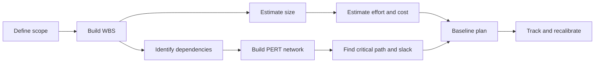

# Project Planning and Estimation

Project planning turns a desired software product into an organized body of work. Gustafson's planning chapter covers work breakdown structures, PERT networks, critical paths, slack time, lines-of-code estimation, LOC-based cost estimation, COCOMO, function point analysis, productivity, and evaluation of estimates. The chapter's central lesson is that planning is not a single number. A credible plan connects tasks, dependencies, sizes, costs, uncertainty, and reviewable assumptions.


*Figure: Kanban boards turn process state into a visible project-management surface. Image: [Wikimedia Commons](https://commons.wikimedia.org/wiki/File:Openproject_kanban.PNG), OpenProject contributors, CC0.*

Planning is where software engineering becomes quantitative. The team decomposes work into tasks, estimates size and effort, finds dependency constraints, identifies the path that controls completion time, and checks whether the estimate is plausible. The resulting plan is still uncertain, but it is no longer a guess without structure.

## Definitions

A **project plan** describes the tasks, ordering, effort, schedule, staffing, and assumptions needed to develop the software. It is a management artifact and an engineering artifact because bad technical decomposition causes bad schedules.

A **work breakdown structure (WBS)** is a hierarchical decomposition of project work into smaller work packages. It should describe work products or activities at a level where ownership, estimation, and tracking are possible.

**PERT**, the Program Evaluation and Review Technique, models project tasks as a network with dependencies and durations. It helps determine earliest and latest start or finish times and identifies the critical path.

The **critical path** is the sequence of dependent tasks that determines the minimum project duration. If a task on the critical path slips, the project completion date slips unless the plan changes.

**Slack time** or float is the amount of time a task can be delayed without delaying the overall project completion. A task with zero slack is critical under the current network and duration assumptions.

**LOC estimation** predicts software size in lines of code. It is easy to understand but sensitive to language, style, reuse, generated code, and counting rules.

**COCOMO**, the Constructive Cost Model, estimates effort from software size and project type. The basic form is often written as:

$$
E = aKLOC^b
$$

where $E$ is effort, $KLOC$ is thousands of delivered source lines, and $a$ and $b$ depend on project class.

**Function point analysis** estimates size from user-visible functionality rather than source code lines. It counts inputs, outputs, inquiries, files, and interfaces, then adjusts for system characteristics.

**Productivity** is output per unit effort. In software, productivity must be interpreted carefully because output can be measured by LOC, function points, features, or delivered value, and each measure has biases.

## Key results

The WBS is the foundation of planning. If work is decomposed poorly, then estimates and schedules inherit the error. A WBS should be complete enough to cover the work but not so detailed that the plan becomes unmaintainable. A useful work package has a clear outcome, owner, estimate, and completion criterion.

PERT exposes dependency logic. Two tasks may each take five days, but if one depends on the other, the pair contributes ten days to the schedule path. If they are independent and can be staffed in parallel, they may contribute only five calendar days. This is why effort and duration are not the same thing.

The critical path is not necessarily the riskiest path or the path with the most important features. It is the path with no timing margin in the current network. However, tasks near the critical path can become critical if estimates change. Planning should therefore watch low-slack tasks, not only zero-slack tasks.

Cost estimation needs calibration. A LOC estimate based on a previous C project may not transfer to a Python web service. COCOMO and function points are useful because they force explicit assumptions, but they still require local historical data for serious accuracy.

Function points can be more stable early in the project because users can often describe inputs, outputs, and data groups before developers know implementation size. Their weakness is subjectivity: counters must apply rules consistently.

Estimate evaluation is part of the planning process. After the project, actual size, effort, duration, and defect data should be compared with estimates. Without this feedback, the organization cannot learn whether its estimation model is biased.

Planning should also keep uncertainty visible. A single-point estimate such as "12 weeks" is easy to communicate but can hide the assumptions behind it. The WBS may show which work packages are understood and which are still speculative. PERT networks show dependency uncertainty because one underestimated task on the critical path affects the whole completion date. Size models such as LOC, COCOMO, and function points should therefore be treated as structured estimates, not as guarantees. A mature planning process records the basis of estimate, updates it when requirements or architecture change, and compares the final outcome with the original assumptions.

## Visual



| Planning tool | Input | Output | Main use |
|---|---|---|---|
| WBS | project scope | work packages | ownership and completeness |
| PERT | tasks, dependencies, durations | earliest/latest times | schedule reasoning |
| Critical path | PERT network | zero-slack path | completion risk |
| LOC estimate | expected implementation size | KLOC | effort model input |
| Function points | user-visible functions | adjusted size | early size estimate |
| COCOMO | KLOC and coefficients | effort | cost and staffing forecast |

## Worked example 1: PERT critical path and slack

**Problem.** A release has tasks A through E. Durations and dependencies are:

| Task | Duration | Depends on |
|---|---:|---|
| A | 3 days | none |
| B | 4 days | A |
| C | 2 days | A |
| D | 5 days | B and C |
| E | 2 days | C |

Find the earliest finish time and identify the critical path.

**Method.** Compute earliest start and earliest finish in dependency order.

1. Task A has no predecessors.

$$
ES_A = 0,\quad EF_A = 0 + 3 = 3
$$

2. Task B depends on A.

$$
ES_B = EF_A = 3,\quad EF_B = 3 + 4 = 7
$$

3. Task C depends on A.

$$
ES_C = EF_A = 3,\quad EF_C = 3 + 2 = 5
$$

4. Task D depends on B and C, so it waits for the later predecessor finish.

$$
ES_D = \max(EF_B, EF_C) = \max(7, 5) = 7
$$

$$
EF_D = 7 + 5 = 12
$$

5. Task E depends on C.

$$
ES_E = EF_C = 5,\quad EF_E = 5 + 2 = 7
$$

6. The release finishes when all terminal tasks finish:

$$
Finish = \max(EF_D, EF_E) = \max(12, 7) = 12
$$

**Checked answer.** The earliest finish is 12 days. The controlling chain is A -> B -> D, with duration $3 + 4 + 5 = 12$. Chain A -> C -> D is $3 + 2 + 5 = 10$, and A -> C -> E is $3 + 2 + 2 = 7$, so they do not control completion under these estimates.

## Worked example 2: Basic COCOMO-style effort estimate

**Problem.** A simple internal tool is estimated at 12 KLOC. Use a basic effort equation $E = 2.4KLOC^{1.05}$ to estimate effort in person-months. If one developer can supply 0.8 productive person-month per calendar month after meetings and support work, how many calendar months would one developer need?

**Method.** Substitute the size estimate, then adjust for available capacity.

1. Compute the exponent term:

$$
12^{1.05} \approx 13.58
$$

2. Multiply by the coefficient:

$$
E = 2.4 \times 13.58 \approx 32.59
$$

So the estimated effort is about 32.6 person-months.

3. One developer supplies 0.8 productive person-month per calendar month. Calendar duration for one developer would be:

$$
Duration = \frac{32.59}{0.8} \approx 40.74
$$

**Checked answer.** The estimate is about 32.6 person-months of effort, or about 40.7 calendar months for one developer at 0.8 productive capacity. This is not a recommendation to staff exactly one developer; it shows why effort, calendar time, and staffing must be considered separately. The answer is checked by noting that capacity below 1.0 person-month per calendar month increases duration.

## Code

```python
from collections import defaultdict, deque

tasks = {
    "A": {"duration": 3, "deps": []},
    "B": {"duration": 4, "deps": ["A"]},
    "C": {"duration": 2, "deps": ["A"]},
    "D": {"duration": 5, "deps": ["B", "C"]},
    "E": {"duration": 2, "deps": ["C"]},
}

earliest_start = {}
earliest_finish = {}

remaining = set(tasks)
while remaining:
    progressed = False
    for task in list(remaining):
        deps = tasks[task]["deps"]
        if all(dep in earliest_finish for dep in deps):
            earliest_start[task] = max([earliest_finish[d] for d in deps], default=0)
            earliest_finish[task] = earliest_start[task] + tasks[task]["duration"]
            remaining.remove(task)
            progressed = True
    if not progressed:
        raise ValueError("Cycle or missing dependency in task graph")

for task in sorted(tasks):
    print(task, earliest_start[task], earliest_finish[task])
print("project finish:", max(earliest_finish.values()))
```

## Common pitfalls

- Treating the WBS as an organization chart. It should decompose project work, not merely list departments.
- Confusing effort with duration. Ten person-days can be one person for ten days or two people for five days only if the work can actually be parallelized.
- Ignoring dependencies when making schedules from estimates.
- Believing the critical path is fixed. It can change when estimates, scope, staffing, or dependencies change.
- Comparing LOC productivity across languages without normalization.
- Using function points casually without consistent counting rules.
- Forgetting to evaluate estimates after actual data is available.

## Connections

- [Project management and process improvement](/cs/software-engineering/project-management-and-process-improvement)
- [Software metrics](/cs/software-engineering/software-metrics)
- [Risk analysis and management](/cs/software-engineering/risk-analysis-and-management)
- [Software life cycle models](/cs/software-engineering/software-life-cycle-models)
- [Software quality assurance](/cs/software-engineering/software-quality-assurance)
