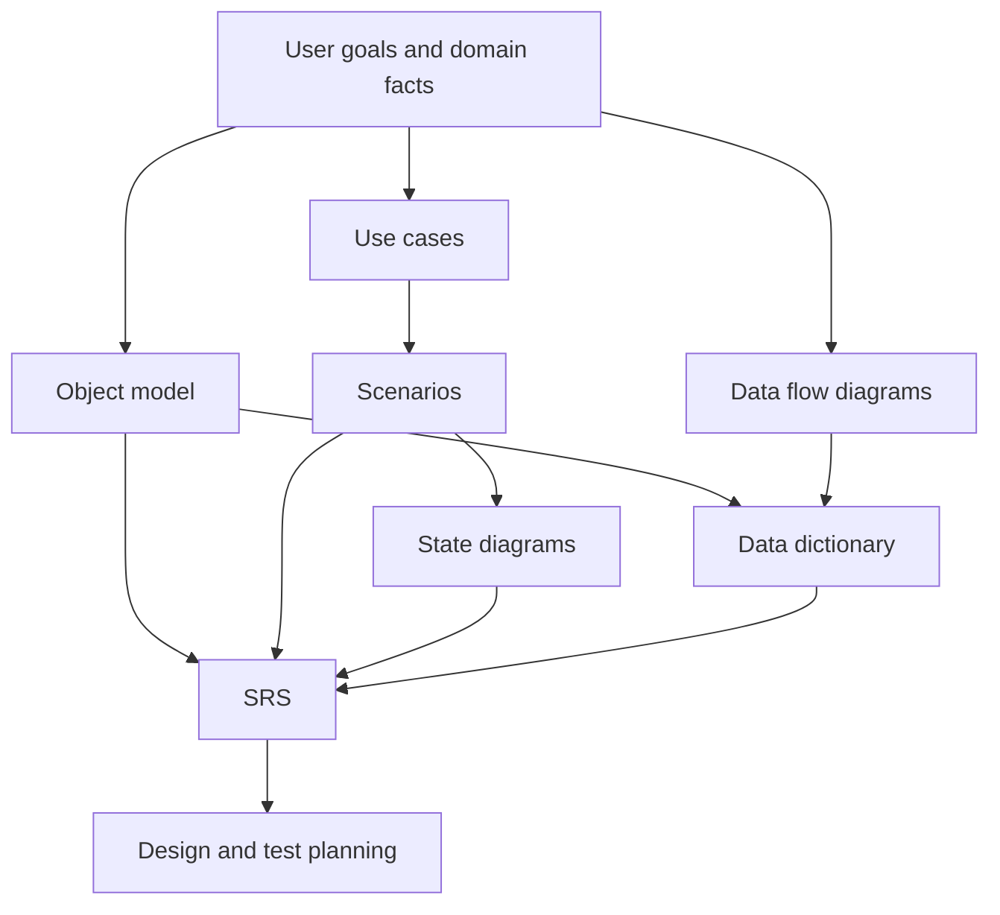
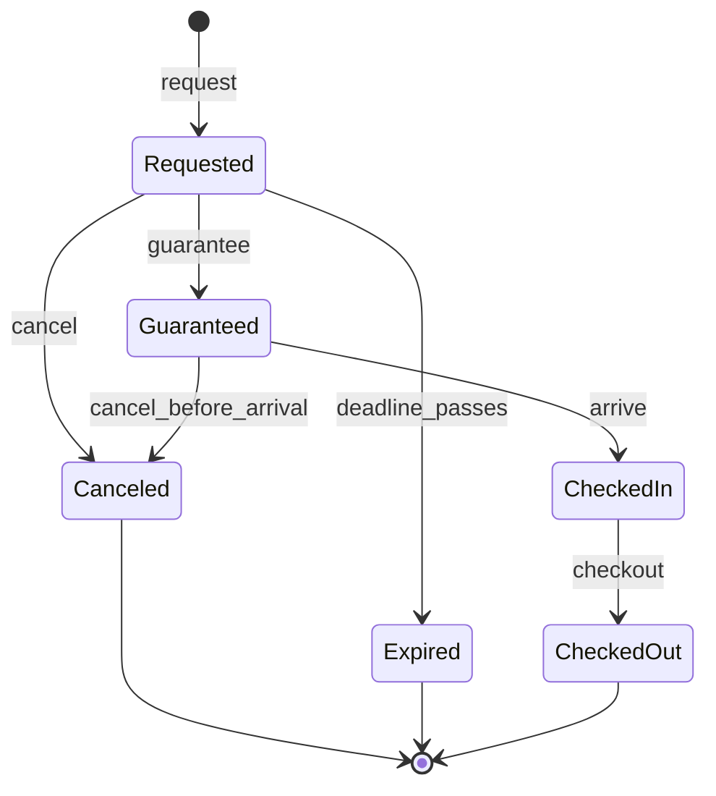

# Requirements Engineering

Requirements engineering defines what the system must do and what constraints it must satisfy before design and implementation commit to a solution. Gustafson's requirements chapter focuses on requirements models and specification artifacts: object models, data flow models, behavioral models, data dictionaries, system diagrams, and the IEEE structure for a software requirements specification. The chapter emphasizes diagrams as communication tools between users and developers.

Requirements sit at the boundary between the environment and the machine. Users describe real-world work, goals, exceptions, and constraints. Developers need a specification detailed enough to design and test against. The requirements process translates domain language into precise, reviewable descriptions without prematurely hiding user-visible behavior inside implementation decisions.

## Definitions

A **requirement** is a statement of needed capability, condition, quality, interface, or constraint. Functional requirements describe behavior; nonfunctional requirements describe qualities or constraints such as performance, reliability, security, usability, and regulatory limits.

A **software requirements specification (SRS)** is a structured document describing what the finished software must do. The source chapter follows an IEEE 830-style outline with introduction, overall description, and specific requirements.

An **object model** in requirements describes domain entities and relationships. At this stage, objects are usually problem-space concepts such as patron, reservation, appointment, copy, patient, or source file. They are not necessarily final implementation classes.

A **data flow model** shows what data is available to processes and how data moves through the system. It is useful even in object-oriented development when the availability and transformation of data need to be clarified.

A **behavioral model** describes system behavior from the user's point of view. Use case diagrams show major functionality, scenarios list specific sequences of actions, and state diagrams show domain-significant states and transitions.

A **scenario** is a sequence of actions that accomplishes a user task. Alternative paths should be represented by separate scenarios or clearly marked alternatives. Scenarios are concrete enough for users to validate.

A **state diagram** used in requirements should follow three rules emphasized by the source:

1. All states must be domain significant.
2. All sequences from scenarios must be allowed.
3. Prohibited scenarios must not be allowed.

A **data dictionary** records information about each data element: name, location or class, type, and semantics. It prevents the same term from being used inconsistently.

A **system diagram** is a less formal overview diagram that may combine people, data stores, functions, and data flows. Its flexibility is useful, but its lack of formal rules can cause ambiguity.

## Key results

Requirements artifacts must be detailed enough to support design and testing. A requirement that cannot guide design or produce a test is too vague. "The system shall be user friendly" is not enough. "A receptionist shall schedule a returning patient appointment in no more than three screens using patient name, desired date range, and appointment type" is closer to designable and testable.

Object models help identify nouns and relationships in the domain. However, requirements object models should avoid implementation bias. A "database row" is usually not a user-domain object, while "reservation" or "appointment" is.

Data flow diagrams clarify what information each process needs. If a process must calculate availability but no room inventory or date range flows into it, the model reveals a requirements gap. The DFD does not need to show every implementation call; it should show essential data availability.

Use cases should include critical functionality but avoid burying the diagram under routine subfunctions. The source uses a simplified editor example where file manipulation and editing operations are represented at a high level, while textual requirements carry finer detail. The judgment is balancing clarity against miscommunication.

Scenarios validate behavior because users can read a concrete story and say whether it matches their work. A scenario should be from the user's point of view, not a hidden database procedure. Significant alternative sequences matter: a returning patient, a new patient, and a patient scheduling multiple appointments may each need a different scenario.

State diagrams protect requirements from illegal behavior. If a reservation can be guaranteed, canceled, expired, or checked in, the state diagram should show legal transitions and omit forbidden ones. Every state should be reachable from the start and able to reach a terminal state or continuing operational state.

The IEEE-style SRS outline is valuable because it separates context from detailed requirements. The introduction explains purpose and scope. The overall description explains perspective, functions, users, constraints, assumptions, and deferred requirements. The specific requirements describe interfaces, functions, performance, design constraints, and attributes in enough detail for design and test.

## Visual



| Artifact | Primary audience | Checks |
|---|---|---|
| Object model | users and analysts | domain nouns, associations, multiplicities |
| DFD | analysts and designers | required input and output data |
| Use case diagram | users and analysts | critical user-visible functions |
| Scenario | users and testers | significant sequences and alternatives |
| State diagram | users, analysts, testers | legal and illegal transitions |
| Data dictionary | whole project | consistent meaning of data |
| SRS | whole project | designable and testable requirements |

## Worked example 1: Building scenarios for appointment scheduling

**Problem.** A dental office system must let a receptionist schedule appointments. Existing patients can be found by name. New patients must first be added to patient records. The system should produce reminder calls two days before the appointment. Write two scenarios and identify what requirements they reveal.

**Method.** Write user-visible sequences, then extract requirements.

1. Scenario A: returning patient.

   A patient calls for an appointment. The receptionist searches by patient name. The system displays matching patient records. The receptionist selects the correct patient. The system suggests open appointment times for the requested appointment type. The patient accepts one time. The receptionist confirms the appointment. Two days before the appointment, the system includes the patient on the reminder call list.

2. Scenario B: new patient.

   A patient calls for an appointment. The receptionist searches by name. The system finds no existing patient. The receptionist creates a patient record with name and phone number. The receptionist requests available times. The system suggests open appointment times. The patient accepts one time. The receptionist confirms the appointment. The appointment is linked to the new patient record.

3. Requirements revealed by the scenarios:

   The system shall search patient records by name. It shall allow creation of a new patient record during appointment scheduling. It shall display available appointment times by appointment type. It shall create confirmed appointments linked to patient records. It shall generate a reminder call list two days before scheduled appointments.

**Checked answer.** The scenarios are valid because they describe user-visible actions and significant alternatives. The requirements are checked against the scenarios: every scenario step has a corresponding required capability, and the new-patient path does not assume a preexisting record.

## Worked example 2: Checking a reservation state model

**Problem.** A bed-and-breakfast reservation can be requested, guaranteed by credit card, canceled before arrival, expired if not guaranteed by a deadline, checked in on arrival, and checked out after the stay. Build a requirements-level state model and check whether "check in before guarantee" is allowed.

**Method.** Use domain states and event-triggered transitions.

1. Domain states: `Requested`, `Guaranteed`, `Canceled`, `Expired`, `CheckedIn`, and `CheckedOut`.

2. Initial transition: a new request creates `Requested`.

3. From `Requested`, the customer may guarantee by credit card, cancel, or pass the guarantee deadline and expire.

4. From `Guaranteed`, the customer may cancel before arrival or check in on arrival.

5. From `CheckedIn`, checkout leads to `CheckedOut`.

6. Terminal states are `Canceled`, `Expired`, and `CheckedOut`.

**Checked answer.**



"Check in before guarantee" is not allowed because there is no transition from `Requested` to `CheckedIn`. The model is checked against the requirements rule: allowed scenario sequences are present, and the prohibited sequence is absent.

## Code

```python
transitions = {
    "Requested": {"guarantee": "Guaranteed", "cancel": "Canceled", "deadline_passes": "Expired"},
    "Guaranteed": {"cancel_before_arrival": "Canceled", "arrive": "CheckedIn"},
    "CheckedIn": {"checkout": "CheckedOut"},
    "Canceled": {},
    "Expired": {},
    "CheckedOut": {},
}

def run_scenario(start, events):
    state = start
    for event in events:
        if event not in transitions[state]:
            return False, state, event
        state = transitions[state][event]
    return True, state, None

valid, state, bad_event = run_scenario("Requested", ["arrive"])
print("check in before guarantee allowed?", valid)
if not valid:
    print(f"blocked event {bad_event!r} while in state {state!r}")
```

## Common pitfalls

- Writing requirements in implementation terms before the user-visible behavior is clear.
- Including only the happy path and omitting significant alternatives.
- Letting use case diagrams become too detailed to communicate.
- Drawing state diagrams with implementation states rather than domain-significant states.
- Allowing a state transition just because it is technically possible, even though the business process forbids it.
- Creating a data dictionary after design instead of using it to stabilize requirements vocabulary.
- Writing SRS statements that are not detailed enough to design or test from.

## Connections

- [Software process models and diagrams](/cs/software-engineering/software-process-models-and-diagrams)
- [Software design](/cs/software-engineering/software-design)
- [Software testing](/cs/software-engineering/software-testing)
- [Software quality assurance](/cs/software-engineering/software-quality-assurance)
- [Formal specifications and OCL](/cs/software-engineering/formal-specifications-and-ocl)
