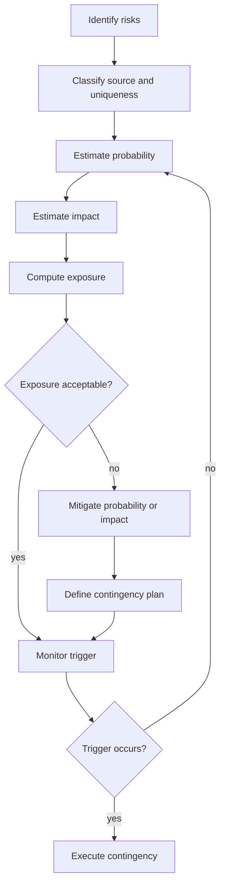

# Risk Analysis and Management

Risk analysis asks what could go wrong, how likely it is, what it would cost, and what the team should do before it happens. Gustafson's risk chapter covers risk identification, estimation, exposure, decision trees, mitigation, and risk management plans. The chapter is short but important because it connects uncertainty to explicit management action.


*Figure: Kanban boards turn process state into a visible project-management surface. Image: [Wikimedia Commons](https://commons.wikimedia.org/wiki/File:Openproject_kanban.PNG), OpenProject contributors, CC0.*

Risk management belongs near the start of a project, but it does not end there. New risks appear as requirements change, suppliers slip, prototypes reveal limitations, or defects cluster in critical modules. A useful risk process turns vague concern into named risks with probabilities, impacts, triggers, owners, mitigation strategies, and contingency plans.

## Definitions

A **risk** is a possible future event or condition that would have a negative effect on project objectives if it occurred. A risk is not the same as a current problem. "The database server is down" is an issue. "The database server may not scale to expected load" is a risk until it becomes true.

**Risk identification** is the activity of finding and naming risks. Risks can be classified by source, such as project, technical, and business risks. They can also be classified as common risks, which occur in many projects, or special risks, which are unusual for this project.

**Risk probability** is the estimated likelihood that the risk event will occur. It can be numeric, such as 0.2, or qualitative, such as low, medium, and high, if numeric estimates are not credible.

**Risk impact** is the cost or loss if the risk event occurs. Impact may be measured in money, schedule delay, lost functionality, safety consequence, regulatory exposure, reputation damage, or extra effort.

**Risk exposure** is the expected value of a risk:

$$
Risk\ exposure = probability \times impact
$$

For multiple mutually exclusive outcomes, the total exposure is the sum of probability times impact for each outcome.

A **risk decision tree** is a branching model that compares alternatives and uncertain outcomes. The first branch often represents the choice available to the team; later branches represent risk events and their probabilities. Leaf values are combined to compare alternatives.

**Risk mitigation** is proactive work that reduces the probability or impact of a risk. A prototype can reduce technical uncertainty, a backup supplier can reduce procurement impact, and an early review can reduce the probability of escaping defects.

A **contingency plan** describes what the team will do if a risk trigger occurs. A **risk trigger** is an observable condition indicating that the risk is becoming active, such as "hardware delivery is more than one week late."

A **risk management plan** records the risk identifier, description, probability, impact, exposure, mitigation, trigger, contingency, owner, and current status.

## Key results

The most important formula in this chapter is simple:

$$
RE = P(risk) \times Loss(risk)
$$

Its simplicity is useful because it forces two separate estimates. A dramatic risk with tiny probability may have lower exposure than a modest risk with high probability. Conversely, a low-probability safety or legal risk may still require strong mitigation because its impact is unacceptable even if its expected value seems moderate.

Risk classification improves coverage. Project risks include cost overrun, schedule slip, staff turnover, and communication failure. Technical risks include immature hardware, unstable external interfaces, performance uncertainty, and algorithm feasibility. Business risks include market changes, funding changes, customer priority shifts, and regulatory constraints.

Common risks can often be managed through standard process. For example, misunderstanding user requirements is common, so requirements reviews and prototypes can be normal practices. Special risks need project-specific attention. If a project uses new cutting-edge hardware, a generic requirements review is not enough; the team may need a hardware simulator, early integration experiment, or backup plan.

Decision trees are useful when alternatives have different risk profiles. A cheap option may have high failure probability; an expensive option may reduce risk enough to be worthwhile. Decision trees should not imply false precision. They are a way to make assumptions visible so stakeholders can challenge probabilities, impacts, and preferences.

Mitigation should usually attack uncertainty early. If the team fears that a database cannot meet response-time requirements, waiting until system testing is poor risk management. A performance prototype or benchmark in the first increment can reduce probability, reduce impact, or reveal the need to change architecture.

The risk management plan should have owners. A risk without an owner becomes a paragraph in a document rather than a managed concern. The owner watches triggers, updates status, and starts contingency action when needed.

Risk management is iterative. Probability and impact estimates should be revised as the project learns more. A risk about an unfamiliar framework may start with high probability and high impact, then drop after a prototype proves the required feature works. A supplier-delay risk may move in the opposite direction as delivery dates slip. The risk register is therefore a live project control artifact. At each review, the team should ask whether new risks have appeared, whether existing mitigation is working, whether triggers have fired, and whether contingency plans still make sense.

Risk exposure is useful for comparing mitigation options, but it should not erase judgment about distribution. Two risks can have the same expected value while having very different consequences. A 50 percent chance of losing two days and a 1 percent chance of causing a safety failure should not be managed in the same casual way just because an arithmetic exposure looks similar. Expected value supports decisions; it does not replace engineering responsibility.

## Visual



| Field | Purpose | Example |
|---|---|---|
| Risk ID | stable reference | R-014 |
| Description | named uncertain event | payment API may change before release |
| Probability | likelihood estimate | 0.25 |
| Impact | loss if event occurs | 15 person-days rework |
| Exposure | expected loss | 3.75 person-days |
| Mitigation | proactive reduction | meet vendor, isolate adapter |
| Trigger | observable warning | vendor publishes breaking beta |
| Contingency | action after trigger | freeze adapter, shift sprint scope |
| Owner | accountable watcher | integration lead |

## Worked example 1: Calculating risk exposure

**Problem.** A project has a 0.5 percent probability of an undetected fault that would cause USD 100,000 in regulatory fines. Calculate the risk exposure.

**Method.** Convert the probability to a decimal and multiply by impact.

1. Probability:

$$
0.5\% = \frac{0.5}{100} = 0.005
$$

2. Impact:

$$
Impact = 100000
$$

3. Risk exposure:

$$
RE = 0.005 \times 100000 = 500
$$

**Checked answer.** The risk exposure is USD 500. This does not mean the company will pay USD 500. It means the expected loss from this risk, under the estimate, is USD 500. The possible actual outcomes are closer to either USD 0 or USD 100,000, but expected value helps compare prevention options.

## Worked example 2: Evaluating an additional review

**Problem.** Use the previous risk. An additional review costs USD 100 and eliminates the fault 50 percent of the time. Should the project perform the review using expected cost?

**Method.** Compute the new probability, include review cost, and compare with the original exposure.

1. Original probability is 0.005.

2. The review eliminates the fault 50 percent of the time, so the remaining probability is:

$$
0.005 \times (1 - 0.50) = 0.0025
$$

3. If the fault remains and causes a fine, the cost is the fine plus the review:

$$
100000 + 100 = 100100
$$

4. If the fault does not cause the fine, the review still costs USD 100.

5. Expected cost with review:

$$
\begin{aligned}
Expected &= 0.0025 \times 100100 + 0.9975 \times 100 \\
         &= 250.25 + 99.75 \\
         &= 350.00
\end{aligned}
$$

6. Compare:

$$
350 < 500
$$

**Checked answer.** The additional review is justified by expected cost because it reduces expected loss from USD 500 to USD 350. The check is that the review cost was included in both outcome branches, not only in the branch where the fault remains.

## Code

```python
from dataclasses import dataclass

@dataclass
class Risk:
    risk_id: str
    probability: float
    impact: float
    mitigation_cost: float = 0.0
    probability_reduction: float = 0.0

    def exposure_without_mitigation(self):
        return self.probability * self.impact

    def expected_cost_with_mitigation(self):
        remaining_probability = self.probability * (1 - self.probability_reduction)
        return remaining_probability * (self.impact + self.mitigation_cost) + (
            1 - remaining_probability
        ) * self.mitigation_cost

risk = Risk("R-fine", probability=0.005, impact=100_000, mitigation_cost=100, probability_reduction=0.50)
print("without review:", risk.exposure_without_mitigation())
print("with review:", risk.expected_cost_with_mitigation())
```

## Common pitfalls

- Calling current issues risks. Risks are uncertain future events; current failures need issue management.
- Estimating only probability and ignoring impact, or estimating only impact and ignoring probability.
- Treating all low-probability risks as unimportant. Catastrophic impact can justify mitigation even when probability is small.
- Writing mitigation strategies that do not reduce probability or impact.
- Forgetting triggers. Without a trigger, contingency plans start too late.
- Assigning no owner to a risk.
- Using expected value mechanically when safety, legal, or ethical constraints require stronger controls.

## Connections

- [Project management and process improvement](/cs/software-engineering/project-management-and-process-improvement)
- [Project planning and estimation](/cs/software-engineering/project-planning-and-estimation)
- [Software quality assurance](/cs/software-engineering/software-quality-assurance)
- [Software life cycle models](/cs/software-engineering/software-life-cycle-models)
- [Software testing](/cs/software-engineering/software-testing)
