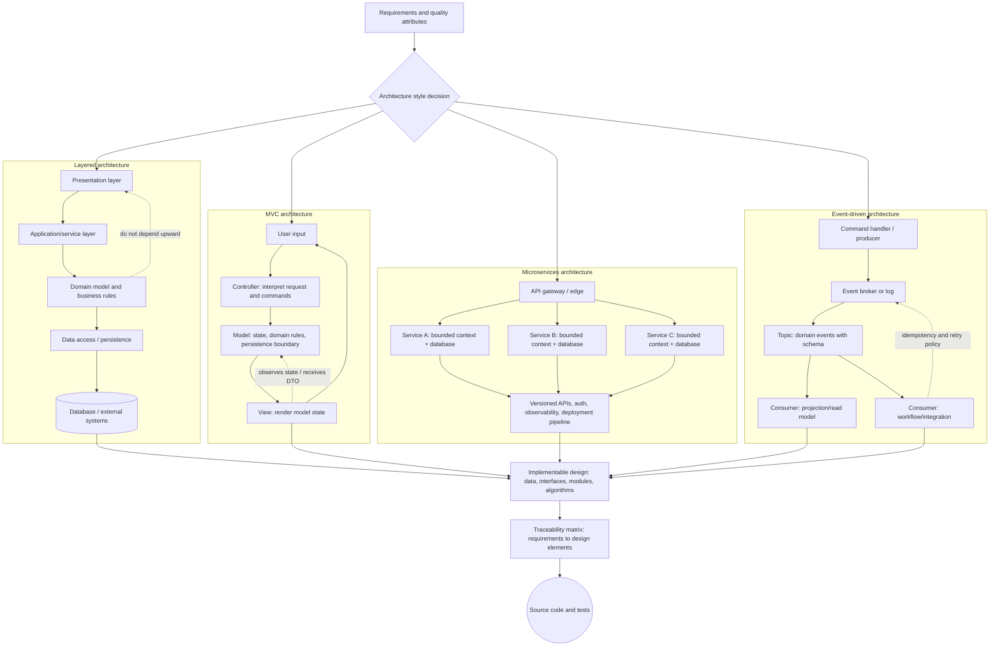

# Software Design

Software design converts the "what" of requirements into the "how" of a buildable system. Gustafson's design chapter covers the movement from user-oriented requirements to development specifications, design phases, interfaces, refinement, modularity, abstraction, cohesion, coupling, program slices, glue tokens, and requirements traceability. The chapter treats design as creative work, but not unstructured work: good design is evaluated by whether it is implementable, understandable, cohesive, loosely coupled, and traceable to requirements.

The chapter also makes a subtle distinction between phenomena in the environment and phenomena visible to the implementation. A user may care about a physical book, a pop can, or a person at a door. The software may only see a barcode, an image pattern, or a sensor event. Design begins from a specification that connects the world and the machine using terms visible enough to both sides.

## Definitions

**Software design** is the process of defining a system in sufficient detail to permit implementation. It transforms requirements into data structures, architecture, interfaces, and algorithms.

A **user requirement** may mention environment phenomena, including things the machine cannot directly observe. A **development specification** should be stated in terms of phenomena visible enough to guide implementation while still representing the intended environment behavior.

The textbook divides design into phases:

| Phase | Product |
|---|---|
| Data design | data structures and data representations |
| Architectural design | major structural units such as classes, modules, or components |
| Interface design | externally visible behavior and method signatures |
| Procedural design | algorithms and method internals |

An **interface specification** describes the external behavior of a module or class. In object-oriented design, it includes public method signatures and their semantics. It may also include preconditions, postconditions, and invariants.

**Refinement** is a design approach that successively adds detail, often called top-down design. A high-level operation is decomposed into lower-level operations until implementation is straightforward.

**Modularity** divides software into smaller pieces that can be implemented, understood, tested, and changed separately while still integrating into the full system.

**Abstraction** hides unnecessary detail so the designer can focus on essential behavior. A caller should not need to know the internal representation of a callee if the interface is sufficient.

**Cohesion** is the degree to which elements of a module belong together. High cohesion is desirable. A cohesive procedure has statements related to its outputs; a cohesive class has methods and attributes that support a unified responsibility.

**Coupling** is the degree of interdependence among modules. Low coupling is desirable because changes in one module are less likely to force changes in another.

A **program slice** is the set of statements or tokens related to a particular input or output through data and control dependencies. An output slice contains statements that can affect a chosen output. An input slice contains statements affected by a chosen input.

**Requirements traceability** links requirements to design elements that satisfy them. A traceability matrix has requirements on one axis and design elements on the other.

## Key results

Design should be traceable to requirements but expressed in solution terms. If a design element has no related requirement, it may be unnecessary infrastructure or an undocumented requirement. If a requirement has no design element, it may be unimplemented. Neither case is automatically wrong, but both deserve review.

Interfaces carry design responsibility. A vague interface forces callers and implementers to guess. A strong interface states inputs, outputs, error behavior, side effects, and semantic rules. In formal design, preconditions and postconditions make these rules explicit.

Refinement and modularity are complementary. Refinement decomposes behavior; modularity packages responsibilities. A team can refine "borrow book" into "find patron," "find available copy," "create loan," and "update status," then assign those operations to cohesive classes such as `Patron`, `BookCopy`, and `Loan`.

High cohesion reduces mental load. If a class handles appointments, payroll, and report formatting, every change requires understanding unrelated concerns. If each class has a clear responsibility, defects are easier to localize and tests are easier to write.

Low coupling improves change tolerance. Coupling increases when modules share globals, depend on control flags, know each other's internal data, or require long parameter lists whose details leak representation. Coupling is not always bad; modules must interact. The goal is to interact through stable, meaningful interfaces.

Program slicing gives a more precise way to discuss cohesion. If every output slice in a procedure shares many tokens, the procedure is likely functionally cohesive. If separate outputs depend on mostly disjoint statements, the procedure may be doing unrelated work.

Traceability matrices reveal both omissions and surplus design. Blank requirement rows suggest unhandled requirements. Blank design columns suggest design elements not justified by requirements, reusable infrastructure, or missing requirements documentation.

## Visual



This diagram expands software design into four common architectural styles and the design artifacts they imply. Layered and MVC diagrams show internal dependency direction, while microservices and event-driven blocks make service ownership, contracts, event schemas, retries, and observability part of the architecture rather than afterthoughts.

| Design quality | Desired direction | Practical question |
|---|---|---|
| Abstraction | high | Can callers ignore unnecessary internals? |
| Cohesion | high | Do the elements support one responsibility? |
| Coupling | low | Can one module change without forcing many others to change? |
| Traceability | complete enough | Can each requirement be found in the design? |
| Interface clarity | high | Are normal, abnormal, and boundary behaviors specified? |

## Worked example 1: Designing an interface for borrowing a book

**Problem.** A library system must let a patron borrow a book by ISBN. A borrow request should succeed only if the patron exists, an available copy exists, and the loan can be created. Design an interface for the operation and state its result meanings.

**Method.** Specify caller-visible behavior without exposing unnecessary internals.

1. Name the operation from the domain:

```text
borrow_book(patron_id, isbn)
```

2. Identify inputs:

   `patron_id` identifies the borrower. `isbn` identifies the requested title. Neither requires the caller to know internal database keys for `Loan` or `BookCopy`.

3. Identify possible outcomes:

   Success, patron not found, title not found, no copy available, patron blocked, and internal error.

4. Define a result type:

```text
BorrowResult(status, loan_id, due_date, message)
```

5. State preconditions:

   The caller supplies a nonempty patron id and a syntactically valid ISBN. The library catalog and patron records are available.

6. State postconditions:

   On success, exactly one available copy is associated with a new loan, the copy becomes unavailable, and the result contains loan id and due date. On failure, no loan is created and no copy status changes.

**Checked answer.** The interface is cohesive because it describes one operation. It is low-coupling because callers do not manipulate `BookCopy` or `Loan` internals. It is checkable because each outcome and postcondition can become a test.

## Worked example 2: Traceability matrix

**Problem.** Requirements for a reservation system are: R1 search vacancies by date, R2 store customer phone number, R3 guarantee reservation by credit card, and R4 print weekly schedule. Design elements are D1 `CalendarService`, D2 `CustomerRecord.phone`, D3 `PaymentAuthorization`, D4 `ScheduleReport`, and D5 `AuditLog`. Build a traceability matrix and identify concerns.

**Method.** Mark a cell when the design element helps satisfy the requirement.

| Requirement | D1 CalendarService | D2 CustomerRecord.phone | D3 PaymentAuthorization | D4 ScheduleReport | D5 AuditLog |
|---|---:|---:|---:|---:|---:|
| R1 search vacancies by date | X |  |  |  |  |
| R2 store customer phone number |  | X |  |  |  |
| R3 guarantee reservation by credit card |  |  | X |  |  |
| R4 print weekly schedule | X |  |  | X |  |

1. R1 is handled by the calendar service.

2. R2 is handled by the phone field in customer records.

3. R3 is handled by payment authorization.

4. R4 is handled by schedule reporting and depends on calendar data.

5. D5 has no mark.

**Checked answer.** All four requirements have at least one design element, so there is no obvious unimplemented requirement. D5 `AuditLog` has no traced requirement. That may be acceptable if it supports a nonfunctional requirement not listed here, but it should trigger a question: is there an audit requirement missing from the requirements, or is the audit log unnecessary scope?

## Code

```python
requirements = ["R1 vacancy search", "R2 phone number", "R3 credit guarantee", "R4 weekly schedule"]
design = ["CalendarService", "CustomerRecord.phone", "PaymentAuthorization", "ScheduleReport", "AuditLog"]

trace = {
    ("R1 vacancy search", "CalendarService"),
    ("R2 phone number", "CustomerRecord.phone"),
    ("R3 credit guarantee", "PaymentAuthorization"),
    ("R4 weekly schedule", "CalendarService"),
    ("R4 weekly schedule", "ScheduleReport"),
}

for req in requirements:
    hits = [item for item in design if (req, item) in trace]
    print(req, "->", hits or ["MISSING DESIGN"])

for item in design:
    hits = [req for req in requirements if (req, item) in trace]
    if not hits:
        print(item, "has no traced requirement")
```

## Common pitfalls

- Designing directly from vague user statements without creating a development specification.
- Exposing internal identifiers or representations in interfaces when domain identifiers are sufficient.
- Treating refinement as a reason to ignore modular responsibility.
- Maximizing abstraction until the design becomes too vague to implement.
- Grouping unrelated operations in one class and calling it cohesive because the operations run at the same time.
- Assuming all coupling is visible in method calls; globals, shared files, and control flags also couple modules.
- Leaving traceability until the end, when design gaps are expensive to correct.

## Connections

- [Requirements engineering](/cs/software-engineering/requirements-engineering)
- [Software process models and diagrams](/cs/software-engineering/software-process-models-and-diagrams)
- [Software metrics](/cs/software-engineering/software-metrics)
- [Formal specifications and OCL](/cs/software-engineering/formal-specifications-and-ocl)
- [Software testing](/cs/software-engineering/software-testing)
