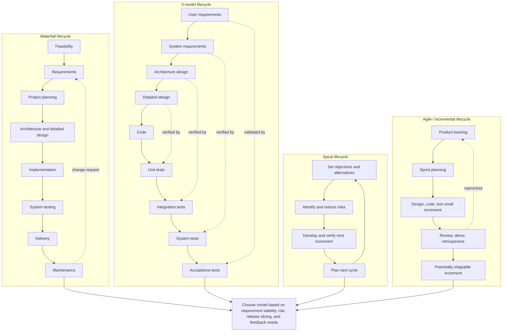

# Software Life Cycle Models

Software engineering begins by making work visible. A software life cycle is the ordered set of activities, deliverables, checkpoints, and decisions that move an idea from feasibility to a maintained product. Gustafson's first chapter treats the life cycle as a management structure as much as a technical structure: phases help teams know what work is expected, what artifacts should exist, and when progress can be judged by an observable milestone.


*Figure: Kanban boards turn process state into a visible project-management surface. Image: [Wikimedia Commons](https://commons.wikimedia.org/wiki/File:Openproject_kanban.PNG), OpenProject contributors, CC0.*

The chapter is intentionally practical. It names common development activities such as requirements, design, implementation, testing, delivery, and maintenance; it also names the documents that make those activities inspectable. Life cycle models then arrange the same kinds of work in different patterns. The waterfall model emphasizes a mostly sequential flow, prototyping uses a throwaway system to clarify ideas, incremental development delivers useful subsets, and the spiral model repeatedly revisits planning, risk, engineering, construction, and customer evaluation.

## Definitions

A **software life cycle** is the sequence of major activities used to develop and evolve software. The term does not mean that every project must use the same steps or the same degree of formality. It means that software work can be described as a set of recognizable activities with outputs that can be reviewed.

A **deliverable** is an object, document, agreement, or result produced during the life cycle. Source code is a deliverable, but so are a requirements specification, a user manual, a test report, a project schedule, and a software quality assurance plan. Deliverables matter because they turn invisible thinking into something that can be inspected, versioned, estimated, and corrected.

A **milestone** is an event used to judge project status. A useful milestone has two properties: it is related to real progress, and it is obvious when it has been reached. "The team worked hard this week" is not a milestone. "The customer accepted the requirements specification" is a milestone because the event can be observed and tied to downstream work.

The textbook's activity categories can be summarized as follows:

| Activity | Main question | Typical outputs |
|---|---|---|
| Feasibility | Is the proposed development worthwhile? | statement of work, market or business analysis |
| Requirements | What must the software do? | software requirements specification, use cases, object model |
| Project planning | How will development be organized? | schedule, cost estimate, WBS, SQA plan |
| Design | How will the software provide the required behavior? | architecture, interfaces, detailed module designs |
| Implementation | How will the design become executable software? | source code, builds, developer notes |
| Testing | Does the software behave acceptably? | test plan, test results, defect reports |
| Delivery | How will the customer receive and use the system? | installed system, training, user manual, help desk process |
| Maintenance | How will usefulness continue after delivery? | patches, enhancements, regression tests, release notes |

The **linear sequential model**, often called the **waterfall model**, arranges activities in a mostly one-way sequence. In its simplest form, feasibility is followed by requirements, design, implementation, and testing. Some variants add delivery and maintenance explicitly; some fold project planning into requirements.

A **prototype** is a temporary version built to test ideas, requirements, or user interaction. In Gustafson's description, the prototype is often throwaway: it helps the customer and developer agree on behavior before normal development proceeds.

An **increment** is a small but useful subset of the final system. The incremental model repeats life cycle work for successive useful releases. The goal is not merely to split code into pieces; it is to deliver a working subset early and then extend it.

The **spiral model** organizes development as repeated cycles around major concerns such as customer communication, planning, risk analysis, engineering, construction and release, and customer evaluation. Its signature feature is explicit attention to risk during each cycle.

## Key results

Life cycle models are not recipes for success by themselves. Their value is that they expose assumptions about order, feedback, risk, and customer involvement. The same activity, such as testing, has a different meaning in each model. In a strict waterfall process, most system testing appears after implementation. In incremental development, testing happens for each increment. In a spiral approach, risk analysis may cause the next engineering work to be a prototype, an experiment, or a partial implementation.

A phased life cycle helps management because it creates visibility. A manager can ask whether the required deliverables for a phase exist, whether reviews have occurred, and whether the team has passed the defined milestone. This is not only administrative. If the project moves into implementation without an agreed requirements baseline, then programmers are forced to resolve product decisions while writing code. That usually hides scope change inside "implementation problems."

Milestones are strongest when they are tied to reviewable artifacts. "Design started" is weak because the word "started" can hide almost any status. "Architecture review completed with approved interface list" is stronger because it references both an event and an artifact. A milestone does not guarantee product quality, but it gives the team a shared fact about progress.

The waterfall model is easiest to understand and easiest to schedule, but it assumes that requirements can be stabilized early enough to justify a long sequence of downstream work. It fits best when the domain is well understood, interfaces are stable, and the cost of change is high. Its major risk is late discovery: if the requirements or design are wrong, the error may not become obvious until testing or customer review.

The prototyping model reduces requirements risk by making ideas concrete. A prototype can reveal missing features, confusing workflows, and unrealistic assumptions. Its major risk is accidental production use: a prototype built quickly for learning can be mistaken for a nearly finished system. Teams should mark prototypes clearly and decide whether they are throwaway or evolutionary before relying on them.

The incremental model improves feedback and value delivery. Each increment should be small enough to build and test, but complete enough to be useful. The key design challenge is architectural foresight: early increments should not make later increments impossible or excessively expensive.

The spiral model is most useful when risk dominates the project. It asks the team to identify, estimate, and address risks repeatedly instead of treating risk as a one-time planning note. It is heavier than a simple waterfall diagram, but that extra structure is justified for large, uncertain, or high-stakes systems.

## Visual



This diagram places waterfall, V-model, spiral, and agile lifecycles side by side instead of reducing them to a single phase chain. The dotted arrows show the main feedback contracts: maintenance changes return to requirements, V-model tests verify matching development artifacts, spiral cycles revisit risk, and agile reviews reprioritize the backlog.

| Model | Basic shape | Best fit | Main trade-off |
|---|---|---|---|
| Waterfall | mostly sequential phases | stable, well understood work | simple control, late feedback |
| Prototyping | exploratory build before main build | unclear requirements or user interface | better learning, possible prototype confusion |
| Incremental | repeated useful subsets | systems that can be sliced into releases | early value, needs extensible architecture |
| Spiral | repeated risk-driven cycles | large or risky projects | explicit risk handling, higher process cost |

## Worked example 1: Mapping deliverables to phases

**Problem.** A small team is building a course registration system. The current artifact list is: statement of work, software requirements specification, cost estimate, architecture diagram, source code, unit test report, user manual, and defect report. Place each artifact in the life cycle activity where it is normally produced or primarily used.

**Method.** Use the purpose of each artifact rather than its filename.

1. The **statement of work** gives a preliminary description of desired capabilities. That makes it a feasibility artifact, because it supports the decision about whether the project should proceed.

2. The **software requirements specification** describes what the finished software should do. It belongs to requirements.

3. The **cost estimate** predicts resources and effort. It belongs to project planning, even though it depends on requirements.

4. The **architecture diagram** shows the high-level structure of the solution. It belongs to design.

5. The **source code** is the executable expression of the design. It belongs to implementation.

6. The **unit test report** records tests run by developers or near the code level. It belongs to testing.

7. The **user manual** may be drafted earlier, but the final manual is normally part of delivery because it helps the customer use the finished product.

8. The **defect report** records dissatisfaction with specific system behavior. It can appear during testing, delivery, or maintenance. If the report is from customer use after release, classify it as maintenance input; if it is from formal test execution before release, classify it as testing output.

**Checked answer.**

| Artifact | Phase |
|---|---|
| statement of work | feasibility |
| software requirements specification | requirements |
| cost estimate | project planning |
| architecture diagram | design |
| source code | implementation |
| unit test report | testing |
| user manual | delivery |
| defect report | testing or maintenance, depending on origin |

The answer is checked by asking whether each phase could proceed without the artifact. Design needs requirements; implementation needs design; acceptance needs test evidence and delivery materials.

## Worked example 2: Choosing a life cycle model

**Problem.** A company wants a new inventory system for warehouse scanners. The hardware API is stable, but warehouse supervisors are unsure about the screen flow. The company needs a usable receiving module in two months, then picking and shipping later. Which life cycle model should the team use?

**Method.** Compare project facts with model strengths.

1. A pure waterfall model is attractive because the hardware API is stable. However, the screen flow is uncertain. If the team freezes requirements too early, it may build the wrong operator workflow.

2. A throwaway prototype is useful for the scanner interaction. The team can simulate receiving, barcode correction, and exception handling without building the complete database and integration layer.

3. The business needs a usable receiving module early. That points to incremental delivery, because receiving can become the first useful increment and later increments can add picking and shipping.

4. The project does not sound dominated by unknown technical risks. The spiral model's risk focus might be helpful, but it would be heavier than necessary unless scanner performance, safety, or integration uncertainty becomes severe.

**Checked answer.** Use an **incremental model with an early throwaway prototype** for the scanner workflow. The first increment should deliver receiving. Before detailed implementation, build a prototype that lets supervisors test screen order, error messages, and barcode exception paths. Then preserve the lessons, discard the prototype if it was not built to production quality, and implement the receiving increment on the real architecture.

This answer is checked against the project goals: it handles uncertain requirements through prototyping, satisfies early business value through incremental delivery, and avoids imposing the full spiral model where risk does not justify it.

## Code

```python
from dataclasses import dataclass

@dataclass(frozen=True)
class Milestone:
    name: str
    artifact: str
    observable_event: str
    tied_to_progress: bool

def evaluate_milestone(milestone: Milestone) -> list[str]:
    issues = []
    if not milestone.artifact:
        issues.append("No reviewable artifact is named.")
    if not milestone.observable_event:
        issues.append("No observable completion event is defined.")
    if not milestone.tied_to_progress:
        issues.append("The milestone is not tied to development progress.")
    return issues

milestones = [
    Milestone(
        "Requirements baseline",
        "software requirements specification",
        "customer signs requirements review record",
        True,
    ),
    Milestone("Design started", "", "team begins discussion", False),
]

for item in milestones:
    problems = evaluate_milestone(item)
    status = "usable" if not problems else "weak"
    print(f"{item.name}: {status}")
    for problem in problems:
        print(f"  - {problem}")
```

## Common pitfalls

- Treating the life cycle as paperwork instead of as a visibility mechanism. The documents matter because they support decisions, reviews, and coordination.
- Calling every date a milestone. A date is only useful when it is connected to an observable event and a meaningful artifact.
- Using waterfall because it is easy to draw, even when requirements are unstable.
- Building a prototype and then quietly evolving it into production without revisiting architecture, tests, maintainability, and quality expectations.
- Splitting increments by technical layer only. An increment should usually deliver a user-visible slice of capability, not just "the database layer."
- Forgetting maintenance. The life cycle does not end when the first version is installed.

## Connections

- [Software process models and diagrams](/cs/software-engineering/software-process-models-and-diagrams)
- [Project planning and estimation](/cs/software-engineering/project-planning-and-estimation)
- [Requirements engineering](/cs/software-engineering/requirements-engineering)
- [Software testing](/cs/software-engineering/software-testing)
- [Risk analysis and management](/cs/software-engineering/risk-analysis-and-management)
