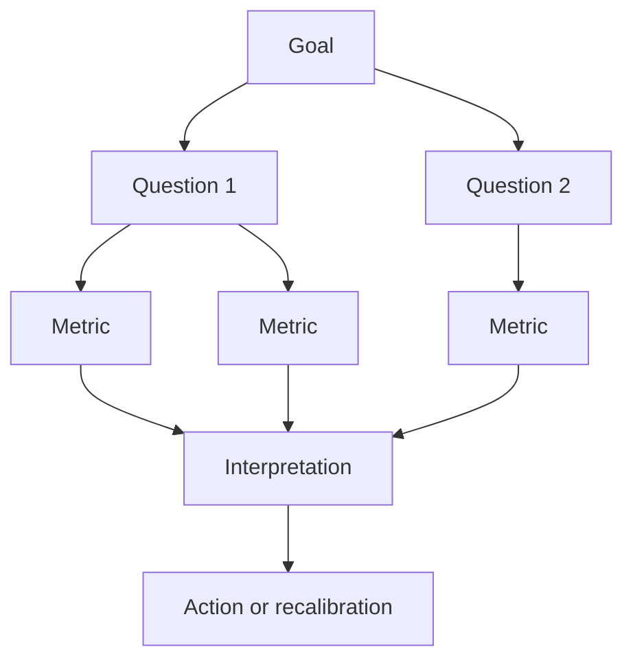

# Software Metrics

Software metrics try to make important software attributes measurable. Gustafson's metrics chapter starts with measurement theory, then applies it to product metrics, process metrics, and the Goal-Question-Metric approach. The chapter is careful about validation: a number is not useful merely because it can be computed. A metric must represent an attribute in a meaningful way, and the use of the metric must be justified.


*Figure: Pair programming makes collaboration and review practices concrete. Image: [Wikimedia Commons](https://commons.wikimedia.org/wiki/File:Pair_Programming.jpg), Calqui, CC BY-SA 3.0.*

This topic sits between project management and quality assurance. Managers need measures to estimate, track, and improve work; engineers need measures that signal complexity, maintainability, and test risk. The chapter covers common size and complexity measures such as LOC, McCabe's cyclomatic number, Halstead's software science measures, Henry-Kafura information flow, productivity, and GQM.

## Definitions

**Software measurement** is the mapping of symbols or numbers to software objects or processes so that some attribute can be quantified. Examples include mapping a module to its lines of code, mapping a control flow graph to a cyclomatic complexity number, or mapping a process to defects found per reviewer-hour.

A **metric** is a defined measurement used for a purpose. The purpose matters. LOC may be useful for estimating effort in a calibrated environment, but it is a weak measure of user value. A metric should be evaluated against the decision it supports.

**Measurement validation** asks whether the metric meaningfully represents the attribute of interest. A correlated number is not automatically valid. Shoe size may correlate with height in a population, but it is not a valid measure of height because it does not directly represent the length attribute.

**Monotonicity** means that increasing the empirical attribute should not decrease the measured value. For a size metric, adding more relevant code should not make the measured size smaller. Nonmonotonic metrics are hard to interpret and easy to manipulate.

**Measurement scales** describe what operations are meaningful:

| Scale | Meaningful statements | Software example |
|---|---|---|
| Nominal | equality or category | defect type |
| Ordinal | ranking | severity level |
| Interval | differences | cyclomatic complexity differences |
| Ratio | ratios and zero point | LOC, elapsed time |
| Absolute | direct count | number of modules |

**McCabe's cyclomatic number** measures control-flow complexity. For a control flow graph:

$$
C = e - n + 2p
$$

where $e$ is the number of edges, $n$ is the number of nodes, and $p$ is the number of strongly connected components, normally 1 for a single routine. For many structured programs, $C$ is also one more than the number of decisions.

**Halstead's measures** treat a program as operators and operands. Let $n_1$ be the number of distinct operators, $n_2$ the number of distinct operands, $N_1$ the total operator occurrences, and $N_2$ the total operand occurrences. Vocabulary is $n = n_1 + n_2$, length is $N = N_1 + N_2$, and volume is:

$$
V = N \log_2(n)
$$

**Henry-Kafura information flow** measures intermodule complexity using information flowing into and out of a module:

$$
HK_i = weight_i(out_i \times in_i)^2
$$

where the weight may be a size or complexity measure.

**GQM**, Goal-Question-Metric, starts with goals, derives questions about those goals, and only then chooses metrics.

## Key results

Metrics should be selected from goals, not collected because they are easy. LOC, defects, effort, and coverage can all be useful, but each can also distort behavior. If a team is rewarded for high LOC, it may write more code than necessary. If it is rewarded for low defect counts, it may underreport defects. A measurement program should include interpretation rules and quality checks.

McCabe's cyclomatic number is useful because it connects control-flow structure to test and maintenance difficulty. The common threshold of 10 is not a mathematical law, but it is a practical warning point: modules above that value deserve review, refactoring, or stronger tests. The decision-count method is valuable because building a full control flow graph for large code is expensive.

Halstead's basic counts remain historically important because they focus on tokens and algorithm expression. Gustafson notes that some of Halstead's more elaborate prediction formulas are questionable, especially when they are not monotonic. The lesson is broader than Halstead: a metric can be easy to calculate and still be invalid for the decision being made.

Henry-Kafura emphasizes coupling through information flow. A small module with many incoming and outgoing flows can be harder to understand than its length suggests. Multiplying input and output flow and then squaring the product penalizes modules that sit at busy communication intersections.

Process metrics measure how work is being performed. Examples include defects per KLOC, review defects found per reviewer-hour, mean time to repair, build failure rate, and requirements volatility. These are not product attributes alone; they describe process behavior and can guide process improvement.

GQM is a guardrail against metric clutter. A goal such as "improve customer satisfaction" leads to questions such as "Are customers reporting fewer defects?" and "Are fixes delivered faster?" Those questions lead to metrics such as customer defect reports, reopened defects, and median time to resolution. Without the goal and question layers, the team may collect numbers that no one uses.

## Visual



| Metric | What it emphasizes | Strength | Weakness |
|---|---|---|---|
| LOC | physical size | easy to count | language and style dependent |
| Cyclomatic complexity | control decisions | supports testing and maintainability review | ignores data complexity |
| Halstead volume | token vocabulary and length | language-level expression measure | counting rules can vary |
| Henry-Kafura | intermodule information flow | highlights coupling hotspots | requires flow identification |
| Defects/KLOC | observed defect density | useful for trend comparison | depends on detection effort |
| GQM metrics | goal-driven measurement | avoids collecting unused numbers | requires careful goal definition |

## Worked example 1: Cyclomatic complexity from decisions

**Problem.** A function has this logic: if the input is missing, return an error; otherwise loop over records; inside the loop, if the record is active, process it; after the loop, if no active record was found, return a warning. Estimate McCabe's cyclomatic number using the decision-count method.

**Method.** Count decisions that split control flow.

1. The first `if input is missing` is one decision.

2. The loop over records is one decision because each loop has a continue/exit choice.

3. The inner `if record is active` is one decision.

4. The final `if no active record was found` is one decision.

5. For structured code, cyclomatic complexity is:

$$
C = decisions + 1
$$

6. Substitute:

$$
C = 4 + 1 = 5
$$

**Checked answer.** The cyclomatic number is 5. This means at least five independent paths are needed for basis-path style structural testing. The answer is checked by listing the four branch points: missing input, loop continuation, active record, and no-active-record warning.

## Worked example 2: Halstead volume for a small expression

**Problem.** Compute Halstead vocabulary, length, and volume for the expression `total = price * quantity + tax` using a simple counting rule. Operators are `=`, `*`, and `+`. Operands are `total`, `price`, `quantity`, and `tax`.

**Method.** Count distinct and total operators and operands.

1. Distinct operators:

$$
n_1 = 3
$$

2. Distinct operands:

$$
n_2 = 4
$$

3. Total operator occurrences: `=`, `*`, `+` each appear once.

$$
N_1 = 3
$$

4. Total operand occurrences: `total`, `price`, `quantity`, `tax` each appear once.

$$
N_2 = 4
$$

5. Vocabulary:

$$
n = n_1 + n_2 = 3 + 4 = 7
$$

6. Length:

$$
N = N_1 + N_2 = 3 + 4 = 7
$$

7. Volume:

$$
\begin{aligned}
V &= N\log_2(n) \\
  &= 7\log_2(7) \\
  &\approx 7 \times 2.807 \\
  &\approx 19.65
\end{aligned}
$$

**Checked answer.** The expression has vocabulary 7, length 7, and volume about 19.65. The check is that every token was classified exactly once under the chosen rule. Different organizations may count syntax differently, so the counting rule must be stated before comparing values.

## Code

```python
import math
import re

def halstead_basic(expression, operator_tokens):
    pattern = "(" + "|".join(re.escape(op) for op in operator_tokens) + ")"
    raw = [tok for tok in re.split(pattern, expression) if tok and not tok.isspace()]
    operators = []
    operands = []
    for token in raw:
        token = token.strip()
        if not token:
            continue
        if token in operator_tokens:
            operators.append(token)
        else:
            operands.extend(token.split())

    n1 = len(set(operators))
    n2 = len(set(operands))
    n = n1 + n2
    length = len(operators) + len(operands)
    volume = length * math.log2(n) if n else 0
    return {"n1": n1, "n2": n2, "N": length, "vocabulary": n, "volume": volume}

metrics = halstead_basic("total = price * quantity + tax", ["=", "*", "+"])
for name, value in metrics.items():
    print(f"{name}: {value:.2f}" if isinstance(value, float) else f"{name}: {value}")
```

## Common pitfalls

- Collecting metrics before stating the decision they support.
- Comparing LOC across languages, teams, or generated-code policies without normalization.
- Treating a threshold such as cyclomatic complexity 10 as a substitute for engineering judgment.
- Counting Halstead operators and operands inconsistently, then comparing results as if they used the same rule.
- Assuming correlation proves validity. A metric must represent the attribute being measured.
- Optimizing the metric rather than improving the process or product.
- Forgetting that process metrics depend on detection effort and reporting culture.

## Connections

- [Project management and process improvement](/cs/software-engineering/project-management-and-process-improvement)
- [Project planning and estimation](/cs/software-engineering/project-planning-and-estimation)
- [Software quality assurance](/cs/software-engineering/software-quality-assurance)
- [Software testing](/cs/software-engineering/software-testing)
- [Object-oriented metrics](/cs/software-engineering/object-oriented-metrics)
