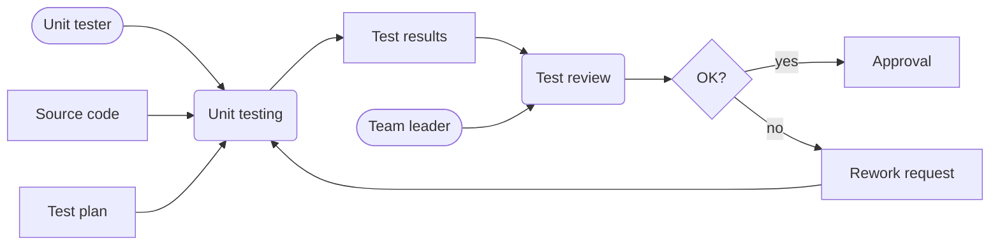
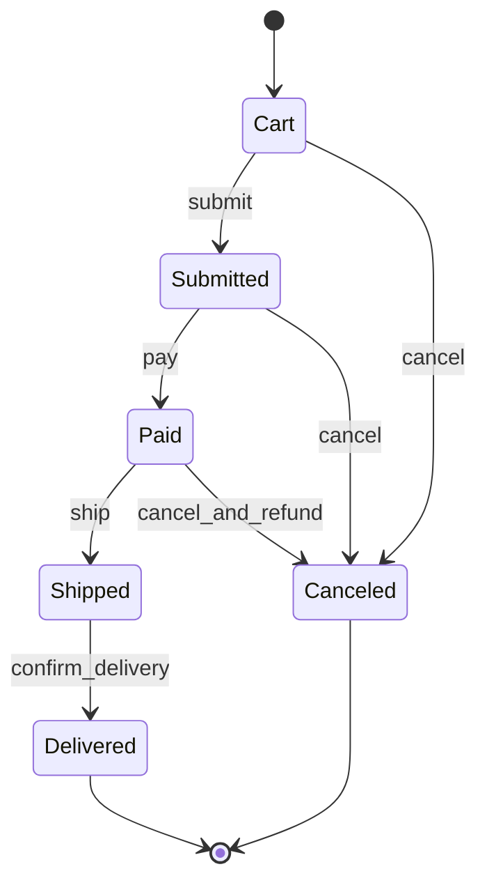

# Software Process Models and Diagrams

The second chapter of Gustafson's book moves from life cycle phases to modeling notations. A software project is full of processes, data movement, objects, messages, states, and control paths. No single diagram shows all of that cleanly. The chapter therefore surveys several diagram types and gives construction rules for each: software process models, data flow diagrams, Petri nets, object models, use cases, scenarios, sequence diagrams, hierarchy diagrams, control flow graphs, state diagrams, and lattice models.

The unifying idea is disciplined abstraction. A diagram is not useful because it is pretty; it is useful because it leaves out the right details while preserving the relationships needed for a decision. A process model can train new team members, a data flow diagram can expose missing inputs and outputs, an object model can clarify associations and multiplicities, a state diagram can prevent impossible transitions, and a lattice can model ordered security or dependency relationships.

## Definitions

A **software process model** describes the processes used to achieve software development. In the notation used by the textbook, tasks or processes are ovals, artifacts are rectangles, actors are stick figures, and optional decisions are diamonds. Arcs show flow, usually from left to right and top to bottom. A task should not connect directly to another task; an artifact should separate them because one task's result becomes another task's input.

A **descriptive process model** records what actually happened in a project. It is often useful in postmortems because it shows rework, waiting, missing artifacts, and informal handoffs. A **prescriptive process model** describes what is supposed to happen. It supports training, governance, and repeatability.

A **data flow diagram** shows how data moves among processes. Processes are boxes labeled with verb phrases; arcs are data and should be labeled with noun phrases. Actors and control decisions are not the focus. Data flow diagrams can imply ordering, but they should not be used as detailed control-flow diagrams.

A **Petri net** consists of condition nodes, event nodes, arcs, and tokens. If all input condition nodes for an event have tokens, the event may fire. Firing consumes input tokens and places tokens on output condition nodes. This makes Petri nets useful for reasoning about enabled actions, synchronization, and concurrent workflows.

An **object model** represents classes or object types and their relationships. A class box may show a name, attributes, and methods. The textbook emphasizes three relationship kinds: inheritance, aggregation, and association. Inheritance is an "is-a" relation; aggregation is a "part-of" relation; association means the objects are connected in some domain-specific way.

A **multiplicity** states how many related objects may participate in an association. For example, `0..1` means optional and at most one, while `0..*` means any number including none.

A **use case diagram** shows interactions between external actors and system functions. A **scenario** is a concrete sequence of steps through a use case. A **sequence diagram** shows messages over time between participating objects or actors.

A **control flow graph** represents possible execution paths through code or logic. A **state diagram** represents states and transitions of an entity over time. A **lattice model** represents ordered values where pairs have least upper bounds and greatest lower bounds, which is useful for security levels and other partial orders.

## Key results

Correctness rules are the main value of this chapter. A diagram with vague labels can hide errors. A process model should have reachable tasks, terminal tasks, and artifact-mediated task transitions. A data flow diagram should keep data and control separate. An object model should distinguish inheritance from aggregation and ordinary association. A state diagram should make illegal transitions absent rather than merely undocumented.

Different diagrams answer different questions. "Who does what and what artifact comes next?" is a process modeling question. "What information is transformed by this activity?" is a data flow question. "What domain entities exist and how are they related?" is an object modeling question. "What messages occur in this scenario?" is a sequence diagram question. "Can this object move from pending to shipped without payment?" is a state diagram question.

The textbook's rule that two process tasks should not be connected directly is especially important. If one oval connects straight to another oval, the model hides the artifact or condition that makes the second task possible. For example, "unit testing" should produce "test results"; "test review" consumes those results and produces approval, rejection, or rework.

Petri nets add execution semantics. They can show that an event is not enabled until all preconditions hold. If "run integration tests" requires tokens in both "latest build exists" and "integration test environment ready," then a token in only one condition is not enough. This simple rule prevents hand-wavy workflow claims.

Object models require careful relationship selection. It is tempting to draw every line as inheritance because inheritance looks formal, but inheritance should mean substitutability: a specialized object is a kind of the general object. A book copy is not a kind of book title; it is a physical copy associated with the bibliographic book concept. That distinction changes the design.

State diagrams are useful only when the state names are meaningful and transitions are triggered by events. A state diagram with states named "step 1" and "step 2" is usually just a weak flowchart. A better diagram names domain conditions such as "draft," "submitted," "approved," and "rejected."

## Visual



| Notation | Best question | Typical mistake |
|---|---|---|
| Process model | What activities and artifacts define the workflow? | connecting task directly to task |
| Data flow diagram | What data is transformed and where does it go? | drawing control decisions as data |
| Petri net | Which events are enabled by which conditions? | forgetting that all input tokens are required |
| Object model | What entities and relationships exist? | using inheritance where association is correct |
| Sequence diagram | What messages occur in a scenario over time? | mixing every possible path into one scenario |
| State diagram | What states and transitions are legal? | naming states after implementation steps |

## Worked example 1: Repairing a process model

**Problem.** A draft model for defect handling contains this chain: `Developer fixes bug -> Tester retests bug -> Team lead approves release`. What is wrong, and how should it be repaired?

**Method.** Apply the process model rule that tasks are separated by artifacts.

1. "Developer fixes bug" is a task. Its output should be something reviewable or usable by another task. Possible artifacts are a changed source file, a build, a commit, and a developer note.

2. "Tester retests bug" is also a task. It cannot execute just because the developer worked. It needs an input artifact such as a new build and a defect report containing reproduction steps.

3. The tester's task should produce a test result. Without that artifact, the team lead has no explicit input for the approval decision.

4. The team lead approval may also have a decision: pass means release approval, fail means rework.

**Checked answer.** A repaired model is:

1. Developer fixes bug.
2. Output artifacts: patched source code and build candidate.
3. Tester retests using build candidate and defect report.
4. Output artifact: retest result.
5. Team lead reviews retest result.
6. Decision: approve release or return to fixing.

The repair is checked by verifying that each task has an input artifact and each downstream task consumes an upstream artifact. The model is now auditable: the team can ask where the build candidate is, where the retest result is, and who approved the release.

## Worked example 2: Constructing a state diagram

**Problem.** Model the states of a simple online order. The order starts as a cart, can be submitted, must be paid before shipment, can be canceled before shipment, and becomes delivered after shipment is confirmed.

**Method.** Identify stable conditions, then identify legal event-triggered transitions.

1. Stable conditions are `Cart`, `Submitted`, `Paid`, `Shipped`, `Delivered`, and `Canceled`.

2. The initial state is `Cart` because the order exists before submission.

3. The `submit` event moves the order from `Cart` to `Submitted`.

4. The `pay` event moves it from `Submitted` to `Paid`.

5. The `ship` event moves it from `Paid` to `Shipped`. There is no transition from `Submitted` to `Shipped`, because payment is required.

6. The `confirm_delivery` event moves it from `Shipped` to `Delivered`.

7. The `cancel` event is legal from `Cart` and `Submitted`, and perhaps from `Paid` if the business allows refund before shipment. It is not legal from `Shipped` in this simple model.

**Checked answer.**



The answer is checked by trying prohibited paths. "Ship before pay" has no transition. "Cancel after delivered" has no transition. These absences are part of the model's meaning.

## Code

```python
from collections import defaultdict, deque

def reachable_tasks(start_artifacts, task_inputs, task_outputs):
    available = set(start_artifacts)
    done = set()
    changed = True
    while changed:
        changed = False
        for task, inputs in task_inputs.items():
            if task in done:
                continue
            if set(inputs).issubset(available):
                done.add(task)
                available.update(task_outputs.get(task, []))
                changed = True
    return done, available

task_inputs = {
    "unit testing": ["source code", "test plan"],
    "test review": ["test results"],
    "release approval": ["review decision"],
}

task_outputs = {
    "unit testing": ["test results"],
    "test review": ["review decision"],
    "release approval": ["approval record"],
}

done, artifacts = reachable_tasks(
    start_artifacts=["source code", "test plan"],
    task_inputs=task_inputs,
    task_outputs=task_outputs,
)

print("reachable tasks:", sorted(done))
print("available artifacts:", sorted(artifacts))
```

## Common pitfalls

- Mixing diagram purposes. A data flow diagram is not a state machine, and a sequence diagram is not a class model.
- Labeling process boxes with nouns. Process or data-flow processes should use verb phrases because they represent actions.
- Leaving arcs unlabeled in data flow diagrams. Unlabeled data movement is almost always ambiguous.
- Treating multiplicities as decoration. Multiplicity errors often become database, validation, or business-rule defects later.
- Drawing inheritance for convenience. Inheritance should mean "is a kind of," not merely "is related to."
- Creating a state diagram that allows every transition. The value of a state diagram is often in the transitions it forbids.

## Connections

- [Software life cycle models](/cs/software-engineering/software-life-cycle-models)
- [Requirements engineering](/cs/software-engineering/requirements-engineering)
- [Software design](/cs/software-engineering/software-design)
- [Object-oriented development](/cs/software-engineering/object-oriented-development)
- [Formal specifications and OCL](/cs/software-engineering/formal-specifications-and-ocl)
