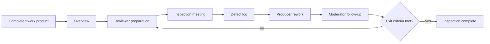

# Software Quality Assurance

Software quality assurance is the planned set of activities that helps a team build confidence in the product and the process used to create it. Gustafson's chapter focuses on formal inspections and technical reviews, software reliability, statistical quality assurance, and the IEEE outline for an SQA plan. The chapter treats quality as something that must be planned, measured, reviewed, and followed up.

Quality assurance is broader than testing. Testing executes software to reveal failures; inspections examine work products directly; reliability estimates use failure data; statistical quality assurance uses samples to infer quality; an SQA plan states who will do which quality activities and under what standards. Together, these practices reduce the chance that defects survive until late phases or customer use.

## Definitions

**Software quality assurance (SQA)** is the planned and systematic set of activities used to provide confidence that software processes and products satisfy requirements, standards, and stakeholder expectations.

A **review** is an examination of a work product. Reviews can be informal or formal. A **formal technical review** or **inspection** has explicit roles, a completed work product, a defined process, records, and the primary purpose of finding defects.

The common inspection roles are:

| Role | Responsibility |
|---|---|
| Moderator | selects team, conducts inspection, reports results |
| Reader | guides the team through the work product |
| Recorder | records each issue or defect accurately |
| Producer | created the work product, answers questions, performs rework |

The common inspection steps are overview, preparation, inspection meeting, rework, and follow-up. Entry criteria decide whether the inspection can begin; exit criteria decide whether it is complete.

A **checklist** is a focused list of items or questions reviewers use to find common faults. Checklist items should be updated based on defect history. Items that never find faults should be removed, and recurring escaped faults should become new checklist items.

**Reliability** is the probability of not failing in a specified time or number of executions. If $R(n)$ is reliability over $n$ units, then failure probability is:

$$
F(n) = 1 - R(n)
$$

If one-execution failure probability is $F(1)$, and executions are independent under the same conditions, then:

$$
R(n) = R(1)^n
$$

**Error rate** or failure rate can be estimated from inter-failure time. If a failure occurs every two days, an instantaneous rate estimate is $0.5$ failures per day.

**Statistical quality assurance** uses samples, often randomly selected tests, to estimate quality of the larger product or process.

An **SQA plan** defines purpose, referenced documents, management, documentation, standards, reviews, audits, testing, problem reporting, tools, code control, training, risk, and related quality activities.

## Key results

Formal inspections work because they slow review down and assign responsibilities. The producer is present, but the goal is not to judge the producer. The goal is to find defects in an explicit work product before those defects become more expensive. Preparation time matters; reviewers who first see the work product during the meeting are unlikely to find deep issues.

Inspection effectiveness can be measured by defects found per KLOC and defects found per reviewer-hour. Those measures are imperfect, but they help compare techniques and tune preparation/review time. A technique that finds slightly more defects may not be more efficient if it requires far more reviewer effort.

Checklists should evolve. If a C++ team repeatedly loses time to accidental semicolons after `if` or `while` conditions, the checklist should include that specific issue. If a checklist item is never associated with a found fault after many inspections, it should be considered for removal because long checklists dilute attention.

Software reliability differs from hardware reliability. Software does not wear out physically. Failures occur when execution reaches a fault under particular input or state conditions. Reliability therefore depends on the operational profile: the same program may appear reliable under common inputs and fail under rare but important inputs.

Statistical quality assurance relies on representativeness. If random tests are drawn from realistic operation, their failure rate can estimate field behavior. If the sample ignores important usage modes, the estimate is misleading.

The IEEE-style SQA plan matters because quality activities need ownership. A plan should state which documents will be reviewed, which standards apply, who tracks problems, how configuration items are controlled, and how test reports and defect reports are handled.

Problem reporting is part of quality assurance because defects must be controlled after they are found. A useful problem report identifies the affected item, describes the observed failure, gives reproduction information when applicable, records severity and priority, assigns responsibility, and captures the final resolution. Without that discipline, the team can find the same fault repeatedly, lose track of deferred fixes, or ship with unverified corrections.

SQA also benefits from separating responsibilities while keeping communication open. Developers produce and correct work products. Testers execute planned and exploratory tests against baselined builds. Configuration management controls versions. The QA group watches whether reviews, inspections, audits, test reporting, and problem tracking occur as planned. These roles do not need to be hostile or bureaucratic. Their purpose is to ensure that quality evidence exists and that quality problems are visible to management before release pressure hides them.

The SQA plan should be written early enough to influence the project, not after the team has already improvised its quality practices. If the test plan is supposed to be produced during requirements, the SQA plan should say so. If formal inspections occur at the end of each phase, the plan should name the inspected work products and approval records. Quality planning is valuable because it turns "we will be careful" into scheduled, assigned, reviewable work.

## Visual



| Quality activity | Finds or prevents | Typical evidence |
|---|---|---|
| Requirements review | ambiguous or missing requirements | review report, issue list |
| Design inspection | interface, data, and structure defects | inspection log |
| Code inspection | logic, standards, and maintainability defects | defect list and rework record |
| Testing | failures during execution | test report |
| Reliability analysis | failure probability over use | failure data and estimate |
| SQA audit | process compliance gaps | audit report |

## Worked example 1: Reliability from observed failures

**Problem.** During representative testing, a system has 10 failures in 200 test cases. Estimate $F(1)$ and $R(1)$ for one test execution. Then estimate the probability of 5 independent executions without failure.

**Method.** Estimate one-execution failure probability from the sample.

1. Failure probability:

$$
F(1) = \frac{10}{200} = 0.05
$$

2. Reliability for one execution:

$$
R(1) = 1 - F(1) = 1 - 0.05 = 0.95
$$

3. Reliability for 5 independent executions:

$$
\begin{aligned}
R(5) &= R(1)^5 \\
     &= 0.95^5 \\
     &\approx 0.7738
\end{aligned}
$$

**Checked answer.** The estimated one-execution reliability is 0.95. The estimated probability of five executions without failure is about 0.774. The answer is checked by noting that reliability decreases as the number of executions increases when $R(1) \lt  1$.

## Worked example 2: Comparing two inspection techniques

**Problem.** Inspection technique A requires 2 hours/KLOC preparation plus 1 hour/KLOC meeting time and finds 12 defects/KLOC. Technique B requires 1 hour/KLOC preparation plus 4 hours/KLOC meeting time and finds 14 defects/KLOC. Compare them by defects found per reviewer-hour.

**Method.** Compute total review effort and defect discovery rate for each technique.

1. Technique A total effort:

$$
2 + 1 = 3 \text{ hours/KLOC}
$$

2. Technique A rate:

$$
\frac{12}{3} = 4 \text{ defects per hour}
$$

3. Technique B total effort:

$$
1 + 4 = 5 \text{ hours/KLOC}
$$

4. Technique B rate:

$$
\frac{14}{5} = 2.8 \text{ defects per hour}
$$

5. B finds two more defects per KLOC:

$$
14 - 12 = 2
$$

6. B uses two more hours per KLOC:

$$
5 - 3 = 2
$$

**Checked answer.** Technique A is more efficient by defects found per reviewer-hour: 4 versus 2.8. Technique B is more complete in this controlled comparison because it finds 14 rather than 12 defects/KLOC, but its marginal two defects cost two additional hours/KLOC. The right choice depends on defect criticality and schedule, but the efficiency calculation favors A.

## Code

```python
def reliability_from_tests(failures, tests, executions=1):
    failure_probability = failures / tests
    one_execution_reliability = 1 - failure_probability
    return one_execution_reliability ** executions

def inspection_rate(defects_per_kloc, prep_hours, meeting_hours):
    total_hours = prep_hours + meeting_hours
    return defects_per_kloc / total_hours

print("R(1):", reliability_from_tests(10, 200, executions=1))
print("R(5):", reliability_from_tests(10, 200, executions=5))
print("Technique A:", inspection_rate(12, 2, 1))
print("Technique B:", inspection_rate(14, 1, 4))
```

## Common pitfalls

- Equating SQA with testing only. Reviews, inspections, standards, audits, and problem tracking are also SQA activities.
- Holding inspection meetings without preparation.
- Letting the producer dominate the inspection. The producer answers questions and reworks defects; the inspection is not a design defense session.
- Keeping ineffective checklist items forever.
- Estimating reliability from nonrepresentative tests.
- Treating failure probability over $n$ executions as $F(1)^n$. The correct relationship is $F(n) = 1 - R(1)^n$ under the simple independence assumption.
- Writing an SQA plan that names activities but not responsible groups or evidence.

## Connections

- [Software testing](/cs/software-engineering/software-testing)
- [Software metrics](/cs/software-engineering/software-metrics)
- [Risk analysis and management](/cs/software-engineering/risk-analysis-and-management)
- [Requirements engineering](/cs/software-engineering/requirements-engineering)
- [Software design](/cs/software-engineering/software-design)
