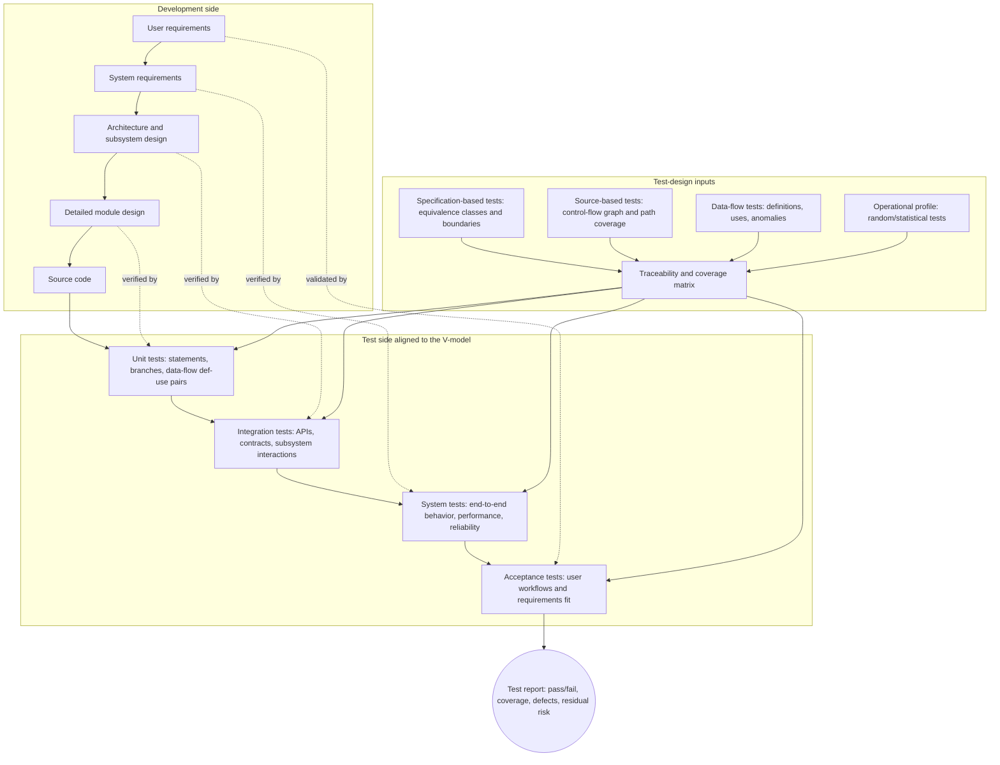

# Software Testing

Software testing executes software with selected inputs to reveal failures and build evidence about behavior. Gustafson's testing chapter covers testing fundamentals, coverage criteria, subsumption, functional testing, test matrices, structural testing, data flow testing, random testing, operational profiles, statistical inference, and boundary testing. The examples repeatedly use the classic triangle classification problem because it exposes how easy it is to miss important cases.


*Figure: Pair programming makes collaboration and review practices concrete. Image: [Wikimedia Commons](https://commons.wikimedia.org/wiki/File:Pair_Programming.jpg), Calqui, CC BY-SA 3.0.*

Testing is not exhaustive for realistic programs. A function with two 32-bit integer inputs has more than $2^{64}$ possible input pairs. The engineering problem is therefore selection: choose tests that are meaningful, cover important domains or code structures, and expose likely faults. Coverage criteria provide stopping rules and force attention to parts of the specification or implementation that a developer might unconsciously avoid.

## Definitions

A **test case** consists of input data, execution conditions, and expected output or behavior. Without an expected result, a test run is only an experiment.

A **test coverage criterion** is a rule for selecting tests and deciding when enough tests have been run for a given purpose. Criteria include functional subdomain coverage, every-statement coverage, every-branch coverage, data flow coverage, and boundary coverage.

Criterion A **subsumes** criterion B if every test set satisfying A also satisfies B. Subsumption compares logical strength, not real-world fault-finding quality. A poor test set satisfying a stronger criterion may be worse than a thoughtful test set satisfying a weaker one.

**Functional testing** derives tests from the specification. It partitions inputs and expected outputs into subdomains such as normal cases, special cases, error cases, and tricky user misconceptions.

A **test matrix** lists test cases against conditions, outputs, paths, or code elements to show what each test covers.

**Structural testing** derives tests from source code structure. **C0 coverage** or every-statement coverage requires every statement to execute at least once. **C1 coverage** or every-branch coverage requires both outcomes of every decision.

**Path testing** attempts to execute paths through the control flow graph. It is often impractical because loops can create infinitely many paths.

**Multiple-condition coverage** requires primitive conditions inside compound decisions to evaluate both true and false, often considering combinations. Lazy evaluation can make some combinations infeasible.

**Data flow testing** focuses on definitions and uses of variables. A **def** assigns a value. A **c-use** uses a value in computation. A **p-use** uses a value in a predicate. A **def-free path** from a definition to a use contains no intervening redefinition.

**Random testing** selects tests randomly, ideally from an **operational profile**, which describes expected usage categories and probabilities in real operation.

**Boundary testing** selects tests on and just off boundaries between subdomains because many faults shift boundaries.

## Key results

Testing requires a specification. Without a specification, testers cannot decide whether behavior is correct. This is why requirements quality directly affects test quality.

Functional testing should cover each distinct output, each error message, special cases, ordering variants, and common misunderstandings. In the triangle problem, this means testing equilateral, isosceles, scalene, non-triangle, and bad input cases, including cases where the largest side appears in different positions.

Structural coverage prevents blind spots in code execution. C0 makes sure every statement executes. C1 is stronger because it requires both branches of decisions. However, coverage alone is not enough. The textbook notes that a small C1-satisfying set for the triangle program can be less effective than a larger, well-chosen C0 set because it may cover code without checking enough output subdomains.

Subsumption is a formal relationship but not a quality guarantee. If every C1 test set also executes every statement, then C1 subsumes C0 for ordinary control flow. But the tester still chooses actual input values. Bad values can satisfy coverage while missing important faults.

Data flow testing catches faults related to variable definitions, redefinitions, and uses. For example, a variable may be assigned in one branch but used after a different branch where it was never defined. Statement coverage may execute both statements but still miss the definition-use relationship.

Random testing is useful when test generation must be fast, unbiased, and statistically interpretable. Its weakness is rare categories. Random integers are unlikely to produce equal triangle sides, so random triangle testing without an operational profile may miss equilateral cases almost entirely.

Boundary testing is based on the observation that mistakes happen at decision edges. If the specification says overtime begins after 40 hours, tests should include values at 40, just below 40, and just above 40. For multidimensional boundaries, choose points on the boundary and close off the boundary.

## Visual



This diagram turns the testing page into a V-model view: each development artifact has a matching test level, from detailed design/unit tests up to requirements/acceptance tests. The test-design input block shows how specification subdomains, control-flow coverage, data-flow criteria, and operational profiles feed the traceability matrix and final test report.

| Criterion | Basis | Strength | Limitation |
|---|---|---|---|
| Functional subdomains | specification | user-visible behavior | can miss implementation paths |
| C0 statement | source code | executes all statements | may miss false branches |
| C1 branch | control decisions | covers both decision outcomes | can still choose weak data |
| Path | control paths | strong path reasoning | often infeasible with loops |
| Data flow | def-use pairs | catches variable-flow faults | analysis can be complex |
| Boundary | subdomain edges | targets common faults | requires boundary knowledge |
| Random | probability model | supports inference | rare cases may be missed |

## Worked example 1: Functional tests for weekly pay

**Problem.** A payroll program takes hours worked and hourly wage. A worker may not work more than 80 hours per week, and wage may not exceed USD 50 per hour. Overtime is paid at 1.5 times the wage for hours above 40. Construct functional tests.

**Method.** Identify output and error subdomains.

1. Normal non-overtime case: hours between 0 and 40, wage in range.

2. Overtime case: hours greater than 40 and at most 80, wage in range.

3. Invalid hours: negative hours or more than 80.

4. Invalid wage: negative wage or greater than 50.

5. Boundary values: 0, 40, 80 for hours and 0, 50 for wage.

| Test | Hours | Wage | Expected result |
|---|---:|---:|---|
| T1 | 30 | 20 | USD 600 normal pay |
| T2 | 45 | 20 | USD 800? check below |
| T3 | 81 | 20 | invalid hours |
| T4 | -1 | 20 | invalid hours |
| T5 | 40 | 50 | USD 2000 boundary normal |
| T6 | 80 | 50 | USD 5000 boundary overtime |
| T7 | 10 | 51 | invalid wage |

6. Compute overtime tests:

For T2:

$$
\begin{aligned}
Pay &= 40 \times 20 + (45 - 40) \times 20 \times 1.5 \\
    &= 800 + 5 \times 30 \\
    &= 950
\end{aligned}
$$

For T6:

$$
\begin{aligned}
Pay &= 40 \times 50 + 40 \times 50 \times 1.5 \\
    &= 2000 + 3000 \\
    &= 5000
\end{aligned}
$$

**Checked answer.** T2's expected value should be USD 950, not USD 800. The check reveals why worked expected outputs are necessary: a plausible-looking table can still contain a wrong oracle.

## Worked example 2: Boundary tests for triangle inequality

**Problem.** For triangle sides $a$, $b$, and $c$, one invalid boundary is $a = b + c$. Construct two on-boundary tests and one just-off-boundary test for this boundary, assuming the invalid side of the boundary is $a \ge b + c$.

**Method.** Choose points on the equality boundary and a nearby point in the valid domain.

1. On-boundary tests satisfy $a = b + c$.

2. Choose widely separated examples:

$$
(a,b,c) = (8,1,7)
$$

and

$$
(a,b,c) = (20,9,11)
$$

Both satisfy equality and should be classified as not a triangle if the program uses strict triangle inequality.

3. A just-off-boundary test in the valid domain should have $a \lt  b + c$ by a small amount:

$$
(a,b,c) = (7.9,4,4)
$$

Because $7.9 \lt  8$, it should be valid if other inputs are positive.

**Checked answer.** On-boundary tests `(8,1,7)` and `(20,9,11)` should be rejected as not triangles. Off-boundary test `(7.9,4,4)` should be accepted as a triangle. The answer is checked by substituting into the inequality each time.

## Code

```python
def classify_triangle(a, b, c):
    if a <= 0 or b <= 0 or c <= 0:
        return "bad inputs"
    if a >= b + c or b >= a + c or c >= a + b:
        return "not a triangle"
    if a == b == c:
        return "equilateral"
    if a == b or a == c or b == c:
        return "isosceles"
    return "scalene"

tests = [
    (5, 5, 5, "equilateral"),
    (3, 4, 5, "scalene"),
    (8, 1, 7, "not a triangle"),
    (7.9, 4, 4, "isosceles"),
    (0, 0, 0, "bad inputs"),
]

for a, b, c, expected in tests:
    actual = classify_triangle(a, b, c)
    print((a, b, c), actual, "OK" if actual == expected else f"expected {expected}")
```

## Common pitfalls

- Running tests without expected outputs.
- Treating high statement coverage as proof of correctness.
- Forgetting error outputs and special cases during functional testing.
- Using random testing without an operational profile, then missing rare but important categories.
- Confusing $F(n)$ with $F(1)^n$ when interpreting reliability from tests.
- Ignoring lazy evaluation when designing multiple-condition tests.
- Testing only one ordering of symmetric inputs, such as only the largest triangle side in the first position.

## Connections

- [Software quality assurance](/cs/software-engineering/software-quality-assurance)
- [Requirements engineering](/cs/software-engineering/requirements-engineering)
- [Software metrics](/cs/software-engineering/software-metrics)
- [Object-oriented testing](/cs/software-engineering/object-oriented-testing)
- [Formal specifications and OCL](/cs/software-engineering/formal-specifications-and-ocl)
