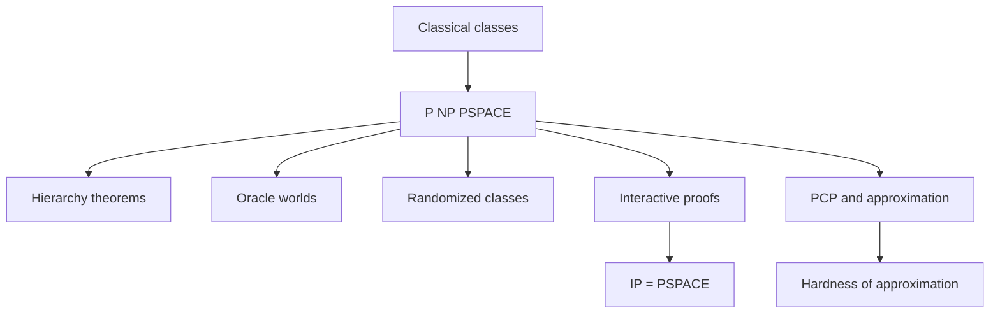

# Advanced Complexity Topics

After P, NP, and PSPACE, complexity theory branches into a landscape of sharper questions. Hierarchy theorems ask whether giving machines more time or space genuinely increases power. Oracles show that some proof techniques cannot resolve P versus NP by relativizing arguments alone. Randomized complexity studies algorithms that use coin flips. Interactive proofs and PCPs reveal surprising connections among verification, games, probability, and approximation.


*Figure: The algorithms mark gives the abstract algorithms pages a concrete visual anchor. Image: [Wikimedia Commons](https://commons.wikimedia.org/wiki/File:Algorithms.svg), Jeff Erickson, CC BY 4.0.*

These topics are usually introduced as brief overviews in a first theory course, but they matter because they show that complexity is not a single ladder. Resources interact: time, space, randomness, alternation, parallelism, communication, and approximation each produce different ways to classify computational difficulty.

## Definitions

A **hierarchy theorem** states that, under appropriate constructibility conditions, more of a resource gives strictly more computational power. Time and space hierarchy theorems prove that there are problems solvable with a larger bound but not a smaller one.

An **oracle Turing machine** has a special query tape and can ask membership questions to an oracle language in one step. Relativization studies what happens to complexity classes when all machines receive access to the same oracle.

The class **BPP** contains languages decidable by randomized polynomial-time algorithms with bounded error. For every input, the algorithm gives the correct answer with probability at least a fixed constant greater than $1/2$, commonly $2/3$.

An **interactive proof system** has a computationally limited verifier exchanging messages with a powerful prover. Completeness means true statements have convincing prover strategies; soundness means false statements cannot convince the verifier except with small probability.

The class **IP** contains languages with polynomial-time interactive proof systems. A major theorem says $IP=PSPACE$.

The **PCP theorem** states, in one formulation, that NP proofs can be checked probabilistically by reading only constantly many proof bits after using logarithmically many random bits. It underlies strong hardness of approximation results.

## Key results

The time hierarchy theorem implies that there are decidable problems requiring more time than a given time bound. It prevents all time classes from collapsing into one class. The proof uses diagonalization with a clock: construct a language that disagrees with each machine running within the smaller bound while staying inside a larger time bound.

Oracle results show limits of relativizing proofs. There are oracles $A$ and $B$ such that $P^A=NP^A$ but $P^B\ne NP^B$. Therefore any proof technique that relativizes in a straightforward way cannot settle the unrelativized P versus NP question.

Randomized algorithms can reduce complexity in practice and theory. BPP allows small error, but repetition reduces the error exponentially: run the algorithm independently many times and take a majority vote. It is widely conjectured that BPP equals P, but randomness remains a central algorithmic resource.

Interactive proofs are unexpectedly powerful. The theorem $IP=PSPACE$ says that every polynomial-space computation has an interactive proof with a polynomial-time randomized verifier. The prover supplies guidance, while randomness and algebraic consistency checks prevent cheating.

The PCP theorem changes the meaning of verification. It says NP membership can be verified by spot-checking a proof in a way that catches false proofs with noticeable probability. This yields hardness of approximation: for many optimization problems, even getting close to optimal is NP-hard.

Hierarchy theorems provide some of the cleanest separations in complexity theory, but they require care about constructibility. A time bound must be sufficiently well behaved that a machine can compute or respect the bound while simulating other machines. The diagonal language then says, in effect, "on the $i$th machine's own input, do the opposite within a larger budget." This is the bounded analogue of the undecidability diagonal argument, with clocks added so the constructed language remains decidable in the larger class.

Oracle results are often misunderstood. An oracle is not evidence that $P=NP$ or $P\ne NP$ in the ordinary world. Instead, oracle worlds are laboratories for proof techniques. If a proposed proof would remain valid no matter what oracle is attached to all machines, but different oracles make the statement true and false, then that proof style cannot settle the real question. Nonrelativizing techniques such as arithmetization are needed for results like $IP=PSPACE$.

Randomized classes separate two issues: correctness probability and running time. In BPP, the algorithm must run in polynomial time for every sequence of random choices, or at least within a polynomial bound under the standard model, and its answer must be correct with high probability on every fixed input. The probability is over internal randomness, not over a distribution of inputs. Repetition reduces error because independent trials make a wrong majority exponentially unlikely.

Interactive proofs change verification from checking a static certificate to conducting a protocol. A dishonest prover may adapt to messages, so the verifier uses randomness to make cheating risky. Completeness gives an honest prover strategy for true statements. Soundness bounds the success probability of any prover on false statements. The equality $IP=PSPACE$ is surprising because it means interaction and randomness let a polynomial-time verifier check statements as hard as any polynomial-space computation.

The PCP theorem has a different flavor. It says NP proofs can be encoded so that a verifier reads only a constant number of positions and still catches errors with constant probability. This local testability transforms optimization. If an approximation algorithm could get too close to optimal for certain problems, it could distinguish fully satisfiable proof encodings from encodings where every proof has many local inconsistencies, implying $P=NP$.

Approximation, parallel computation, cryptography, and circuit complexity all grow from these ideas. Approximation asks for near-optimal solutions when exact optimization is NP-hard. Parallel complexity asks what can be computed quickly with many processors. Cryptography often assumes certain problems are hard on average, a stronger and different demand than NP-completeness. Circuit complexity studies computation by fixed-size Boolean circuits and seeks lower bounds that are notoriously difficult to prove.

Alternation provides another route from NP-like existential choice to PSPACE. An alternating machine has existential states, where some successor may lead to acceptance, and universal states, where all successors must lead to acceptance. Existential states resemble prover choices; universal states resemble adversary choices. Polynomial-time alternation captures PSPACE, which explains why quantified formulas and games fit so naturally into polynomial space.

Circuit complexity studies nonuniform computation. Instead of one machine handling every input length, a circuit family has one Boolean circuit for each input size. The class P/poly captures polynomial-size circuit families, possibly with advice depending only on input length. Proving strong circuit lower bounds for explicit functions is a major open direction and is connected to derandomization and separations among complexity classes.

Cryptography uses hardness differently from NP-completeness. A cryptographic assumption needs problems that are hard on average for efficient adversaries, not merely hard in the worst case. Factoring, discrete logarithms, lattice problems, and one-way functions live in this landscape. Complexity theory supplies the language for reductions and adversaries, but cryptographic security definitions add probability, distributions, and interaction.
## Visual



| Topic | Main surprise | Typical proof ingredient |
|---|---|---|
| hierarchy theorems | more resource can strictly help | diagonalization with bounds |
| oracles | some techniques cannot settle P vs NP | relativized computation |
| BPP | randomness with small error can be amplified | Chernoff or majority bounds |
| IP | interaction verifies PSPACE | arithmetization |
| PCP | constant-query checking of NP proofs | probabilistic proof encodings |

## Worked example 1: Error amplification for BPP

**Problem.** A randomized algorithm is correct with probability at least $2/3$ on every input. Explain how to reduce error below $1/8$.

**Method.** Repeat independently and take a majority vote.

1. Run the algorithm three independent times.
2. Each run has error probability at most $1/3$.
3. The majority is wrong only if at least two runs are wrong.
4. The probability of exactly two wrong runs is $\binom32(1/3)^2(2/3)=3\cdot1/9\cdot2/3=2/9$.
5. The probability of three wrong runs is $(1/3)^3=1/27$.
6. Total error is $2/9+1/27=7/27\approx0.259$, not yet below $1/8$.
7. Use more repetitions, such as eleven, and apply a Chernoff bound or exact binomial tail. The error drops exponentially in the number of repetitions.

**Checked answer.** Three repetitions improve reliability but not below $1/8$. Independent majority repetition with enough trials reduces bounded error exponentially while preserving polynomial time.

## Worked example 2: Why oracle results limit proof strategies

**Problem.** Explain what it means for oracle worlds to block a relativizing proof of $P\ne NP$.

**Method.** Compare hypothetical proof behavior across oracles.

1. A proof technique **relativizes** if it remains valid when all machines receive the same oracle.
2. Suppose a relativizing proof showed $P\ne NP$.
3. Then for every oracle $O$, the same proof would show $P^O\ne NP^O$.
4. But complexity theory has an oracle $A$ with $P^A=NP^A$.
5. That oracle contradicts what the relativizing proof would imply.
6. Therefore no purely relativizing proof can prove $P\ne NP$.
7. A symmetric argument applies to relativizing proofs of $P=NP$ using an oracle where $P^B\ne NP^B$.

**Checked answer.** Oracle separations do not answer the original P versus NP question. They show that certain proof methods are insufficient.

## Code

```python
import random

def noisy_decider(x):
    correct = (len(x) % 2 == 0)
    if random.random() < 2 / 3:
        return correct
    return not correct

def amplified_decider(x, trials=31):
    votes = sum(1 for _ in range(trials) if noisy_decider(x))
    return votes > trials // 2

for sample in ["1010", "101"]:
    print(sample, amplified_decider(sample))
```

## Common pitfalls

- Thinking hierarchy theorems settle P versus NP. They separate classes with properly different bounds, not the specific nondeterministic versus deterministic polynomial-time question.
- Treating oracles as real subroutines available to ordinary algorithms. They are proof devices for relativized worlds.
- Saying randomized algorithms are allowed to be wrong on some inputs always. BPP requires bounded error on every input.
- Confusing IP with NP certificates. Interactive proofs allow randomness and multiple rounds with an adaptive prover.
- Interpreting the PCP theorem as saying ordinary proofs are short to read without special encoding. The proof format and verifier are part of the theorem.

## Connections

- P, NP, and verifiers are introduced in [time complexity, P, and NP](/cs/theory/time-complexity-p-and-np).
- NP-completeness and reductions are in [NP-completeness and classic reductions](/cs/theory/np-completeness-and-classic-reductions).
- PSPACE is developed in [space complexity](/cs/theory/space-complexity).
- Diagonalization starts in [proof methods and countability](/cs/theory/proof-methods-and-countability).
