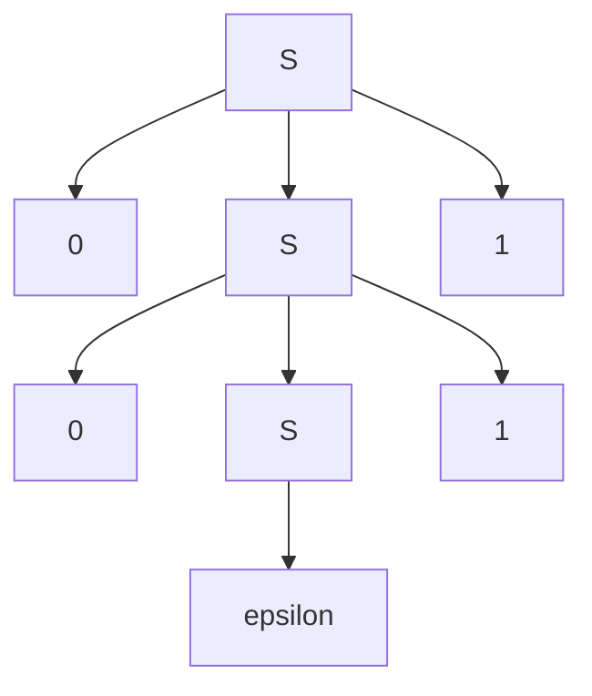

# Context-Free Grammars and Normal Forms

Context-free grammars describe recursive syntax. They are stronger than finite automata because a nonterminal can expand into smaller instances of the same pattern, which naturally represents nesting and balanced structure. This is why CFGs appear in programming-language syntax, arithmetic expressions, markup languages, and parse trees.

The grammar viewpoint is generative: a language is the set of terminal strings that can be derived from a start variable. The same language may have many grammars, and a grammar may admit several parse trees for one string. Normal forms such as Chomsky normal form make grammars easier to analyze and connect them to algorithms and pushdown automata.

## Definitions

A **context-free grammar**, or **CFG**, is a 4-tuple $(V,\Sigma,R,S)$. The set $V$ contains variables or nonterminals, $\Sigma$ contains terminals, $R$ is a finite set of production rules, and $S\in V$ is the start variable.

A **derivation** applies productions to replace variables by strings of variables and terminals. If $S\Rightarrow^* w$ and $w\in\Sigma^*$, then the grammar generates $w$. The language of a grammar is $L(G)=\{w\in\Sigma^*:S\Rightarrow^*w\}$.

A **parse tree** is a tree representation of a derivation. Internal nodes are variables, leaves are terminals or $\epsilon$, and children record the right-hand side of the production used at that node.

A grammar is **ambiguous** if some string in its language has two distinct parse trees, or equivalently two distinct leftmost derivations. A language is **inherently ambiguous** if every CFG for it is ambiguous.

A grammar is in **Chomsky normal form**, or **CNF**, if every production has form $A\to BC$ or $A\to a$, with a possible special rule $S\to\epsilon$ when the language contains the empty string. Here $A,B,C$ are variables and $a$ is a terminal.

## Key results

CFGs can generate many nonregular languages. The grammar $S\to 0S1\mid\epsilon$ generates $\{0^n1^n:n\ge0\}$ by placing one matching `0` and `1` around a smaller balanced string. A finite automaton cannot enforce this unbounded matching, but a recursive grammar can.

Every context-free language has a grammar in Chomsky normal form, except that the empty string requires a controlled special case. The conversion removes useless symbols, removes epsilon rules, removes unit rules, and breaks long right-hand sides into binary productions. CNF is useful because every nonempty string of length $n$ then has parse trees with exactly $2n-1$ variable-labeled nodes.

The CYK algorithm decides membership for CFGs in CNF in polynomial time. It fills a table where entry $(i,\ell)$ records variables that can derive the substring beginning at position $i$ with length $\ell$. Binary productions combine smaller spans. This connects grammar theory to parsing algorithms.

Ambiguity is a property of grammars, not only of languages. A grammar for arithmetic expressions may be ambiguous if it does not encode precedence and associativity. The language of arithmetic expressions may still have an unambiguous grammar once the grammar separates expressions, terms, and factors.

Grammar design is usually about choosing the right recursive decomposition. For $0^n1^n$, the outermost symbols are linked, so $S\to0S1$ is natural. For balanced parentheses, a string may be a pair around a smaller balanced string or a concatenation of two balanced strings, giving rules such as $S\to (S)S\mid\epsilon$. For arithmetic expressions, the decomposition must encode precedence, so expressions expand into terms and terms expand into factors. The variables of a good grammar name syntactic categories, not arbitrary states.

Parse trees are often more informative than derivation sequences. A leftmost derivation and a rightmost derivation may differ only in expansion order while representing the same tree. Ambiguity is about different trees because different trees can assign different structure, such as whether `a+a*a` groups multiplication before addition. In programming-language grammars, ambiguity is not just aesthetic; it can change the meaning assigned by a parser or compiler.

Chomsky normal form is not meant for human-friendly grammar writing. It is a technical normal form that makes parse trees binary and bounded in a useful way. The conversion process must preserve the generated terminal language, except for the carefully handled empty string. Removing epsilon rules prevents variables from disappearing unpredictably. Removing unit rules prevents long chains of aliases. Replacing terminals in long rules and binarizing long right-hand sides gives uniform productions for algorithms.

The CYK membership algorithm illustrates why normal forms matter. In a CNF grammar, any derivation of a substring of length greater than one ends with a rule $A\to BC$, splitting the substring into two smaller substrings. This gives a dynamic-programming recurrence over spans. Without a normal form, productions of many shapes would require many special cases. Normalization converts grammar theory into a table algorithm.

In proofs involving CFGs, keep two directions separate. If a grammar generates a string, show the string has the intended property by induction on the parse tree. If a string has the intended property, show the grammar can generate it, often by induction on a size parameter such as length or nesting depth. Both directions are needed for language equality.

When converting a grammar or proving a grammar correct, it helps to keep the generated language separate from the intended informal language. For example, the grammar $S\to SS\mid (S)\mid\epsilon$ is intended to generate balanced parentheses. The proof is not "it looks balanced." One direction shows that every production preserves balance: concatenating balanced strings is balanced, surrounding a balanced string by matching parentheses is balanced, and $\epsilon$ is balanced. The other direction shows that every nonempty balanced string can be decomposed into either one matched outer pair followed by a balanced remainder or a concatenation of smaller balanced strings. That decomposition is what makes the recursive grammar complete.

Ambiguity should be checked with parse trees, not just with strings. A grammar may generate the same terminal string by two different derivation orders that still correspond to the same parse tree; that is not ambiguity. To prove ambiguity, exhibit one string and two genuinely different tree structures or two different leftmost derivations. To remove ambiguity, introduce variables that encode precedence, associativity, or syntactic category. The unambiguous grammar may be longer, but the extra variables carry semantic information.

Normal-form conversions also require a preservation mindset. Removing a nullable variable means adding alternatives where that variable is omitted, but not accidentally adding the empty string everywhere. Removing unit productions means copying the non-unit productions of the target variable back to the source variable. Each step should preserve exactly the terminal strings generated from each relevant variable, or at least preserve the start language after the standard setup. This is why CNF conversion is algorithmic but still easy to get wrong by hand.
## Visual



| Grammar feature | Meaning | Typical issue |
|---|---|---|
| leftmost derivation | always expand leftmost variable | useful for parser traces |
| parse tree | derivation structure independent of expansion order | reveals ambiguity |
| epsilon rule | variable may disappear | must be controlled in normal forms |
| unit rule | $A\to B$ | removed during CNF conversion |
| binary rule | $A\to BC$ | core form in CNF |

## Worked example 1: Deriving a balanced string

**Problem.** Use the grammar $S\to 0S1\mid\epsilon$ to derive `0011`, and explain why `0101` is not generated.

**Method.** Apply the recursive rule once per matching pair.

1. Start with $S$.
2. Apply $S\to 0S1$ to get $0S1$.
3. Apply $S\to 0S1$ again to the remaining variable: $00S11$.
4. Apply $S\to\epsilon$ to get $0011$.
5. Every use of $S\to0S1$ places a `0` to the left and a `1` to the right of the remaining middle.
6. Therefore all zeros are produced before all ones.
7. The string `0101` has a `0` after a `1`, so it cannot have the form $0^n1^n$.

**Checked answer.** `0011` is generated by two recursive expansions and one epsilon expansion. `0101` is not generated because the grammar never interleaves zeros and ones.

## Worked example 2: Eliminating a long right-hand side for CNF

**Problem.** Convert the production $A\to BCDE$ into CNF-style binary productions.

**Method.** Introduce helper variables so each production has two variables on the right.

1. The right-hand side has length four, so it is not allowed in CNF.
2. Keep the first symbol and group the rest under a new variable: $A\to BX_1$.
3. Let $X_1\to CX_2$.
4. Let $X_2\to DE$.
5. Now every new production has exactly two variables on the right.
6. The derivation $A\Rightarrow BX_1\Rightarrow BCX_2\Rightarrow BCDE$ reproduces the original expansion.

**Checked answer.** The equivalent binary chain is $A\to BX_1$, $X_1\to CX_2$, and $X_2\to DE$.

## Code

```python
def derives_0n1n_by_grammar(w):
    # Specialized recognizer for S -> 0 S 1 | epsilon.
    if len(w) % 2:
        return False
    n = len(w) // 2
    return w == "0" * n + "1" * n

def cnf_binary_chain(lhs, rhs):
    if len(rhs) <= 2:
        return [(lhs, rhs)]
    rules = []
    current = lhs
    for i, symbol in enumerate(rhs[:-2], start=1):
        helper = f"X{i}"
        rules.append((current, symbol + helper))
        current = helper
    rules.append((current, rhs[-2:]))
    return rules

print(derives_0n1n_by_grammar("0011"))
print(cnf_binary_chain("A", "BCDE"))
```

## Common pitfalls

- Confusing a derivation with a parse tree. Different derivation orders can produce the same parse tree.
- Calling a language ambiguous because one grammar is ambiguous. Ambiguity of the language requires all grammars to be ambiguous.
- Forgetting to preserve or handle $\epsilon$ separately during CNF conversion.
- Introducing helper variables that accidentally change terminal order.
- Assuming every recursive grammar is context-free. The left side of each CFG production must be a single variable.

## Connections

- Regular-language limitations are proved in [regular expressions and nonregularity](/cs/theory/regular-expressions-and-nonregularity).
- Stack machines for the same languages appear in [pushdown automata and deterministic CFLs](/cs/theory/pushdown-automata-and-deterministic-cfls).
- Non-CFL proofs use the CFL pumping lemma in [non-context-free languages](/cs/theory/non-context-free-languages).
- CFG membership algorithms are part of [Turing machine variants and decidable problems](/cs/theory/turing-machine-variants-and-decidable-problems).
