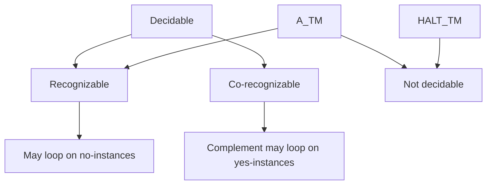

# Decidability and the Halting Problem

Decidability marks the boundary between algorithmic problems that can always be solved and those that cannot. Turing machines are powerful enough to express ordinary computation, but that power makes it possible to encode machines as inputs to other machines. Once programs can reason about programs, self-reference and diagonalization produce unavoidable limits.


*Figure: Alan Turing's work on computation and undecidability frames the theory section. Image: [Wikimedia Commons](https://commons.wikimedia.org/wiki/File:Alan_Turing_Aged_16.jpg), Unknown photographer, public domain.*

The halting problem is the canonical undecidable problem. It asks whether a given machine eventually halts on a given input. The proof that no decider exists is short, but its consequences are broad: no fully automatic tool can decide every semantic property of programs, and many natural language-theory questions are undecidable.

## Definitions

A language $A$ is **decidable** if some Turing machine halts on every input and accepts exactly the strings in $A$. Such a machine is called a decider.

A language $A$ is **Turing-recognizable** if some Turing machine accepts exactly the strings in $A$, possibly looping on strings not in $A$.

The **acceptance problem for Turing machines** is $A_{TM}=\{\langle M,w\rangle:M\text{ accepts }w\}$. It asks whether machine $M$ accepts input $w$.

The **halting problem** is $HALT_{TM}=\{\langle M,w\rangle:M\text{ halts on }w\}$. It asks whether $M$ eventually accepts or rejects $w$.

The **complement** of a language $A$ is $\overline A=\Sigma^*\setminus A$, relative to a fixed encoding alphabet.

A language is **co-recognizable** if its complement is Turing-recognizable. A language is decidable exactly when it is both recognizable and co-recognizable.

## Key results

$A_{TM}$ is Turing-recognizable. A recognizer simulates $M$ on $w$; if $M$ accepts, accept; if $M$ rejects, reject or halt rejecting; if $M$ loops, the recognizer loops. Thus recognizability captures semi-decision by successful simulation.

$A_{TM}$ is not decidable. If a decider for $A_{TM}$ existed, one could construct a machine $D$ that, on input $\langle M\rangle$, asks whether $M$ accepts its own description and then does the opposite. Running $D$ on its own description yields a contradiction: $D$ accepts exactly when it does not accept.

$HALT_{TM}$ is undecidable. If halting were decidable, then $A_{TM}$ would be decidable: first test whether $M$ halts on $w$; if not, reject; if yes, simulate until it halts and accept exactly if it accepted. This contradicts undecidability of $A_{TM}$.

A language is decidable if and only if both it and its complement are recognizable. If both recognizers exist, dovetail them on the input; one must eventually accept, telling which side the input belongs to. If a decider exists, it recognizes the language, and a swapped-answer decider recognizes the complement.

The proof that $A_{TM}$ is undecidable is a diagonal argument over machines. If a decider $H$ could correctly answer whether machine $M$ accepts input $w$, then we could define a new machine $D$ that asks $H$ about $\langle M,\langle M\rangle\rangle$ and then does the opposite of what $H$ predicts for acceptance. The contradiction appears when $D$ is run on its own description. If $H$ predicts acceptance, $D$ rejects; if $H$ predicts nonacceptance, $D$ accepts. Thus $H$ cannot exist.

The halting problem is closely related but not identical. Acceptance asks whether the final answer is accept. Halting asks whether there is any final answer at all. A machine may halt and reject, which belongs to $HALT_{TM}$ but not to $A_{TM}$. The reduction from $A_{TM}$ to $HALT_{TM}$ handles this by using a hypothetical halting decider first and then simulating only when halting is guaranteed. This two-stage pattern prevents the constructed decider from getting stuck.

Recognizable complements are a useful diagnostic. If both $A$ and $\overline A$ are recognizable, then $A$ is decidable by dovetailing: run both recognizers in parallel until one accepts. Exactly one must eventually accept because every input belongs to one side. Therefore, once $A_{TM}$ is known recognizable but undecidable, its complement cannot be recognizable. Otherwise $A_{TM}$ would be decidable.

Undecidability does not mean the problem is impossible on every instance. Many individual programs can be proved to halt or not halt; many restricted programming languages have decidable termination. The theorem says there is no single algorithm that correctly handles all Turing-machine/input pairs. This universal quantifier is crucial for understanding why practical analyzers can be useful while still incomplete.

The halting problem also separates syntax from semantics. It is decidable whether a string is a well-formed Turing-machine encoding, because that is a finite syntactic check. It is undecidable whether the encoded machine has a semantic behavior such as halting on a given input. Much of computability theory studies where that syntax/semantics boundary lies.

A decider is stronger than a procedure that works on all examples you have tested. It must halt on every syntactically valid input, including machines deliberately designed to frustrate analysis. The diagonal construction exploits this universal requirement. It does not need to know how a proposed decider is implemented; it only uses the promised input-output behavior of that decider and then builds a machine whose self-application contradicts the promise.

One useful mental separation is between simulation and prediction. Simulating $M$ on $w$ is always possible step by step. Predicting in finite time whether the simulation will ever halt is not always possible. Many invalid halting-problem "solutions" quietly replace prediction with simulation plus patience. But no matter how large a step bound is chosen, there are machines that halt after more steps, and machines that never halt at all. A decider must distinguish those cases uniformly.

The theorem about recognizable complements gives a practical test for proposed recognizers. If someone claims to recognize $\overline{A_{TM}}$, then together with the straightforward recognizer for $A_{TM}$ we could decide $A_{TM}$ by parallel simulation. Since that is impossible, the claimed recognizer cannot exist. This style of argument is often cleaner than a fresh diagonal proof for every nonrecognizability result.

Rice-style intuition is also useful, even before stating Rice's theorem formally. Any nontrivial semantic property of the language recognized by a Turing machine is vulnerable to undecidability because a constructed machine can hide one computation inside that property. The property may sound different from halting or acceptance, but the proof often asks the machine to behave one way if $M$ accepts $w$ and another way otherwise. Syntax remains checkable; general semantic behavior does not. This perspective helps students recognize when a problem is secretly asking for impossible program understanding in a general-purpose model.
## Visual



| Language | Recognizable? | Decidable? | Reason |
|---|---|---|---|
| $A_{DFA}$ | yes | yes | finite simulation |
| $E_{DFA}$ | yes | yes | finite reachability |
| $A_{TM}$ | yes | no | simulate accepts, diagonal contradiction |
| $\overline{A_{TM}}$ | no | no | otherwise $A_{TM}$ would be decidable |
| $HALT_{TM}$ | yes | no | halting simulation recognizes, reduction from $A_{TM}$ |

## Worked example 1: Recognizing but not deciding $A_{TM}$

**Problem.** Give a recognizer for $A_{TM}$ and explain why it may fail to decide.

**Method.** Simulate the encoded machine.

1. Input is $\langle M,w\rangle$.
2. Check that the encoding is valid. If invalid, reject.
3. Simulate $M$ on $w$ step by step.
4. If $M$ enters its accept state, accept.
5. If $M$ enters its reject state, reject.
6. If $M$ never halts, the simulation never halts.

**Checked answer.** The machine accepts exactly the pairs where $M$ accepts $w$, so it recognizes $A_{TM}$. It is not a decider because on pairs where $M$ loops, it loops too.

## Worked example 2: Reducing acceptance to halting

**Problem.** Show that if $HALT_{TM}$ were decidable, then $A_{TM}$ would be decidable.

**Method.** Use the hypothetical halting decider as a subroutine.

1. Assume $H$ decides $HALT_{TM}$.
2. Build a machine $D$ for $A_{TM}$.
3. On input $\langle M,w\rangle$, run $H$ on $\langle M,w\rangle$.
4. If $H$ says $M$ does not halt on $w$, reject.
5. If $H$ says $M$ halts on $w$, simulate $M$ on $w$ until it halts.
6. Accept if the simulation accepts; reject if it rejects.
7. Because $H$ is assumed to halt and the second simulation is run only in the halting case, $D$ halts on all inputs.

**Checked answer.** $D$ would decide $A_{TM}$, impossible. Therefore $HALT_{TM}$ is undecidable.

## Code

```python
def dovetail_two(recognize_A, recognize_not_A, x, max_rounds=1000):
    for steps in range(1, max_rounds + 1):
        if recognize_A(x, steps):
            return True
        if recognize_not_A(x, steps):
            return False
    return None  # no conclusion within the artificial bound

def recognizes_even_length(x, steps):
    return steps >= 1 and len(x) % 2 == 0

def recognizes_odd_length(x, steps):
    return steps >= 1 and len(x) % 2 == 1

print(dovetail_two(recognizes_even_length, recognizes_odd_length, "101"))
```

## Common pitfalls

- Saying $A_{TM}$ is undecidable because simulation might run long. Long is not enough; the issue is possible nontermination for all algorithms.
- Forgetting to distinguish halting from accepting. A machine can halt by rejecting.
- Trying to decide $A_{TM}$ by setting a large step limit. Any fixed limit misses computations that halt later.
- Assuming the complement of a recognizable language is recognizable. That is true only when the language is decidable.
- Treating diagonalization as a paradox rather than a precise construction using encoded machines.

## Connections

- Turing-machine configurations are introduced in [Turing machines and the Church-Turing thesis](/cs/theory/turing-machines-and-the-church-turing-thesis).
- Decidable automata and grammar problems are surveyed in [Turing machine variants and decidable problems](/cs/theory/turing-machine-variants-and-decidable-problems).
- Reductions spread undecidability in [reductions and the recursion theorem](/cs/theory/reductions-and-the-recursion-theorem).
- Complexity reductions adapt the same pattern in [NP-completeness and classic reductions](/cs/theory/np-completeness-and-classic-reductions).
