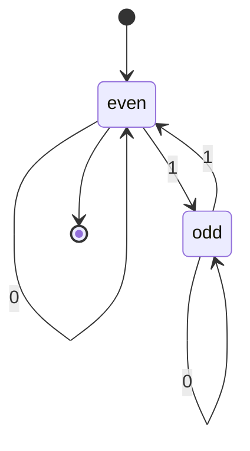

# Finite Automata and DFAs

A deterministic finite automaton is the simplest serious model of computation in the course. It reads an input string from left to right, keeps only one state from a finite set, and decides acceptance after the last symbol. Because it has no stack, tape, or unbounded counter, a DFA can remember only bounded information: parity, a fixed suffix, a residue modulo $k$, whether a required substring has appeared, or which stage of a fixed pattern it is in.

This restriction is exactly what makes finite automata useful. They model lexical scanners, simple controllers, network protocol states, hardware circuits with finite memory, and pattern matching for regular languages. The point of learning DFAs is not that they are powerful; it is that their limits are clean enough to prove, and their constructions prepare the habits used for richer models.

## Definitions

A **deterministic finite automaton**, or **DFA**, is a 5-tuple $(Q,\Sigma,\delta,q_0,F)$. Here $Q$ is a finite set of states, $\Sigma$ is a finite input alphabet, $\delta:Q\times\Sigma\to Q$ is the transition function, $q_0\in Q$ is the start state, and $F\subseteq Q$ is the set of accepting states.

A DFA **computes** on a string $w=w_1w_2\cdots w_n$ by starting in $q_0$ and repeatedly applying the transition function. If the final state after reading all symbols lies in $F$, the DFA accepts $w$; otherwise it rejects $w$.

The **language recognized** by a DFA $M$ is $L(M)=\{w\in\Sigma^*:M\text{ accepts }w\}$. A language is **regular** if some DFA recognizes it.

The **extended transition function** $\hat\delta:Q\times\Sigma^*\to Q$ is defined recursively by $\hat\delta(q,\epsilon)=q$ and $\hat\delta(q,xa)=\delta(\hat\delta(q,x),a)$. It formalizes "the state reached after reading a whole string."

A state is **reachable** if some input string takes the start state to it. A state is **dead** or **sink-like** for a property if, after entering it, no future input can lead to acceptance. Sink states are not required, but they often make transition functions total.

## Key results

Every DFA defines a regular language by definition, but the useful results are closure constructions. If $A$ and $B$ are regular, then $A\cup B$, $A\cap B$, and $\overline A$ are regular. For complement, keep the same states and transitions and swap accepting with nonaccepting states. For union and intersection, use product states $(q_A,q_B)$ that simulate both machines on the same input.

The product construction is an invariant proof. After reading any prefix $x$, the product machine is in state $(\hat\delta_A(q_{0A},x),\hat\delta_B(q_{0B},x))$. This invariant is true at $\epsilon$ and preserved by every next symbol. Acceptance then encodes the desired Boolean combination of membership in $A$ and $B$.

DFAs cannot count without a bound. They can count modulo a fixed number because finitely many residues fit in finite state. They can remember whether the last three symbols are `101` because there are finitely many relevant suffixes. They cannot recognize $\{0^n1^n:n\ge0\}$ because matching an arbitrary number of zeros with ones requires unbounded memory.

Designing DFAs is usually easier when states are named by the information they store. A state called `seen_10` is more useful than `q3` during design. After the logic is correct, formal names can be simplified.

A reliable DFA design process begins by asking what two prefixes must be distinguished. Two prefixes $x$ and $y$ are distinguishable for a target language if there is some suffix $z$ such that $xz$ is in the language and $yz$ is not, or conversely. A correct DFA must put distinguishable prefixes in different states because, after the prefix has been read, the machine has no record except its current state. This idea later becomes the Myhill-Nerode theorem, but it is already useful informally when deciding how many states are necessary.

For suffix languages, the stored information is often "the longest suffix of the input so far that is also a prefix of the pattern." For modulo languages, the stored information is a residue. For "contains a substring" languages, the stored information is progress toward the substring plus a found state. These patterns are not memorized diagrams; they are finite summaries of everything about the prefix that can affect future acceptance.

The totality of $\delta$ is mathematically important. In a programming sketch we might omit impossible-looking cases, but a DFA must know what to do on every symbol in every state. Sink states make this explicit. They also prevent a hidden form of nondeterminism where an undefined transition is interpreted as rejection at the moment it is encountered. Formal DFA acceptance is defined only after reading the whole input, so all transitions should be present.

Product constructions are more than a closure trick. They show how finite information can be combined. If one DFA stores parity and another stores a suffix condition, their product stores both pieces simultaneously. The number of states multiplies because each independent summary may combine with each other summary. This multiplication foreshadows larger state blowups, especially the exponential blowup in the NFA subset construction.

When proving a DFA correct, use two directions. Soundness: if the DFA accepts, then the string has the desired property. Completeness: if the string has the desired property, then the DFA accepts. For small machines both directions can often be wrapped into one invariant that describes the meaning of each state after any prefix.

Minimization is not required for every DFA construction, but the idea of equivalent states is useful. Two states are equivalent if no continuation string can distinguish them with respect to acceptance. If two states have the same future behavior, merging them preserves the language. If a suffix exists that makes one state accept and the other reject, they must remain separate. Even informal minimization can catch design errors: if two states were intended to mean different things but have identical transitions and acceptance status, either the distinction is unnecessary or the transition table is wrong.

Another helpful habit is to test boundary strings. For a suffix machine, test the empty string, strings shorter than the suffix, exactly the suffix, and strings that almost match but fail at the last character. For a modulo machine, test representatives around the modulus boundary. For a substring machine, test strings where the pattern overlaps with itself. These examples do not prove correctness, but they reveal whether the proposed state meanings are coherent enough to support a proof.

DFAs also provide a first example of finite abstraction. A long prefix may contain a huge amount of raw history, but the DFA intentionally throws away everything except the state. Correctness means the discarded information is irrelevant to all future membership decisions. This abstraction viewpoint returns in dynamic programming, compiler analysis, model checking, and complexity proofs.
## Visual



| Language pattern | DFA memory idea | Number of states often needed |
|---|---|---|
| even number of `1`s | parity bit | 2 |
| length divisible by $k$ | residue modulo $k$ | $k$ |
| ends with fixed word $u$ | longest suffix matching a prefix of $u$ | at most $\vert u\vert +1$ |
| contains fixed substring $u$ | progress through pattern plus found state | at most $\vert u\vert +1$ |

## Worked example 1: DFA for strings ending in `01`

**Problem.** Build a DFA over $\{0,1\}$ that accepts exactly the strings ending in `01`.

**Method.** Track the longest suffix of the input that is also a prefix of `01`.

1. Use state `q0` for "no useful suffix yet."
2. Use state `q1` for "the current suffix is `0`."
3. Use state `q2` for "the current suffix is `01`." This is accepting.
4. From `q0`, reading `0` moves to `q1`; reading `1` stays in `q0`.
5. From `q1`, reading `0` stays in `q1` because the latest symbol can begin a new `01`; reading `1` moves to `q2`.
6. From `q2`, reading `0` moves to `q1`; reading `1` moves to `q0` because the string now ends in `11`.

| State | on `0` | on `1` | Accepting? |
|---|---|---|---|
| `q0` | `q1` | `q0` | no |
| `q1` | `q1` | `q2` | no |
| `q2` | `q1` | `q0` | yes |

**Checked answer.** Test `101`: `q0 -> q0 -> q1 -> q2`, accepted. Test `010`: `q0 -> q1 -> q2 -> q1`, rejected. The final state matches whether the final two symbols are `01`.

## Worked example 2: Product DFA for intersection

**Problem.** Let $A$ be strings over $\{0,1\}$ with an even number of `1`s, and let $B$ be strings whose length is divisible by $3$. Describe a DFA for $A\cap B$.

**Method.** Track both properties in a product state.

1. For $A$, use parity states `E` and `O`.
2. For $B$, use length residues `0`, `1`, and `2` modulo $3$.
3. Product states are pairs such as `(E,0)` and `(O,2)`.
4. Start at `(E,0)` because the empty string has zero `1`s and length zero.
5. On symbol `0`, parity stays the same and length residue increases by one modulo $3$.
6. On symbol `1`, parity toggles and length residue also increases by one modulo $3$.
7. Accept only `(E,0)`.

**Checked answer.** Input `101101` has four `1`s and length six, so it should be accepted. The product update reaches `(E,0)`. Input `101` has two `1`s but length three, accepted; input `10` has one `1` and length two, rejected.

## Code

```python
def accepts_ending_01(w):
    state = "q0"
    delta = {
        ("q0", "0"): "q1", ("q0", "1"): "q0",
        ("q1", "0"): "q1", ("q1", "1"): "q2",
        ("q2", "0"): "q1", ("q2", "1"): "q0",
    }
    for ch in w:
        state = delta[(state, ch)]
    return state == "q2"

for sample in ["", "01", "101", "010", "1101"]:
    print(sample, accepts_ending_01(sample))
```

## Common pitfalls

- Leaving the transition function partial. A DFA must specify exactly one next state for every state-symbol pair.
- Accepting too early. A DFA accepts only after the entire input is consumed, not when it first visits an accepting state.
- Naming states by sample strings rather than stored information. The state should summarize all future-relevant history.
- Forgetting the empty string. Always check whether $\epsilon$ should be accepted.
- Building a product DFA but choosing the wrong accepting pairs for union, intersection, or difference.

## Connections

- The set and function notation comes from [mathematical preliminaries](/cs/theory/mathematical-preliminaries).
- NFAs and closure constructions extend these ideas in [nondeterminism and closure](/cs/theory/nondeterminism-and-closure).
- Regular expressions are equivalent to automata in [regular expressions and nonregularity](/cs/theory/regular-expressions-and-nonregularity).
- DFA emptiness and equivalence become decidable problems in [Turing machine variants and decidable problems](/cs/theory/turing-machine-variants-and-decidable-problems).
