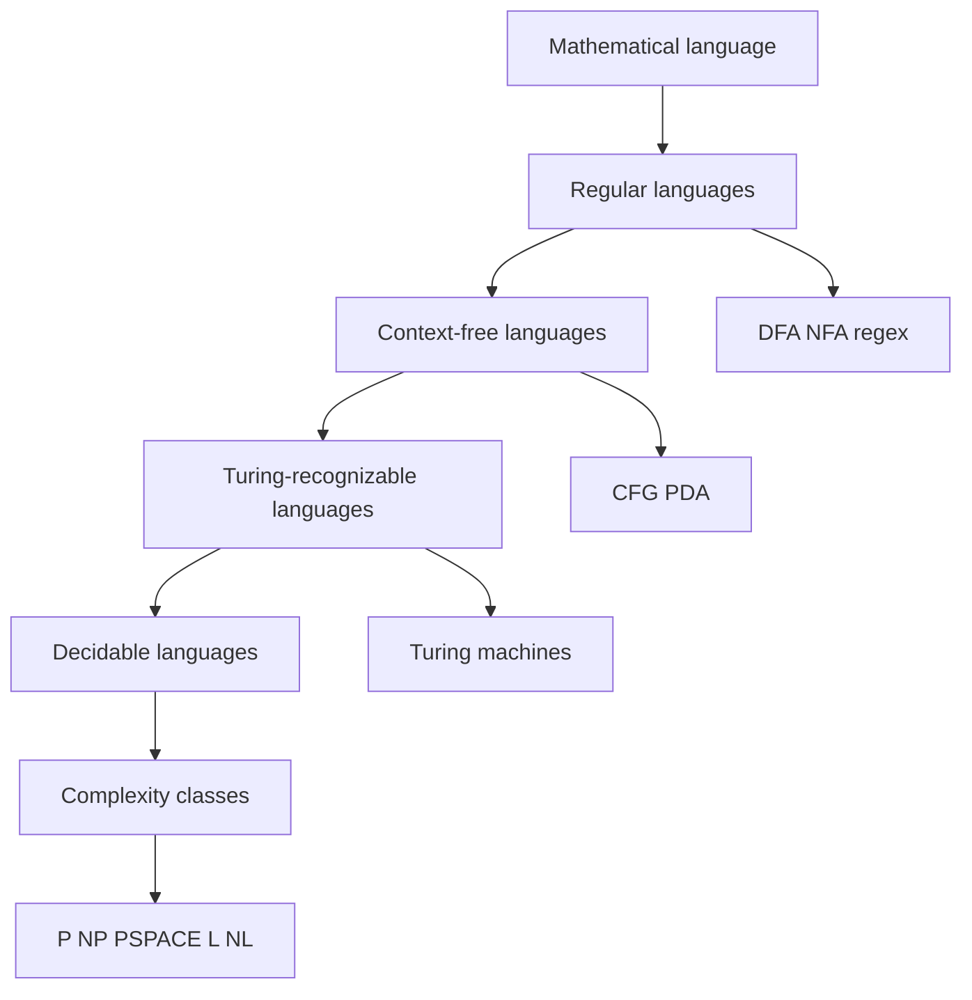

# Theory of Computation

Theory of computation studies computation before it becomes a particular programming language, operating system, or machine architecture. It asks which problems can be solved at all, which ones can be solved by limited devices such as finite automata or pushdown automata, and which solvable problems demand unreasonable resources. The subject is abstract, but its abstractions are practical: scanners in compilers behave like finite automata, parsers are organized around context-free grammars, termination questions explain why fully automatic program verification is limited, and complexity theory explains why many optimization problems need reductions, approximations, heuristics, or randomized methods.

These notes follow the scope of Michael Sipser's *Introduction to the Theory of Computation*, third edition, without reproducing its text. They use the textbook as a map of topics: mathematical preliminaries, automata and languages, computability, decidability, reducibility, time complexity, space complexity, and selected advanced topics. Each page is written as a study note with definitions, key results, visual anchors, worked examples, code, pitfalls, and links to neighboring pages.


*Figure: Nested language classes in the Chomsky hierarchy. Image: [Wikimedia Commons](https://commons.wikimedia.org/wiki/File:Chomsky-hierarchy.svg), J. Finkelstein, CC BY-SA 3.0.*

## Definitions

A **model of computation** is a mathematical object that describes what counts as a computation. In this course the main models are deterministic finite automata, nondeterministic finite automata, regular expressions, context-free grammars, pushdown automata, Turing machines, and variants of Turing machines. A model is useful when it is precise enough for proof and simple enough to reveal structure.

A **language** is a set of strings over an alphabet. Many questions in the course are language-recognition questions: given an input string, should a machine accept it or reject it? The same view can encode graphs, formulas, programs, arithmetic expressions, and scheduling instances by choosing a reasonable string representation.

A **decision problem** is a yes-or-no problem represented as a language. A problem is **decidable** if some algorithm halts on every input and answers correctly. It is **recognizable** if some algorithm accepts exactly the yes-instances, possibly running forever on no-instances. These two notions separate total algorithms from semi-decision procedures.

A **complexity class** is a collection of languages decidable within a resource bound such as polynomial time, polynomial space, logarithmic space, nondeterministic polynomial time, or randomized polynomial time. Complexity theory treats resource bounds as mathematical objects so that hard problems can be compared by reductions.

The page list is:

| Page | Main scope |
|---|---|
| [mathematical preliminaries](/cs/theory/mathematical-preliminaries) | sets, functions, graphs, strings, languages, Boolean logic |
| [proof methods and countability](/cs/theory/proof-methods-and-countability) | construction, contradiction, induction, diagonalization |
| [finite automata and DFAs](/cs/theory/finite-automata-and-dfas) | deterministic finite automata and regular languages |
| [nondeterminism and closure](/cs/theory/nondeterminism-and-closure) | NFAs, subset construction, regular operations |
| [regular expressions and nonregularity](/cs/theory/regular-expressions-and-nonregularity) | regex, GNFA conversion, pumping lemma |
| [context-free grammars and normal forms](/cs/theory/context-free-grammars-and-normal-forms) | CFGs, derivations, parse trees, ambiguity, CNF |
| [pushdown automata and deterministic CFLs](/cs/theory/pushdown-automata-and-deterministic-cfls) | PDAs, CFG equivalence, DPDAs |
| [non-context-free languages](/cs/theory/non-context-free-languages) | pumping lemma for CFLs and separation examples |
| [Turing machines and the Church-Turing thesis](/cs/theory/turing-machines-and-the-church-turing-thesis) | formal TMs, configurations, algorithms |
| [Turing machine variants and decidable problems](/cs/theory/turing-machine-variants-and-decidable-problems) | multitape, nondeterminism, enumerators, language algorithms |
| [decidability and the halting problem](/cs/theory/decidability-and-the-halting-problem) | diagonalization, acceptance, halting, recognizability |
| [reductions and the recursion theorem](/cs/theory/reductions-and-the-recursion-theorem) | mapping reductions, language-theory undecidability, self-reference |
| [time complexity, P, and NP](/cs/theory/time-complexity-p-and-np) | asymptotic time, P, NP, verifiers |
| [NP-completeness and classic reductions](/cs/theory/np-completeness-and-classic-reductions) | Cook-Levin, SAT, CLIQUE, HAMPATH, SUBSETSUM |
| [space complexity](/cs/theory/space-complexity) | PSPACE, Savitch, L, NL, NL-completeness |
| [advanced complexity topics](/cs/theory/advanced-complexity-topics) | hierarchy theorems, oracles, randomized complexity, IP, PCP |

## Key results

The first organizing result is that weak models can still express nontrivial computation. DFAs have no memory except a finite state, yet they exactly recognize regular languages. NFAs and regular expressions look different, but they define the same class. The proof of equivalence is constructive: convert a regular expression to an NFA by structural induction, convert an NFA to a DFA by the subset construction, and convert a finite automaton to a regular expression by state elimination.

The second organizing result is that adding a stack strictly increases expressive power. Context-free grammars and pushdown automata recognize the same class of languages, the context-free languages. The stack can match nested structure such as parentheses or balanced blocks, which finite automata cannot do. However, a single stack still cannot coordinate several independent unbounded counts, which is why languages such as $\{a^n b^n c^n:n\ge 0\}$ are not context-free.

The third organizing result is that Turing machines provide a robust mathematical account of algorithms. Many variations of Turing machines have the same decidability power: multitape machines, nondeterministic machines, and enumerators do not decide fundamentally more languages than the basic model. This robustness supports the Church-Turing thesis: any effectively calculable procedure can be carried out by a Turing machine.

The fourth organizing result is negative: some problems are not algorithmically solvable. The halting problem and the acceptance problem for Turing machines are undecidable. Reductions spread these impossibility results to grammar ambiguity, language equivalence questions, and other program-analysis tasks. In complexity theory the same reduction idea becomes a comparison tool for feasible computation, leading to NP-completeness and PSPACE-completeness.

One way to read the whole sequence is as a series of controlled increases in memory. A DFA has only finite state, so its languages are exactly those whose relevant past can be compressed into one of finitely many summaries. A PDA adds a stack, so it can manage nested obligations but still sees only the top of that stack. A Turing machine adds a rewritable tape, so it can implement general algorithms. Complexity theory then keeps the Turing-machine level of generality but asks how much time, space, nondeterminism, randomness, or interaction is required.

Another way to read the sequence is as a series of equivalence theorems followed by separation theorems. DFA, NFA, and regular expressions are equivalent; CFGs and PDAs are equivalent; many Turing-machine variants are equivalent. These equivalences make the models trustworthy because a language family is not an artifact of one notation. Separations then explain the limits: regular languages are strictly weaker than context-free languages, context-free languages are strictly weaker than decidable languages, recognizable languages are not all decidable, and polynomial-time computation is not known to capture all efficiently verifiable search.

The most reusable skill is reduction design. In automata, reductions are often disguised as closure constructions or encodings. In computability, they transfer undecidability from $A_{TM}$ or $HALT_{TM}$ to a new semantic question. In complexity, they transfer NP-hardness or PSPACE-hardness while preserving polynomial or log-space resource bounds. Each reduction has the same core checklist: define the input transformation, prove it is computable within the allowed resource, prove the yes direction, and prove the no direction.
## Visual



| Theme | Central question | Typical tool |
|---|---|---|
| Automata | What can restricted machines recognize? | constructions and closure proofs |
| Computability | What can any algorithm decide? | diagonalization and reductions |
| Complexity | What can be decided with limited resources? | asymptotic analysis and completeness |

## Worked example 1: Classifying a language by required memory

**Problem.** Decide which model naturally recognizes each language: $L_1=\{w\in\{0,1\}^*:w$ ends in `01`$\}$, $L_2=\{0^n1^n:n\ge0\}$, and $L_3=\{\langle M,w\rangle:M$ accepts $w\}$.

**Method.** Look for the amount and shape of memory required.

1. For $L_1$, the machine only needs to remember the last two input symbols. There are finitely many possibilities: no symbols yet, last symbol `0`, last symbol `1`, last two symbols `00`, `01`, `10`, `11`. A DFA can keep this information in its state.
2. For $L_2$, the machine must compare an arbitrary number of leading zeros with an arbitrary number of following ones. A finite state cannot store the count, but a stack can push one marker per `0` and pop one marker per `1`. A PDA or CFG is natural.
3. For $L_3$, the input encodes a machine and another input. Recognizing it requires simulating the encoded machine. A Turing machine can do that, but no decider can always halt because the acceptance problem for Turing machines is undecidable.

**Checked answer.** $L_1$ is regular, $L_2$ is context-free but not regular, and $L_3$ is Turing-recognizable but not decidable.

## Worked example 2: Reading the course through reductions

**Problem.** Explain how a single undecidability result can imply that another language is undecidable.

**Method.** Use the reduction pattern. Suppose $A$ is known undecidable and we want to prove $B$ undecidable.

1. Assume for contradiction that $B$ has a decider $D_B$.
2. Given an input $x$ for $A$, compute an instance $f(x)$ for $B$.
3. Arrange the construction so that $x\in A$ exactly when $f(x)\in B$.
4. Decide $A$ by running $D_B$ on $f(x)$ and copying its answer.
5. This contradicts the known undecidability of $A$.

**Checked answer.** The proof succeeds when $f$ is computable and preserves membership both ways. In notation, $A\le_m B$. If $A$ is undecidable and $A\le_m B$, then $B$ is undecidable.

## Code

```python
def classify_by_memory(description):
    cues = description.lower()
    if "last" in cues or "substring" in cues or "mod" in cues:
        return "try a finite automaton"
    if "balanced" in cues or "nested" in cues or "same number" in cues:
        return "try a context-free grammar or pushdown automaton"
    if "program" in cues or "machine" in cues or "halts" in cues:
        return "expect a Turing-machine or undecidability argument"
    return "identify the encoding, then choose a model"

for text in ["strings ending with 01", "balanced parentheses", "program halts"]:
    print(text, "->", classify_by_memory(text))
```

## Common pitfalls

- Treating a model as a programming convenience rather than a mathematical definition. A DFA is not just a simple program; it has no unbounded storage.
- Forgetting that a language is a set of strings. Problems about graphs, machines, and formulas must be encoded before they become languages.
- Confusing recognizability with decidability. A recognizer may loop on nonmembers; a decider must halt on every input.
- Using examples as proofs. A few accepted and rejected strings can guide a construction, but a proof must cover all strings.
- Thinking reductions only prove hardness in complexity theory. The same idea first appears as a way to transfer undecidability.

## Connections

- Start with [mathematical preliminaries](/cs/theory/mathematical-preliminaries) for notation.
- Use [finite automata and DFAs](/cs/theory/finite-automata-and-dfas) as the first formal machine model.
- See [decidability and the halting problem](/cs/theory/decidability-and-the-halting-problem) for the first major impossibility theorem.
- Continue to [NP-completeness and classic reductions](/cs/theory/np-completeness-and-classic-reductions) for resource-bounded reductions.
