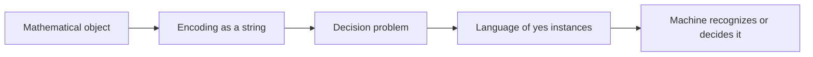

# Mathematical Preliminaries

Theory of computation is written in the language of discrete mathematics. The machines are finite descriptions, the inputs are strings, the behaviors are languages, and the proofs reason about sets, functions, relations, graphs, and logical statements. A student who can manipulate these objects cleanly will find automata theory much less mysterious because most machine definitions are just tuples of sets and functions.

The aim of this page is not to repeat a full discrete-math course. It is to collect the notation and habits that appear constantly in automata, computability, and complexity. The most important shift is to treat syntax as data. Strings are mathematical objects; encodings of graphs and programs are strings too; and a decision problem is represented by the set of strings whose answer is yes.

## Definitions

A **set** is an unordered collection of distinct objects. Write $x\in A$ when $x$ is an element of $A$, $A\subseteq B$ when every element of $A$ is also in $B$, $A\cup B$ for union, $A\cap B$ for intersection, and $\overline A$ for complement relative to an understood universe. The **power set** $\mathcal P(A)$ is the set of all subsets of $A$.

A **sequence** is an ordered list. A finite sequence is often called a **tuple**. Order and repetition matter in sequences, so $(0,1)$ and $(1,0)$ are different, and $(0,0,1)$ is different from $(0,1)$. The **Cartesian product** $A\times B$ is the set of ordered pairs $(a,b)$ with $a\in A$ and $b\in B$.

A **function** $f:A\to B$ assigns each element of $A$ exactly one element of $B$. The set $A$ is the domain and $B$ is the codomain. A **relation** from $A$ to $B$ is any subset of $A\times B$. Relations may be one-to-many or partial; functions are total and single-valued unless explicitly stated otherwise.

A **graph** is a set of vertices together with edges. In an undirected graph an edge is an unordered pair of vertices; in a directed graph it is an ordered pair. Computability and complexity use graphs both as examples of mathematical structures and as encoded inputs to decision problems such as reachability, clique, Hamiltonian path, and generalized geography.

An **alphabet** $\Sigma$ is a finite nonempty set of symbols. A **string** over $\Sigma$ is a finite sequence of symbols from $\Sigma$. The empty string is $\epsilon$, and $\Sigma^*$ denotes all finite strings over $\Sigma$. A **language** over $\Sigma$ is any subset of $\Sigma^*$. Concatenation joins strings, and $w^R$ denotes the reverse of $w$.

Boolean logic uses connectives such as $\land$, $\lor$, $\neg$, $\Rightarrow$, and $\Leftrightarrow$. A **truth assignment** gives each variable a value. A Boolean formula is **satisfiable** if at least one assignment makes it true and a **tautology** if every assignment makes it true.

## Key results

Many definitions in the course are finite tuples. A DFA is a 5-tuple $(Q,\Sigma,\delta,q_0,F)$, a CFG is a 4-tuple $(V,\Sigma,R,S)$, and a Turing machine is a tuple containing states, alphabets, a transition function, and halting states. The tuple format is not decoration. It says exactly what data determine the object and which parts must be checked when proving a construction valid.

Set operations on languages are central. If $A,B\subseteq\Sigma^*$, then $A\cup B$, $A\cap B$, and $\overline A$ are languages. Concatenation is $AB=\{xy:x\in A \text{ and } y\in B\}$, and star is $A^*=\{x_1x_2\cdots x_k:k\ge0, x_i\in A\}$. Closure theorems ask whether a family of languages remains inside the family after these operations.

Encodings connect abstract objects to strings. A graph, automaton, grammar, formula, or Turing machine can be written as a string over a fixed alphabet. Once an object is encoded, a decision problem becomes a language. For example, the graph-reachability problem can be written as $\{\langle G,s,t\rangle:G$ has a path from $s$ to $t\}$. The angle brackets indicate a standard effective encoding, not a special alphabet symbol.

Boolean formulas bridge computation and complexity. The satisfiability problem asks whether a formula has a satisfying assignment. Its importance comes from representing the local choices of computations. In the Cook-Levin theorem, a tableau of a nondeterministic polynomial-time computation is encoded by Boolean variables and constraints.

The distinction between object language and metalanguage is worth keeping explicit. When we write a string such as `0011`, the characters are part of the object being studied. When we write a sentence such as "the string has two zeros," we are speaking in the metalanguage about that object. Encodings connect the two levels: a graph or machine is a mathematical object, but its code is a string that another machine can read. Many mistakes in computability proofs come from blurring these levels, especially when a machine is given its own description as input.

Tuples also carry arity information that sets do not. The transition function of a DFA takes a pair $(q,a)$, where the first coordinate must be a state and the second coordinate must be an input symbol. Swapping the coordinates is not meaningful even if both are ultimately encoded as strings. Similarly, an encoded triple $\langle G,s,t\rangle$ must be parsed as a graph plus two vertices. A decider for a language of triples may first reject malformed encodings; after that, it reasons about the decoded object.

Closure operations on languages are not merely notation. They correspond to machine constructions. Union corresponds to "accept if either submachine accepts." Intersection corresponds to "accept if both accept." Complement corresponds to "swap accepting and rejecting outcomes," which is safe for deciders and complete DFAs but dangerous for recognizers that may loop. Concatenation and star correspond to splitting an input into pieces; nondeterminism is often the cleanest way to guess those split points.

Boolean logic should be read both syntactically and semantically. Syntactically, a formula is a finite string or tree built from variables and connectives. Semantically, it defines a truth value under each assignment. SAT asks whether at least one assignment works; TQBF asks whether a quantified formula is true under alternating existential and universal choices. This movement from syntax to semantics mirrors the rest of the course: the input is a finite string, but the question is about the object that the string denotes.
## Visual



| Object | Notation | Role in theory of computation |
|---|---|---|
| Alphabet | $\Sigma$ | finite set of symbols used for inputs |
| String | $w\in\Sigma^*$ | one finite input instance |
| Language | $L\subseteq\Sigma^*$ | yes-instances of a decision problem |
| Function | $f:A\to B$ | transition rule, reduction, encoding |
| Graph | $G=(V,E)$ | common input type for P, NP, PSPACE, NL |
| Formula | $\phi$ | satisfiability and computation encoding |

## Worked example 1: Turning a graph question into a language

**Problem.** Let `PATH` be the problem "given a directed graph $G$ and vertices $s,t$, is there a directed path from $s$ to $t$?" Write it as a language and test one instance.

**Method.** Choose an encoding and identify the yes-instances.

1. Represent the input triple by $\langle G,s,t\rangle$. The exact binary encoding can list the vertices, then the directed edges, then the two distinguished vertices.
2. Define
   $$\mathrm{PATH}=\{\langle G,s,t\rangle:G \text{ contains a directed path from } s \text{ to } t\}.$$
3. Consider $V=\{a,b,c,d\}$ and $E=\{(a,b),(b,c),(a,d)\}$ with $s=a$ and $t=c$.
4. The path $a\to b\to c$ exists, so $\langle G,a,c\rangle\in\mathrm{PATH}$.
5. If $s=c$ and $t=a$, no listed edge leaves $c$, so $\langle G,c,a\rangle\notin\mathrm{PATH}$.

**Checked answer.** The language contains exactly the encodings whose graph has the requested reachability property.

## Worked example 2: Computing language operations

**Problem.** Let $A=\{0,11\}$ and $B=\{\epsilon,1\}$. Compute $AB$ and $A^2$.

**Method.** Use the definitions directly.

1. Concatenation forms every $xy$ with $x\in A$ and $y\in B$.
2. Pair $0$ with $\epsilon$ to get $0$.
3. Pair $0$ with $1$ to get $01$.
4. Pair $11$ with $\epsilon$ to get $11$.
5. Pair $11$ with $1$ to get $111$.
6. Therefore $AB=\{0,01,11,111\}$.
7. Now $A^2=AA$. The four products are $00$, $011$, $110$, and $1111$.

**Checked answer.** $AB=\{0,01,11,111\}$ and $A^2=\{00,011,110,1111\}$. Notice that $\epsilon$ acts as an identity under concatenation, but it is present only when the language explicitly contains it.

## Code

```python
from itertools import product

def concat_language(A, B):
    return {x + y for x, y in product(A, B)}

def star_up_to(A, max_pieces):
    result = {""}
    current = {""}
    for _ in range(max_pieces):
        current = concat_language(current, A)
        result |= current
    return result

A = {"0", "11"}
B = {"", "1"}
print(concat_language(A, B))
print(star_up_to(A, 3))
```

## Common pitfalls

- Confusing a symbol with a string of length one. In formal notation they are related but not identical.
- Forgetting that $\epsilon$ is a string and $\emptyset$ is a language with no strings.
- Treating $\Sigma^*$ as infinite but vague. It is the precise set of all finite strings over $\Sigma$, including $\epsilon$.
- Using set braces when order matters. A transition such as $(q,a)$ is an ordered pair, not a two-element set.
- Assuming encodings are magical. A proof involving $\langle M,w\rangle$ must rely on an effective, finite representation.

## Connections

- Proof styles are developed in [proof methods and countability](/cs/theory/proof-methods-and-countability).
- Formal automata begin in [finite automata and DFAs](/cs/theory/finite-automata-and-dfas).
- Encoded machines become central in [decidability and the halting problem](/cs/theory/decidability-and-the-halting-problem).
- Boolean formulas return in [NP-completeness and classic reductions](/cs/theory/np-completeness-and-classic-reductions).
