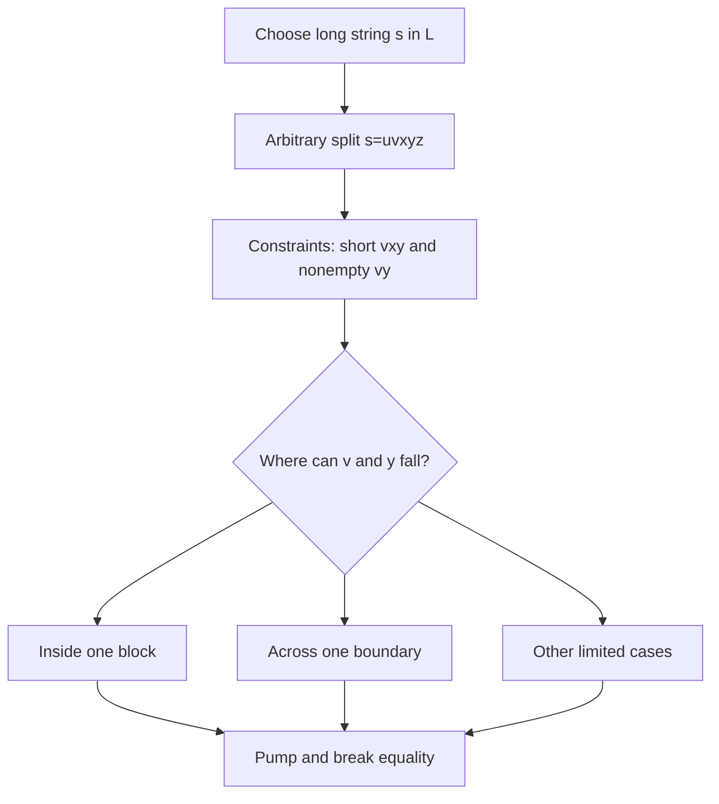

# Non-Context-Free Languages

Context-free languages handle one main unbounded dependency very well. They can match parentheses, count zeros against ones, and parse recursively nested expressions. They do not handle arbitrary coordination among several independent counts or cross-serial dependencies. The pumping lemma for context-free languages is the first standard tool for proving those limitations.

The CFL pumping lemma is subtler than the regular pumping lemma because parse trees branch. A long generated string must contain a repeated variable along some root-to-leaf path in a parse tree, and pumping repeats the material generated between those two occurrences. The result is a split into five pieces rather than three.

## Definitions

The **pumping lemma for context-free languages** says that if $A$ is context-free, then there is a pumping length $p$ such that any string $s\in A$ with $\vert s\vert \ge p$ can be written as $s=uvxyz$ satisfying $\vert vxy\vert \le p$, $\vert vy\vert \gt 0$, and $uv^ixy^iz\in A$ for every $i\ge0$.

The pieces $v$ and $y$ are pumped together. Either one may be empty, but not both. The middle window $vxy$ has length at most $p$, so it lies within a small region of the chosen string.

A **non-CFL proof** by pumping assumes the language is context-free, chooses a carefully structured string, considers every legal split, and finds a pump value that leaves the language.

A **closure-based non-CFL proof** uses known closure properties. CFLs are closed under union, concatenation, star, homomorphism, inverse homomorphism, and intersection with regular languages. They are not closed under arbitrary intersection or complement.

A **semilinear counting property** underlies Parikh's theorem, though it is beyond the basic pumping lemma. It gives another way to see that CFLs cannot impose some arithmetic patterns on symbol counts.

## Key results

The language $\{a^n b^n c^n:n\ge0\}$ is not context-free. A single stack can compare the number of $a$s with the number of $b$s, or the number of $b$s with the number of $c$s, but it cannot enforce both equalities in one left-to-right pass without losing needed information. The pumping lemma makes this intuition formal.

The language $\{ww:w\in\{0,1\}^*\}$ is not context-free. It requires copying an arbitrary first half in the same order. A stack naturally reverses order, which is why palindromes are context-free but exact duplication is not.

Closure with regular languages is often cleaner than raw pumping. To show a complicated language is not context-free, intersect it with a regular language that filters out noise and leaves a known non-CFL. If the original language were context-free, the intersection would be context-free; contradiction.

The pumping lemma is necessary but not sufficient. Failing to find a pumping contradiction does not mean a language is context-free. More advanced tools, such as Ogden's lemma, can prove non-context-freeness when the basic pumping lemma is awkward.

The CFL pumping lemma comes from repeated variables in parse trees. In a grammar in Chomsky normal form, a sufficiently long string has a tall parse tree. Along a long root-to-leaf path, some variable must repeat because there are only finitely many variables. The upper occurrence of that variable derives a substring containing the lower occurrence, and the lower occurrence derives a smaller substring. Repeating or deleting the difference between these derivations pumps two regions of the yield together.

This parse-tree origin explains the constraints $\vert vxy\vert \le p$ and $\vert vy\vert \gt 0$. The substring $vxy$ is the yield of the upper repeated variable and is bounded because the repetition can be chosen low enough in the tree. The pieces $v$ and $y$ are the material added around the lower repeated variable. At least one of them must be nonempty, or repeating the variable would not change the generated string. The lemma is therefore about local repeatability inside a parse tree, not about arbitrary substrings.

Choosing the pumping string for a CFL proof requires controlling where the short window $vxy$ can lie. In $a^p b^p c^p$, any window of length at most $p$ touches at most two adjacent blocks. That means pumping can never change all three counts in the coordinated way needed to remain in the language. This "window cannot see everything" strategy is common. For copy languages such as $\{ww\}$, the chosen string often contains repeated blocks arranged so that local pumping breaks correspondence between distant positions.

Closure arguments are often cleaner because they let regular languages do the filtering. A language with symbols in arbitrary order may be hard to pump directly because the short window can appear in many patterns. Intersecting with $a^*b^*c^*$ restricts attention to ordered blocks while preserving context-freeness if the original language were context-free. This technique is a precursor to reductions: transform the question into a known impossible one while preserving membership in the class under discussion.

Do not overstate stack intuition. Saying "one stack cannot count three things" is a useful guide, but some languages with several counts are context-free because they decompose into unions of simpler cases. Formal proofs must use pumping, closure, Ogden's lemma, Parikh's theorem, or another precise tool.

A common source of failed CFL pumping proofs is choosing a string with too much symmetry. If the pumpable pieces can fall in several places and some placements preserve the language when pumped, the proof may become impossible even though the language is not context-free. The chosen string should expose the dependency that a single local pump cannot preserve. For three-count languages, ordered blocks work well. For copy languages, markers or carefully separated regions can force the two copies to disagree when one local region is pumped.

The quantifier order is the same adversarial pattern as in regular pumping but with more cases. You choose $s$ after receiving $p$. Then the adversary chooses $u,v,x,y,z$ subject to $\vert vxy\vert \le p$ and $\vert vy\vert \gt 0$. Your proof must find an $i$ that breaks membership for that arbitrary split. The value of $i$ may depend on the case, but the case analysis must cover all legal positions of $v$ and $y$.

Closure proofs are often shorter because they let previous results do work. If a language has a messy definition involving all orders of symbols, intersecting with a regular language can restrict attention to one canonical order. The regular filter is safe because CFLs are closed under intersection with regular languages. The result is a controlled sublanguage; if that sublanguage is a known non-CFL, the original language could not have been context-free.
## Visual



| Language | Regular? | Context-free? | Reason |
|---|---|---|---|
| $a^*b^*$ | yes | yes | simple block order |
| $\{a^n b^n:n\ge0\}$ | no | yes | one stack count |
| $\{a^n b^n c^n:n\ge0\}$ | no | no | two synchronized equalities |
| palindromes | no | yes | stack compares reverse |
| $\{ww:w\in\{0,1\}^*\}$ | no | no | requires same-order copy |

## Worked example 1: Pumping $a^n b^n c^n$

**Problem.** Prove that $L=\{a^n b^n c^n:n\ge0\}$ is not context-free.

**Method.** Use the CFL pumping lemma.

1. Assume $L$ is context-free and let $p$ be its pumping length.
2. Choose $s=a^p b^p c^p$.
3. Let $s=uvxyz$ be any split with $\vert vxy\vert \le p$ and $\vert vy\vert \gt 0$.
4. Since $vxy$ has length at most $p$, it cannot cover both the $a/b$ boundary and the $b/c$ boundary. It lies inside one block or crosses one boundary.
5. If $v$ and $y$ affect only one kind of symbol, pumping changes that count but not the other two, so equality fails.
6. If they cross the $a/b$ boundary, pumping changes only $a$s and $b$s, not $c$s; equality with $c$s fails.
7. If they cross the $b/c$ boundary, pumping changes only $b$s and $c$s, not $a$s; equality with $a$s fails.
8. Pumping down with $i=0$ or pumping up with $i=2$ gives a string not in $L$ in every case.

**Checked answer.** No legal split can satisfy the lemma, so $L$ is not context-free.

## Worked example 2: Closure proof using regular intersection

**Problem.** Let $K=\{w\in\{a,b,c\}^*: \#a(w)=\#b(w)=\#c(w)\}$. Prove that $K$ is not context-free.

**Method.** Intersect with a regular language to isolate a known non-CFL.

1. Let $R=a^*b^*c^*$, which is regular.
2. If $K$ were context-free, then $K\cap R$ would be context-free because CFLs are closed under intersection with regular languages.
3. A string in $K\cap R$ has all $a$s first, then all $b$s, then all $c$s, and the three counts are equal.
4. Therefore $K\cap R=\{a^n b^n c^n:n\ge0\}$.
5. Worked example 1 shows this language is not context-free.

**Checked answer.** The assumption that $K$ is context-free leads to a non-context-free intersection that should be context-free. Thus $K$ is not context-free.

## Code

```python
def in_anbncn(w):
    i = 0
    while i < len(w) and w[i] == "a":
        i += 1
    j = i
    while j < len(w) and w[j] == "b":
        j += 1
    k = j
    while k < len(w) and w[k] == "c":
        k += 1
    return k == len(w) and i == j - i == k - j

def counts_equal(w):
    return w.count("a") == w.count("b") == w.count("c")

for sample in ["aaabbbccc", "abcabc", "aabbcc", "aaabbccc"]:
    print(sample, in_anbncn(sample), counts_equal(sample))
```

## Common pitfalls

- Pumping only one chosen split. A CFL pumping proof must handle every split satisfying the constraints.
- Forgetting that $v$ or $y$ may be empty. The condition is $\vert vy\vert \gt 0$, not both nonempty.
- Assuming CFLs are closed under complement or arbitrary intersection. They are not.
- Choosing a string that is too short or not in the language.
- Treating stack intuition as proof. The pumping lemma or closure argument must formalize the limitation.

## Connections

- CFGs and CNF are covered in [context-free grammars and normal forms](/cs/theory/context-free-grammars-and-normal-forms).
- PDAs explain the one-stack intuition in [pushdown automata and deterministic CFLs](/cs/theory/pushdown-automata-and-deterministic-cfls).
- Turing machines recognize languages far beyond CFLs in [Turing machines and the Church-Turing thesis](/cs/theory/turing-machines-and-the-church-turing-thesis).
- Reductions later provide another style of impossibility proof in [reductions and the recursion theorem](/cs/theory/reductions-and-the-recursion-theorem).
