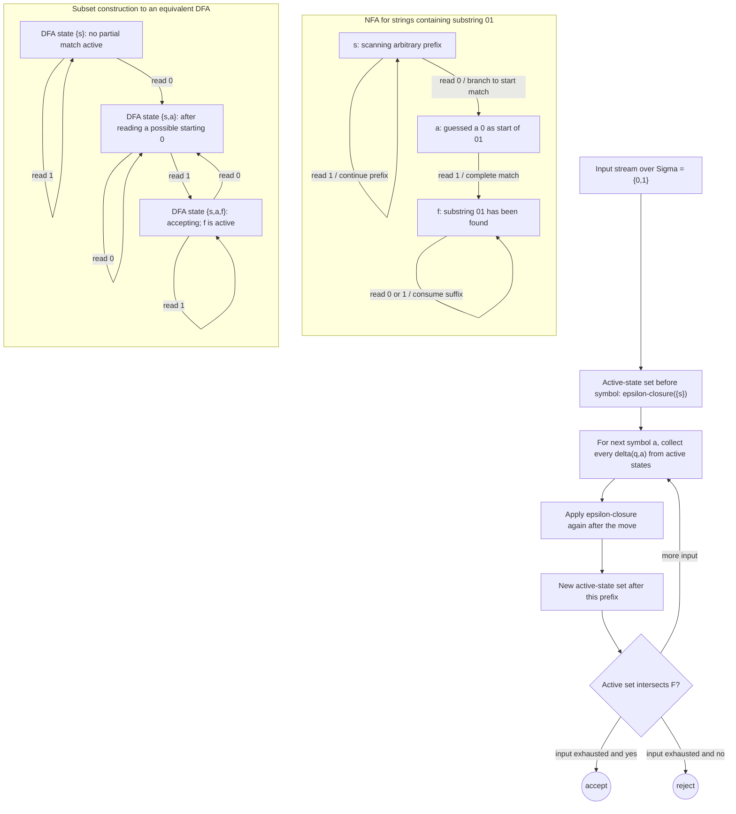

# Nondeterminism and Closure

Nondeterminism lets a finite automaton branch into several possible futures. An NFA accepts if at least one branch accepts. This sounds more powerful than a DFA because the machine can guess where a pattern begins, which alternative to take, or how many symbols to consume before a final check. For finite automata, however, nondeterminism adds convenience but not expressive power.

The equivalence between NFAs and DFAs is one of the first major robustness results in the course. It shows that a computational feature can make descriptions shorter and constructions easier without changing the class of languages recognized. The same lesson returns later for nondeterministic Turing machines in decidability, although complexity theory treats nondeterminism much more carefully.

## Definitions

A **nondeterministic finite automaton**, or **NFA**, is a 5-tuple $(Q,\Sigma,\delta,q_0,F)$ where $Q$, $\Sigma$, $q_0$, and $F$ have the same meaning as for DFAs, but the transition function has type $\delta:Q\times(\Sigma\cup\{\epsilon\})\to\mathcal P(Q)$. The output is a set of possible next states.

An **epsilon transition** consumes no input symbol. It lets an NFA change state spontaneously. A computation may use any number of epsilon transitions before, between, or after consuming symbols.

An NFA **accepts** a string if there exists at least one path from the start state to an accepting state whose consumed input symbols, in order, form the whole string. Other branches may reject or get stuck; existence of one accepting branch is enough.

The **epsilon closure** of a set of states $S$ is the set of all states reachable from states in $S$ using only epsilon transitions. It is used in NFA simulation and in the subset construction.

The **subset construction** converts an NFA into a DFA whose states are subsets of NFA states. A DFA subset represents all NFA states that could be active after reading the current input prefix.

## Key results

Every DFA is an NFA with singleton transition sets and no epsilon transitions. Therefore all regular languages recognized by DFAs are recognized by NFAs. The nontrivial direction is that every NFA has an equivalent DFA. If the NFA has $n$ states, the constructed DFA may have up to $2^n$ subset states, although many may be unreachable.

NFAs make closure under union, concatenation, and star especially clean. For union, create a new start state with epsilon transitions to the starts of the two component NFAs. For concatenation, add epsilon transitions from accepting states of the first NFA to the start of the second. For star, add a new accepting start state and epsilon transitions that allow zero repetitions or another repetition after each accepted copy.

The subset construction has a simple invariant. After reading a prefix $x$, the DFA state is exactly the set of NFA states reachable by some path whose consumed label is $x$, including epsilon moves. The start subset is the epsilon closure of $\{q_0\}$, and a subset is accepting if it contains at least one accepting NFA state.

Nondeterminism is existential. This matters in proofs and simulations. To show an NFA accepts a string, present one accepting path. To show it rejects a string, argue that every possible path fails to finish in an accepting state after consuming the whole input.

The mental model for an NFA should be "set of possible current states," not "a machine that makes lucky guesses." The lucky-guess language is useful for intuition, but the subset construction shows the deterministic reality behind it: after each input prefix, there is a precise set of states reachable by some path. Acceptance means that this set intersects the final-state set after the whole input has been consumed.

Epsilon transitions are especially easy to mishandle because they do not consume input. In a simulation, before reading the next symbol you must include every state reachable by epsilon moves from the current active set. After reading a symbol, you again include epsilon closure, because the NFA may move spontaneously before the next input symbol. If the NFA accepts $\epsilon$, that acceptance must already be visible in the epsilon closure of the start state.

NFAs are often smaller because they postpone commitment. For a language such as "contains one of these ten patterns," a DFA may need to remember partial progress toward many patterns at once. An NFA can branch into separate attempts and accept if any attempt completes. The subset construction pays the bill by making the DFA state a set containing all simultaneous attempts. This is why nondeterminism can be descriptively succinct even when it adds no language-recognition power for finite automata.

Closure under concatenation and star reveals why nondeterminism fits regular languages so well. To recognize $AB$, the machine must choose where the part from $A$ ends and the part from $B$ begins. To recognize $A^*$, it must choose repetition boundaries. A deterministic automaton can still do this, but its state must encode all possible boundary choices implicitly. The NFA construction expresses the idea directly through epsilon transitions.

To prove an NFA construction correct, state the path correspondence. For union, every accepting path in the new NFA begins by choosing one component, and every accepting path in a component becomes an accepting path in the union machine. For concatenation, accepting paths correspond to a split $w=xy$ where the first component accepts $x$ and the second accepts $y$. For star, accepting paths correspond to a finite factorization into accepted pieces, including the empty factorization for $\epsilon$.

The subset construction also proves a determinization algorithm. Given a finite NFA description, one can compute the reachable subsets by graph search from the start subset. Each subset is a finite bit vector of length $\vert Q\vert $, so the process terminates. This matters because equivalence is not merely existential; it is effective. We can actually build the equivalent DFA, remove unreachable subset states, and then use DFA algorithms for membership, emptiness, and equivalence.

In examples, distinguish between branches that die and branches that reject after consuming all input. An NFA path may get stuck because no transition is available; that path simply contributes no accepting computation. The whole NFA rejects only when every possible path either gets stuck, fails to consume the whole input, or finishes in a nonaccepting state. This is why drawing all possible active states after each input symbol is safer than following one path.

Nondeterministic closure constructions are often intentionally permissive. In a concatenation NFA, the machine may jump from the first component to the second at the wrong split. Those branches fail later. Correctness requires that every successful branch corresponds to a valid split and that every valid split has at least one successful branch. Wrong guesses are harmless because acceptance is existential, not universal.
## Visual



The NFA branch from `s` to `a` shows how nondeterminism guesses that a particular `0` begins the target substring while other branches keep scanning. The active-state pipeline below it is the deterministic simulation invariant: each input symbol maps one set of possible NFA states to the next, and the subset DFA makes those sets explicit as ordinary states.

| Construction | NFA idea | Why it is useful |
|---|---|---|
| Union | epsilon-branch to either machine | no product needed |
| Concatenation | jump from final states of first to start of second | guesses split point |
| Star | loop final states back to start | guesses repetition boundaries |
| Subset to DFA | track all active NFA states | removes nondeterminism |

## Worked example 1: Subset construction

**Problem.** Convert an NFA with states `s,a,b`, alphabet $\{0,1\}$, start `s`, final state `b`, and transitions `s --0--> s`, `s --1--> s`, `s --epsilon--> a`, `a --1--> b` into a DFA. The NFA accepts strings whose last symbol can be chosen as a `1`.

**Method.** Compute reachable subsets with epsilon closure.

1. The epsilon closure of `{s}` is `{s,a}` because `s` can jump to `a`.
2. Start DFA state is `{s,a}`.
3. From `{s,a}` on `0`: `s` goes to `s`, `a` has no `0` transition. Epsilon closure of `{s}` is `{s,a}`.
4. From `{s,a}` on `1`: `s` goes to `s`, `a` goes to `b`. Epsilon closure of `{s,b}` is `{s,a,b}` because `s` again reaches `a`.
5. From `{s,a,b}` on `0`: only `s` contributes, so the result is `{s,a}`.
6. From `{s,a,b}` on `1`: `s` contributes `s`, `a` contributes `b`, so the result remains `{s,a,b}`.
7. Accepting subsets are those containing `b`, so `{s,a,b}` is accepting.

**Checked answer.** The DFA has two reachable states: `{s,a}` nonaccepting and `{s,a,b}` accepting. It accepts exactly nonempty strings ending in `1`.

## Worked example 2: NFA for concatenation

**Problem.** Build an NFA for $L=\{0,1\}^*01\{0,1\}^*$, the language of strings containing substring `01`.

**Method.** Use nondeterminism to guess where the substring begins.

1. Start in state `s` and loop on both `0` and `1`, allowing any prefix.
2. From `s`, on input `0`, nondeterministically either stay in `s` or move to `a`, guessing that this `0` begins the desired substring.
3. From `a`, read `1` and move to accepting state `f`.
4. From `f`, loop on `0` and `1` to consume any suffix.
5. Reject paths that guessed a `0` not followed by `1`; those paths simply get stuck, but another branch may succeed.

**Checked answer.** On `10010`, the branch that guesses the third symbol as the start reads `0` then `1` and accepts. On `111000`, every guessed `0` is followed by `0` or end of input, so no branch accepts.

## Code

```python
def nfa_contains_01(w):
    states = {"s"}
    for ch in w:
        nxt = set()
        for q in states:
            if q == "s":
                nxt.add("s")
                if ch == "0":
                    nxt.add("a")
            elif q == "a" and ch == "1":
                nxt.add("f")
            elif q == "f":
                nxt.add("f")
        states = nxt
    return "f" in states

for sample in ["", "01", "111000", "10010"]:
    print(sample, nfa_contains_01(sample))
```

## Common pitfalls

- Treating an NFA as if it chooses one random path. Acceptance is existential, not probabilistic.
- Forgetting epsilon closure before and after consuming symbols in subset construction.
- Marking a subset accepting only when all its states are final. For NFAs, one final active state is enough.
- Assuming the subset construction always creates all $2^n$ subsets. Only reachable subsets matter in the resulting DFA diagram.
- Using nondeterminism to "guess" information that is never verified by the input.

## Connections

- DFA basics are in [finite automata and DFAs](/cs/theory/finite-automata-and-dfas).
- Regular-expression constructions use NFAs in [regular expressions and nonregularity](/cs/theory/regular-expressions-and-nonregularity).
- Pushdown automata reuse nondeterministic branching in [pushdown automata and deterministic CFLs](/cs/theory/pushdown-automata-and-deterministic-cfls).
- Nondeterminism becomes a complexity resource in [time complexity, P, and NP](/cs/theory/time-complexity-p-and-np).
