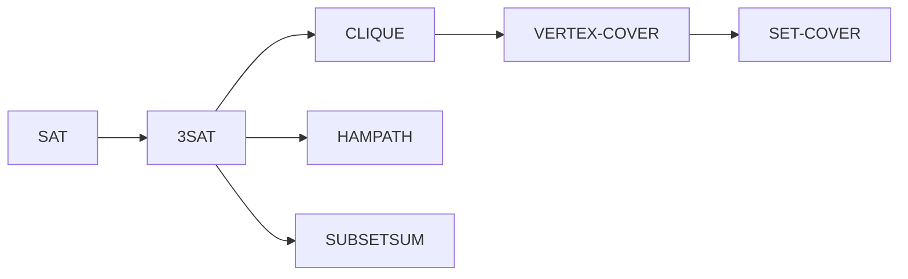

# NP-Completeness and Classic Reductions

NP-completeness gives a rigorous way to say that a problem is at least as hard as every problem in NP. It does not prove that the problem lacks a polynomial-time algorithm, because that would prove $P\ne NP$. Instead, it provides strong evidence: a polynomial-time algorithm for any NP-complete problem would yield polynomial-time algorithms for all NP problems.

The engine is polynomial-time reducibility. To prove a new problem NP-complete, show it is in NP and transform a known NP-complete problem into it. The transformation must preserve yes/no answers and run in polynomial time. Classic reductions build a network of hard problems from SAT to CLIQUE, VERTEX-COVER, HAMPATH, SUBSETSUM, and many others.

## Definitions

A **polynomial-time mapping reduction** from language $A$ to language $B$, written $A\le_p B$, is a function $f$ computable in polynomial time such that $w\in A$ if and only if $f(w)\in B$.

A language $B$ is **NP-hard** if every language in NP reduces to $B$ by polynomial-time reductions. A language is **NP-complete** if it is NP-hard and also belongs to NP.

The **SAT** problem asks whether a Boolean formula has a satisfying assignment. The **3SAT** problem restricts formulas to conjunctions of clauses, each with at most or exactly three literals depending on convention.

The **Cook-Levin theorem** states that SAT is NP-complete. It encodes the accepting computation tableau of a nondeterministic polynomial-time machine as a Boolean formula.

Classic graph and number problems include **CLIQUE**, asking whether a graph has $k$ pairwise adjacent vertices; **HAMPATH**, asking whether a graph has a Hamiltonian path; and **SUBSETSUM**, asking whether some subset of given integers sums to a target.

## Key results

To prove $B$ NP-complete, the standard template has two parts. First prove $B\in NP$ by giving a polynomial certificate and verifier. Second choose a known NP-complete language $A$ and prove $A\le_p B$. The second part proves NP-hardness because every NP language reduces to $A$, and reductions compose.

Cook-Levin is the root theorem. For any NP computation, create variables describing which symbol, state, and head position occur in each cell and time step of the computation tableau. Add clauses enforcing a valid start, legal local transitions, exactly one symbol/state condition where needed, and an accepting configuration. The formula is satisfiable exactly when an accepting computation exists.

The reduction from 3SAT to CLIQUE uses one vertex for each literal occurrence in each clause. Connect vertices from different clauses when their literals are not contradictory. A clique with one vertex per clause corresponds to a consistent choice of one true literal in every clause.

SUBSETSUM demonstrates that NP-completeness is not only about graphs and logic. Reductions can encode combinatorial choices into arithmetic digits, using place values to prevent carries from mixing independent constraints.

The direction of an NP-hardness reduction encodes a solver implication. To prove that $B$ is hard, start from a problem $A$ already known to be hard and transform instances of $A$ into instances of $B$. If a polynomial-time solver for $B$ existed, then the transformation followed by that solver would solve $A$. This is why the arrow is $A\le_p B$. Reversing the arrow proves that $B$ is no harder than $A$, which is usually not the desired claim.

The Cook-Levin theorem is conceptually a local-consistency proof. A full accepting computation is a large tableau: rows are time steps and columns are tape cells. Boolean variables describe which symbol and state information appear in each cell. Clauses enforce that the first row is the start configuration, some row is accepting, each cell has one valid content, and each small window of neighboring cells evolves according to the transition function. Local constraints are enough because Turing-machine transitions are local.

Classic reductions preserve structure by building gadgets. In 3SAT to CLIQUE, a gadget group represents a clause and choosing a vertex represents choosing a literal to satisfy that clause. Edges enforce compatibility between choices. In reductions to HAMPATH, graph gadgets force a path to make choices corresponding to truth assignments. In SUBSETSUM, digit positions enforce clause satisfaction and variable consistency without unwanted carries. A gadget proof must explain both how satisfying assignments create solutions and how solutions decode back into satisfying assignments.

Membership in NP should never be skipped. Some hard-looking problems are not known to be in NP because a solution may require exponential length or universal reasoning. For NP-completeness, the target must have short certificates. For example, "does this game position have a winning strategy?" may be PSPACE-complete rather than NP-complete because the strategy tree can be exponentially large.

NP-completeness is a worst-case classification. It does not say that every instance is hard, that small instances are hard, or that heuristics are useless. It says that a polynomial-time exact algorithm for all instances would collapse the entire class NP to P. This is why NP-completeness guides expectations while still leaving room for approximation, parameterized algorithms, special cases, and practical solvers.

Reductions compose. Once SAT reduces to 3SAT and 3SAT reduces to CLIQUE, any NP problem reduces to CLIQUE through that chain. This compositionality is what turns a single root theorem into a large map of complete problems.

A reduction should be size controlled. In 3SAT to CLIQUE, a formula with $m$ clauses and at most three literals per clause produces at most $3m$ vertices and $O(m^2)$ possible inter-clause edges. That is polynomial in the formula size. In more elaborate reductions, gadget counts, edge counts, and numeric bit lengths must all be bounded. A construction that creates exponentially large objects is not a polynomial-time reduction even if it is conceptually correct.

The two directions of a gadget proof usually have different flavors. The forward direction starts with a satisfying assignment or valid solution to the source problem and shows how to choose pieces of the constructed instance. The reverse direction starts with an arbitrary solution to the target instance and decodes it back into a source solution. Reverse directions catch most flawed reductions because target solutions may exploit unintended shortcuts unless the gadgets prevent them.

Optimization versions should be separated from decision versions. NP-completeness is formally about languages, so CLIQUE asks whether a clique of size at least $k$ exists, not "find the largest clique." The search and optimization versions are closely related for many classic problems, but the decision version is the one used in reductions. When writing proofs, include the threshold parameter because it is part of the encoded input.
## Visual



| Problem | Certificate | Verification |
|---|---|---|
| SAT | truth assignment | evaluate formula |
| CLIQUE | set of $k$ vertices | check all pairs are edges |
| VERTEX-COVER | set of $k$ vertices | check every edge is covered |
| HAMPATH | vertex ordering | check uniqueness and edges |
| SUBSETSUM | chosen indices | add selected numbers and compare target |

## Worked example 1: 3SAT to CLIQUE

**Problem.** Reduce the formula $(x\lor y\lor z)\land(\neg x\lor y\lor \neg z)\land(x\lor\neg y\lor z)$ to a CLIQUE instance.

**Method.** Make one vertex per literal occurrence and connect consistent choices from different clauses.

1. Create three groups of vertices, one group per clause.
2. Group 1 has vertices $x_1,y_1,z_1$.
3. Group 2 has vertices $\neg x_2,y_2,\neg z_2$.
4. Group 3 has vertices $x_3,\neg y_3,z_3$.
5. Connect vertices only between different groups.
6. Do not connect contradictory literal pairs such as $x_1$ with $\neg x_2$, or $y_1$ with $\neg y_3$.
7. Set clique size $k=3$.
8. A size-3 clique selects one mutually consistent literal from each clause.

**Checked answer.** The assignment $x=\text{true}$, $y=\text{true}$, $z=\text{true}$ satisfies the formula, and vertices $x_1,y_2,z_3$ form a consistent 3-clique.

## Worked example 2: Verifying a SUBSETSUM certificate

**Problem.** Given numbers $[3,5,9,10,12]$ and target $22$, verify certificate indices $[1,2,4]$ using zero-based indexing.

**Method.** Add the selected numbers and compare with the target.

1. Index `1` selects `5`.
2. Index `2` selects `9`.
3. Index `4` selects `12`.
4. The sum is $5+9+12=26$.
5. Since $26\ne22$, this certificate is invalid.
6. Try certificate `[3,4]`: selected numbers are `10` and `12`.
7. The sum is $10+12=22$.

**Checked answer.** `[1,2,4]` does not verify, but `[3,4]` is a valid certificate. This illustrates why SUBSETSUM is in NP.

## Code

```python
def verify_subset_sum(numbers, target, certificate):
    if len(set(certificate)) != len(certificate):
        return False
    if any(i < 0 or i >= len(numbers) for i in certificate):
        return False
    return sum(numbers[i] for i in certificate) == target

nums = [3, 5, 9, 10, 12]
print(verify_subset_sum(nums, 22, [1, 2, 4]))
print(verify_subset_sum(nums, 22, [3, 4]))
```

## Common pitfalls

- Proving only that a problem is in NP and calling it NP-complete. Membership and hardness are separate.
- Reducing from the target problem to a known NP-complete problem. That proves the target is no harder than the known problem, not NP-hard.
- Ignoring polynomial-time construction cost. The reduction must be efficient.
- Forgetting the if-and-only-if condition. Yes-instances and no-instances must both be preserved.
- Assuming NP-complete means unsolvable. NP-complete problems are decidable and often solvable on many practical instances.

## Connections

- P and NP are defined in [time complexity, P, and NP](/cs/theory/time-complexity-p-and-np).
- Mapping reductions for undecidability are in [reductions and the recursion theorem](/cs/theory/reductions-and-the-recursion-theorem).
- PSPACE-completeness extends the idea in [space complexity](/cs/theory/space-complexity).
- Randomization and approximation are surveyed in [advanced complexity topics](/cs/theory/advanced-complexity-topics).
