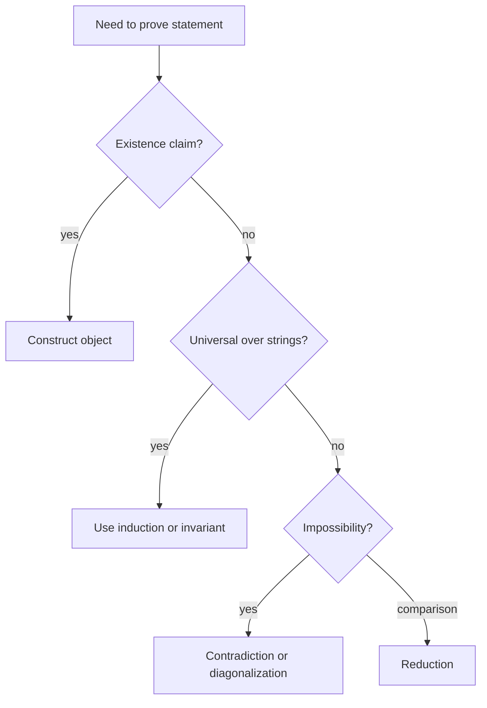

# Proof Methods and Countability

Computation theory is proof-heavy because the main claims are not about one machine run but about all strings, all machines, or all algorithms. A construction must work for every input in a language. A pumping argument must defeat every possible decomposition. An undecidability proof must rule out every algorithm, including algorithms nobody has written down.

The proof techniques are standard but used in distinctive ways. Construction builds a machine, grammar, expression, or reduction. Contradiction assumes an impossible decider or recognizer and derives a contradiction. Induction proves statements about string length, expression structure, derivation length, or computation steps. Diagonalization and countability show that some languages or behaviors cannot be listed by finite descriptions.

## Definitions

A **direct proof** starts from hypotheses and applies definitions until the conclusion follows. In this subject direct proofs often show membership: if a string has a certain form, a constructed machine reaches an accepting state.

A **proof by construction** proves existence by explicitly building the object. Closure proofs are usually constructive: to show regular languages are closed under union, build a DFA that simulates two DFAs in parallel.

A **proof by contradiction** assumes the negation of the desired conclusion and derives an impossibility. The halting-problem proof assumes a decider for halting and then constructs a machine whose behavior contradicts the decider's prediction.

A **proof by induction** proves a statement for a base case and then proves that one step preserves it. Structural induction follows the recursive definition of an object such as a regular expression or parse tree.

A set is **countable** if its elements can be listed in a sequence, finite or infinite. The natural numbers, integers, finite strings over a finite alphabet, and Turing machines are countable. The power set of the natural numbers, equivalently the set of all languages over a nonempty alphabet, is uncountable.

The **diagonalization method** constructs an object that differs from the $i$th listed object at position $i$. It is a way of proving that no proposed list is complete. Diagonalization appears in countability arguments and in undecidability proofs.

## Key results

Every finite string over a finite alphabet can be listed. One listing orders strings first by length and then lexicographically. Because descriptions of automata, grammars, and Turing machines are finite strings, the set of such descriptions is countable. This does not mean every string describes a valid machine; invalid encodings can be ignored.

The set of all languages over $\Sigma$ is uncountable when $\Sigma$ is nonempty. Since $\Sigma^*$ is countable, a language is a subset of a countable set. The collection of all subsets of a countably infinite set is uncountable by Cantor's diagonal argument. Therefore most languages cannot be recognized by any Turing machine because there are countably many machines but uncountably many languages.

Induction on computation length is a common correctness proof. If an invariant holds at the start configuration and every transition preserves it, then the invariant holds for every reachable configuration. DFA product constructions, PDA stack simulations, and Turing-machine encodings all use this pattern.

Contradiction proofs must identify exactly what the assumed object decides or recognizes. Assuming a decider is stronger than assuming a recognizer because a decider halts on both yes and no inputs. Many flawed undecidability proofs accidentally assume total halting behavior without stating it.

A good proof in this subject usually states its quantifiers before doing any clever work. For a closure theorem, the statement begins "for all languages $A$ and $B$ in the family." For a pumping lemma proof, after choosing the pumping length and string, the proof must handle "for every legal split." For a reduction, the proof must show "for every input $w$." Making these quantifiers visible prevents the most common error: proving that one convenient case works and accidentally ignoring the adversarial choices allowed by the theorem.

Construction proofs have two separate obligations. First, the constructed object must be well formed. If you build a DFA, every state-symbol pair needs exactly one transition. If you build a CFG, each production must have a single variable on the left. If you build a reduction, the output must be a valid encoding. Second, the object must have the intended behavior. The second obligation is normally proved with an invariant, a two-direction language equality proof, or an induction on derivations.

Diagonalization is best understood as a controlled disagreement argument. Given a list of candidate objects, the diagonal construction builds a new object that disagrees with candidate number $i$ on test number $i$. In countability, the candidates are infinite bit sequences and the tests are bit positions. In undecidability, the candidates are machines and the tests are inputs built from their own descriptions. The self-reference is not mystical; it is made possible because machines have finite encodings that can be fed to other machines.

Induction appears in several different forms. Ordinary induction on string length proves DFA and recursive-algorithm invariants. Structural induction on regular expressions or formulas follows the grammar of the object. Induction on derivation length proves facts about CFGs. Induction on computation steps proves simulation correctness. In every case, the induction step should match the operation that makes the object one step larger: append a symbol, add a constructor, apply a production, or execute one transition.

Countability arguments also explain why explicit examples matter. Knowing that some languages are undecidable by counting does not tell us which natural languages are undecidable. The counting proof is nonconstructive: it compares the number of languages with the number of machines. Diagonalization against machines, by contrast, produces named languages such as $A_{TM}$ that can be studied and reduced from. Both styles are useful, but they answer different kinds of questions.

In induction proofs, the statement being proved is often more important than the induction mechanics. If the statement is too weak, the induction step may not go through. For example, proving only "the DFA accepts some even-parity strings" is useless; the invariant must describe the exact state after every prefix. Strengthening the induction hypothesis is a standard move: prove a precise state meaning, a stack invariant, or a table-entry interpretation, then derive the desired theorem as a corollary.

Contradiction proofs should end by naming the contradicted fact. If the assumption was "suppose $B$ is decidable" and the construction gives a decider for $A_{TM}$, the contradiction is with the theorem that $A_{TM}$ is undecidable. This explicit ending makes clear that the new construction itself is not paradoxical; it is impossible only because it would imply something already ruled out.
## Visual



| Technique | Typical target | Checkpoint |
|---|---|---|
| Construction | automaton, grammar, reduction | all components are defined |
| Induction | all strings or all derivations | base case and step match the recursive structure |
| Contradiction | nonregularity, undecidability | assumption is stated precisely |
| Diagonalization | unlistability or self-reference | constructed object differs on the diagonal |

## Worked example 1: Induction on string length for DFA processing

**Problem.** A DFA over $\{0,1\}$ has states `even` and `odd`. It starts in `even`; on input `1` it toggles states; on input `0` it stays put. Prove that after reading any string $w$, the state is `even` exactly when $w$ contains an even number of `1` symbols.

**Method.** Prove the stronger invariant by induction on $\vert w\vert $.

1. Base case: $w=\epsilon$. The number of `1` symbols is $0$, which is even, and the start state is `even`.
2. Inductive hypothesis: assume the claim holds for some string $w$.
3. Consider $w0$. Appending `0` does not change the number of `1` symbols. The DFA also stays in the same state. Therefore the parity relation remains true.
4. Consider $w1$. Appending `1` changes parity from even to odd or odd to even. The DFA toggles states in exactly the same way.
5. These two cases cover all one-symbol extensions over the alphabet.

**Checked answer.** By induction, the invariant holds for all strings. The DFA accepts exactly the strings with an even number of `1` symbols if `even` is the only accepting state.

## Worked example 2: Cantor diagonalization for infinite binary sequences

**Problem.** Show that the set of infinite binary sequences is not countable.

**Method.** Assume a list exists and construct a missing sequence.

1. Suppose every infinite binary sequence appears in a list $s_1,s_2,s_3,\ldots$.
2. Write $s_i[j]$ for the $j$th bit of the $i$th sequence.
3. Define a new sequence $d$ by flipping diagonal bits:
   $$d[i]=1-s_i[i].$$
4. Compare $d$ with $s_1$. They differ at position $1$.
5. Compare $d$ with $s_2$. They differ at position $2$.
6. In general, $d$ differs from $s_i$ at position $i$.

**Checked answer.** The sequence $d$ is not anywhere in the assumed list, contradicting completeness. Thus infinite binary sequences are uncountable.

## Code

```python
def diagonal_flip(rows, n):
    """Build the first n bits of a sequence missing from the displayed rows."""
    bits = []
    for i in range(n):
        bits.append("1" if rows[i][i] == "0" else "0")
    return "".join(bits)

rows = [
    "001101",
    "101010",
    "111000",
    "010111",
    "000001",
    "110011",
]
print(diagonal_flip(rows, 6))
```

## Common pitfalls

- Proving only a few cases and calling it induction. The induction step must handle every possible extension or constructor.
- Using contradiction when a direct construction is clearer. Closure results are usually best proved by building the required object.
- Forgetting that countable does not mean finite. The set of all Turing machines is infinite but still listable.
- Claiming that uncountably many languages implies a specific language is undecidable. Countability proves existence; explicit undecidability requires a named language and proof.
- Mixing recognizers and deciders in contradiction proofs. The halting behavior on no-instances is often the critical point.

## Connections

- The notation used here relies on [mathematical preliminaries](/cs/theory/mathematical-preliminaries).
- DFA invariants appear in [finite automata and DFAs](/cs/theory/finite-automata-and-dfas).
- Diagonalization becomes concrete in [decidability and the halting problem](/cs/theory/decidability-and-the-halting-problem).
- Reductions are developed in [reductions and the recursion theorem](/cs/theory/reductions-and-the-recursion-theorem).
