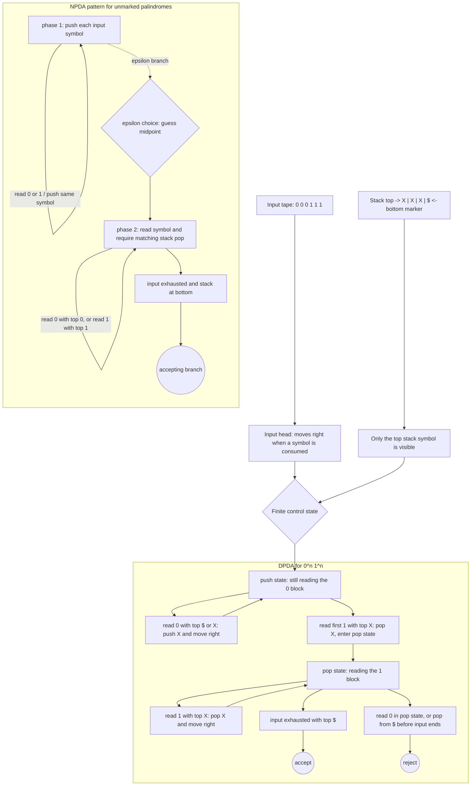

# Pushdown Automata and Deterministic CFLs

A pushdown automaton is a finite automaton equipped with a stack. The stack gives it unbounded last-in-first-out memory, which is exactly the right shape for nested and balanced structure. While a DFA can remember only bounded summaries, a PDA can push markers while reading one part of the input and pop them while reading a corresponding later part.


*Figure: Parse trees make grammar derivations visible as rooted syntax structures. Image: [Wikimedia Commons](https://commons.wikimedia.org/wiki/File:Parse-tree.svg), Martin Thoma, CC BY 3.0.*

Pushdown automata are the machine counterpart of context-free grammars. CFGs generate strings by recursive expansion; PDAs recognize strings by using a stack to manage unfinished obligations. The equivalence between CFGs and PDAs is one of the central bridges of automata theory. Deterministic PDAs form a smaller class with important parsing applications.

## Definitions

A **pushdown automaton**, or **PDA**, is a finite-state machine with an input head and a stack. A transition may read an input symbol or $\epsilon$, inspect the top stack symbol, replace that top symbol by a string of stack symbols, and move to a new state.

One common formal definition uses a 6-tuple $(Q,\Sigma,\Gamma,\delta,q_0,F)$, where $\Gamma$ is the stack alphabet and $\delta$ maps a state, optional input symbol, and optional stack symbol to a set of possible next moves. The exact convention varies, but the computational idea is stable.

A PDA **accepts by final state** if some computation consumes the input and ends in an accepting state. Some definitions use **acceptance by empty stack** instead. For nondeterministic PDAs these conventions are equivalent.

A **deterministic PDA**, or **DPDA**, has at most one legal move from each instantaneous situation and cannot have both an input-consuming move and an epsilon move competing for the same state and stack top. DPDAs recognize the deterministic context-free languages.

A **configuration** of a PDA records the current state, unread input, and stack contents. PDA correctness proofs often reason about configurations and stack invariants.

## Key results

The languages recognized by nondeterministic PDAs are exactly the context-free languages. For CFG to PDA, the stack stores variables and terminals that remain to be matched. The PDA nondeterministically chooses productions for variables and consumes terminals when they match the input. For PDA to CFG, variables describe how the PDA can go from one state to another while balancing stack behavior.

Nondeterminism matters for PDAs more than for finite automata. NFAs and DFAs are equivalent, but NPDAs are strictly more powerful than DPDAs. For example, palindromes over a simple alphabet can be recognized by an NPDA that guesses the midpoint; without an explicit midpoint marker, a DPDA cannot in general know when to switch from pushing to popping.

DCFLs have useful closure properties but not all CFL closure properties. They are closed under complement, which depends on determinism and total halting behavior, but they are not closed under union in the same broad way as CFLs. This asymmetry is important in parsing theory.

In parsing, deterministic context-free behavior is prized because it supports efficient single-path recognition. LR parsing and related methods can be understood as disciplined deterministic stack computation, even though practical parser generators add engineering layers beyond the formal DPDA model.

A PDA stack should be interpreted as a list of obligations. In the language $0^n1^n$, each pushed marker says "one future `1` must appear." In balanced parentheses, each pushed marker says "one future closing parenthesis must match this opening parenthesis." In grammar simulation, the stack contains terminals and variables still to be matched against the unread input. This obligation view makes PDA design more systematic than thinking of the stack as a general-purpose array.

The equivalence between CFGs and PDAs is conceptually two-way. From a grammar to a PDA, the machine begins with the start variable on the stack. If the top is a variable, it nondeterministically replaces it by the right-hand side of a production. If the top is a terminal, it must match and consume the next input symbol. From a PDA to a grammar, variables encode balanced computations that start and end with specified stack behavior. The second direction is more technical, but the common theme is that stack discipline matches recursive syntax.

Acceptance conventions can obscure the main idea if they are mixed carelessly. Acceptance by empty stack emphasizes that all obligations have been discharged. Acceptance by final state emphasizes control-state success after input consumption. For nondeterministic PDAs the two conventions can simulate each other, but for deterministic machines details are more delicate. Always state which convention is being used before proving a construction.

Determinism restricts when a PDA may choose to switch phases. For $0^n1^n$, the first `1` visibly marks the shift from pushing to popping, so a DPDA can recognize the language. For palindromes without a midpoint marker, the shift point is not visible; an NPDA can guess it, but a DPDA cannot generally know it. This is the core reason deterministic context-free languages form a proper subclass of context-free languages.

Parser theory uses deterministic stack behavior because a compiler should not explore exponentially many parses during ordinary syntax analysis. LR-style parsers encode enough finite control to decide which stack action to take from the current state and lookahead. The theory of DPDAs explains why some grammars need rewriting or extra disambiguation before deterministic parsing works.

For PDA traces, write the stack with a consistent convention. Some authors put the top of stack on the left, others on the right. The transition notation is easy to misread unless the convention is fixed. In worked examples, it is often clearer to say "push `X`" and "pop `X`" in words, then reserve formal transition tuples for final specifications.

A PDA can use finite control to remember phases while using the stack for unbounded obligations. In $0^n1^n$, finite control records whether the machine is still reading zeros or has moved to ones. The stack records how many unmatched zeros remain. Both parts are necessary: the stack alone does not prevent a later zero, and finite control alone cannot count. This division of labor is a recurring design pattern.

Deterministic CFLs are especially relevant when an input marker determines the stack phase. The language $\{wcw^R:w\in\{0,1\}^*\}$ is deterministic context-free because the symbol `c` announces the midpoint. The language of unmarked palindromes lacks that signal and needs nondeterministic guessing. This contrast is a good test for whether nondeterminism is being used for convenience or for genuine extra power.
## Visual



The PDA diagram separates finite control, the one-way input head, and the stack interface so the transition labels show exactly what is read, pushed, or popped. The `0^n1^n` DPDA has a visible phase switch at the first `1`, while the palindrome NPDA uses an epsilon branch to guess an unmarked midpoint before comparing symbols against the stack.

| Model | Memory | Language family |
|---|---|---|
| DFA | finite state only | regular |
| NFA | finite state plus branching | regular |
| DPDA | one stack, deterministic moves | deterministic CFL |
| NPDA | one stack plus branching | CFL |
| Turing machine | read-write tape | recursively enumerable or decidable, depending on halting |

## Worked example 1: PDA for $\{0^n1^n:n\ge0\}$

**Problem.** Design a PDA that accepts strings of the form $0^n1^n$.

**Method.** Push one stack marker per `0`, then pop one per `1`.

1. Begin with a bottom marker on the stack.
2. In state `push`, read `0` symbols. For each `0`, push one marker `X`.
3. When the first `1` appears, move to state `pop` and pop one `X`.
4. Continue reading `1` symbols in `pop`, popping one `X` for each.
5. If the input ends and the stack top is the bottom marker, accept.
6. If a `0` appears after entering `pop`, reject because the input is not in block form.
7. If the stack empties too early or has extra `X` markers after input ends, reject.

**Checked answer.** `0011` pushes two markers and pops two markers, then accepts. `001` leaves one marker and rejects. `011` tries to pop too many markers and rejects.

## Worked example 2: Why nondeterminism helps for palindromes

**Problem.** Explain an NPDA for $P=\{ww^R:w\in\{0,1\}^*\}$, the even-length palindromes.

**Method.** Guess the midpoint.

1. In the first phase, read input symbols and push each symbol onto the stack.
2. At any moment, take an epsilon transition to the second phase. This guesses that the midpoint has been reached.
3. In the second phase, read each remaining input symbol.
4. For each read symbol, pop the top stack symbol and require it to match.
5. Accept if the input is consumed exactly when the stack returns to the bottom marker.
6. For `0110`, push `0`, push `1`, guess midpoint, read `1` and pop `1`, read `0` and pop `0`, then accept.
7. For `0100`, no midpoint guess makes all later symbols match the stack, so reject.

**Checked answer.** The NPDA recognizes even palindromes by using nondeterminism to choose the split point, then using the stack to compare the second half against the reverse of the first.

## Code

```python
def accepts_0n1n_pda_style(w):
    stack = ["$"]
    i = 0
    while i < len(w) and w[i] == "0":
        stack.append("X")
        i += 1
    while i < len(w) and w[i] == "1":
        if stack[-1] == "$":
            return False
        stack.pop()
        i += 1
    return i == len(w) and stack == ["$"]

for sample in ["", "01", "0011", "001", "0101"]:
    print(sample, accepts_0n1n_pda_style(sample))
```

## Common pitfalls

- Letting a PDA inspect deep stack contents. Only the top of the stack is directly visible.
- Forgetting that a transition can replace the top stack symbol with several symbols, one symbol, or nothing.
- Assuming DPDA and NPDA power is the same because DFA and NFA power is the same.
- Accepting with unread input remaining. Acceptance by final state still requires the input to be consumed under the standard convention.
- Designing a PDA for $0^n1^n$ that accepts `0101` because it switches between push and pop phases more than once.

## Connections

- The equivalent grammar viewpoint is in [context-free grammars and normal forms](/cs/theory/context-free-grammars-and-normal-forms).
- Pumping limits for CFLs are in [non-context-free languages](/cs/theory/non-context-free-languages).
- Turing machines extend stack memory to tape memory in [Turing machines and the Church-Turing thesis](/cs/theory/turing-machines-and-the-church-turing-thesis).
- Deterministic parsing connects to compiler topics outside this theory sequence.
