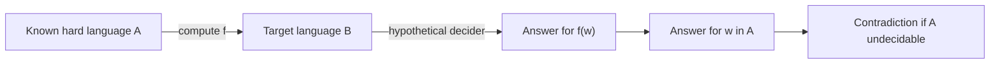

# Reductions and the Recursion Theorem

Reductions are the main transport mechanism for impossibility results. Instead of proving every undecidable problem from scratch by diagonalization, we transform known hard instances into new instances. If a solver for the new problem would give a solver for the old problem, then the new problem cannot be decidable.

The recursion theorem deepens the same theme of self-reference. It says, roughly, that a Turing machine can obtain and use its own description. This formalizes self-reproducing and self-aware constructions without relying on informal paradoxes. Together, reductions and self-reference explain why many semantic program questions are beyond total algorithmic decision.

## Definitions

A **mapping reduction** from language $A$ to language $B$, written $A\le_m B$, is a computable function $f$ such that for every string $w$, $w\in A$ if and only if $f(w)\in B$.

A **computable function** is a function on strings whose output is produced by some Turing machine that halts on every input.

A language $B$ is **undecidable by reduction** if a known undecidable language $A$ maps to $B$. If $B$ were decidable, then deciding $A$ would be possible by computing $f(w)$ and running the decider for $B$.

A **many-one reduction** is another name for mapping reduction. It converts one instance into one instance and then uses only the final yes-or-no answer.

The **recursion theorem** states that for any computable transformation $t$ that maps machine descriptions to machine descriptions, there is a Turing machine $R$ whose behavior is the behavior of the machine described by $t(\langle R\rangle)$. Informally, programs can be constructed with access to their own descriptions.

## Key results

Mapping reductions preserve decidability downward. If $A\le_m B$ and $B$ is decidable, then $A$ is decidable. The contrapositive is the common use: if $A$ is undecidable and $A\le_m B$, then $B$ is undecidable.

Mapping reductions also preserve recognizability downward. If $A\le_m B$ and $B$ is recognizable, then $A$ is recognizable. The recognizer for $A$ computes $f(w)$ and runs the recognizer for $B$. Contrapositives involving nonrecognizability are often useful.

Many language-theory problems are undecidable by reductions from $A_{TM}$ or $HALT_{TM}$. Examples include emptiness of Turing-machine languages, equivalence of Turing-machine languages, and ambiguity or equality questions for sufficiently expressive grammar systems. The construction usually embeds one computation question into the behavior of a new machine or grammar.

The recursion theorem gives rigorous self-reference. It can prove the existence of machines that print their own descriptions, machines that refer to their own code inside a reduction, and fixed points for computable program transformations. It supports the idea that self-referential programs are not loopholes in the formal model; they are part of it.

A reduction proof should be readable as an algorithm plus two lemmas. The algorithm takes an arbitrary source instance and produces a target instance. The first lemma proves that yes source instances become yes target instances. The second lemma proves that no source instances become no target instances. If the target property is about a constructed machine, these lemmas usually analyze what that machine does in the cases where the original machine accepts, rejects, or loops.

For undecidability, the reduction function may perform extensive syntactic construction, but it may not solve the source problem along the way. When reducing from $A_{TM}$, the function can write code for a new machine that simulates $M$ on $w$ later. It cannot first determine whether $M$ accepts $w$ and then choose an output accordingly, because that would already solve the undecidable problem. This distinction between building a simulator and knowing its outcome is essential.

Mapping reductions are stricter than Turing reductions. A mapping reduction gets one transformed instance and then uses the target answer directly. A Turing reduction may ask multiple adaptive oracle questions. Sipser's core development emphasizes mapping reductions because they are simple, composable, and strong enough for many undecidability and NP-completeness proofs. Later advanced topics may use broader reducibility notions.

Self-reference through the recursion theorem is often surprising because it removes the need for informal "this program reads its own file" assumptions. The theorem says that for any computable way of transforming program descriptions, some program is a fixed point of that transformation. This is a formal version of a quine, but it is also a proof tool. It lets machines refer to their own descriptions inside diagonal arguments without smuggling in an external naming mechanism.

In language-theory undecidability, reductions often build machines whose languages have a property exactly when the source computation behaves a certain way. For emptiness, the machine may accept everything if $M$ accepts $w$ and nothing otherwise. For equivalence, two machines may be constructed to differ only in the accepting case. For grammar-related problems, computation histories can be encoded so that a grammar generates invalid histories, making validity equivalent to a computation question.

It is useful to classify reductions by what the constructed object does on irrelevant inputs. In the $A_{TM}$ to nonemptiness reduction, the new machine ignores its own input entirely. That is allowed because the target property is about whether the language has at least one string. For other target properties, irrelevant inputs may need careful behavior. For equivalence, the constructed machines must agree in one case and disagree in the other. For universality, the constructed machine may accept all strings exactly in the accepting case.

Reduction functions manipulate descriptions, not running computations. A reduction can output a machine that contains the code of $M$ and the literal string $w$ embedded inside it. This is a finite syntactic operation, so it halts even if $M$ would loop on $w$. The later behavior of the constructed machine carries the undecidable information into the target instance.

The recursion theorem is not needed for every self-reference proof, but it clarifies why self-reference is legitimate. In informal programming, a program can sometimes read its own source file, but file systems are not part of the Turing-machine model. The recursion theorem gives an internal mechanism: for computable transformations on descriptions, fixed-point machines exist. That is the formal basis for quines and for deeper undecidability constructions involving machines that know their own descriptions.
## Visual



| Goal | Reduction setup | Conclusion |
|---|---|---|
| prove $B$ undecidable | $A_{TM}\le_m B$ | a decider for $B$ would decide $A_{TM}$ |
| prove $B$ not recognizable | $\overline{A_{TM}}\le_m B$ | a recognizer for $B$ would recognize $\overline{A_{TM}}$ |
| prove complexity hardness | known hard $A\le_p B$ | efficient solver for $B$ gives efficient solver for $A$ |
| use recursion theorem | machine accesses own description | self-reference becomes formal |

## Worked example 1: Reducing $A_{TM}$ to TM emptiness complement

**Problem.** Let $NE_{TM}=\{\langle M\rangle:L(M)\ne\emptyset\}$. Show that $A_{TM}\le_m NE_{TM}$.

**Method.** Given $\langle M,w\rangle$, build a machine $N$ whose language is nonempty exactly when $M$ accepts $w$.

1. Input to the reduction is $\langle M,w\rangle$.
2. Construct machine $N$ as follows: on any input $x$, ignore $x$ and simulate $M$ on $w$.
3. If $M$ accepts $w$, then $N$ accepts $x$.
4. If $M$ rejects or loops on $w$, then $N$ does not accept $x$.
5. If $M$ accepts $w$, then $N$ accepts every input, so $L(N)\ne\emptyset$.
6. If $M$ does not accept $w$, then $N$ accepts no input, so $L(N)=\emptyset$.

**Checked answer.** The computable map $\langle M,w\rangle\mapsto\langle N\rangle$ satisfies $\langle M,w\rangle\in A_{TM}$ exactly when $\langle N\rangle\in NE_{TM}$.

## Worked example 2: A self-printing program idea

**Problem.** Explain the recursion-theorem idea behind a program that prints its own description.

**Method.** Use a computable transformation that inserts a description into a printer.

1. Define a computable transformation $t(x)$ that returns the description of a program $P_x$.
2. Program $P_x$ ignores its input and prints the string $x$.
3. The recursion theorem gives a machine $R$ whose behavior is the behavior of $P_{\langle R\rangle}$.
4. Therefore $R$ ignores its input and prints $\langle R\rangle$.
5. No infinite regress is needed; the theorem supplies a fixed point of the transformation.

**Checked answer.** The existence of a self-printing machine follows from the recursion theorem as a fixed point of a computable program transformer.

## Code

```python
def mapping_reduction_A_to_NE(M_accepts_w):
    # This is a Python analogy of the construction:
    # build N_x that ignores x and accepts iff M accepts w.
    def N(x):
        return M_accepts_w()
    return N

def sample_M_accepts_w():
    return True

N = mapping_reduction_A_to_NE(sample_M_accepts_w)
print(N("anything"))
```

## Common pitfalls

- Reducing in the wrong direction. To prove $B$ hard, reduce a known hard problem to $B$, not $B$ to the known hard problem.
- Building a function that is not total. A mapping reduction must halt and output an instance for every input.
- Preserving only one implication. Mapping reductions require $w\in A$ if and only if $f(w)\in B$.
- Assuming the target problem's decider exists in the construction itself. The reduction must compute instances without using the hypothetical decider.
- Treating the recursion theorem as a programming trick only. It is a theorem about fixed points of computable transformations.

## Connections

- The source undecidable languages are in [decidability and the halting problem](/cs/theory/decidability-and-the-halting-problem).
- Encodings and computable functions rely on [Turing machines and the Church-Turing thesis](/cs/theory/turing-machines-and-the-church-turing-thesis).
- Polynomial-time reductions appear in [NP-completeness and classic reductions](/cs/theory/np-completeness-and-classic-reductions).
- Space-bounded reductions matter in [space complexity](/cs/theory/space-complexity).
