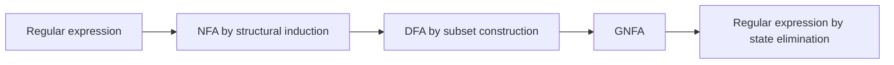

# Regular Expressions and Nonregularity

Regular expressions give an algebraic notation for regular languages. They describe languages from atomic pieces using union, concatenation, and star. In practice, regex syntax in programming languages includes many extensions, but the mathematical core is deliberately small. That small core is exactly equivalent to finite automata.


*Figure: Parse trees make grammar derivations visible as rooted syntax structures. Image: [Wikimedia Commons](https://commons.wikimedia.org/wiki/File:Parse-tree.svg), Martin Thoma, CC BY 3.0.*

The same chapter of the theory also introduces nonregularity. Once we know many languages are regular, we need a principled way to show that some are not. The pumping lemma is the standard first tool. It proves that every regular language has a finite-memory repetition property, then shows that certain languages violate it.

## Definitions

A **regular expression** over alphabet $\Sigma$ is defined recursively. The expressions $\emptyset$, $\epsilon$, and each symbol $a\in\Sigma$ are regular expressions. If $R$ and $S$ are regular expressions, then $(R\cup S)$, $(RS)$, and $(R^*)$ are regular expressions.

The **language of a regular expression** is defined by the same recursion. $\emptyset$ denotes no strings, $\epsilon$ denotes the language containing only the empty string, and $a$ denotes the language containing the one-character string $a$. Union, concatenation, and star have their language-operation meanings.

A **generalized nondeterministic finite automaton**, or **GNFA**, labels transitions by regular expressions rather than single symbols. State elimination converts a GNFA to one regular expression by removing states while preserving the language of paths from the start to the accept state.

A language is **nonregular** if no DFA, NFA, or regular expression recognizes it. Because these three formalisms are equivalent, ruling out one rules out all.

The **pumping lemma for regular languages** says that if $A$ is regular, then there is a pumping length $p$ such that any string $s\in A$ with $\vert s\vert \ge p$ can be split as $s=xyz$ satisfying $\vert xy\vert \le p$, $\vert y\vert \gt 0$, and $xy^iz\in A$ for every $i\ge0$.

## Key results

Regular expressions and finite automata are equivalent. To convert a regular expression to an NFA, use structural induction: atomic expressions have tiny NFAs, union uses epsilon branching, concatenation links final states to the next start, and star adds loops and an accepting empty path. To convert an automaton to a regular expression, use state elimination or an equivalent dynamic-programming construction.

The pumping lemma is a necessary condition for regularity, not a characterization. Every regular language pumps, but some nonregular languages may still have pumpable strings or even satisfy variants of pumping behavior. Therefore the lemma is mainly a proof-by-contradiction tool for showing nonregularity.

The structure of a pumping proof is rigid. Assume the target language is regular and let $p$ be its pumping length. Choose a string $s$ in the language with length at least $p$. Consider an arbitrary split $s=xyz$ satisfying the pumping constraints. Show that some pump value, often $i=0$ or $i=2$, produces a string outside the language. Because the split was arbitrary, no valid pumping split exists.

Closure properties can also prove nonregularity. If a target language were regular, intersecting it with a carefully chosen regular language or applying a homomorphism might produce a known nonregular language. This strategy becomes more powerful after reductions are introduced.

Regular expressions are syntax trees. The expression $(0\cup1)^*01$ is not merely a string of symbols; it has a root concatenation, a starred subexpression, and two literal leaves. Structural induction on that tree is the natural way to prove things about all regular expressions. For example, the regex-to-NFA conversion proves one case for $\emptyset$, one for $\epsilon$, one for a literal, and then one case each for union, concatenation, and star.

The GNFA state-elimination formula is a compact way to preserve all paths through a removed state. If a state $r$ is removed, and there are remaining states $i$ and $j$, the new label from $i$ to $j$ becomes the old direct label plus the paths that go from $i$ to $r$, loop around $r$ any number of times, and then go from $r$ to $j$. Algebraically this is $R_{ij}\cup R_{ir}(R_{rr})^*R_{rj}$. The formula is less important than the path idea: no accepted string should be lost or added when the state disappears.

Pumping proofs are adversarial. You choose the pumping string after seeing only the pumping length, but an adversary chooses the split subject to the constraints. Therefore the chosen string should force every legal $y$ into a region whose repetition breaks the language. For $0^p1^p$, the constraint $\vert xy\vert \le p$ traps $y$ inside the zeros. For more complicated languages, the hardest part is designing a string that traps the pumpable pieces.

The pumping lemma also explains why finite memory implies repetition. A DFA reading a long enough string must visit some state twice while processing an early segment. The substring read between the two visits can be repeated or removed because the machine returns to the same state. This is the machine-level reason behind the algebraic split $s=xyz$. Understanding that reason makes the lemma easier to adapt and prevents treating it as a black-box ritual.

When a pumping proof becomes messy, closure may simplify it. Intersect the suspected language with a regular language that isolates a clean pattern, or apply a homomorphism that erases irrelevant symbols. Because regular languages are closed under these operations, a contradiction against a known nonregular language transfers back to the original target.

Algebraic identities for regular expressions are helpful but should be used semantically. For instance, $R\emptyset=\emptyset$, $R\epsilon=R$, and $R\cup R=R$ are true because the denoted languages are equal. Operator precedence is normally star before concatenation before union, but adding parentheses avoids ambiguity in handwritten solutions. When converting to automata, the parse tree induced by those parentheses determines the construction order.

Some languages look nonregular only because they are described awkwardly. "Binary strings whose numeric value is divisible by 3" is regular because a DFA can store the value modulo 3 while scanning bits. "Strings with the same number of zeros and ones" is not regular because the difference can grow without bound. The key question is whether all future-relevant information fits into finitely many summaries.

For pumping, the chosen string should be simple enough that the constraints force the pumpable part into a known region. If a language has several cases, choose a string lying deep inside one case so that pumping cannot escape into another valid case. If the language includes short exceptions, choose a string much longer than the pumping length. The proof should not depend on knowing the exact value of $p$, only on using it to construct a sufficiently long witness.
## Visual



| Regex | Language | Notes |
|---|---|---|
| `0*` | any number of zeros | includes $\epsilon$ |
| `(0 union 1)*` | all binary strings | written algebraically as $(0\cup1)^*$ |
| `(0 union 1)*01` | strings ending in `01` | arbitrary prefix, fixed suffix |
| `0*1*` | zeros followed by ones | counts need not match |
| `emptyset*` | $\{\epsilon\}$ | zero repetitions are allowed |

## Worked example 1: Designing a regular expression

**Problem.** Find a regular expression for binary strings that contain at least one `1` and end in `00`.

**Method.** Separate the required final suffix from the earlier requirement.

1. Ending in `00` means every accepted string has form $x00$ for some binary string $x$.
2. The string must contain at least one `1`. That `1` could be in $x$, since the final suffix has only zeros.
3. A binary string with at least one `1` can be written $(0\cup1)^*1(0\cup1)^*$.
4. Appending the fixed suffix gives $(0\cup1)^*1(0\cup1)^*00$.
5. Test `100`: choose the first `1`, then empty middle, then `00`; accepted.
6. Test `000`: no `1` can be matched; rejected.
7. Test `10100`: choose the first or second `1`; accepted.

**Checked answer.** A correct expression is $(0\cup1)^*1(0\cup1)^*00$. It enforces both the existence of a `1` and the final suffix.

## Worked example 2: Pumping $\{0^n1^n:n\ge0\}$

**Problem.** Prove that $L=\{0^n1^n:n\ge0\}$ is not regular.

**Method.** Use the pumping lemma by contradiction.

1. Assume $L$ is regular. Let $p$ be the pumping length.
2. Choose $s=0^p1^p$, which is in $L$ and has length at least $p$.
3. Let $s=xyz$ be any split with $\vert xy\vert \le p$ and $\vert y\vert \gt 0$.
4. Since the first $p$ symbols of $s$ are all zeros, both $x$ and $y$ lie within the block of zeros. Thus $y=0^k$ for some $k\gt 0$.
5. Pump down with $i=0$. The string becomes $xz=0^{p-k}1^p$.
6. This string has fewer zeros than ones, so it is not in $L$.

**Checked answer.** Every permitted split fails when pumped down. This contradicts the pumping lemma, so $L$ is nonregular.

## Code

```python
def regex_like_ends_with_00_and_has_1(w):
    return w.endswith("00") and "1" in w

def in_0n1n(w):
    zeros = 0
    while zeros < len(w) and w[zeros] == "0":
        zeros += 1
    ones = len(w) - zeros
    return w == "0" * zeros + "1" * ones and zeros == ones

for sample in ["100", "000", "0011", "000111", "00111"]:
    print(sample, regex_like_ends_with_00_and_has_1(sample), in_0n1n(sample))
```

## Common pitfalls

- Confusing mathematical regular expressions with full programming-language regex features such as backreferences. Backreferences can exceed regular power.
- Forgetting that star allows zero repetitions, so $R^*$ always contains $\epsilon$.
- Using the pumping lemma backward. Showing one string pumps does not prove regularity.
- Choosing a pumping string not in the language. The lemma applies only to strings in the assumed regular language.
- Picking one convenient split in a nonregularity proof. You must handle every split satisfying the pumping constraints.

## Connections

- NFA constructions for regex operators are in [nondeterminism and closure](/cs/theory/nondeterminism-and-closure).
- DFA memory limitations are introduced in [finite automata and DFAs](/cs/theory/finite-automata-and-dfas).
- Context-free grammars recognize $\{0^n1^n:n\ge0\}$ in [context-free grammars and normal forms](/cs/theory/context-free-grammars-and-normal-forms).
- Pumping for CFLs appears in [non-context-free languages](/cs/theory/non-context-free-languages).
