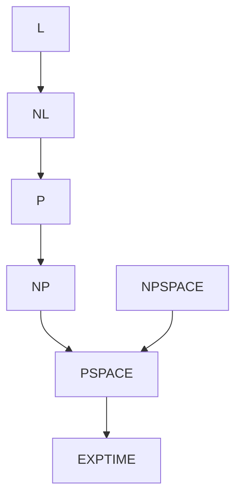

# Space Complexity

Space complexity measures working memory rather than time. A computation may run for many steps while using only a small amount of storage, and nondeterministic choices can sometimes be simulated with surprisingly little extra space. Space classes are central for graph reachability, quantified Boolean formulas, games, and memory-limited computation.

The main classes in the introductory theory sequence are PSPACE, NPSPACE, L, and NL. Savitch's theorem relates deterministic and nondeterministic space by showing that nondeterministic space can be simulated deterministically with only a quadratic space blowup. This is one of the most striking contrasts with time complexity, where no analogous proof is known for P and NP.

## Definitions

For a Turing machine, **space usage** counts the number of tape cells used on the work tapes as a function of input length. Read-only input tape cells are often excluded in multi-tape definitions so sublinear space classes make sense.

The class **PSPACE** is the set of languages decidable using polynomial space. Time may be exponential, because a polynomial-space machine has exponentially many possible configurations.

The class **NPSPACE** is the nondeterministic version of PSPACE. A nondeterministic machine accepts if some branch accepts while using polynomial space.

**Savitch's theorem** states that for $s(n)\ge\log n$, $\mathrm{NSPACE}(s(n))\subseteq \mathrm{DSPACE}(s(n)^2)$. In particular, PSPACE equals NPSPACE.

The class **L** contains languages decidable in deterministic logarithmic space. The class **NL** contains languages decidable in nondeterministic logarithmic space.

A problem is **NL-complete** if it is in NL and every language in NL reduces to it under log-space reductions. Directed reachability, often called `PATH`, is the standard NL-complete problem.

## Key results

PSPACE contains P and NP because polynomial-time computations can visit only polynomially many tape cells. PSPACE is contained in EXPTIME because a polynomial-space deterministic computation has at most exponentially many configurations; if it runs longer without halting, a configuration repeats.

Savitch's theorem proves PSPACE equals NPSPACE. The key recursive procedure asks whether configuration $c_2$ is reachable from configuration $c_1$ within at most $t$ steps by guessing or iterating over a midpoint configuration $m$ and recursively checking reachability from $c_1$ to $m$ and from $m$ to $c_2$ within $t/2$ steps. Reusing space across recursive calls keeps space quadratic.

TQBF, the problem of deciding true quantified Boolean formulas, is PSPACE-complete. The formula may alternate existential and universal quantifiers, naturally matching game-tree or alternating computation. A depth-first recursive evaluator uses polynomial space because it stores only one branch at a time.

Directed reachability is NL-complete. It is in NL because a nondeterministic log-space machine can store the current vertex and a step counter, guessing the next vertex at each step. Hardness comes from encoding configurations of any NL computation as graph vertices.

Space complexity is sensitive to what is counted. If the input tape were counted as working space, then no algorithm reading an input of length $n$ could use less than $n$ space. To study logarithmic space, the standard model gives the machine a read-only input tape, one or more work tapes whose used cells are counted, and sometimes a write-only output tape for reductions. The machine may scan the input many times while storing only small summaries.

Configuration graphs explain many space results. A machine using $s(n)$ space has only exponentially many configurations in $s(n)$ because a configuration records state, head positions, and work-tape contents. Nondeterministic acceptance becomes graph reachability in this configuration graph. Savitch's theorem solves reachability recursively without storing the whole graph, trading time for space.

The recursive reachability idea in Savitch's theorem is worth internalizing. To decide whether $c_2$ is reachable from $c_1$ within $t$ steps, try every possible midpoint configuration $m$ and check whether $c_1$ reaches $m$ within $t/2$ steps and $m$ reaches $c_2$ within $t/2$ steps. The recursion depth is logarithmic in $t$, and each level stores only a constant number of configurations. Since each configuration uses $O(s(n))$ space, the total is $O(s(n)^2)$ under the usual bounds.

PSPACE-complete problems often involve alternating choices. TQBF alternates existential and universal quantifiers. Games alternate moves between players. An existential quantifier asks whether some move works; a universal quantifier asks whether all opponent responses can be handled. A depth-first evaluation may explore an exponential game tree, but it stores only the current path and current subformula, so polynomial space suffices.

Log-space reductions are stricter than polynomial-time reductions because the reduction itself must not use enough memory to solve the problem outright. They are used for completeness inside small space classes such as NL. Directed reachability is NL-complete because an NL machine's configurations form a graph of polynomial size, and a log-space transducer can output or query the relevant adjacency structure using only small counters and local recomputation.

The theorem NL equals coNL, proved by Immerman and Szelepcsenyi, is another surprising space result. It says nondeterministic log-space can decide nonreachability as well as reachability. The proof is beyond the basic page, but the result warns against assuming nondeterministic space behaves like nondeterministic time.

Space bounds can allow repeated recomputation. A log-space algorithm may scan the input many times and recompute local facts instead of storing them. This is why time and space should not be conflated. Saving space often costs time, and Savitch's theorem is an extreme example: it reduces nondeterministic space to deterministic space by recursively recomputing reachability information rather than storing a visited set.

For PSPACE, the accepting computation may be exponentially long, but a depth-first search through possibilities can reuse memory after returning from a branch. This is exactly what happens when evaluating TQBF. The algorithm tries truth values recursively; after finishing one branch, it discards that branch's local assignment and tries the next. The recursion stack has depth at most the number of variables, so the space is polynomial.

In NL, nondeterminism supplies a path certificate one vertex at a time. The machine does not need to store the whole path; it only stores the current vertex and a counter. If a guessed path is wrong, that branch rejects. If a path exists, one branch guesses it. This is the same existential flavor as NP, but with a much smaller storage budget and no need to write down the entire certificate at once.
## Visual



| Class | Resource | Canonical problem |
|---|---|---|
| L | deterministic $O(\log n)$ space | deterministic graph tasks |
| NL | nondeterministic $O(\log n)$ space | directed reachability |
| P | polynomial time | shortest paths, matching |
| NP | nondeterministic polynomial time | SAT |
| PSPACE | polynomial space | TQBF, generalized games |

## Worked example 1: Log-space reachability certificate

**Problem.** Show why directed reachability is in NL.

**Method.** Store only the current vertex and a counter.

1. Input is $\langle G,s,t\rangle$ with $n$ vertices.
2. A nondeterministic machine stores the current vertex, initially $s$.
3. It also stores a counter from $0$ to $n-1$ to prevent paths longer than necessary.
4. At each step, if the current vertex is $t$, accept.
5. Otherwise nondeterministically choose an outgoing neighbor and update the current vertex.
6. Increment the counter. If the counter reaches $n$ without seeing $t$, reject that branch.
7. Storing a vertex name and counter needs $O(\log n)$ bits each.

**Checked answer.** If a path exists, some branch guesses it and accepts. If no path exists, every branch fails within $n-1$ edge moves. Thus `PATH` is in NL.

## Worked example 2: Evaluating a quantified formula in polynomial space

**Problem.** Evaluate $\exists x\,\forall y\,((x\lor y)\land(\neg x\lor y))$.

**Method.** Work from the quantifiers inward.

1. The matrix is $(x\lor y)\land(\neg x\lor y)$.
2. Try $x=\text{true}$. Then the matrix becomes $(\text{true}\lor y)\land(\text{false}\lor y)$, which simplifies to $\text{true}\land y$, or $y$.
3. The universal quantifier over $y$ asks whether $y$ is true for both values of $y$. It is false when $y=\text{false}$.
4. Try $x=\text{false}$. The matrix becomes $(\text{false}\lor y)\land(\text{true}\lor y)$, which also simplifies to $y$.
5. Again, $\forall y\, y$ is false.
6. No existential choice for $x$ makes the universal condition true.

**Checked answer.** The quantified formula is false. A recursive evaluator needs to store only the current partial assignment and recursion depth, both polynomial in formula size.

## Code

```python
def reachable_nondet_style(graph, start, target):
    # Deterministic BFS here checks the same reachability relation.
    seen = {start}
    frontier = [start]
    while frontier:
        v = frontier.pop()
        if v == target:
            return True
        for w in graph.get(v, []):
            if w not in seen:
                seen.add(w)
                frontier.append(w)
    return False

G = {"a": ["b", "d"], "b": ["c"], "c": [], "d": ["c"]}
print(reachable_nondet_style(G, "a", "c"))
```

## Common pitfalls

- Counting input tape space against log-space algorithms. Standard definitions use a read-only input tape and count work space.
- Assuming polynomial space means polynomial time. A polynomial-space machine may run exponentially long.
- Believing NPSPACE is larger than PSPACE by analogy with NP and P. Savitch's theorem collapses them at polynomial space.
- Forgetting that NL computations need a step bound to avoid cycling forever.
- Treating PSPACE-complete games as ordinary finite games without considering input-scaled board size.

## Connections

- Time classes are introduced in [time complexity, P, and NP](/cs/theory/time-complexity-p-and-np).
- NP-complete reductions are covered in [NP-completeness and classic reductions](/cs/theory/np-completeness-and-classic-reductions).
- Advanced hierarchy and interactive proof results are surveyed in [advanced complexity topics](/cs/theory/advanced-complexity-topics).
- Configuration graphs rely on Turing-machine definitions from [Turing machines and the Church-Turing thesis](/cs/theory/turing-machines-and-the-church-turing-thesis).
