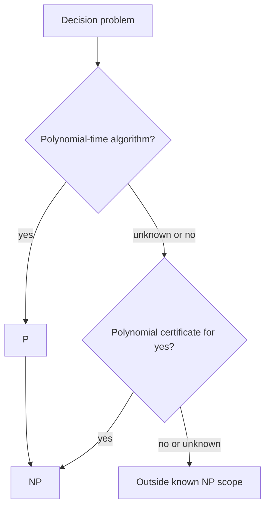

# Time Complexity, P, and NP

Computability asks whether a problem can be solved at all. Complexity asks whether it can be solved within a reasonable resource bound. Time complexity measures how the number of computation steps grows with input length. This shifts attention from possible to feasible, and from isolated algorithms to classes of problems.

The classes P and NP are the center of introductory complexity theory. P contains decision problems solvable in polynomial time. NP contains decision problems whose yes-instances have polynomial-size certificates verifiable in polynomial time, equivalently decidable by nondeterministic polynomial-time Turing machines. The unresolved question $P$ versus $NP$ asks whether efficient verification always implies efficient solution.

## Definitions

For a deterministic Turing machine $M$, the **running time** $t(n)$ is the maximum number of steps $M$ uses on any input of length $n$. Worst-case time is the standard measure unless another measure is stated.

Big-O notation $f(n)=O(g(n))$ means there exist constants $c$ and $n_0$ such that $0\le f(n)\le c g(n)$ for all $n\ge n_0$. It suppresses constant factors and lower-order terms.

The class **P** is the set of languages decidable by deterministic Turing machines in time $n^k$ for some constant $k$.

The class **NP** is the set of languages for which membership has polynomial-time verification. A language $A$ is in NP if there is a polynomial-time verifier $V$ and polynomial $p$ such that $w\in A$ exactly when there exists a certificate $c$ with $\vert c\vert \le p(\vert w\vert )$ and $V(w,c)$ accepts.

A **nondeterministic polynomial-time** machine accepts if some branch accepts within polynomial time. This is equivalent to verifier-based NP: the accepting branch choices can be encoded as a certificate.

## Key results

P is contained in NP. If a language can be decided in polynomial time, a verifier can ignore the certificate and run the decider. The hard question is whether NP is contained in P. No proof of equality or separation is known.

Polynomial time is robust across reasonable deterministic models. Single-tape and multitape Turing machines may differ polynomially, but not exponentially for standard simulations. This is one reason P is treated as a model-independent notion of feasible exact computation.

Many natural problems lie in NP because proposed solutions are easy to check. A Hamiltonian path can be verified by checking a listed vertex order. A satisfying assignment can be verified by evaluating the formula. A clique certificate is a set of vertices whose pairwise adjacency can be checked.

Not every decidable problem is known or expected to be in NP. NP concerns short certificates for yes-instances. Problems requiring universal reasoning, game strategies, or exponentially long witnesses often land in classes such as coNP, PSPACE, or EXPTIME.

The input length convention is central. If an integer $N$ is written in binary, its input length is about $\log_2 N$, not $N$. An algorithm that loops from $1$ to $N$ is therefore exponential in the length of the binary input. This is why primality, factoring, and subset-sum-style problems must be analyzed with respect to encoded length. Complexity theory measures resources as functions of the size of the representation given to the machine.

Worst-case analysis deliberately ignores how often hard inputs occur. A polynomial-time algorithm must halt quickly on every input of length $n$. This makes the theory robust and compositional: if a subroutine has a polynomial worst-case bound and is called polynomially many times, the result remains polynomial. Average-case and smoothed analyses are important but require probability distributions over inputs, which are not part of the basic P and NP definitions.

The verifier definition of NP is often the easiest to use. To show a problem is in NP, do not try to solve it. State what a certificate looks like, prove its length is polynomial in the input length, and give a deterministic polynomial-time verifier. For graph problems the certificate is often a set or ordering of vertices. For SAT it is a truth assignment. For arithmetic problems it may be a set of selected indices, but the bit lengths of the numbers must be included in the analysis.

Nondeterministic polynomial time is equivalent to polynomial verification because a nondeterministic machine's accepting choices can be written as a certificate. Conversely, a nondeterministic machine can guess the certificate and run the verifier. This equivalence is one of the reasons NP is a stable class rather than a quirk of a particular machine definition.

The statement $P\subseteq NP$ is easy, but the open question concerns whether every efficiently checkable certificate can be found or avoided efficiently. If $P=NP$, optimization, search, theorem proving, and cryptography would be affected deeply, although real-world consequences would depend on polynomial degrees and constants. If $P\ne NP$, then at least one NP problem lacks a polynomial-time algorithm, and NP-complete problems all lack one.

When giving time bounds, be explicit about the machine model only when it matters. For high-level algorithms, it is usually enough to argue that operations on encoded objects can be implemented in polynomial time. For fine-grained complexity, a random-access machine and a single-tape Turing machine may differ too much, but introductory P/NP theory tolerates polynomial changes.

Polynomial-time reductions are the comparison language of NP. They are strong enough to preserve efficient solvability: if $A\le_p B$ and $B\in P$, then $A\in P$. They are weak enough to be meaningful: the reduction itself cannot spend exponential time solving $A$ and then outputting a trivial yes or no instance of $B$. This balance is why reductions are used to define NP-hardness.

Search and decision are closely related but not identical in the definitions. NP is defined for decision languages because yes/no membership is mathematically clean. Many search problems can be solved with polynomially many calls to a decision oracle. For example, if SAT were decidable in polynomial time, a satisfying assignment could be found by fixing variables one by one and asking whether the remaining formula is still satisfiable. This is one reason decision NP-completeness has consequences for finding solutions.

The verifier view also explains why coNP is different. For an unsatisfiable formula, a short certificate of unsatisfiability is not known in general. The class coNP contains complements of NP languages, and whether NP equals coNP is also open. If NP-complete problems had short certificates for both yes and no instances in the right way, major collapses in complexity theory would follow. Thus "easy to check yes" should not be silently converted into "easy to check no."

When analyzing algorithms, separate input parsing, main computation, and output. A graph algorithm may be polynomial in vertices and edges, but the encoded input length depends on the representation. An adjacency matrix has size $n^2$, while an adjacency list has size closer to $n+m$. Both are polynomially related for simple graphs, so P membership is unaffected, but precise time bounds should state the representation.
## Visual



| Problem | In P? | In NP? | Certificate idea |
|---|---|---|---|
| graph reachability | yes | yes | path, though not needed |
| primality | yes | yes | modern algorithms decide directly |
| SAT | unknown | yes | truth assignment |
| CLIQUE | unknown | yes | vertex subset |
| HAMPATH | unknown | yes | ordered list of vertices |

## Worked example 1: Big-O comparison

**Problem.** Prove that $3n^2+20n+7=O(n^2)$.

**Method.** Find constants $c$ and $n_0$.

1. For $n\ge1$, we have $20n\le20n^2$.
2. For $n\ge1$, we have $7\le7n^2$.
3. Therefore
   $$3n^2+20n+7\le3n^2+20n^2+7n^2=30n^2.$$
4. Choose $c=30$ and $n_0=1$.
5. The definition of Big-O is satisfied.

**Checked answer.** $3n^2+20n+7=O(n^2)$. The constants are not unique; any larger $c$ or $n_0$ would also work.

## Worked example 2: Showing HAMPATH is in NP

**Problem.** Show that the Hamiltonian path problem is in NP.

**Method.** Provide a polynomial-time verifier.

1. Input is a graph $G=(V,E)$ with $n$ vertices and two distinguished vertices $s,t$, depending on the version.
2. Certificate is an ordered list $(v_1,\ldots,v_n)$ of vertices.
3. Verify that $v_1=s$ and $v_n=t$ when endpoints are specified.
4. Verify that every vertex of $G$ appears exactly once in the list.
5. For each adjacent pair $(v_i,v_{i+1})$, check that the edge exists in $E$.
6. There are $n-1$ edge checks and polynomial bookkeeping for duplicates.

**Checked answer.** A correct Hamiltonian path list is a polynomial-size certificate, and the verifier runs in polynomial time. Therefore HAMPATH is in NP.

## Code

```python
def verify_clique(vertices, edges, certificate, k):
    chosen = list(certificate)
    if len(chosen) != k or len(set(chosen)) != k:
        return False
    if any(v not in vertices for v in chosen):
        return False
    edge_set = {tuple(sorted(e)) for e in edges}
    for i in range(k):
        for j in range(i + 1, k):
            if tuple(sorted((chosen[i], chosen[j]))) not in edge_set:
                return False
    return True

V = {"a", "b", "c", "d"}
E = {("a", "b"), ("a", "c"), ("b", "c"), ("c", "d")}
print(verify_clique(V, E, ["a", "b", "c"], 3))
```

## Common pitfalls

- Confusing polynomial with small. $n^{20}$ is polynomial but may be impractical.
- Treating NP as "not polynomial." NP means nondeterministic polynomial time, not non-polynomial.
- Providing a certificate that may be exponentially long. NP certificates must have polynomial length.
- Verifying no-instances instead of yes-instances. NP is about existential certificates for membership.
- Ignoring encoding length. Numeric values written in binary have length logarithmic in their magnitude.

## Connections

- Turing-machine robustness is discussed in [Turing machine variants and decidable problems](/cs/theory/turing-machine-variants-and-decidable-problems).
- NP-completeness is developed in [NP-completeness and classic reductions](/cs/theory/np-completeness-and-classic-reductions).
- PSPACE and log-space classes appear in [space complexity](/cs/theory/space-complexity).
- Randomized polynomial time is surveyed in [advanced complexity topics](/cs/theory/advanced-complexity-topics).
