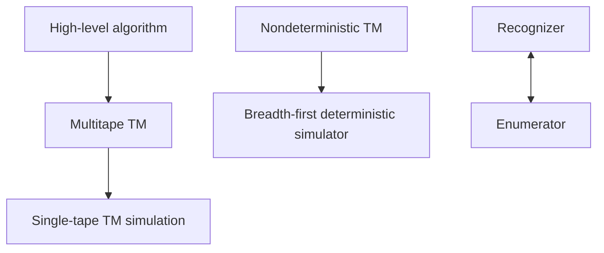

# Turing Machine Variants and Decidable Problems

The basic Turing machine model is deliberately minimal, so it is natural to ask whether more convenient versions compute more languages. Multitape machines, nondeterministic machines, enumerators, and high-level algorithms all look stronger or more natural. For decidability, these variants are equivalent to the basic model.


*Figure: Alan Turing's work on computation and undecidability frames the theory section. Image: [Wikimedia Commons](https://commons.wikimedia.org/wiki/File:Alan_Turing_Aged_16.jpg), Unknown photographer, public domain.*

This equivalence matters because it lets us write algorithms at a sensible level without changing what is computable. When proving decidability of automata and grammar questions, we can describe graph searches, table-filling algorithms, and simulations. A formal single-tape Turing machine could implement them, but requiring low-level tape details every time would hide the idea.

## Definitions

A **multitape Turing machine** has several tapes, each with its own head. One transition reads all current tape symbols, writes symbols on all tapes, moves each head, and changes state.

A **nondeterministic Turing machine** branches into several possible moves. It accepts if at least one branch accepts. For language decidability, every nondeterministic machine has an equivalent deterministic simulator.

An **enumerator** is a Turing-machine-like device with an output printer. It enumerates a language if it eventually prints every string in the language and never prints strings outside it. Repetition may be allowed depending on convention.

A language is **decidable** if a Turing machine halts on every input and correctly accepts or rejects. Decidable languages are also called recursive languages in older terminology.

A problem about automata or grammars is encoded as a language. For example, $A_{DFA}=\{\langle B,w\rangle:B$ is a DFA that accepts $w\}$ and $E_{DFA}=\{\langle B\rangle:B$ is a DFA with empty language$\}$.

## Key results

Multitape Turing machines are equivalent in power to single-tape Turing machines. A single tape can encode all tapes separated by delimiters, mark the simulated head positions, scan to gather symbols, and update the encoding. This may be slower, but it decides or recognizes the same languages.

Nondeterministic Turing machines are equivalent to deterministic Turing machines for recognizability and decidability. A deterministic simulator explores the nondeterministic computation tree breadth-first so that an accepting branch, if one exists, is eventually found. If the nondeterministic machine is a decider with bounded branch halting, the simulator can decide.

Enumerators characterize Turing-recognizable languages. A language is Turing-recognizable if and only if some enumerator prints its strings. One direction runs the recognizer on all strings in dovetailing fashion; the other checks whether the input appears in the enumeration.

Many problems about regular languages and context-free languages are decidable. For DFAs, membership is direct simulation, emptiness is graph reachability from the start to an accept state, and equivalence reduces to emptiness of symmetric difference. For CFGs, membership is decidable by parsing, and emptiness is decidable by marking variables that can derive terminal strings.

Variant equivalence proofs usually separate power from convenience. A multitape machine is easier to program because it can keep input, work data, counters, and output on separate tapes. The single-tape simulation encodes these tapes into tracks or delimited regions and performs sweeps to locate simulated heads. This may introduce polynomial overhead, but it never changes whether the simulated machine eventually accepts, rejects, or loops.

Nondeterministic Turing-machine simulation must be fair. A naive simulator that follows the first branch until it halts may never return from an infinite branch, even if another branch accepts quickly. Breadth-first search over the computation tree avoids this problem by exploring all branches of depth $0$, then all branches of depth $1$, and so on. If an accepting branch exists at finite depth, it is eventually reached. This fairness idea also appears in dovetailing recognizers and enumerators.

Enumerator equivalence clarifies the meaning of recognizability. If a recognizer exists, an enumerator can systematically run it on every string for more and more steps. If an enumerator exists, a recognizer for a particular input waits until that input is printed. The waiting recognizer may loop forever when the input is not in the language, which is exactly the recognizability behavior. Ordered enumeration without repetition is stronger and may require decidability rather than mere recognizability.

Decidable questions about DFAs rely on finiteness. Membership runs in time proportional to input length. Emptiness reduces to reachability in a finite directed graph. Equivalence reduces to testing whether there is any string accepted by exactly one of the two machines. Because the product automaton is finite, this last question is again reachability. These algorithms are total because all relevant search spaces are finite.

CFG algorithms are subtler but still decidable for core questions. Membership can be decided by CYK after conversion to Chomsky normal form. Emptiness can be decided by marking variables that derive terminal strings and checking whether the start variable is marked. However, the boundary arrives quickly: equivalence of CFGs is undecidable. This contrast is important because it shows that "grammar problem" does not automatically mean decidable or undecidable; each property must be analyzed.

High-level decidability proofs still require finite search bounds. For a DFA, reachability explores at most $\vert Q\vert $ states. For a CFG emptiness algorithm, the marking process adds variables monotonically and can run for at most $\vert V\vert $ successful marking rounds. For CYK, the table has polynomially many spans and variables. These bounds prove that the described procedures halt, which is the defining requirement for decidability.

The universal Turing machine is the conceptual bridge behind simulation-based decidability and recognizability. It reads an encoding $\langle M,w\rangle$ and simulates the transition function of $M$ on $w$. If $M$ halts, the simulator can report the same outcome. If $M$ loops, the simulator loops. This is enough to recognize $A_{TM}$ but not enough to decide it. The same simulation ability also lets reductions build machines that contain other machine descriptions as data.

Some automata problems change status when the model changes. DFA emptiness is decidable, CFG emptiness is decidable, and TM emptiness is undecidable. DFA equivalence is decidable, while CFG equivalence and TM equivalence are undecidable. The pattern is not "language question equals decidable"; it is that finite-state and some grammar structures permit bounded analysis, while general Turing-machine semantics do not.

This is why the chapter is a hinge between automata and undecidability. It collects positive algorithms first, so later negative results are not overgeneralized. The right conclusion is not that formal-language questions are usually impossible; it is that decidability depends on the model, the property, and whether a finite search bound survives the encoding.
## Visual



| Problem | Input encoding | Decidable idea |
|---|---|---|
| $A_{DFA}$ | $\langle B,w\rangle$ | simulate DFA on $w$ |
| $E_{DFA}$ | $\langle B\rangle$ | reachability to accepting states |
| $EQ_{DFA}$ | $\langle A,B\rangle$ | test emptiness of symmetric difference |
| $A_{CFG}$ | $\langle G,w\rangle$ | CYK or derivation search with bound |
| $E_{CFG}$ | $\langle G\rangle$ | mark variables deriving terminal strings |

## Worked example 1: Deciding DFA emptiness

**Problem.** Given a DFA $B$, decide whether $L(B)=\emptyset$.

**Method.** Treat the transition diagram as a directed graph.

1. The vertices are the states of $B$.
2. For each transition $\delta(q,a)=r$, add a directed edge from $q$ to $r$.
3. Run breadth-first search from the start state $q_0$.
4. If BFS reaches any accepting state, then some input labels a path from $q_0$ to that state, so the language is nonempty.
5. If BFS finishes without reaching an accepting state, no accepting computation is possible.

**Checked answer.** The decider accepts $\langle B\rangle$ as empty exactly when no final state is reachable from the start state.

## Worked example 2: Enumerator from a recognizer

**Problem.** Suppose $R$ recognizes language $L$ over alphabet $\{0,1\}$. Construct an enumerator for $L$.

**Method.** Dovetail all simulations.

1. List all binary strings as $s_1,s_2,s_3,\ldots$ by length and lexicographic order.
2. Stage $t$ simulates $R$ on each of $s_1,\ldots,s_t$ for $t$ steps.
3. Whenever a simulation accepts during the current stage, print that string.
4. If $x\in L$, then $R(x)$ accepts after some finite number $k$ of steps.
5. Once the stage number is at least both the position of $x$ in the list and $k$, the simulation will discover the acceptance and print $x$.

**Checked answer.** Every string in $L$ is eventually printed, and no string outside $L$ is printed because $R$ never accepts nonmembers.

## Code

```python
from collections import deque

def dfa_empty(states, alphabet, delta, start, finals):
    seen = {start}
    q = deque([start])
    while q:
        state = q.popleft()
        if state in finals:
            return False
        for a in alphabet:
            nxt = delta[(state, a)]
            if nxt not in seen:
                seen.add(nxt)
                q.append(nxt)
    return True

states = {"q0", "q1"}
alphabet = {"0", "1"}
delta = {("q0", "0"): "q0", ("q0", "1"): "q1",
         ("q1", "0"): "q1", ("q1", "1"): "q1"}
print(dfa_empty(states, alphabet, delta, "q0", {"q1"}))
```

## Common pitfalls

- Thinking a multitape machine decides more languages because it is easier to program. It may be faster but not more powerful for decidability.
- Simulating nondeterminism depth-first. A depth-first simulator can get trapped in an infinite branch and miss an accepting branch.
- Forgetting that enumerators may print strings in any order unless a specific ordered enumeration is required.
- Claiming CFG equivalence is decidable. General CFG equivalence is undecidable; membership and emptiness are decidable.
- Treating graph reachability in a DFA as if labels do not matter. Labels matter for reconstructing a string, but any path label is a valid input string.

## Connections

- Basic Turing machines are defined in [Turing machines and the Church-Turing thesis](/cs/theory/turing-machines-and-the-church-turing-thesis).
- The undecidable boundary starts in [decidability and the halting problem](/cs/theory/decidability-and-the-halting-problem).
- Mapping reductions appear in [reductions and the recursion theorem](/cs/theory/reductions-and-the-recursion-theorem).
- Time overhead becomes important in [time complexity, P, and NP](/cs/theory/time-complexity-p-and-np).
