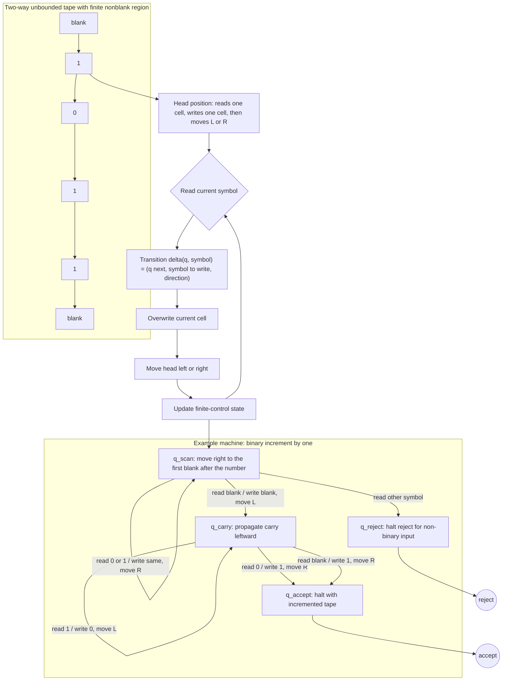

# Turing Machines and the Church-Turing Thesis

Turing machines are the course's full-strength model of algorithmic computation. A Turing machine has finite control like a DFA, but it also has a tape that can be read, written, and revisited. This tape supplies unbounded working memory, allowing the machine to simulate algorithms, manipulate encodings, and perform computations that finite automata and pushdown automata cannot express.

The model is intentionally austere. It does not resemble a modern processor in speed or convenience, but it captures the fundamental idea of a step-by-step effective procedure. The Church-Turing thesis is the philosophical and mathematical claim that this simple model captures exactly the intuitive notion of algorithmic computability.

## Definitions

A **Turing machine** can be defined as a tuple $(Q,\Sigma,\Gamma,\delta,q_0,q_{accept},q_{reject})$. The set $Q$ is finite, $\Sigma$ is the input alphabet, $\Gamma$ is the tape alphabet with $\Sigma\subseteq\Gamma$ and blank symbol included, and $\delta$ maps a nonhalting state and tape symbol to a new state, a symbol to write, and a head direction.

The machine begins with the input written on the tape, blanks elsewhere, the head on the first input symbol, and state $q_0$. At each step it reads the current tape symbol, writes a symbol, moves left or right, and changes state.

A machine **accepts** by entering $q_{accept}$ and **rejects** by entering $q_{reject}$. If it never enters either halting state, it **loops**.

A language is **Turing-recognizable** if some Turing machine accepts exactly the strings in the language. On strings outside the language, the machine may reject or loop. A language is **decidable** if some Turing machine halts on every input and accepts exactly the strings in the language.

A **configuration** records the complete instantaneous description of a computation: the current state, tape contents relevant so far, and head position. Configurations let us reason about simulations and computation histories.

The **Church-Turing thesis** states that any effectively calculable function can be computed by a Turing machine. It is not a theorem in the usual sense because "effectively calculable" is informal; its support comes from the equivalence of many independently proposed models.

## Key results

Turing machines can simulate finite automata, pushdown automata, and standard algorithmic procedures. A DFA simulation uses only finite control. A PDA simulation uses a region of tape as the stack. Graph algorithms, arithmetic algorithms, parsing algorithms, and proof searches can all be encoded as Turing-machine computations.

Recognizability and decidability differ because of looping. If a decider exists, recognition is immediate: halt and answer. But a recognizer may search forever when the answer is no. This distinction becomes central in the acceptance and halting problems.

Configurations make computations discrete objects. A complete accepting computation can be represented as a finite sequence of configurations where each follows legally from the previous one. This idea later supports reductions based on computation histories and the Cook-Levin theorem's tableau construction.

The Church-Turing thesis gains force from robustness. Lambda calculus, recursive functions, register machines, cellular automata, and reasonable programming languages all compute the same class of functions when unbounded memory is idealized. The thesis does not claim all models have the same efficiency; complexity theory studies those differences.

A Turing-machine transition is local, but a Turing-machine algorithm can have global intent. Scanning to the end of the input, marking a symbol, returning to the beginning, comparing two regions, and shifting data are all built from local read-write-move steps. This gap between low-level transitions and high-level descriptions is why theory texts allow implementation-level descriptions once the formal model is established. A high-level algorithm is acceptable when every step is effectively implementable on a tape.

Configurations are the right unit for rigorous reasoning because they contain everything needed to determine the next step. If two computations reach the same configuration, their futures are identical. This observation proves that a decider using bounded space cannot run forever without repeating a configuration, and it underlies configuration-graph arguments in space complexity. It also lets us encode computations as finite histories: a list of configurations where each adjacent pair follows legally.

The difference between recognizing and deciding should be tied to observable behavior. On a yes-instance, both a recognizer and a decider must eventually accept. On a no-instance, a decider must eventually reject, while a recognizer has no such obligation. Looping is not a third answer; it is the absence of an answer. This asymmetry is exactly what lets $A_{TM}$ be recognizable but not decidable.

The Church-Turing thesis should not be used to skip formal proof when formal proof is available. It justifies treating reasonable algorithms as Turing-computable, but once a problem is formalized, claims such as decidability, recognizability, and reducibility still need precise arguments. For example, "we can simulate the machine" is a valid high-level step because a universal Turing machine can be constructed, not because modern computers happen to run interpreters.

Finally, Turing-machine power does not eliminate the earlier models. Regular and context-free languages remain important because restrictions buy decidability, efficient algorithms, and structural insight. A Turing machine can decide every regular language, but a DFA gives a much stronger statement: constant memory and linear scan are enough.

A useful way to specify a Turing machine is by implementation levels. At the lowest level are individual transitions. Above that are macros such as "scan right to the next blank," "copy this block," or "compare marked symbols." Above that is an algorithm on encoded objects. A proof can use higher levels if each macro has an obvious finite transition implementation. This mirrors how assembly instructions, library routines, and high-level code relate in real programming.

The tape alphabet may contain symbols not in the input alphabet. These extra symbols are work symbols: marks, delimiters, crossed-off versions of input symbols, or separators between encoded fields. They do not change the input language; they give the machine a way to remember progress on the tape. Many Turing-machine algorithms work by marking processed symbols rather than deleting them, because marks preserve positional information.

Deciders are often built by combining smaller deciders. If a machine can decide property $A$ and another can decide property $B$, then a combined machine can decide Boolean combinations by running both and combining the answers, because both halt. The same is not automatically true for recognizers and complement, because a recognizer may never return. This operational distinction is one of the main reasons the course insists on halting behavior in definitions.

Turing machines are therefore both a model and a measuring stick. They let us prove that an informal algorithm can be represented formally, and they let us prove that some desired algorithms cannot exist. The same formalism supports positive simulations, negative diagonal arguments, and later resource-bounded analysis.
## Visual



The tape cells, head, and transition function show the Turing-machine I/O contract at one step of execution: only the current cell and finite-control state determine the write, move, and next state. The binary-increment subgraph expands a high-level algorithm into local scan and carry states, including the shape transition from input such as `1011` to output `1100` on the same tape.

## Worked example 1: A Turing machine for binary increment

**Problem.** Describe a Turing machine that adds one to a binary number written on the tape.

**Method.** Use the standard carry algorithm from right to left.

1. Scan right until the first blank after the input is found.
2. Move left to the least significant bit.
3. If the symbol is `0`, write `1` and halt accept. The carry is resolved.
4. If the symbol is `1`, write `0` and move left. The carry continues.
5. If the machine moves left past the original most significant bit and sees blank, write `1` and halt accept.
6. On input `1011`, scan to the end, then process from right to left: `1` becomes `0`, next `1` becomes `0`, next `0` becomes `1`.
7. The tape becomes `1100`.

**Checked answer.** The machine implements ordinary binary addition by one. It halts for every binary input because each carry step moves left and the input is finite.

## Worked example 2: Configuration trace

**Problem.** Give a configuration-level trace for a machine that scans right over `0`s and accepts when it sees blank, on input `000`.

**Method.** Record state and head position.

1. Initial configuration: state `q`, tape `000_`, head on the first `0`.
2. Read `0`, keep `0`, move right. Configuration has head on the second `0`.
3. Read `0`, keep `0`, move right. Configuration has head on the third `0`.
4. Read `0`, keep `0`, move right. Configuration has head on the blank after input.
5. Read blank, enter `q_accept`.

**Checked answer.** The computation has four transitions and accepts. The tape content is unchanged; only the head position and state change.

## Code

```python
def binary_increment(bits):
    tape = list(bits)
    i = len(tape) - 1
    while i >= 0 and tape[i] == "1":
        tape[i] = "0"
        i -= 1
    if i >= 0:
        tape[i] = "1"
    else:
        tape.insert(0, "1")
    return "".join(tape)

for sample in ["0", "1", "1011", "111"]:
    print(sample, "->", binary_increment(sample))
```

## Common pitfalls

- Forgetting that a recognizer may loop. Turing-recognizable does not mean decidable.
- Treating the tape as infinite input. The input is finite; the tape provides blank working space.
- Assuming the Church-Turing thesis is a theorem with a formal proof. It relates a formal model to an informal notion.
- Ignoring configurations. Many later proofs require reasoning about exact computation steps.
- Confusing a Turing machine with a complexity-bounded algorithm. Turing machines define computability first; time and space bounds come later.

## Connections

- Simpler machine models appear in [finite automata and DFAs](/cs/theory/finite-automata-and-dfas) and [pushdown automata and deterministic CFLs](/cs/theory/pushdown-automata-and-deterministic-cfls).
- Equivalent variants are discussed in [Turing machine variants and decidable problems](/cs/theory/turing-machine-variants-and-decidable-problems).
- Undecidable Turing-machine questions begin in [decidability and the halting problem](/cs/theory/decidability-and-the-halting-problem).
- Complexity bounds are introduced in [time complexity, P, and NP](/cs/theory/time-complexity-p-and-np).
