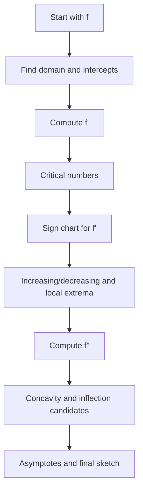

# Applications of Derivatives

Derivatives turn local rate information into global conclusions about a function. Once $f'$ and $f''$ are known, we can identify increasing and decreasing intervals, local extrema, concavity, inflection points, and approximate behavior near a point. This is the foundation for curve sketching and for many applied decisions.


*Figure: Newton iteration uses local linearization to turn calculus into a fast root-finding algorithm. Image: [Wikimedia Commons](https://commons.wikimedia.org/wiki/File:Newton_iteration.svg), Oleg Alexandrov and Pbroks13, public domain.*

The central theme is that signs carry meaning. The sign of $f'$ describes whether the graph rises or falls. The sign of $f''$ describes how the slope itself changes. Theorems such as Rolle's Theorem and the Mean Value Theorem justify moving from pointwise derivative information to interval-level conclusions.

## Definitions

A critical number of $f$ is a number $c$ in the domain of $f$ where

$$
f'(c)=0
\quad\text{or}\quad
f'(c)\text{ does not exist}.
$$

A local maximum occurs at $c$ if $f(c)\ge f(x)$ for all $x$ near $c$. A local minimum occurs if $f(c)\le f(x)$ for all $x$ near $c$. Absolute extrema compare $f(c)$ with all values on the specified domain.

The function $f$ is increasing on an interval if larger inputs give larger outputs. It is decreasing if larger inputs give smaller outputs. Derivatives provide sufficient tests:

$$
f'(x)>0 \Rightarrow f\text{ increasing},
\qquad
f'(x)<0 \Rightarrow f\text{ decreasing}.
$$

Concavity describes how slope changes. If $f''(x)\gt 0$, then $f$ is concave up. If $f''(x)\lt 0$, then $f$ is concave down. An inflection point is a point where concavity changes, provided the point is on the graph.

The Mean Value Theorem states that if $f$ is continuous on $[a,b]$ and differentiable on $(a,b)$, then there is some $c\in(a,b)$ such that

$$
f'(c)=\frac{f(b)-f(a)}{b-a}.
$$

Rolle's Theorem is the special case where $f(a)=f(b)$, so some $c$ satisfies $f'(c)=0$.

## Key results

The First Derivative Test classifies local extrema by sign changes in $f'$:

- If $f'$ changes from positive to negative at $c$, then $f$ has a local maximum at $c$.
- If $f'$ changes from negative to positive at $c$, then $f$ has a local minimum at $c$.
- If $f'$ does not change sign, then $c$ is not a local extremum.

The Second Derivative Test applies when $f'(c)=0$ and $f''(c)$ exists:

$$
f''(c)>0 \Rightarrow \text{local minimum},
\qquad
f''(c)<0 \Rightarrow \text{local maximum}.
$$

If $f''(c)=0$, the test is inconclusive, not proof that no extremum exists.

The Mean Value Theorem gives a proof of the increasing/decreasing test. If $x_1\lt x_2$ and $f'\gt 0$ on $(x_1,x_2)$, then for some $c$,

$$
f(x_2)-f(x_1)=f'(c)(x_2-x_1)>0.
$$

Therefore $f(x_2)\gt f(x_1)$ and the function is increasing. The same argument with $f'\lt 0$ proves decreasing behavior.

L'Hopital's Rule is a derivative application for limits. If $f(a)=g(a)=0$ or both functions become infinite, and the hypotheses hold, then

$$
\lim_{x\to a}\frac{f(x)}{g(x)}
=
\lim_{x\to a}\frac{f'(x)}{g'(x)}
$$

when the derivative limit exists. The rule should be used only for indeterminate forms such as $0/0$ and $\infty/\infty$, not for products or differences until they are rewritten into quotient form.

Curve sketching combines all of these results: domain, intercepts, asymptotes, critical numbers, derivative sign chart, concavity chart, and selected function values.

Absolute extrema require a slightly different mindset from local extrema. A local maximum only wins against nearby points; an absolute maximum wins against the entire specified domain. On a closed interval, endpoints are just as important as critical numbers. On an open interval or an unbounded domain, an absolute extremum may fail to exist even when the function has local extrema.

The Mean Value Theorem also gives useful qualitative consequences. If $f'(x)=0$ throughout an interval, then $f$ is constant on that interval. If two functions have the same derivative on an interval, then they differ by a constant. These facts explain why antiderivatives come in families $F(x)+C$ and why derivative information can determine a function only up to a vertical shift.

For concavity, the second derivative should be interpreted as the rate of change of slope. A graph can be increasing and concave down when it rises but at a slower and slower rate, such as $\ln x$ on $(0,\infty)$. It can be decreasing and concave up when it falls but levels off, such as $e^{-x}$. This separates first-derivative questions about direction from second-derivative questions about bending.

When using L'Hopital's Rule, other algebra may be preferable. Factoring, rationalizing, standard trigonometric limits, or Taylor polynomials can give more insight. L'Hopital's Rule is powerful, but it is not a substitute for recognizing the form of the expression. It also does not apply to a quotient whose denominator derivative is zero in a way that violates the theorem's hypotheses.

## Visual



| Derivative information | Graph conclusion | Caution |
|---|---|---|
| $f'\gt 0$ | increasing | conclusion is interval-based |
| $f'\lt 0$ | decreasing | check all intervals split by critical numbers |
| $f'=0$ | horizontal tangent | may not be extremum |
| $f''\gt 0$ | concave up | slopes increasing |
| $f''\lt 0$ | concave down | slopes decreasing |
| $f''=0$ | inflection candidate | concavity must actually change |

## Worked example 1: curve sketching with derivative tests

**Problem.** Analyze

$$
f(x)=x^3-3x^2-9x+5.
$$

Find increasing and decreasing intervals, local extrema, concavity, and inflection point.

**Method.**

1. Differentiate:

$$
f'(x)=3x^2-6x-9=3(x^2-2x-3)=3(x-3)(x+1).
$$

2. Critical numbers occur where $f'(x)=0$:

$$
x=-1,\qquad x=3.
$$

3. Make a sign chart for $f'$:

| Interval | Test point | Sign of $3(x-3)(x+1)$ | Behavior |
|---|---:|---:|---|
| $(-\infty,-1)$ | $-2$ | positive | increasing |
| $(-1,3)$ | $0$ | negative | decreasing |
| $(3,\infty)$ | $4$ | positive | increasing |

4. Classify extrema. At $x=-1$, $f'$ changes positive to negative, so there is a local maximum. At $x=3$, $f'$ changes negative to positive, so there is a local minimum.

5. Compute function values:

$$
f(-1)=-1-3+9+5=10,
$$

and

$$
f(3)=27-27-27+5=-22.
$$

6. Compute the second derivative:

$$
f''(x)=6x-6.
$$

7. Concavity changes when $f''(x)=0$:

$$
6x-6=0
\quad\Rightarrow\quad
x=1.
$$

8. If $x\lt 1$, then $f''(x)\lt 0$, so the graph is concave down. If $x\gt 1$, then $f''(x)\gt 0$, so the graph is concave up. The inflection point is

$$
(1,f(1))=(1,1-3-9+5)=(1,-6).
$$

**Checked answer.** The function increases on $(-\infty,-1)$ and $(3,\infty)$, decreases on $(-1,3)$, has a local maximum at $(-1,10)$, a local minimum at $(3,-22)$, is concave down on $(-\infty,1)$, concave up on $(1,\infty)$, and has inflection point $(1,-6)$.

## Worked example 2: L'Hopital's Rule with an indeterminate limit

**Problem.** Evaluate

$$
\lim_{x\to 0}\frac{e^x-1-x}{x^2}.
$$

**Method.**

1. Substitute $x=0$:

$$
\frac{e^0-1-0}{0^2}=\frac00.
$$

The form is indeterminate, so L'Hopital's Rule may be considered.

2. Differentiate numerator and denominator:

$$
\frac{d}{dx}(e^x-1-x)=e^x-1,
\qquad
\frac{d}{dx}(x^2)=2x.
$$

3. The new limit is

$$
\lim_{x\to 0}\frac{e^x-1}{2x}.
$$

4. Substitute again:

$$
\frac{e^0-1}{0}=\frac00.
$$

It is still indeterminate.

5. Apply L'Hopital's Rule a second time:

$$
\lim_{x\to 0}\frac{e^x}{2}.
$$

6. Substitute:

$$
\frac{e^0}{2}=\frac12.
$$

**Checked answer.** The limit is $1/2$. This agrees with the Taylor expansion $e^x=1+x+x^2/2+\cdots$.

The agreement with Taylor series is a useful check. Near $x=0$, the numerator behaves like

$$
e^x-1-x\approx \frac{x^2}{2}.
$$

Dividing by $x^2$ should therefore produce a value near $1/2$. A numerical table would suggest the same result, but the derivative-based computation supplies the justification.

In a curve-sketching context, derivative tests should be combined with actual function values. A sign chart says where the graph rises and falls, but values such as $f(-1)=10$ and $f(3)=-22$ anchor the sketch vertically. Asymptotes, intercepts, and end behavior provide additional anchors, especially for rational functions.

Derivative applications are also approximation tools. If $f'(a)$ is known, then $f(a+h)\approx f(a)+f'(a)h$ for small $h$. If $f''$ is known, concavity tells whether the tangent-line estimate tends to lie above or below the graph. For a concave-up function, tangent lines usually sit below the graph near the tangent point; for concave-down functions, they usually sit above. This makes derivative information useful even before an exact graph is drawn carefully by hand or software.

## Code

```python
def f(x):
    return x**3 - 3*x**2 - 9*x + 5

def fp(x):
    return 3*x**2 - 6*x - 9

def fpp(x):
    return 6*x - 6

for x in [-2, -1, 0, 1, 3, 4]:
    print(x, f(x), fp(x), fpp(x))
```

## Common pitfalls

- Treating every critical number as an extremum. Use a sign change or second derivative test.
- Forgetting that endpoints can be absolute extrema even though $f'$ may not be zero there.
- Calling $f''(c)=0$ an inflection point without checking a concavity change.
- Using L'Hopital's Rule on a non-indeterminate form.
- Losing domain restrictions before building sign charts.
- Confusing increasing with concave up. A graph can be increasing and concave down at the same time.

## Connections

- [Derivatives and Rates](/math/calculus/derivatives-and-rates): applications rely on derivative meaning and units.
- [Differentiation Rules](/math/calculus/differentiation-rules): accurate derivative computation is required before sign analysis.
- [Optimization Newton and Antiderivatives](/math/calculus/optimization-newton-antiderivatives): optimization is a focused derivative application.
- [Power Series and Taylor Polynomials](/math/calculus/power-series-and-taylor-polynomials): Taylor expansions provide another route to limits and approximation.
