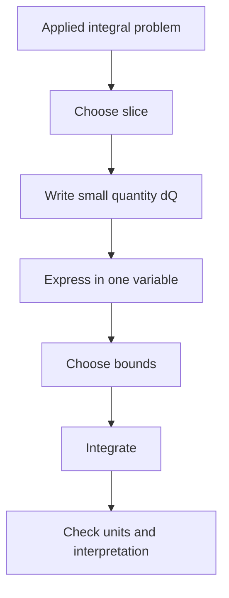

# Applications of Integrals

Applications of integrals all follow the same organizing idea: slice a quantity into small pieces, approximate each piece, and add the pieces by integration. Area, volume, work, mass, average value, arc length, and accumulated change differ in geometry and units, but the integral structure is the same.

The hardest part is often not the integration itself. It is choosing the slice, writing the representative small quantity, identifying correct bounds, and checking units. Once the setup is correct, the definite integral carries out the accumulation.

## Definitions

Area between curves is computed by integrating top minus bottom:

$$
A=\int_a^b [f(x)-g(x)]\,dx
$$

when $f(x)\ge g(x)$ on $[a,b]$. If the curves cross, split the interval at intersection points or use absolute value with care.

Volumes by washers use cross-sectional area:

$$
V=\int_a^b \pi\left(R(x)^2-r(x)^2\right)\,dx.
$$

Volumes by cylindrical shells use

$$
V=\int_a^b 2\pi(\text{radius})(\text{height})\,dx.
$$

Work done by a variable force is

$$
W=\int_a^b F(x)\,dx.
$$

If a density $\rho(x)$ is spread along a line segment, mass is

$$
m=\int_a^b \rho(x)\,dx.
$$

The average value of $f$ on $[a,b]$ is

$$
f_{\text{avg}}=\frac{1}{b-a}\int_a^b f(x)\,dx.
$$

Arc length for a smooth curve $y=f(x)$ is

$$
L=\int_a^b \sqrt{1+[f'(x)]^2}\,dx.
$$

## Key results

The slice method has a reliable pattern:

1. Draw the region or physical setup.
2. Choose the slicing direction.
3. Write a representative slice quantity.
4. Express everything in one variable.
5. Set bounds from the geometry.
6. Integrate and attach units.

For area, the representative slice has height top minus bottom and width $dx$. For washer volumes, the representative slice is a disk or annulus perpendicular to the axis of rotation. For shell volumes, the representative slice is parallel to the axis of rotation and becomes a cylindrical shell.

The choice between washers and shells is often strategic. If rotating around a horizontal axis, vertical slices often create washers and horizontal slices often create shells. If solving for inverse functions would be messy, shells may avoid that algebra. Both methods must give the same volume when set up correctly.

Work problems require force as a function of position. For a spring obeying Hooke's law,

$$
F(x)=kx,
$$

so stretching from $a$ to $b$ requires

$$
W=\int_a^b kx\,dx.
$$

For lifting a rope or pumping fluid, each slice has a weight and a distance moved. The small work is

$$
dW=(\text{weight of slice})(\text{distance moved}).
$$

Average value is not the same as average of endpoint values. It is the constant height that gives the same area:

$$
f_{\text{avg}}(b-a)=\int_a^b f(x)\,dx.
$$

Centroid and center of mass formulas also arise from weighted integrals. The same accumulation idea applies, but each small mass is multiplied by a coordinate before integrating.

For volumes, the axis of rotation controls the radius. If the region is rotated about the $x$-axis, radii are usually vertical distances. If it is rotated about the $y$-axis, radii are usually horizontal distances. Rotating around a shifted line such as $y=3$ or $x=-2$ requires measuring distance to that line, not simply using the function value.

The washer method squares radii because each slice is an area. Forgetting the square is a dimensional error: a radius has length units, but a cross-sectional area must have square units. The shell method multiplies circumference $2\pi r$, height, and thickness. This also gives cubic units.

Work integrals are built from force times distance, but the force may be hidden inside weight density, spring stretch, pressure, or gravity. For pumping fluid, a horizontal slice has volume, weight, and lifting distance. For hydrostatic force, pressure depends on depth, and the force on a thin strip is pressure times area.

Arc length comes from the distance formula. Over a small interval,

$$
ds\approx \sqrt{(dx)^2+(dy)^2}.
$$

Since $dy=f'(x)\,dx$, this becomes

$$
ds\approx \sqrt{1+[f'(x)]^2}\,dx.
$$

Integrating adds the small lengths. Arc length integrals are often algebraically harder than area integrals, and many require numerical methods.

Average value provides a way to replace a varying quantity by an equivalent constant over an interval. If temperature varies over time, the average value is the constant temperature that would produce the same accumulated temperature-time product. In probability, expected values are weighted averages written as integrals.

When curves cross, absolute value is not a cosmetic detail. The area between $f$ and $g$ over $[a,b]$ is

$$
\int_a^b |f(x)-g(x)|\,dx,
$$

but evaluating that integral usually requires splitting at intersection points. Without splitting, positive and negative signed regions may cancel and produce a result smaller than the actual geometric area.

For physical applications, a unit check is a reliable setup test. Density times length gives mass. Force times distance gives work. Area times thickness gives volume. If the units of the integrand times the differential do not match the requested quantity, the slice model is probably wrong.

Some applications can be set up in more than one correct way. A volume may be computed with washers in $x$, shells in $y$, or sometimes Pappus's theorem in a more advanced setting. A good setup is not the one that looks most familiar; it is the one that expresses the slice cleanly and keeps the bounds simple.

## Visual

| Application | Slice quantity | Integral form | Units |
|---|---|---|---|
| Area between curves | height $\cdot dx$ | $\int(\text{top}-\text{bottom})\,dx$ | square units |
| Washer volume | annulus area $\cdot dx$ | $\int \pi(R^2-r^2)\,dx$ | cubic units |
| Shell volume | circumference $\cdot$ height $\cdot dx$ | $\int 2\pi rh\,dx$ | cubic units |
| Work | force $\cdot dx$ | $\int F(x)\,dx$ | joules or ft-lb |
| Mass | density $\cdot dx$ | $\int \rho(x)\,dx$ | mass units |
| Arc length | small curve length | $\int\sqrt{1+(f')^2}\,dx$ | length units |



## Worked example 1: area between curves

**Problem.** Find the area enclosed by

$$
y=x
\qquad\text{and}\qquad
y=x^2.
$$

**Method.**

1. Find intersections:

$$
x=x^2
\quad\Rightarrow\quad
x^2-x=0
\quad\Rightarrow\quad
x(x-1)=0.
$$

Thus $x=0$ and $x=1$.

2. Determine which curve is on top. On $0\lt x\lt 1$,

$$
x>x^2.
$$

So the top curve is $y=x$ and the bottom curve is $y=x^2$.

3. Set up the area integral:

$$
A=\int_0^1 (x-x^2)\,dx.
$$

4. Find an antiderivative:

$$
\int (x-x^2)\,dx=\frac{x^2}{2}-\frac{x^3}{3}.
$$

5. Evaluate:

$$
A=\left[\frac{x^2}{2}-\frac{x^3}{3}\right]_0^1
=\frac12-\frac13.
$$

6. Simplify:

$$
A=\frac16.
$$

**Checked answer.** The enclosed area is $1/6$ square unit. The result is positive because the integrand was top minus bottom on the entire interval.

## Worked example 2: volume by washers

**Problem.** Rotate the region under $y=\sqrt{x}$ from $x=0$ to $x=4$ around the $x$-axis. Find the volume.

**Method.**

1. A vertical slice perpendicular to the $x$-axis rotates into a disk.

2. The radius is the function value:

$$
R(x)=\sqrt{x}.
$$

3. There is no hole, so $r(x)=0$.

4. The washer formula becomes

$$
V=\int_0^4 \pi(R(x)^2-r(x)^2)\,dx.
$$

5. Substitute:

$$
V=\int_0^4 \pi(\sqrt{x})^2\,dx
=\int_0^4 \pi x\,dx.
$$

6. Integrate:

$$
V=\pi\left[\frac{x^2}{2}\right]_0^4.
$$

7. Evaluate:

$$
V=\pi\left(\frac{16}{2}-0\right)=8\pi.
$$

**Checked answer.** The volume is $8\pi$ cubic units. The units are cubic because each disk area is multiplied by a thickness $dx$.

A shell setup would use horizontal slices and solve $x=y^2$. The shell radius would be $y$, the shell height would be $4-y^2$, and the bounds would be $0\le y\le 2$:

$$
V=\int_0^2 2\pi y(4-y^2)\,dy.
$$

Evaluating gives

$$
2\pi\left[2y^2-\frac{y^4}{4}\right]_0^2
=2\pi(8-4)=8\pi,
$$

matching the washer result.

This agreement is a strong check because the two methods use different slice directions. When two independent setups produce the same value, the radius, height, and bounds are much more likely to be correct.

In applied settings, the final answer should be interpreted in context. A volume is not just $8\pi$; it is $8\pi$ cubic units of the solid generated by the stated rotation.

## Code

```python
def midpoint_integral(f, a, b, n=10000):
    h = (b - a) / n
    total = 0.0
    for i in range(n):
        total += f(a + (i + 0.5) * h)
    return total * h

area = midpoint_integral(lambda x: x - x*x, 0, 1)
volume = midpoint_integral(lambda x: 3.141592653589793 * x, 0, 4)
print(area, volume)
```

## Common pitfalls

- Integrating bottom minus top and getting a negative area.
- Forgetting to split the interval when curves cross.
- Squaring the whole diameter instead of the radius in washer problems.
- Mixing washers and shells without changing the slicing direction.
- Omitting units. Area, volume, work, and mass have different dimensions.
- Using endpoint averages instead of integral average value.
- Treating force as constant in a work problem when the force depends on position.

## Connections

- [Definite Integrals and the Fundamental Theorem](/math/calculus/definite-integrals-fundamental-theorem): applied integrals rely on accumulation and exact evaluation.
- [Integration Techniques and Improper Integrals](/math/calculus/integration-techniques-improper-integrals): setup often leads to integrals requiring techniques.
- [Multiple Integrals](/math/calculus/multiple-integrals): area, volume, mass, and average value generalize to two and three dimensions.
- [Vector Calculus](/math/calculus/vector-calculus): work and flux become line and surface integrals.
