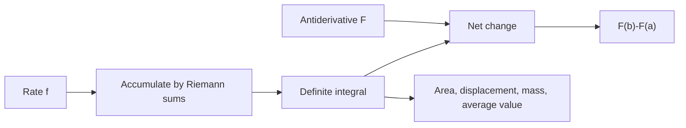

# Definite Integrals and the Fundamental Theorem

The definite integral measures accumulated change. It begins as a limit of sums, where many small pieces are added to approximate area, distance, mass, or any quantity built from a rate. The Fundamental Theorem of Calculus then connects this accumulation process to antiderivatives, making exact evaluation practical.

This topic is the hinge between differential and integral calculus. Derivatives measure local change; definite integrals add local contributions over an interval. The Fundamental Theorem says these operations are inverse in a precise sense, provided the hypotheses are satisfied.


*Figure: Riemann-sum approximation of area under a curve. Image: [Wikimedia Commons](https://commons.wikimedia.org/wiki/File:Riemannsumme.svg), Emes2k, public domain.*

## Definitions

Let $f$ be defined on $[a,b]$. Partition the interval into subintervals

$$
a=x_0<x_1<\cdots<x_n=b.
$$

Let

$$
\Delta x_i=x_i-x_{i-1}
$$

and choose a sample point $x_i^*$ in each subinterval. A Riemann sum is

$$
\sum_{i=1}^n f(x_i^*)\Delta x_i.
$$

If these sums approach a common limit as the partition widths shrink to zero, that limit is the definite integral:

$$
\int_a^b f(x)\,dx.
$$

When $f(x)\ge 0$, the integral represents area under the curve. When $f$ takes positive and negative values, the integral represents signed area: regions above the $x$-axis count positively and regions below count negatively.

The net change theorem says that if $F'(x)=f(x)$, then

$$
\int_a^b f(x)\,dx=F(b)-F(a).
$$

The average value of a continuous function on $[a,b]$ is

$$
f_{\text{avg}}=\frac{1}{b-a}\int_a^b f(x)\,dx.
$$

Different choices of sample points produce familiar approximations. Left endpoint sums use $x_i^*=x_{i-1}$, right endpoint sums use $x_i^*=x_i$, and midpoint sums use the midpoint of each subinterval. For increasing positive functions, left sums underestimate area and right sums overestimate area. For decreasing positive functions, the direction reverses. Midpoint and trapezoidal approximations often improve accuracy because their local errors partly balance.

The symbol $dx$ records the variable and the limiting slice width. In a one-variable integral, it reminds us that the thin piece has width measured in $x$ units. In substitution and multivariable calculus, this bookkeeping becomes essential because changing variables changes the differential factor.

## Key results

The Fundamental Theorem of Calculus has two common parts.

Part 1: If $f$ is continuous on $[a,b]$ and

$$
G(x)=\int_a^x f(t)\,dt,
$$

then

$$
G'(x)=f(x).
$$

This says that the rate of change of accumulated area is the current height of the graph.

Part 2: If $f$ is continuous on $[a,b]$ and $F$ is any antiderivative of $f$, then

$$
\int_a^b f(x)\,dx=F(b)-F(a).
$$

A proof sketch for Part 1 uses the difference quotient:

$$
\frac{G(x+h)-G(x)}{h}
=\frac{1}{h}\int_x^{x+h}f(t)\,dt.
$$

For small $h$, continuity makes $f(t)$ close to $f(x)$ throughout $[x,x+h]$, so the integral is close to $hf(x)$. Dividing by $h$ gives a value close to $f(x)$, and the limit is $f(x)$.

Basic definite integral properties include:

$$
\begin{aligned}
\int_a^a f(x)\,dx &= 0,\\
\int_a^b f(x)\,dx &= -\int_b^a f(x)\,dx,\\
\int_a^b [f(x)+g(x)]\,dx &= \int_a^b f(x)\,dx+\int_a^b g(x)\,dx,\\
\int_a^b cf(x)\,dx &= c\int_a^b f(x)\,dx.
\end{aligned}
$$

Additivity over intervals is essential:

$$
\int_a^b f(x)\,dx+\int_b^c f(x)\,dx=\int_a^c f(x)\,dx.
$$

If $f(x)\le g(x)$ on $[a,b]$, then

$$
\int_a^b f(x)\,dx\le \int_a^b g(x)\,dx.
$$

This comparison principle supports estimates, bounds, and later improper integral tests.

The definite integral has units. If $f(x)$ is measured in meters per second and $x$ in seconds, then $\int_a^b f(x)\,dx$ is measured in meters. If $f$ is density in kilograms per meter and $x$ is length, the integral gives kilograms.

Net change and total change are different. If $v(t)$ is velocity, then

$$
\int_a^b v(t)\,dt
$$

gives displacement, while

$$
\int_a^b |v(t)|\,dt
$$

gives total distance traveled. The absolute value is necessary because motion in the negative direction should still add to distance.

Symmetry can simplify definite integrals. If $f$ is odd, then

$$
\int_{-a}^a f(x)\,dx=0.
$$

If $f$ is even, then

$$
\int_{-a}^a f(x)\,dx=2\int_0^a f(x)\,dx.
$$

These formulas follow from cancellation or doubling of symmetric areas. They are useful for trigonometric functions, polynomials, and probability densities.

The Mean Value Theorem for Integrals says that if $f$ is continuous on $[a,b]$, then there is some $c\in[a,b]$ such that

$$
f(c)=\frac{1}{b-a}\int_a^b f(x)\,dx.
$$

Geometrically, some actual function height equals the average height. This theorem is an integral analogue of the ordinary Mean Value Theorem.

For numerical approximation, the size of the subintervals matters. A regular partition with $n$ equal pieces has width

$$
\Delta x=\frac{b-a}{n}.
$$

Right endpoint sums have the form

$$
\sum_{i=1}^n f(a+i\Delta x)\Delta x.
$$

As $n$ increases, these approximations usually improve for continuous functions. The limit definition is not meant to be a practical way to evaluate every integral by hand, but it explains why an integral is an accumulation and why numerical integration is possible.

The Fundamental Theorem also explains why differentiation and integration are inverse processes only under the right interpretation. Differentiating an accumulation function returns the integrand. Integrating a derivative returns net change, not the original function with no information lost:

$$
\int_a^x F'(t)\,dt=F(x)-F(a).
$$

To recover $F(x)$ exactly, the starting value $F(a)$ must be known.

Continuity is a sufficient condition for integrability, but not the only one. Many functions with jump discontinuities are still Riemann integrable if they are bounded and the discontinuities are not too wild. In a first calculus course, continuity is the main safe hypothesis because it guarantees both integrability and the Fundamental Theorem statements used for computation.

The orientation rule $\int_a^b f=-\int_b^a f$ is more than notation. It keeps substitution formulas consistent when a change of variables reverses limits. If $u=g(x)$ decreases as $x$ increases, then the transformed bounds may appear in reverse order, and the negative sign is handled automatically by the integral orientation convention.

## Visual



| Concept | Expression | Meaning |
|---|---:|---|
| Riemann sum | $\sum f(x_i^*)\Delta x_i$ | finite accumulation |
| Definite integral | $\int_a^b f(x)\,dx$ | limiting accumulation |
| Antiderivative evaluation | $F(b)-F(a)$ | exact integral via FTC |
| Average value | $\frac1{b-a}\int_a^b f$ | constant height with same area |
| Net change | $\int_a^b F'(x)\,dx$ | $F(b)-F(a)$ |

ASCII view of signed area:

```text
       y
       ^
   +   |      area above axis counts +
       |       /\ 
       |      /  \ 
-------+-----/----\----------> x
       |          \__
   -   |             \__ area below axis counts -
```

## Worked example 1: exact integral from an antiderivative

**Problem.** Evaluate

$$
\int_0^2 (3x^2-4x+1)\,dx
$$

and interpret the result as signed area.

**Method.**

1. Find an antiderivative term by term:

$$
\int (3x^2-4x+1)\,dx=x^3-2x^2+x+C.
$$

2. Let

$$
F(x)=x^3-2x^2+x.
$$

3. Apply the Fundamental Theorem:

$$
\int_0^2 (3x^2-4x+1)\,dx=F(2)-F(0).
$$

4. Evaluate:

$$
F(2)=8-8+2=2,
\qquad
F(0)=0.
$$

5. Subtract:

$$
F(2)-F(0)=2.
$$

**Checked answer.** The definite integral is $2$. Because the integrand changes sign on the interval, this is signed area, not total geometric area. Regions below the axis subtract from regions above the axis.

To find total area, one would first locate zeros of the integrand:

$$
3x^2-4x+1=(3x-1)(x-1).
$$

The sign changes at $x=1/3$ and $x=1$. The total area on $[0,2]$ would require integrating the absolute value or splitting at those points. This illustrates why the word "area" must be read carefully in definite integral problems.

If the original problem asks for displacement, the signed integral is the correct quantity. If it asks for total distance or total geometric area, signs must not cancel. The same computed integral can therefore answer different applied questions only after the interpretation is specified.

## Worked example 2: derivative of an accumulation function

**Problem.** Let

$$
G(x)=\int_1^{x^2} \sqrt{1+t^3}\,dt.
$$

Find $G'(x)$.

**Method.**

1. Recognize that the upper limit is not $x$ but $x^2$.

2. Define

$$
H(u)=\int_1^u \sqrt{1+t^3}\,dt.
$$

Then by FTC Part 1,

$$
H'(u)=\sqrt{1+u^3}.
$$

3. Since $G(x)=H(x^2)$, use the chain rule:

$$
G'(x)=H'(x^2)\cdot 2x.
$$

4. Substitute:

$$
G'(x)=\sqrt{1+(x^2)^3}\cdot 2x.
$$

5. Simplify:

$$
G'(x)=2x\sqrt{1+x^6}.
$$

**Checked answer.** $G'(x)=2x\sqrt{1+x^6}$. The factor $2x$ is required by the chain rule because the accumulation endpoint moves at rate $2x$.

## Code

```python
def trapezoid(f, a, b, n=10000):
    h = (b - a) / n
    total = 0.5 * (f(a) + f(b))
    for i in range(1, n):
        total += f(a + i * h)
    return total * h

def f(x):
    return 3*x*x - 4*x + 1

print(trapezoid(f, 0, 2))
```

## Common pitfalls

- Forgetting that definite integrals give signed area, not always total area.
- Omitting endpoint evaluation order. $\int_a^b f=F(b)-F(a)$, not $F(a)-F(b)$.
- Dropping the chain-rule factor when differentiating $\int_a^{g(x)}f(t)\,dt$.
- Including $+C$ in a definite integral evaluation. Constants cancel in $F(b)-F(a)$.
- Ignoring units. An integral of a rate has accumulated units.
- Assuming every Riemann sum uses right endpoints. Left, right, midpoint, and arbitrary sample points can all converge to the same integral for integrable functions.

## Connections

- [Optimization Newton and Antiderivatives](/math/calculus/optimization-newton-antiderivatives): antiderivatives provide the evaluation step in the FTC.
- [Integration Techniques and Improper Integrals](/math/calculus/integration-techniques-improper-integrals): techniques expand the set of computable antiderivatives.
- [Applications of Integrals](/math/calculus/applications-of-integrals): area, volume, work, and mass use definite integrals.
- [Multiple Integrals](/math/calculus/multiple-integrals): Riemann sums extend to regions in the plane and space.
