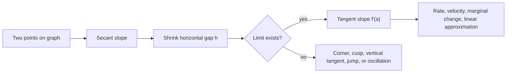

# Derivatives and Rates

The derivative measures instantaneous change. It turns the average slope of a secant line into the slope of a tangent line by shrinking the input interval to zero. In physical language, the same idea turns average velocity into instantaneous velocity, average growth into current growth rate, and average cost into marginal cost.

Derivatives are the first major payoff of limits. They connect local graph shape, rates with units, and linear approximation. A derivative is not only a formula to compute; it is a function that tells how another function is changing at every point where the limit exists.

## Definitions

For a function $f$, the derivative at $a$ is

$$
f'(a)=\lim_{h\to 0}\frac{f(a+h)-f(a)}{h},
$$

provided the limit exists. The quotient

$$
\frac{f(a+h)-f(a)}{h}
$$

is the slope of the secant line through $(a,f(a))$ and $(a+h,f(a+h))$. The derivative is the limiting slope of these secant lines as the second point approaches the first.

The derivative function is

$$
f'(x)=\lim_{h\to 0}\frac{f(x+h)-f(x)}{h}.
$$

Alternative notation includes

$$
\frac{dy}{dx},\qquad \frac{d}{dx}f(x),\qquad Df(x).
$$

If $s(t)$ is position at time $t$, then velocity is

$$
v(t)=s'(t),
$$

and acceleration is

$$
a(t)=v'(t)=s''(t).
$$

The units of a derivative are output units per input unit. If $s$ is measured in meters and $t$ in seconds, then $s'(t)$ is measured in meters per second. If $C(q)$ is cost in dollars for $q$ units produced, then $C'(q)$ is dollars per unit.

A function is differentiable at $a$ if $f'(a)$ exists. Differentiability can fail at corners, cusps, vertical tangents, jumps, holes, or oscillations. A tangent line to a differentiable graph at $x=a$ is

$$
y=f(a)+f'(a)(x-a).
$$

One-sided derivatives are useful at endpoints and corners:

$$
f'_-(a)=\lim_{h\to 0^-}\frac{f(a+h)-f(a)}{h},
\qquad
f'_+(a)=\lim_{h\to 0^+}\frac{f(a+h)-f(a)}{h}.
$$

The derivative exists exactly when the two one-sided derivative limits exist and agree. On a closed interval $[a,b]$, a function can have a right-hand derivative at $a$ and a left-hand derivative at $b$, but ordinary differentiability is usually discussed at interior points.

Higher derivatives repeat the same operation. The second derivative $f''(x)$ measures how $f'(x)$ changes, and in graph language it measures concavity. If $f''(x)\gt 0$, slopes are increasing and the graph is concave up. If $f''(x)\lt 0$, slopes are decreasing and the graph is concave down. This makes the derivative a bridge from local linear change to the larger shape of the graph.

## Key results

If $f$ is differentiable at $a$, then $f$ is continuous at $a$. A proof sketch starts from

$$
f(x)-f(a)=\frac{f(x)-f(a)}{x-a}(x-a)
$$

for $x\ne a$. As $x\to a$, the first factor approaches $f'(a)$ and the second factor approaches $0$, so $f(x)-f(a)\to 0$. Therefore $f(x)\to f(a)$.

The converse is false. The function $f(x)=\vert x\vert $ is continuous at $0$ but not differentiable there because

$$
\lim_{h\to 0^-}\frac{|h|-0}{h}=-1,
\qquad
\lim_{h\to 0^+}\frac{|h|-0}{h}=1.
$$

The two one-sided derivative limits disagree, so the derivative does not exist.

The derivative controls a first-order approximation:

$$
f(a+h)\approx f(a)+f'(a)h
$$

for small $h$. This says that near $a$, the graph is well approximated by its tangent line. The approximation becomes more accurate relative to $h$ as $h\to 0$ when $f$ is differentiable.

For motion, the sign of velocity indicates direction, while speed is $\vert v(t)\vert $. Positive acceleration means velocity is increasing, not necessarily that the object is moving to the right. An object moving left with negative velocity and negative acceleration is speeding up because the velocity is becoming more negative.

Geometrically, a positive derivative means the tangent line rises left to right. A negative derivative means it falls. A zero derivative means a horizontal tangent, which may signal a local maximum, local minimum, or neither.

The derivative may also be read as the best linear coefficient near a point. If $\Delta x$ is small, then

$$
\Delta y=f(a+\Delta x)-f(a)\approx f'(a)\Delta x.
$$

This is a local statement, not a global one. A large input change may make the tangent-line estimate poor, especially when the graph has strong curvature. The second derivative later gives a way to judge the likely size and direction of that error.

Normal lines are perpendicular to tangent lines. If $f'(a)=m$ and $m\ne 0$, the normal slope is $-1/m$. If the tangent is horizontal, the normal is vertical. This geometry is useful in curve sketching, optics, constrained motion, and optimization problems where a direction perpendicular to a level curve matters.

Rates should always be interpreted in context. If $P'(t)=120$ people per year, then the population is increasing at that instant at approximately $120$ people per year; it does not mean exactly $120$ people are added over every nearby year. If $C'(50)=8$ dollars per item, then producing the $51$st item costs about $8$ more, assuming one unit is a small enough change for the marginal approximation to be sensible.

Another useful interpretation is sensitivity. If $f'(a)$ has large magnitude, a small error in the input can create a relatively large error in the output. If $f'(a)$ is near zero, the output is locally insensitive to small input changes. This idea appears in measurement error, numerical methods, optimization, and stability analysis. For instance, if a radius measurement has error $dr$, then the area error for a circle is approximately $dA=2\pi r\,dr$, so the same measuring error matters more for a larger circle.

Derivative notation should be chosen to match the setting. Prime notation is compact for one-variable functions, while Leibniz notation makes the independent variable and units explicit. In applied problems, $\frac{dP}{dt}$ is often clearer than $P'$ because it states that population is changing with respect to time rather than with respect to another parameter directly.

## Visual



| Object | Formula | Interpretation |
|---|---:|---|
| Average rate on $[a,b]$ | $\dfrac{f(b)-f(a)}{b-a}$ | Slope of secant line |
| Instantaneous rate at $a$ | $f'(a)$ | Slope of tangent line |
| Velocity | $s'(t)$ | Instantaneous change in position |
| Acceleration | $s''(t)$ | Instantaneous change in velocity |
| Marginal cost | $C'(q)$ | Approximate extra cost for one more unit |

## Worked example 1: derivative from the limit definition

**Problem.** Use the definition to find the derivative of $f(x)=x^2$ at a general point $x$.

**Method.**

1. Start with the difference quotient:

$$
\frac{f(x+h)-f(x)}{h}
=\frac{(x+h)^2-x^2}{h}.
$$

2. Expand the numerator:

$$
(x+h)^2-x^2=x^2+2xh+h^2-x^2.
$$

3. Simplify:

$$
\frac{x^2+2xh+h^2-x^2}{h}
=\frac{2xh+h^2}{h}.
$$

4. Factor $h$ and cancel for $h\ne 0$:

$$
\frac{h(2x+h)}{h}=2x+h.
$$

5. Take the limit:

$$
f'(x)=\lim_{h\to 0}(2x+h)=2x.
$$

**Checked answer.** The derivative is $f'(x)=2x$. At $x=3$, the tangent slope is $6$. The tangent line there is

$$
y=9+6(x-3)=6x-9.
$$

## Worked example 2: velocity, speed, and acceleration

**Problem.** A particle moves along a line with position

$$
s(t)=t^3-6t^2+9t
$$

meters after $t$ seconds. Find velocity and acceleration. Determine when the particle is at rest on $0\le t\le 4$, and decide whether it is speeding up at $t=3$.

**Method.**

1. Differentiate position to get velocity:

$$
v(t)=s'(t)=3t^2-12t+9.
$$

2. Factor the velocity:

$$
v(t)=3(t^2-4t+3)=3(t-1)(t-3).
$$

3. The particle is at rest when $v(t)=0$:

$$
t=1,\qquad t=3.
$$

4. Differentiate velocity to get acceleration:

$$
a(t)=v'(t)=6t-12.
$$

5. Evaluate at $t=3$:

$$
v(3)=0,\qquad a(3)=6.
$$

At the exact instant $t=3$, the speed is $\vert v(3)\vert =0$. Immediately after $3$, velocity is positive and acceleration is positive, so the particle begins moving right and speeding up.

**Checked answer.** The velocity is $3t^2-12t+9$, acceleration is $6t-12$, and the rest times are $t=1$ and $t=3$. At $t=3$ the object is momentarily stopped; just after that instant it speeds up to the right.

## Code

```python
def derivative_central(f, x, h=1e-5):
    return (f(x + h) - f(x - h)) / (2 * h)

def position(t):
    return t**3 - 6*t**2 + 9*t

for t in [0, 1, 2, 3, 4]:
    velocity_estimate = derivative_central(position, t)
    print(t, round(velocity_estimate, 6))
```

## Common pitfalls

- Treating the derivative as a fraction before learning what the limit notation means. The notation is powerful, but the derivative is defined by a limit.
- Forgetting units. A derivative of distance with respect to time is not measured in meters; it is measured in meters per second.
- Assuming continuity implies differentiability. Corners such as $\vert x\vert $ are continuous but not differentiable at the corner.
- Assuming a zero derivative always means a local maximum or minimum. A function such as $x^3$ has $f'(0)=0$ but no extremum at $0$.
- Confusing velocity and speed. Velocity can be negative; speed is never negative.
- Using a numerical derivative with too large or too small a step without checking stability. Floating-point rounding can distort the estimate.

## Connections

- [Limits and Continuity](/math/calculus/limits-and-continuity): the derivative is built from a limit.
- [Differentiation Rules](/math/calculus/differentiation-rules): rules make derivative computation efficient after the definition is understood.
- [Applications of Derivatives](/math/calculus/applications-of-derivatives): signs of derivatives explain increasing, decreasing, and concavity.
- [Vector Functions and Motion](/math/calculus/vector-functions-and-motion): velocity and acceleration extend to curves in space.
