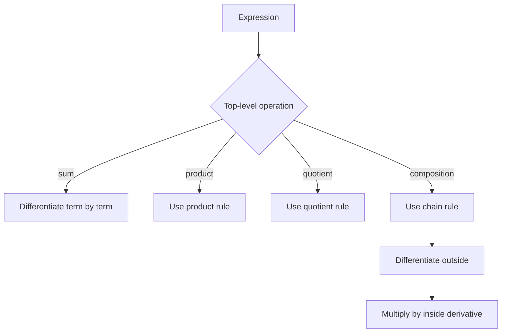

# Differentiation Rules

Differentiation rules turn the derivative from a limit that must be recomputed every time into a practical calculus tool. The rules are shortcuts, but they are not arbitrary tricks. Each one follows from the limit definition and the algebra of functions.

The main task is to recognize structure. A complicated expression may be a sum, product, quotient, or composition of simpler functions. Once that structure is clear, the derivative is found by applying the appropriate rule in the correct order, while keeping domain restrictions and units in mind.

## Definitions

The derivative of $f$ is

$$
f'(x)=\lim_{h\to 0}\frac{f(x+h)-f(x)}{h},
$$

when the limit exists. Differentiation rules tell how to compute this limit for functions assembled from simpler pieces.

Basic rules:

$$
\begin{aligned}
\frac{d}{dx}c &= 0,\\
\frac{d}{dx}x^n &= nx^{n-1},\\
\frac{d}{dx}[cf(x)] &= cf'(x),\\
\frac{d}{dx}[f(x)+g(x)] &= f'(x)+g'(x).
\end{aligned}
$$

The product rule is

$$
\frac{d}{dx}[f(x)g(x)]=f'(x)g(x)+f(x)g'(x).
$$

The quotient rule is

$$
\frac{d}{dx}\left[\frac{f(x)}{g(x)}\right]
=\frac{g(x)f'(x)-f(x)g'(x)}{[g(x)]^2},
\qquad g(x)\ne 0.
$$

The chain rule is

$$
\frac{d}{dx}f(g(x))=f'(g(x))g'(x).
$$

It says to differentiate the outside function while leaving the inside function in place, then multiply by the derivative of the inside function.

Common elementary derivatives include:

$$
\begin{aligned}
\frac{d}{dx}a^x &= a^x\ln a && (a>0,\ a\ne 1),\\
\frac{d}{dx}\log_a x &= \frac{1}{x\ln a} && (x>0),\\
\frac{d}{dx}\sec x &= \sec x\tan x,\\
\frac{d}{dx}\csc x &= -\csc x\cot x,\\
\frac{d}{dx}\cot x &= -\csc^2 x.
\end{aligned}
$$

Inverse trigonometric derivatives also appear frequently:

$$
\begin{aligned}
\frac{d}{dx}\arcsin x &= \frac{1}{\sqrt{1-x^2}},\\
\frac{d}{dx}\arctan x &= \frac{1}{1+x^2},\\
\frac{d}{dx}\operatorname{arcsec} x &= \frac{1}{|x|\sqrt{x^2-1}}.
\end{aligned}
$$

These formulas are valid on their natural domains. The absolute value in the derivative of $\operatorname{arcsec} x$ is a reminder that inverse-function derivatives often carry domain choices.

## Key results

The power rule for positive integers follows from expanding $(x+h)^n$:

$$
(x+h)^n=x^n+nx^{n-1}h+\text{terms containing }h^2.
$$

Then

$$
\frac{(x+h)^n-x^n}{h}=nx^{n-1}+\text{terms containing }h,
$$

so the limit as $h\to 0$ is $nx^{n-1}$. The rule extends to many real exponents on their domains, with special care around roots and negative powers.

The product rule can be derived by adding and subtracting $f(x+h)g(x)$:

$$
\begin{aligned}
&\frac{f(x+h)g(x+h)-f(x)g(x)}{h}\\
&=\frac{f(x+h)g(x+h)-f(x+h)g(x)}{h}
+\frac{f(x+h)g(x)-f(x)g(x)}{h}\\
&=f(x+h)\frac{g(x+h)-g(x)}{h}
+g(x)\frac{f(x+h)-f(x)}{h}.
\end{aligned}
$$

Taking the limit gives $f(x)g'(x)+g(x)f'(x)$. This proof also explains why the derivative of a product is not simply $f'g'$.

The quotient rule can be obtained by writing $f/g=f\cdot g^{-1}$ and using the product and chain rules. The denominator $[g(x)]^2$ appears because differentiating $g^{-1}$ gives $-g^{-2}g'$.

Trigonometric derivatives used throughout calculus include

$$
\begin{aligned}
\frac{d}{dx}\sin x &= \cos x,\\
\frac{d}{dx}\cos x &= -\sin x,\\
\frac{d}{dx}\tan x &= \sec^2 x.
\end{aligned}
$$

Exponential and logarithmic derivatives are

$$
\frac{d}{dx}e^x=e^x,
\qquad
\frac{d}{dx}\ln x=\frac1x\quad (x>0).
$$

The chain rule is the most important rule because every nontrivial formula is built from nested operations. If $y=\sin(x^2)$, the outside function is sine and the inside function is $x^2$, so

$$
\frac{dy}{dx}=\cos(x^2)\cdot 2x.
$$

If $y=(3x-1)^{10}$, the outside function is the tenth power and the inside function is $3x-1$, so

$$
\frac{dy}{dx}=10(3x-1)^9\cdot 3.
$$

Logarithmic differentiation is a strategy, not a new rule. It is helpful when a product, quotient, or variable exponent would be messy to differentiate directly. Taking natural logs converts products to sums and powers to factors. For example, if $y=x^x$ for $x\gt 0$, then

$$
\ln y=x\ln x.
$$

Differentiating implicitly gives

$$
\frac{y'}{y}=\ln x+1,
$$

so

$$
y'=x^x(\ln x+1).
$$

The rule set should be used with simplification in mind. Sometimes it is easier to simplify before differentiating; for example, $(x^2-1)/(x-1)=x+1$ for $x\ne 1$. Sometimes simplifying first creates algebraic work or hides a domain restriction. The safest habit is to record the original domain, simplify where valid, and then state the derivative on that same domain.

A chain-rule proof sketch uses a small change in the inside variable. Let $y=f(u)$ and $u=g(x)$. For a change $\Delta x$, the inside changes by $\Delta u=g(x+\Delta x)-g(x)$. When $\Delta u\ne 0$,

$$
\frac{\Delta y}{\Delta x}
=\frac{\Delta y}{\Delta u}\cdot\frac{\Delta u}{\Delta x}.
$$

As $\Delta x\to 0$, differentiability of $g$ gives $\Delta u\to 0$, and differentiability of $f$ gives $\Delta y/\Delta u\to f'(u)$. The limit becomes

$$
\frac{dy}{dx}=\frac{dy}{du}\frac{du}{dx}.
$$

This proof also explains the notation: the formal derivative is not simple fraction cancellation, but the notation records a true limiting relationship.

Higher derivatives are computed by applying the same rules repeatedly. If $f'(x)$ gives slope, then $f''(x)$ gives the rate of change of slope. In applications, $s'(t)$ is velocity and $s''(t)$ is acceleration. In graphing, $f''$ helps determine concavity and inflection points. The same derivative rules therefore support both computation and interpretation.

A good workflow is to identify the outermost operation first. If the top-level operation is addition, differentiate term by term. If it is multiplication, use the product rule before simplifying. If it is a power of a nontrivial expression, use the chain rule. If several rules are needed, write intermediate labels such as $u$ and $v$; this reduces sign errors and makes the final expression easier to audit.

Domain awareness remains part of differentiation. The formula for a derivative is only meaningful where the original function is defined and where the derivative limit exists. For instance, $f(x)=x^{1/3}$ is defined at $0$, but its tangent is vertical there, so the derivative is not finite at $0$. Similarly, $f(x)=\vert x\vert $ is defined and continuous at $0$, but the left and right derivative limits disagree. Rules speed up computation, but they do not erase the need to check exceptional points.

When answers will be used for graphing or optimization, leave factors visible when possible. A derivative such as $2x(x-3)^2$ immediately shows sign and zero information, while its expanded form hides that structure and makes later interval testing slower.

Clean form is part of correctness because it supports the next mathematical decision clearly afterward.

## Visual

| Rule | Pattern | Derivative | Common cue |
|---|---|---|---|
| Constant multiple | $cf$ | $cf'$ | Number times a function |
| Sum | $f+g$ | $f'+g'$ | Terms separated by plus or minus |
| Product | $fg$ | $f'g+fg'$ | Two variable factors multiplied |
| Quotient | $f/g$ | $(gf'-fg')/g^2$ | Variable expression in denominator |
| Chain | $f(g(x))$ | $f'(g(x))g'(x)$ | Function nested inside function |



## Worked example 1: product and chain rules together

**Problem.** Differentiate

$$
y=(x^2+1)^5\sin x.
$$

**Method.**

1. Identify a product:

$$
u=(x^2+1)^5,\qquad v=\sin x.
$$

2. Differentiate $u$ using the chain rule. The outside function is $w^5$ and the inside is $w=x^2+1$:

$$
u'=5(x^2+1)^4(2x)=10x(x^2+1)^4.
$$

3. Differentiate $v$:

$$
v'=\cos x.
$$

4. Apply the product rule:

$$
y'=u'v+uv'.
$$

5. Substitute:

$$
y'=10x(x^2+1)^4\sin x+(x^2+1)^5\cos x.
$$

**Checked answer.** A factored equivalent form is

$$
y'=(x^2+1)^4\left(10x\sin x+(x^2+1)\cos x\right).
$$

Both forms are correct.

## Worked example 2: quotient rule with simplification

**Problem.** Differentiate

$$
f(x)=\frac{x^2+3x}{x-1}
$$

for $x\ne 1$.

**Method.**

1. Identify numerator and denominator:

$$
u=x^2+3x,\qquad v=x-1.
$$

2. Differentiate them:

$$
u'=2x+3,\qquad v'=1.
$$

3. Apply the quotient rule:

$$
f'(x)=\frac{v u'-u v'}{v^2}.
$$

4. Substitute:

$$
f'(x)=\frac{(x-1)(2x+3)-(x^2+3x)(1)}{(x-1)^2}.
$$

5. Expand the numerator:

$$
(x-1)(2x+3)=2x^2+x-3.
$$

6. Subtract:

$$
2x^2+x-3-(x^2+3x)=x^2-2x-3.
$$

**Checked answer.**

$$
f'(x)=\frac{x^2-2x-3}{(x-1)^2}.
$$

The derivative is valid only where the original function is defined, so $x\ne 1$.

As a check, rewrite the numerator by polynomial division:

$$
\frac{x^2+3x}{x-1}=x+4+\frac{4}{x-1}.
$$

Differentiating this equivalent form gives

$$
1-\frac{4}{(x-1)^2}
=\frac{(x-1)^2-4}{(x-1)^2}
=\frac{x^2-2x-3}{(x-1)^2},
$$

which matches the quotient-rule result.

## Code

```python
def central_difference(f, x, h=1e-6):
    return (f(x + h) - f(x - h)) / (2 * h)

def f(x):
    return (x**2 + 3*x) / (x - 1)

def f_prime_formula(x):
    return (x**2 - 2*x - 3) / ((x - 1)**2)

for x in [2, 3, 5]:
    print(x, central_difference(f, x), f_prime_formula(x))
```

## Common pitfalls

- Applying the power rule to a sum, such as treating $(x^2+1)^5$ as $5x^4$. Use the chain rule.
- Forgetting the second term in the product rule. The derivative of $fg$ is not $f'g'$.
- Reversing signs in the quotient rule. Keep the order as denominator times derivative of numerator minus numerator times derivative of denominator.
- Dropping the inner derivative in the chain rule.
- Simplifying the original function across a restricted point and then forgetting the original domain.
- Mixing radians and degrees. The standard trigonometric derivatives assume radian measure.
- Applying a formula outside its domain. For example, $\ln x$ requires $x\gt 0$, and $\sqrt{x}$ has a one-sided derivative issue at $0$.
- Expanding everything automatically. Factored derivatives often reveal zeros and signs more clearly in applications.
- Confusing $\frac{d}{dx}(\sin^2 x)$ with $\frac{d}{dx}(\sin x^2)$. The first is $(\sin x)^2$; the second is $\sin(x^2)$.

## Connections

- [Derivatives and Rates](/math/calculus/derivatives-and-rates): rules compute the derivative defined by a limit.
- [Implicit Differentiation and Linearization](/math/calculus/implicit-related-rates-linearization): chain rule thinking supports implicit differentiation.
- [Exponential Log and Inverse Functions](/math/calculus/exponential-log-inverse-functions): exponential, logarithmic, and inverse derivatives extend the rule set.
- [Applications of Derivatives](/math/calculus/applications-of-derivatives): derivative computations become graph and optimization tools.
