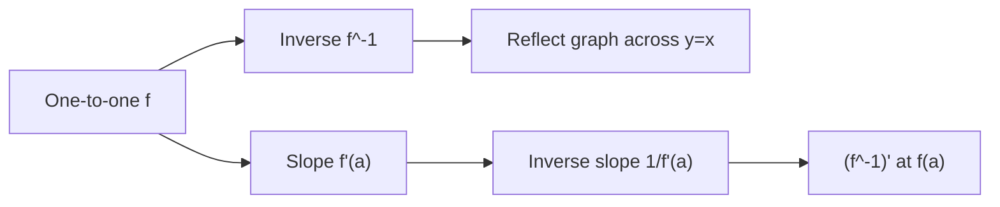

# Exponential Log and Inverse Functions

Exponential, logarithmic, and inverse functions are where calculus moves beyond polynomial behavior. Exponentials model quantities whose rate of change is proportional to the current amount. Logarithms undo exponential growth and convert multiplication into addition. Inverse functions reverse input-output roles, so their derivatives explain how rates change when a relationship is solved in the opposite direction.


*Figure: Leonhard Euler's notation and results appear across analysis, graph theory, and number theory. Image: [Wikimedia Commons](https://commons.wikimedia.org/wiki/File:Leonhard_Euler.jpg), Jakob Emanuel Handmann, public domain.*

These functions appear in growth and decay, compound interest, radioactive half-life, pH, sound intensity, population models, and change of scale. They also support many integration techniques and differential equations later in calculus.

## Definitions

The natural exponential function $e^x$ is the unique function satisfying

$$
\frac{d}{dx}e^x=e^x,
\qquad
e^0=1.
$$

For a positive base $a\ne 1$,

$$
a^x=e^{x\ln a}.
$$

The natural logarithm $\ln x$ is the inverse of $e^x$:

$$
y=\ln x \quad\Longleftrightarrow\quad e^y=x,
\qquad x>0.
$$

Logarithm laws follow from exponent laws:

$$
\begin{aligned}
\ln(ab)&=\ln a+\ln b,\\
\ln\left(\frac{a}{b}\right)&=\ln a-\ln b,\\
\ln(a^r)&=r\ln a.
\end{aligned}
$$

An inverse function reverses a one-to-one function. If $f(a)=b$, then $f^{-1}(b)=a$. The graphs of $f$ and $f^{-1}$ are reflections across the line $y=x$. A function is one-to-one if no horizontal line meets its graph more than once.

For inverse trigonometric functions, the original trigonometric functions must be restricted to intervals where they are one-to-one. For example, $\arcsin x$ is the inverse of $\sin x$ restricted to $[-\pi/2,\pi/2]$.

## Key results

The core derivative formulas are

$$
\begin{aligned}
\frac{d}{dx}e^x &= e^x,\\
\frac{d}{dx}a^x &= a^x\ln a,\\
\frac{d}{dx}\ln x &= \frac1x,\\
\frac{d}{dx}\log_a x &= \frac{1}{x\ln a}.
\end{aligned}
$$

With the chain rule,

$$
\frac{d}{dx}e^{g(x)}=e^{g(x)}g'(x),
\qquad
\frac{d}{dx}\ln(g(x))=\frac{g'(x)}{g(x)}
$$

where $g(x)\gt 0$ for the logarithm.

The derivative of an inverse function is

$$
(f^{-1})'(b)=\frac{1}{f'(a)}
\quad\text{where}\quad f(a)=b,
$$

provided $f'(a)\ne 0$. A proof sketch uses $f(f^{-1}(x))=x$. Differentiating gives

$$
f'(f^{-1}(x))(f^{-1})'(x)=1,
$$

so

$$
(f^{-1})'(x)=\frac{1}{f'(f^{-1}(x))}.
$$

Exponential growth and decay have the form

$$
P(t)=P_0e^{kt}.
$$

If $k\gt 0$, the quantity grows. If $k\lt 0$, it decays. The derivative is

$$
P'(t)=kP_0e^{kt}=kP(t),
$$

so the rate of change is proportional to the current amount. The doubling time for $k\gt 0$ is

$$
T=\frac{\ln 2}{k},
$$

and the half-life for $k\lt 0$ is

$$
T=\frac{\ln 2}{|k|}.
$$

Logarithmic differentiation is useful for products, quotients, and variable exponents. If $y=x^x$ for $x\gt 0$, then $\ln y=x\ln x$, so

$$
\frac{y'}{y}=\ln x+1
\quad\Rightarrow\quad
y'=x^x(\ln x+1).
$$

Inverse trigonometric derivative formulas include

$$
\frac{d}{dx}\arcsin x=\frac{1}{\sqrt{1-x^2}},
\qquad
\frac{d}{dx}\arctan x=\frac{1}{1+x^2}.
$$

The domains are part of the result. The derivative of $\arcsin x$ is real only for $-1\lt x\lt 1$.

The change-of-base formula is often the simplest way to move between logarithms:

$$
\log_a x=\frac{\ln x}{\ln a}.
$$

Since $\ln a$ is a constant, differentiating gives $\frac{d}{dx}\log_a x=1/(x\ln a)$. This is also why natural logarithms dominate calculus: base $e$ removes the extra constant from the derivative.

Logarithmic scales compress multiplicative change. If a quantity is multiplied by $10$, its common logarithm increases by $1$. If a quantity is multiplied by $e$, its natural logarithm increases by $1$. This is why logarithms are used for pH, decibels, earthquake magnitude, and data spanning many orders of magnitude. Calculus on a logarithmic scale often turns relative change into ordinary change:

$$
\frac{d}{dt}\ln P(t)=\frac{P'(t)}{P(t)}.
$$

The expression $P'(t)/P(t)$ is the relative growth rate. If it is constant, the model is exponential. If it varies with time, the model may still be analyzed by integrating the relative growth rate.

Inverse-function derivatives have a geometric meaning. If the graph of $f$ has a steep tangent at $(a,b)$, then the reflected graph of $f^{-1}$ has a shallow tangent at $(b,a)$. Slopes become reciprocals because reflection across $y=x$ swaps horizontal and vertical changes. This interpretation also explains why $f'(a)=0$ creates trouble: the reciprocal slope would be infinite, so the inverse has a vertical tangent or fails to be a differentiable function there.

In applications, exponential models should be checked against assumptions. Continuous compounding assumes growth occurs at every instant, not only once per year. Radioactive decay uses exponential behavior because each atom has a constant probability of decay per unit time. A population may grow approximately exponentially for a while, but limited resources eventually make a logistic or other constrained model more realistic.

Solving exponential equations usually means isolating the exponential expression and then taking logarithms. Solving logarithmic equations usually means combining logarithms carefully and then exponentiating. Each step must preserve the domain. For example, an equation involving $\ln(x-3)$ automatically requires $x\gt 3$, and any solution outside that domain must be rejected even if it appears after algebraic manipulation.

The constant $e$ also appears as a limiting growth factor:

$$
e=\lim_{n\to\infty}\left(1+\frac1n\right)^n.
$$

This limit connects continuous growth with increasingly frequent compounding. If interest at annual rate $r$ is compounded $n$ times per year, the growth factor over one year is

$$
\left(1+\frac{r}{n}\right)^n.
$$

As $n$ increases without bound, the factor approaches $e^r$. This is why $e^{rt}$ is the natural continuous compounding model.

For inverse trigonometric functions, remember that the output is an angle in a restricted interval. The statement $\arcsin(1/2)=\pi/6$ is not listing every angle whose sine is $1/2$; it gives the principal value in $[-\pi/2,\pi/2]$. Calculus formulas for inverse trigonometric derivatives rely on those principal branches.

Growth comparisons are another reason these functions are central. For large positive $x$, exponential functions eventually outgrow every power $x^n$, while logarithms grow more slowly than every positive power $x^p$. These facts are often summarized by limits such as

$$
\lim_{x\to\infty}\frac{x^n}{e^x}=0,
\qquad
\lim_{x\to\infty}\frac{\ln x}{x^p}=0
$$

for fixed $n\gt 0$ and $p\gt 0$. They help estimate series, improper integrals, and algorithms.

They also explain why graph scales matter: exponential curves may look flat and then suddenly steep on ordinary axes, while logarithmic axes reveal multiplicative patterns more evenly across large ranges of data.

This matters in modeling, estimation, and asymptotic comparison.

## Visual

| Function | Domain | Range | Derivative | Typical model |
|---|---:|---:|---:|---|
| $e^x$ | $(-\infty,\infty)$ | $(0,\infty)$ | $e^x$ | continuous growth |
| $a^x$ | $(-\infty,\infty)$ | $(0,\infty)$ | $a^x\ln a$ | base-$a$ scaling |
| $\ln x$ | $(0,\infty)$ | $(-\infty,\infty)$ | $1/x$ | inverse growth scale |
| $\arctan x$ | $(-\infty,\infty)$ | $(-\pi/2,\pi/2)$ | $1/(1+x^2)$ | angle from slope |
| $P_0e^{kt}$ | all real $t$ in model | positive | $kP(t)$ | growth or decay |



## Worked example 1: differentiate exponential and logarithmic expressions

**Problem.** Differentiate

$$
y=e^{3x^2-1}\ln(5x+2)
$$

on its domain.

**Method.**

1. Find the domain. The exponential is defined for all real $x$, but the logarithm requires

$$
5x+2>0
\quad\Rightarrow\quad
x>-\frac25.
$$

2. Identify a product:

$$
u=e^{3x^2-1},\qquad v=\ln(5x+2).
$$

3. Differentiate $u$ using the chain rule:

$$
u'=e^{3x^2-1}\cdot 6x.
$$

4. Differentiate $v$:

$$
v'=\frac{5}{5x+2}.
$$

5. Apply the product rule:

$$
y'=u'v+uv'.
$$

6. Substitute:

$$
y'=6xe^{3x^2-1}\ln(5x+2)+e^{3x^2-1}\frac{5}{5x+2}.
$$

**Checked answer.** A factored form is

$$
y'=e^{3x^2-1}\left(6x\ln(5x+2)+\frac{5}{5x+2}\right),
\qquad x>-\frac25.
$$

## Worked example 2: exponential decay and half-life

**Problem.** A substance has mass $80$ grams at time $t=0$ and decays continuously with half-life $12$ years. Find the model and the mass after $30$ years.

**Method.**

1. Use the model

$$
M(t)=M_0e^{kt}.
$$

2. The initial mass gives $M_0=80$.

3. Half-life means $M(12)=40$:

$$
40=80e^{12k}.
$$

4. Divide by $80$:

$$
\frac12=e^{12k}.
$$

5. Take natural logs:

$$
\ln\left(\frac12\right)=12k.
$$

6. Since $\ln(1/2)=-\ln 2$,

$$
k=-\frac{\ln 2}{12}.
$$

7. The model is

$$
M(t)=80e^{-(\ln 2)t/12}.
$$

8. Evaluate at $t=30$:

$$
M(30)=80e^{-(\ln 2)(30)/12}
=80e^{-2.5\ln 2}
=80\cdot 2^{-2.5}.
$$

**Checked answer.** Numerically, $2^{-2.5}\approx 0.1768$, so

$$
M(30)\approx 14.14\text{ grams}.
$$

The answer is reasonable because $30$ years is $2.5$ half-lives, so the mass should be $80$ divided by $2^{2.5}$.

The rate at $t=30$ can also be interpreted:

$$
M'(30)=kM(30)=-\frac{\ln 2}{12}M(30).
$$

Using $M(30)\approx 14.14$, the mass is decreasing at about

$$
\frac{\ln 2}{12}(14.14)\approx 0.817
$$

grams per year at that instant. The rate is smaller than it was initially because the remaining mass is smaller.

## Code

```python
from math import exp, log

def decay_model(initial_mass, half_life, t):
    k = -log(2) / half_life
    return initial_mass * exp(k * t)

for years in [0, 12, 24, 30]:
    print(years, round(decay_model(80, 12, years), 4))
```

## Common pitfalls

- Writing $\ln(a+b)=\ln a+\ln b$. Logarithms turn products into sums, not sums into sums.
- Forgetting domain restrictions such as $x\gt 0$ for $\ln x$.
- Treating $f^{-1}(x)$ as $1/f(x)$. Inverse function notation is not reciprocal notation.
- Using the inverse derivative formula when $f'(a)=0$. The inverse may have a vertical tangent or fail to be differentiable.
- Dropping the chain-rule factor in derivatives such as $\ln(5x+2)$ or $e^{3x^2}$.
- Confusing half-life with the decay constant. The decay constant is $k=-\ln 2/T$, not $T$ itself.

## Connections

- [Functions and Models](/math/calculus/functions-and-models): exponentials, logarithms, and inverses are major model families.
- [Differentiation Rules](/math/calculus/differentiation-rules): these functions expand the derivative rule set.
- [Integration Techniques and Improper Integrals](/math/calculus/integration-techniques-improper-integrals): logarithms often appear from integrating $1/x$ and rational functions.
- [Sequences and Series](/math/calculus/sequences-and-series): exponential and logarithmic comparisons help classify growth rates.
