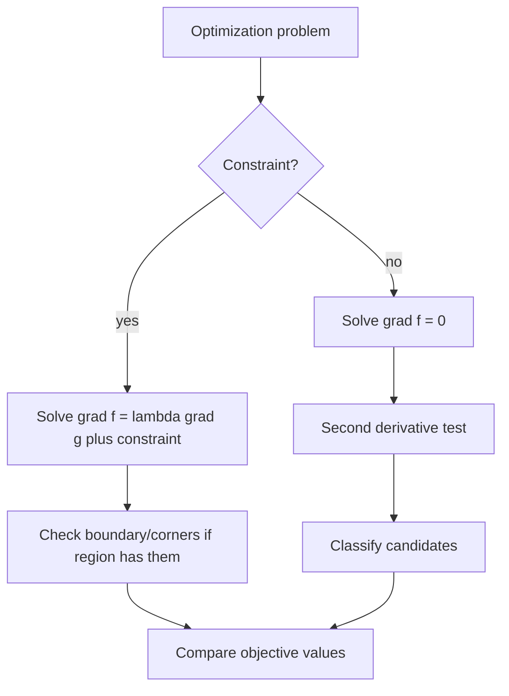

# Extrema and Lagrange Multipliers

Multivariable extrema extend optimization to surfaces and constraints. Without constraints, critical points occur where the gradient is zero or undefined. With constraints, the gradient of the objective must align with the gradient of the constraint at an interior constrained optimum.

The geometry is more important than the algebra. At an unconstrained local maximum or minimum, every first-order direction has zero change. On a constraint curve or surface, only directions tangent to the constraint are allowed, so the objective gradient must be perpendicular to those tangent directions.

## Definitions

For $f(x,y)$, a critical point is a point where

$$
\nabla f(x,y)=\mathbf{0}
$$

or where one of the first partial derivatives fails to exist.

A local maximum occurs at $(a,b)$ if

$$
f(a,b)\ge f(x,y)
$$

for all $(x,y)$ near $(a,b)$. A local minimum is defined with $\le$.

The second derivative discriminant for $f(x,y)$ is

$$
D(a,b)=f_{xx}(a,b)f_{yy}(a,b)-[f_{xy}(a,b)]^2.
$$

For constrained optimization with constraint

$$
g(x,y)=c,
$$

the Lagrange multiplier equations are

$$
\nabla f=\lambda \nabla g,
\qquad
g(x,y)=c.
$$

For more than one constraint, use one multiplier for each constraint:

$$
\nabla f=\lambda\nabla g+\mu\nabla h.
$$

## Key results

The second derivative test for a critical point $(a,b)$ of $f(x,y)$ says:

$$
D=f_{xx}f_{yy}-f_{xy}^2.
$$

If $D\gt 0$ and $f_{xx}\gt 0$, then $(a,b)$ is a local minimum. If $D\gt 0$ and $f_{xx}\lt 0$, then it is a local maximum. If $D\lt 0$, then it is a saddle point. If $D=0$, the test is inconclusive.

This test comes from the quadratic part of the Taylor expansion:

$$
\frac12\left(f_{xx}h^2+2f_{xy}hk+f_{yy}k^2\right).
$$

The sign of this quadratic form determines whether the surface bends up in all directions, down in all directions, or in mixed directions.

For constrained extrema, suppose $f$ has an extremum on the smooth constraint curve $g(x,y)=c$, and $\nabla g\ne \mathbf{0}$. Tangent vectors $\mathbf{v}$ to the constraint satisfy

$$
\nabla g\cdot\mathbf{v}=0.
$$

At a constrained extremum, the directional derivative of $f$ in every allowed tangent direction is zero:

$$
\nabla f\cdot\mathbf{v}=0.
$$

Thus $\nabla f$ and $\nabla g$ are both normal to the same tangent line, so they are parallel:

$$
\nabla f=\lambda\nabla g.
$$

Absolute extrema on closed and bounded regions require checking all candidates: interior critical points, boundary points, corners, and constraint candidates. Lagrange multipliers handle smooth boundary pieces but not automatically corners or nonsmooth boundaries.

The multiplier $\lambda$ often has a sensitivity interpretation. In many applied problems, it measures how the optimal value changes as the constraint level changes, although that interpretation depends on regularity and the specific formulation.

The Hessian matrix organizes the second derivative test:

$$
H=
\begin{bmatrix}
f_{xx} & f_{xy}\\
f_{yx} & f_{yy}
\end{bmatrix}.
$$

At a critical point, the quadratic approximation is

$$
f(a+h,b+k)\approx f(a,b)+\frac12
\begin{bmatrix}h & k\end{bmatrix}
H
\begin{bmatrix}h\\ k\end{bmatrix}.
$$

If this quadratic form is positive in every nonzero direction, the point is a local minimum. If it is negative in every nonzero direction, the point is a local maximum. If it takes both signs, the point is a saddle.

For absolute extrema on a closed disk, rectangle, triangle, or other bounded region, a complete search separates the region into interior and boundary. Interior points use $\nabla f=\mathbf{0}$. Boundary curves may be parametrized, handled with single-variable calculus, or handled with Lagrange multipliers. Corners must be checked directly.

For Lagrange multipliers, the condition $\nabla f=\lambda\nabla g$ is necessary under smoothness assumptions, not automatically sufficient. After solving the system, compare objective values at all feasible candidates. If the feasible set is compact and $f$ is continuous, absolute maximum and minimum values exist.

In three variables with one constraint, the same idea applies. Optimizing $f(x,y,z)$ subject to $g(x,y,z)=c$ gives

$$
\nabla f=\lambda\nabla g,
\qquad
g=c.
$$

With two constraints, the feasible set is often a curve, and the objective gradient lies in the span of both constraint gradients.

Saddle points are common in multivariable calculus. The surface

$$
f(x,y)=x^2-y^2
$$

has $\nabla f(0,0)=\mathbf{0}$, but along the $x$-axis the function is positive and along the $y$-axis it is negative. Therefore every neighborhood of the origin contains both higher and lower values. The second derivative discriminant detects this because

$$
D=f_{xx}f_{yy}-f_{xy}^2=2(-2)-0<0.
$$

Boundary analysis can reduce a multivariable problem to one-variable calculus. On the rectangle $a\le x\le b$, $c\le y\le d$, each edge fixes one variable. For example, on $x=a$, the function becomes $f(a,y)$ with $c\le y\le d$. Critical points on that edge come from differentiating with respect to the remaining variable, and the corner values are checked separately.

Lagrange multipliers have a clear level-curve picture. At a constrained extremum of $f$ on $g=c$, the level curve of $f$ just touches the constraint curve. If the two curves crossed transversely, moving along the constraint would pass to a higher or lower level of $f$, contradicting extremality. Tangency means their normals, the gradients, are parallel.

In applied problems, constraints often encode limited resources. A maximum volume subject to fixed surface area, a minimum cost subject to production requirements, or a shortest distance subject to lying on a curve all fit this pattern. The multiplier equations are only useful after the objective and constraint correctly represent the situation.

## Visual



| Case | Candidate condition | Classification step |
|---|---|---|
| Unconstrained interior | $\nabla f=\mathbf{0}$ | Hessian or second derivative test |
| Closed rectangle | critical points and boundary | compare all values |
| Smooth constraint | $\nabla f=\lambda\nabla g$ | compare feasible candidates |
| Nonsmooth boundary | separate pieces and corners | direct comparison |
| Saddle point | $D\lt 0$ | neither max nor min |

## Worked example 1: classify unconstrained critical points

**Problem.** Find and classify the critical point of

$$
f(x,y)=x^2+xy+y^2-3x-6y.
$$

**Method.**

1. Compute first partial derivatives:

$$
f_x=2x+y-3,
\qquad
f_y=x+2y-6.
$$

2. Set them equal to zero:

$$
2x+y-3=0,
\qquad
x+2y-6=0.
$$

3. Solve the system. From the first equation,

$$
y=3-2x.
$$

4. Substitute into the second:

$$
x+2(3-2x)-6=0.
$$

5. Simplify:

$$
x+6-4x-6=0
\quad\Rightarrow\quad
-3x=0
\quad\Rightarrow\quad
x=0.
$$

6. Then

$$
y=3.
$$

7. Compute second partials:

$$
f_{xx}=2,\qquad f_{yy}=2,\qquad f_{xy}=1.
$$

8. Compute the discriminant:

$$
D=2\cdot2-1^2=3.
$$

Since $D\gt 0$ and $f_{xx}\gt 0$, the point is a local minimum.

**Checked answer.** The function has a local minimum at $(0,3)$. The value is $f(0,3)=9-18=-9$.

## Worked example 2: constrained optimization with Lagrange multipliers

**Problem.** Maximize and minimize

$$
f(x,y)=xy
$$

subject to

$$
x^2+y^2=1.
$$

**Method.**

1. Let

$$
g(x,y)=x^2+y^2.
$$

The constraint is $g=1$.

2. Compute gradients:

$$
\nabla f=\langle y,x\rangle,
\qquad
\nabla g=\langle2x,2y\rangle.
$$

3. Set $\nabla f=\lambda\nabla g$:

$$
y=2\lambda x,
\qquad
x=2\lambda y,
\qquad
x^2+y^2=1.
$$

4. If $x=0$, then the second equation gives $0=2\lambda y$. The constraint forces $y=\pm1$, and then the first equation gives $y=0$, impossible. So $x\ne0$. Similarly $y\ne0$.

5. Multiply the first equation by $y$ and the second by $x$:

$$
y^2=2\lambda xy,
\qquad
x^2=2\lambda xy.
$$

Thus

$$
x^2=y^2.
$$

6. So $y=x$ or $y=-x$.

7. If $y=x$, then

$$
2x^2=1
\quad\Rightarrow\quad
x=\pm\frac{1}{\sqrt2}.
$$

The points are $(1/\sqrt2,1/\sqrt2)$ and $(-1/\sqrt2,-1/\sqrt2)$, with $xy=1/2$.

8. If $y=-x$, the points are $(1/\sqrt2,-1/\sqrt2)$ and $(-1/\sqrt2,1/\sqrt2)$, with $xy=-1/2$.

**Checked answer.** The maximum value is $1/2$, and the minimum value is $-1/2$ on the unit circle.

The results also follow from the identity

$$
(x-y)^2\ge 0
\quad\Rightarrow\quad
x^2+y^2\ge 2xy.
$$

Since $x^2+y^2=1$, this gives $xy\le 1/2$. Similarly, $(x+y)^2\ge 0$ gives $xy\ge -1/2$. These inequalities confirm the Lagrange multiplier values and show they are absolute extrema.

The feasible set is the unit circle, which is closed and bounded, and $f(x,y)=xy$ is continuous. Therefore absolute maximum and minimum values must exist. This justifies comparing the finite list of Lagrange candidates.

If the constraint were not closed or bounded, a finite candidate list might not tell the whole story. Always match the existence argument to the feasible set.

## Code

```python
def f(x, y):
    return x*y

samples = []
for i in range(361):
    import math
    theta = math.radians(i)
    x = math.cos(theta)
    y = math.sin(theta)
    samples.append((f(x, y), x, y))

print(max(samples))
print(min(samples))
```

## Common pitfalls

- Forgetting points where partial derivatives do not exist.
- Using the second derivative test when $D=0$ as if it classified the point.
- Checking only interior critical points on a closed region and missing boundary extrema.
- Applying Lagrange multipliers when $\nabla g=\mathbf{0}$ at a candidate without separate analysis.
- Solving $\nabla f=\lambda\nabla g$ but forgetting the constraint equation.
- Reporting candidates instead of objective values when asked for maxima and minima.

## Connections

- [Partial Derivatives and the Gradient](/math/calculus/partial-derivatives-and-gradient): gradients and Hessian entries drive multivariable optimization.
- [Applications of Derivatives](/math/calculus/applications-of-derivatives): second derivative testing generalizes from one variable.
- [Multiple Integrals](/math/calculus/multiple-integrals): extrema help bound and interpret multivariable integrals.
- [Vector Calculus](/math/calculus/vector-calculus): constrained geometry reappears in surfaces and flux orientation.
