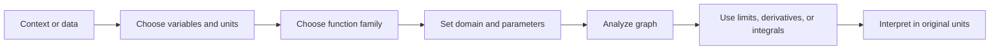

# Functions and Models

Calculus begins by treating a changing quantity as a function: one input determines one output. A function can be described by a formula, graph, table, verbal rule, or data set, and a good calculus student learns to move between those descriptions without changing the underlying relationship. Later topics such as limits, derivatives, integrals, and differential equations all depend on this language.

Models matter because real problems rarely arrive as polished formulas. A falling object, a cooling drink, a population, or a cost curve must first be represented by variables, units, and assumptions. The quality of the calculus that follows depends on the quality of that modeling step: the domain must match the physical situation, the units must be meaningful, and the graph should behave in a way that agrees with the context.

## Definitions

A function $f$ from a domain $D$ to a codomain is a rule assigning exactly one output $f(x)$ to each input $x \in D$. The graph is the set of ordered pairs

$$
\{(x,y): x \in D,\ y=f(x)\}.
$$

The domain is the set of allowable inputs. The range is the set of outputs actually produced. In applications, the domain is not always the natural algebraic domain of the formula. For example, $A(r)=\pi r^2$ is algebraically meaningful for all real $r$, but as an area model for a circle it uses $r\ge 0$.

Important function families include:

- Linear functions: $f(x)=mx+b$, with constant rate of change $m$.
- Power functions: $f(x)=x^p$, including roots and reciprocal powers.
- Polynomials: $p(x)=a_nx^n+\cdots+a_1x+a_0$.
- Rational functions: $r(x)=p(x)/q(x)$, with $q(x)\ne 0$.
- Algebraic functions formed by arithmetic operations, powers, and roots.
- Trigonometric functions such as $\sin x$, $\cos x$, and $\tan x$.
- Exponential and logarithmic functions, used for multiplicative growth and inverse growth scales.

Transformations change a graph while preserving a recognizable shape:

$$
\begin{aligned}
y &= f(x)+c && \text{vertical shift},\\
y &= f(x-c) && \text{horizontal shift right by } c,\\
y &= cf(x) && \text{vertical scale by } c,\\
y &= f(cx) && \text{horizontal scale by } 1/c,\\
y &= -f(x) && \text{reflection across the } x\text{-axis},\\
y &= f(-x) && \text{reflection across the } y\text{-axis}.
\end{aligned}
$$

Composition is $(f\circ g)(x)=f(g(x))$, defined when $g(x)$ lies in the domain of $f$. A function is even if $f(-x)=f(x)$ and odd if $f(-x)=-f(x)$. One-to-one functions pass the horizontal line test and have inverse functions on their ranges.

Two modeling distinctions are worth making early. A discrete model uses inputs such as $n=0,1,2,\dots$ and often appears as a sequence, table, or recurrence. A continuous model allows all inputs in an interval and is the natural setting for derivatives and integrals. A population counted each year may begin as discrete data, but a smooth function can still be useful if the goal is to estimate trends, rates, or accumulated change.

Another distinction is exact description versus approximation. The formula $C=2\pi r$ exactly describes the circumference of an ideal circle. A least-squares line through experimental data is an approximation, and its slope should be interpreted with uncertainty. Calculus uses both kinds of formulas, but a model built from data should always be checked against the scale and scatter of that data.

## Key results

For a line through two distinct points $(x_1,y_1)$ and $(x_2,y_2)$, the constant rate of change is

$$
m=\frac{y_2-y_1}{x_2-x_1}.
$$

Every other point $(x,y)$ on the same line satisfies

$$
\frac{y-y_1}{x-x_1}=m,
$$

so the point-slope equation is

$$
y-y_1=m(x-x_1).
$$

Solving for $y$ gives $y=mx+b$. This is more than an algebra formula: it is the prototype for local linear approximation. When a differentiable curve is viewed under enough magnification, it behaves almost like its tangent line, and the slope of that tangent line is the derivative.

Function composition is associative where all expressions are defined:

$$
(f\circ(g\circ h))(x)=((f\circ g)\circ h)(x).
$$

The proof is only careful notation:

$$
(f\circ(g\circ h))(x)=f((g\circ h)(x))=f(g(h(x)))=((f\circ g)\circ h)(x).
$$

However, composition is usually not commutative. In general, $f(g(x))$ and $g(f(x))$ have different formulas, domains, and interpretations. This matters later in the chain rule, where the order of inside and outside functions controls the derivative.

When fitting a simple model, the main questions are:

1. What are the input and output variables?
2. What units do they use?
3. What domain is meaningful?
4. Is the expected change additive, multiplicative, periodic, saturating, or constrained?
5. Does the model interpolate within known data, or extrapolate beyond it?

Interpolation is usually safer than extrapolation because it stays between observed values. Extrapolation may be useful, but it depends heavily on whether the chosen function family still matches the real mechanism outside the data range.

Units provide a strong consistency check. If $x$ is measured in seconds and $f(x)$ in meters, then a slope has units meters per second. If $A(r)=\pi r^2$ gives square meters, then $A'(r)=2\pi r$ has units square meters per meter, which simplifies to meters and represents area gained per unit increase in radius. Dimensional reasoning catches many modeling mistakes before any graphing or differentiation begins.

Graphical features also carry mathematical information. Intercepts identify where a quantity is zero. Increasing and decreasing intervals describe the sign of average or instantaneous change. Concavity suggests whether growth is accelerating or slowing. Asymptotes often encode physical limits, such as saturation or forbidden input values. Even before formal calculus, reading those features prepares the later derivative and integral interpretations.

## Visual

| Description | Typical model | Signature behavior | Calculus role |
|---|---:|---|---|
| Constant rate | $mx+b$ | Equal input changes give equal output changes | Slope is constant |
| Power scaling | $kx^p$ | Output responds by powers of input size | Derivatives lower powers; integrals raise powers |
| Exponential growth | $ab^x$ or $Ae^{kx}$ | Equal input changes multiply output | Derivative is proportional to value |
| Logarithmic scale | $a+b\ln x$ | Rapid early growth, slow later growth | Inverse of exponential behavior |
| Periodic motion | $A\sin(Bx+C)+D$ | Repeating cycles | Derivatives shift phase |
| Rational constraint | $p(x)/q(x)$ | Holes and asymptotes possible | Limits diagnose behavior |

The same modeling pipeline appears throughout calculus:



## Worked example 1: build and interpret a linear model

**Problem.** Suppose Fahrenheit temperature $F$ depends linearly on Celsius temperature $C$. The calibration points are $(0,32)$ and $(100,212)$. Find the model, interpret the slope, and compute the Celsius temperature corresponding to $68^\circ$F.

**Method.**

1. Use the two calibration points to compute the slope:

$$
m=\frac{212-32}{100-0}=\frac{180}{100}=\frac95.
$$

2. Use point-slope form with $(0,32)$:

$$
F-32=\frac95(C-0).
$$

3. Solve for $F$:

$$
F=\frac95C+32.
$$

4. Interpret the slope. A change of $1^\circ$C corresponds to a change of $9/5^\circ$F. The intercept $32$ says that $0^\circ$C is $32^\circ$F.

5. Set $F=68$ and solve for $C$:

$$
\begin{aligned}
68 &= \frac95C+32\\
36 &= \frac95C\\
C &= 36\cdot\frac59\\
C &= 20.
\end{aligned}
$$

**Checked answer.** The model is $F=\frac95C+32$, and $68^\circ$F corresponds to $20^\circ$C. Substitution checks it:

$$
\frac95(20)+32=36+32=68.
$$

## Worked example 2: composition, domain, and symmetry

**Problem.** Let $f(x)=\sqrt{x}$ and $g(x)=x^2-4$. Find $(f\circ g)(x)$ and its domain. Then determine whether $h(x)=x^4-3x^2+1$ is even, odd, or neither.

**Method for composition.**

1. Place $g(x)$ inside $f$:

$$
(f\circ g)(x)=f(g(x))=\sqrt{x^2-4}.
$$

2. Require the radicand to be nonnegative:

$$
x^2-4\ge 0.
$$

3. Factor:

$$
(x-2)(x+2)\ge 0.
$$

4. The product is nonnegative outside the roots, so

$$
x\le -2 \quad\text{or}\quad x\ge 2.
$$

Thus the domain is $(-\infty,-2]\cup[2,\infty)$.

**Method for symmetry.**

1. Compute $h(-x)$:

$$
h(-x)=(-x)^4-3(-x)^2+1.
$$

2. Simplify powers:

$$
h(-x)=x^4-3x^2+1.
$$

3. Compare with $h(x)$:

$$
h(-x)=h(x).
$$

**Checked answer.** $(f\circ g)(x)=\sqrt{x^2-4}$ with domain $(-\infty,-2]\cup[2,\infty)$. The function $h$ is even, so its graph is symmetric about the $y$-axis.

## Code

```python
from math import sqrt

def celsius_to_fahrenheit(c):
    return (9 / 5) * c + 32

def compose_domain_sample(x):
    radicand = x * x - 4
    if radicand < 0:
        return None
    return sqrt(radicand)

for c in [0, 20, 100]:
    print(c, celsius_to_fahrenheit(c))

for x in [-3, -1, 0, 2, 5]:
    print(x, compose_domain_sample(x))
```

## Common pitfalls

- Treating the algebraic domain as the application domain. A formula may allow negative inputs while the model does not.
- Forgetting that $f(x-c)$ shifts right by $c$, not left by $c$.
- Composing functions in the wrong order. $f(g(x))$ means apply $g$ first, then $f$.
- Checking symmetry by looking only at a few values. Use $f(-x)=f(x)$ or $f(-x)=-f(x)$ algebraically.
- Ignoring units. A slope is not just a number; it has output units per input unit.
- Extrapolating a model far beyond its data without checking whether the behavior remains realistic.

## Connections

- [Limits and Continuity](/math/calculus/limits-and-continuity): functions are the objects whose limiting behavior is studied.
- [Derivatives and Rates](/math/calculus/derivatives-and-rates): the slope idea from linear models becomes instantaneous rate of change.
- [Exponential Log and Inverse Functions](/math/calculus/exponential-log-inverse-functions): inverse and growth models become central function families.
- [Applications of Derivatives](/math/calculus/applications-of-derivatives): graphs and transformations support monotonicity, concavity, and optimization.
