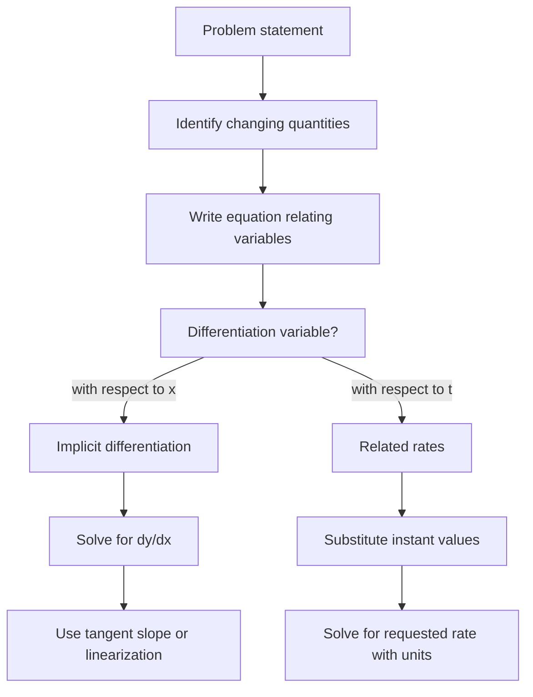

# Implicit Differentiation and Linearization

Implicit differentiation handles curves described by equations that do not solve neatly for $y$ as a function of $x$. Instead of rewriting the equation first, we differentiate both sides and remember that $y$ depends on $x$. The chain rule then produces factors of $dy/dx$.

The same idea drives related rates and linearization. In related rates, several quantities change with time and are tied together by an equation. In linearization, a differentiable curve is replaced near a point by its tangent line. Both topics ask for careful attention to variables, units, and the moment at which the information is evaluated.

## Definitions

An implicit equation has the form

$$
F(x,y)=0
$$

instead of $y=f(x)$. If $y$ is differentiable as a function of $x$, then differentiating $F(x,y)=0$ with respect to $x$ uses the chain rule whenever a term contains $y$.

For example,

$$
\frac{d}{dx}(y^3)=3y^2\frac{dy}{dx}.
$$

If $F_x$ and $F_y$ are partial derivatives and $F_y\ne 0$, implicit differentiation gives

$$
\frac{dy}{dx}=-\frac{F_x}{F_y}.
$$

A related rates problem uses time $t$ as the hidden independent variable. If $x=x(t)$ and $y=y(t)$, then differentiating an equation such as $x^2+y^2=25$ gives

$$
2x\frac{dx}{dt}+2y\frac{dy}{dt}=0.
$$

Linearization of $f$ at $a$ is the tangent-line approximation

$$
L(x)=f(a)+f'(a)(x-a).
$$

In differential notation,

$$
dy=f'(x)\,dx,
$$

which estimates the change in $y$ caused by a small change $dx$.

The symbol $dx$ represents a chosen small input change in this setting, while $dy$ is the corresponding linear estimate for the output change. The actual change is

$$
\Delta y=f(x+dx)-f(x).
$$

Usually $dy$ and $\Delta y$ are close but not identical. Linearization keeps only the tangent-line behavior and ignores curvature. This is why the approximation is strongest near the base point and weaker farther away.

Implicit equations can describe more than one branch. The circle $x^2+y^2=25$ is not globally the graph of one function $y=f(x)$, but near most points it splits into an upper branch and a lower branch. Implicit differentiation finds the slope of whichever local branch passes through the point being studied.

## Key results

Implicit differentiation works because ordinary differentiation follows the chain rule. If $F(x,y)=0$ and $y=y(x)$, then the composite function $F(x,y(x))$ is constantly zero. Differentiating gives

$$
F_x(x,y)\cdot 1+F_y(x,y)\frac{dy}{dx}=0.
$$

Solving for $dy/dx$ gives

$$
\frac{dy}{dx}=-\frac{F_x}{F_y},
$$

as long as $F_y\ne 0$. If $F_y=0$, the curve may have a vertical tangent, fail to define $y$ locally as a function of $x$, or require a separate analysis.

Related rates problems have a consistent structure:

1. Draw or describe the changing quantities.
2. Assign variables and units.
3. Write an equation connecting the variables.
4. Differentiate with respect to time.
5. Substitute values for the specific instant after differentiating.
6. Solve for the requested rate and include units.

The instruction to substitute after differentiating is important. If a quantity such as $x=3$ only at one instant, replacing $x$ by $3$ before differentiating would incorrectly make $dx/dt=0$.

Linearization is justified by differentiability:

$$
f(x)=f(a)+f'(a)(x-a)+\text{error},
$$

where the error is small compared with $\vert x-a\vert $ as $x\to a$. This makes $L(x)$ useful for quick approximations and for deriving Newton's method.

For functions with a known second derivative, Taylor's theorem gives a more quantitative picture:

$$
f(x)=f(a)+f'(a)(x-a)+\frac{f''(c)}{2}(x-a)^2
$$

for some $c$ between $a$ and $x$. The last term is the error in the linear approximation. This explains why halving the distance from the base point often makes the linearization error about four times smaller when the second derivative stays bounded.

The formula $\frac{dy}{dx}=-F_x/F_y$ also reveals vertical and horizontal tangent candidates. If $F_y=0$ and $F_x\ne 0$, then solving for $dy/dx$ breaks down and the tangent may be vertical. If $F_x=0$ and $F_y\ne 0$, then $dy/dx=0$ and the tangent is horizontal. If both partial derivatives vanish, the point may be singular and needs a separate local analysis.

Linearization is also a practical estimation tool. To approximate $\sqrt{4.1}$, use $f(x)=\sqrt{x}$ at $a=4$. Since $f(4)=2$ and $f'(x)=1/(2\sqrt{x})$, we have $f'(4)=1/4$. Thus

$$
L(4.1)=2+\frac14(0.1)=2.025.
$$

The actual value is close because $4.1$ is near $4$. The point is not to replace calculators, but to understand how local slope predicts nearby change and how errors depend on curvature.

In related rates, signs should be assigned from the actual motion, not from a memorized convention. A distance increasing from a wall has positive derivative; a height decreasing has negative derivative. Choosing variables as positive lengths is fine, but the derivatives of those lengths can still be negative.

A final check is reasonableness. If an answer says the top of a ladder is moving upward while the bottom slides away, the sign is probably wrong. If a linear approximation is requested near $a=4$ but the estimate uses a tangent at $a=9$, the base point is probably wrong. These checks are quick and often catch errors before algebra is reviewed line by line in homework, labs, or exams.

They also force the final number back into the original situation.

## Visual



| Technique | Given relationship | Main derivative idea | Typical output |
|---|---|---|---|
| Implicit differentiation | $F(x,y)=0$ | Treat $y$ as $y(x)$ | Slope $dy/dx$ |
| Related rates | Equation among changing variables | Differentiate with respect to $t$ | A rate such as $dx/dt$ |
| Linearization | Explicit function near $a$ | Tangent line | Approximate value |
| Differentials | Small input change $dx$ | $dy=f'(x)dx$ | Approximate change |

## Worked example 1: tangent slope on an implicit curve

**Problem.** Find $dy/dx$ for

$$
x^2+xy+y^2=7
$$

and find the tangent line at $(1,2)$.

**Method.**

1. Differentiate both sides with respect to $x$:

$$
\frac{d}{dx}(x^2)+\frac{d}{dx}(xy)+\frac{d}{dx}(y^2)=\frac{d}{dx}(7).
$$

2. Compute each term. The product rule gives

$$
\frac{d}{dx}(xy)=x\frac{dy}{dx}+y.
$$

Also,

$$
\frac{d}{dx}(y^2)=2y\frac{dy}{dx}.
$$

3. Substitute into the differentiated equation:

$$
2x+x\frac{dy}{dx}+y+2y\frac{dy}{dx}=0.
$$

4. Group terms containing $dy/dx$:

$$
(x+2y)\frac{dy}{dx}+2x+y=0.
$$

5. Solve:

$$
\frac{dy}{dx}=-\frac{2x+y}{x+2y}.
$$

6. Evaluate at $(1,2)$:

$$
m=-\frac{2(1)+2}{1+2(2)}=-\frac45.
$$

7. Write the tangent line:

$$
y-2=-\frac45(x-1).
$$

**Checked answer.** The slope is $-4/5$, and the tangent line is $y-2=-\frac45(x-1)$.

## Worked example 2: related rates for a sliding ladder

**Problem.** A $10$ ft ladder leans against a wall. The bottom slides away from the wall at $2$ ft/s. How fast is the top sliding down when the bottom is $6$ ft from the wall?

**Method.**

1. Let $x$ be the bottom's distance from the wall and $y$ be the top's height. The ladder length is constant:

$$
x^2+y^2=10^2.
$$

2. The given rate is

$$
\frac{dx}{dt}=2\ \text{ft/s}.
$$

We want $dy/dt$ when $x=6$.

3. Find $y$ at that instant:

$$
6^2+y^2=100
\quad\Rightarrow\quad
y^2=64
\quad\Rightarrow\quad
y=8.
$$

4. Differentiate the equation with respect to $t$:

$$
2x\frac{dx}{dt}+2y\frac{dy}{dt}=0.
$$

5. Substitute the instant values:

$$
2(6)(2)+2(8)\frac{dy}{dt}=0.
$$

6. Solve:

$$
24+16\frac{dy}{dt}=0
\quad\Rightarrow\quad
\frac{dy}{dt}=-\frac{24}{16}=-\frac32.
$$

**Checked answer.** The top slides down at $3/2$ ft/s. The negative sign indicates decreasing height.

A unit check confirms the result. The expression

$$
\frac{dy}{dt}=-\frac{x}{y}\frac{dx}{dt}
$$

has dimension

$$
\frac{\text{ft}}{\text{ft}}\cdot\frac{\text{ft}}{\text{s}}
=\frac{\text{ft}}{\text{s}}.
$$

The negative sign also fits the geometry: as the bottom distance $x$ increases, the top height $y$ must decrease because the ladder length is fixed.

## Code

```python
def tangent_line_implicit(x0, y0):
    slope = -(2*x0 + y0) / (x0 + 2*y0)
    intercept = y0 - slope * x0
    return slope, intercept

def ladder_top_rate(x, dx_dt, length=10):
    y = (length**2 - x**2) ** 0.5
    dy_dt = -(x * dx_dt) / y
    return y, dy_dt

print(tangent_line_implicit(1, 2))
print(ladder_top_rate(6, 2))
```

## Common pitfalls

- Forgetting to multiply by $dy/dx$ when differentiating a term containing $y$.
- Substituting instant values before differentiating in a related rates problem.
- Losing the sign of a rate. A negative value often has a physical meaning, such as height decreasing.
- Using the ladder length as a variable even though it is constant in the problem.
- Treating linearization as exact. It is an approximation that improves near the base point.
- Forgetting that implicit slopes may fail where the denominator in $dy/dx$ is zero.
- Using $dy/dx$ in a related rates problem when the requested rates are with respect to time. Write $dx/dt$, $dy/dt$, or $dV/dt$ as appropriate.
- Not drawing a diagram for geometric problems. The equation often comes directly from a right triangle, circle, cone, or similar figure.
- Reporting a rate without units or direction. "Down at $3/2$ ft/s" is clearer than just $-3/2$.
- Applying linearization far from the base point without checking curvature or error.

## Connections

- [Differentiation Rules](/math/calculus/differentiation-rules): implicit work depends heavily on product and chain rules.
- [Applications of Derivatives](/math/calculus/applications-of-derivatives): tangent lines and rates support graph analysis and applied problems.
- [Optimization Newton and Antiderivatives](/math/calculus/optimization-newton-antiderivatives): linearization leads naturally to Newton's method.
- [Partial Derivatives and the Gradient](/math/calculus/partial-derivatives-and-gradient): the formula $dy/dx=-F_x/F_y$ previews multivariable derivatives.
