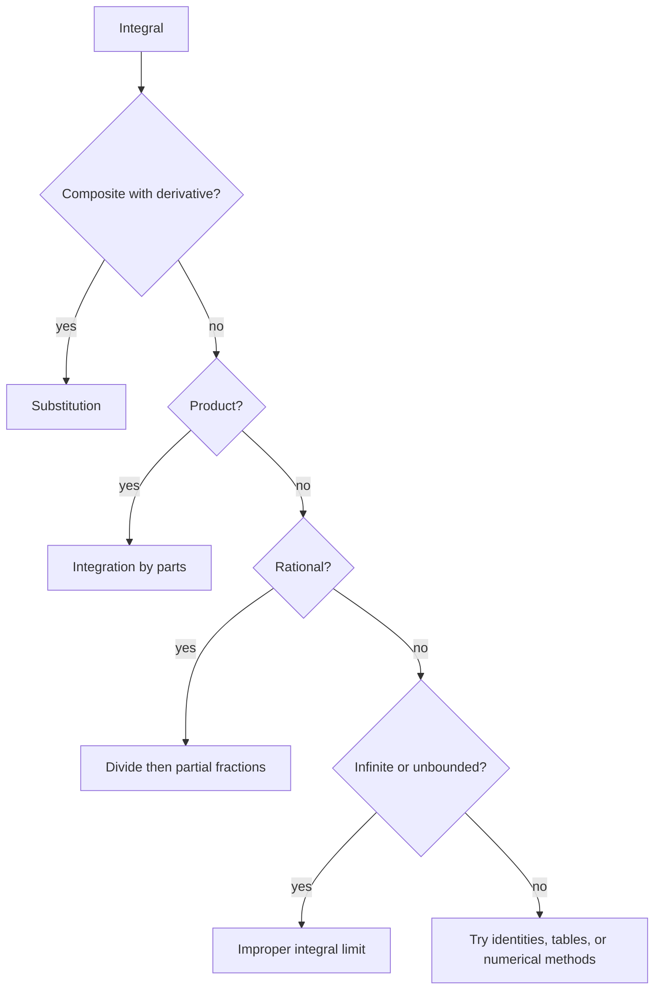

# Integration Techniques and Improper Integrals

Integration techniques are pattern-recognition tools for finding antiderivatives and evaluating definite integrals. Substitution reverses the chain rule. Integration by parts reverses the product rule. Partial fractions break rational functions into simpler pieces. Improper integrals extend definite integrals to infinite intervals and unbounded integrands through limits.

No single technique solves every integral. The work is to identify structure, transform the integral without changing its value, and check whether the result is an antiderivative, a convergent improper integral, or a divergent expression.

## Definitions

Substitution uses a new variable $u=g(x)$ and $du=g'(x)\,dx$. It is most useful when the integrand contains a composite function and a constant multiple of the inside derivative.

Integration by parts is

$$
\int u\,dv=uv-\int v\,du.
$$

It follows from the product rule:

$$
(uv)'=u'v+uv'.
$$

Partial fractions apply to rational functions

$$
\frac{p(x)}{q(x)}
$$

after polynomial division if necessary. The denominator is factored, and the fraction is written as a sum of simpler rational terms.

An improper integral over an infinite interval is defined by a limit:

$$
\int_a^\infty f(x)\,dx
=\lim_{b\to\infty}\int_a^b f(x)\,dx.
$$

An integral with an infinite discontinuity at $a$ is also improper:

$$
\int_a^b f(x)\,dx
=\lim_{c\to a^+}\int_c^b f(x)\,dx.
$$

If the defining limit exists as a finite number, the improper integral converges. Otherwise it diverges.

## Key results

Substitution for definite integrals changes the limits as well as the integrand. If $u=g(x)$, then

$$
\int_a^b f(g(x))g'(x)\,dx
=
\int_{g(a)}^{g(b)} f(u)\,du.
$$

Changing limits prevents accidental substitution back to $x$.

Integration by parts is useful when the integrand is a product and differentiating one factor makes it simpler. A common guideline for choosing $u$ is LIATE: logarithmic, inverse trigonometric, algebraic, trigonometric, exponential. This is only a heuristic; the real test is whether the remaining integral becomes simpler.

For rational functions, factor the denominator into linear and irreducible quadratic factors. Repeated factors require repeated terms. For example,

$$
\frac{1}{(x-1)^2(x+2)}
=\frac{A}{x-1}+\frac{B}{(x-1)^2}+\frac{C}{x+2}.
$$

The $p$-integral test for improper integrals states:

$$
\int_1^\infty \frac{1}{x^p}\,dx
\begin{cases}
\text{converges}, & p>1,\\
\text{diverges}, & p\le 1.
\end{cases}
$$

Near zero,

$$
\int_0^1 \frac{1}{x^p}\,dx
\begin{cases}
\text{converges}, & p<1,\\
\text{diverges}, & p\ge 1.
\end{cases}
$$

Comparison tests extend these facts. If $0\le f(x)\le g(x)$ and $\int g$ converges, then $\int f$ converges. If $0\le g(x)\le f(x)$ and $\int g$ diverges, then $\int f$ diverges.

Trigonometric integrals often use identities such as

$$
\sin^2 x=\frac{1-\cos 2x}{2},
\qquad
\cos^2 x=\frac{1+\cos 2x}{2}.
$$

Trigonometric substitution converts radicals such as $\sqrt{a^2-x^2}$ using $x=a\sin\theta$, but it must be paired with triangle-based back-substitution or careful inverse trigonometric notation.

A useful first step is to decide whether the goal is an antiderivative or a definite value. Some definite integrals are easiest through symmetry, geometry, or a substitution that changes the bounds. Some antiderivatives are not elementary at all, even though the corresponding definite integral can be approximated accurately. For example, $\int e^{-x^2}\,dx$ has no elementary antiderivative, but definite integrals involving $e^{-x^2}$ are central in probability.

Substitution should be checked by differentiating the chosen $u$. If $u=x^2+1$, then $du=2x\,dx$. The integrand must contain $x\,dx$ up to a constant factor, or it must be transformed in another way. If the remaining expression still contains both $x$ and $u$, the substitution has not completed the conversion.

Integration by parts may need to be repeated. Integrals such as $\int x^2e^x\,dx$ reduce the power of $x$ one step at a time. Integrals such as $\int e^x\sin x\,dx$ cycle back to the original integral; in that case, apply parts twice and solve algebraically for the original integral.

Improper integrals require checking every problematic point. If an integral is improper at both endpoints, split it:

$$
\int_a^b f(x)\,dx
=\int_a^c f(x)\,dx+\int_c^b f(x)\,dx.
$$

Each piece must converge. If either piece diverges, the original improper integral diverges. Cancellation across an infinite discontinuity is not allowed unless the problem specifically asks for a Cauchy principal value, which is a different concept.

Comparison tests usually need nonnegative functions. If the integrand changes sign, absolute convergence may be studied by applying comparison to $\vert f(x)\vert $. Conditional convergence is more subtle and appears again in series.

Partial fractions require careful algebra before integration starts. If the denominator has an irreducible quadratic such as $x^2+1$, the numerator over that factor should be linear:

$$
\frac{Ax+B}{x^2+1}.
$$

If the denominator contains $(x^2+1)^2$, include both

$$
\frac{Ax+B}{x^2+1}
\quad\text{and}\quad
\frac{Cx+D}{(x^2+1)^2}.
$$

Missing repeated-factor terms is a common reason partial fraction systems fail.

For trigonometric integrals, parity guides the method. If a power of sine is odd, save one sine factor and convert the remaining even power using $\sin^2 x=1-\cos^2 x$. If a power of cosine is odd, save one cosine factor and convert the remaining even power using $\cos^2 x=1-\sin^2 x$. If both powers are even, half-angle identities are often the cleanest route.

Numerical integration is also a legitimate technique when an exact antiderivative is unavailable or unnecessary. Midpoint, trapezoidal, and Simpson rules approximate definite integrals from function values. They do not replace convergence checks for improper integrals, but they are useful after the interval has been made finite and the integrand is well behaved.

## Visual

| Integral pattern | Likely technique | Reason |
|---|---|---|
| Composite with inside derivative | substitution | reverses chain rule |
| Product where one factor simplifies | integration by parts | reverses product rule |
| Rational function | partial fractions | decomposes denominator factors |
| Powers of sine and cosine | trig identities or substitution | uses parity and identities |
| Radical $a^2-x^2$ | trig substitution | matches sine/cosine identity |
| Infinite interval or vertical asymptote | improper limit | integral defined by convergence |



## Worked example 1: integration by parts

**Problem.** Evaluate

$$
\int x e^x\,dx.
$$

**Method.**

1. Choose

$$
u=x,\qquad dv=e^x\,dx.
$$

2. Then

$$
du=dx,\qquad v=e^x.
$$

3. Apply integration by parts:

$$
\int u\,dv=uv-\int v\,du.
$$

4. Substitute:

$$
\int x e^x\,dx=xe^x-\int e^x\,dx.
$$

5. Integrate the remaining term:

$$
xe^x-e^x+C.
$$

6. Factor if desired:

$$
e^x(x-1)+C.
$$

**Checked answer.** Differentiate:

$$
\frac{d}{dx}\left(e^x(x-1)\right)=e^x(x-1)+e^x=e^x x.
$$

So the antiderivative is correct.

## Worked example 2: improper integral convergence

**Problem.** Determine whether

$$
\int_1^\infty \frac{1}{x^3}\,dx
$$

converges, and evaluate it if it does.

**Method.**

1. Write the integral as a limit:

$$
\int_1^\infty \frac{1}{x^3}\,dx
=\lim_{b\to\infty}\int_1^b x^{-3}\,dx.
$$

2. Find an antiderivative:

$$
\int x^{-3}\,dx=\frac{x^{-2}}{-2}=-\frac{1}{2x^2}.
$$

3. Evaluate from $1$ to $b$:

$$
\left[-\frac{1}{2x^2}\right]_1^b
=-\frac{1}{2b^2}-\left(-\frac12\right).
$$

4. Simplify:

$$
\frac12-\frac{1}{2b^2}.
$$

5. Take the limit:

$$
\lim_{b\to\infty}\left(\frac12-\frac{1}{2b^2}\right)=\frac12.
$$

**Checked answer.** The improper integral converges and equals $1/2$. This agrees with the $p$-integral test because $p=3\gt 1$.

The finite value has a geometric interpretation: the tail from $1$ to infinity has total area $1/2$ even though the interval is infinitely long. The function decreases fast enough that the accumulated area remains finite. In contrast, $1/x$ decreases too slowly:

$$
\int_1^\infty \frac1x\,dx
=\lim_{b\to\infty}\ln b
$$

diverges.

The comparison with $1/x$ is one of the most important benchmarks in calculus. Powers just larger than $1$ converge on $[1,\infty)$, while $1/x$ and slower decays diverge. On the other hand, near $0$ the inequality reverses: $1/\sqrt{x}$ is integrable near $0$, but $1/x$ is not.

A final verification step is to differentiate any proposed antiderivative. For definite integrals, also check whether the numerical sign and size are plausible. A positive integrand on a positive-length interval cannot have a negative integral, and a bounded integrand satisfies simple area bounds such as

$$
m(b-a)\le \int_a^b f(x)\,dx\le M(b-a)
$$

when $m\le f(x)\le M$ throughout the interval under consideration carefully.

## Code

```python
def midpoint_integral(f, a, b, n=10000):
    h = (b - a) / n
    total = 0.0
    for i in range(n):
        total += f(a + (i + 0.5) * h)
    return total * h

def improper_tail_estimate(B):
    return midpoint_integral(lambda x: 1 / x**3, 1, B) + 1 / (2 * B**2)

for B in [5, 10, 50]:
    print(B, improper_tail_estimate(B))
```

## Common pitfalls

- Using substitution without changing $dx$ into $du$.
- Forgetting to change bounds in a definite integral after substitution.
- Choosing $u$ in integration by parts so the remaining integral becomes harder.
- Skipping polynomial division before partial fractions when the numerator degree is at least the denominator degree.
- Treating an improper integral as ordinary endpoint substitution. The limit is part of the definition.
- Assuming a decreasing positive integrand always has a finite area over an infinite interval.
- Forgetting absolute values in antiderivatives such as $\int 1/x\,dx=\ln\vert x\vert +C$.

## Connections

- [Definite Integrals and the Fundamental Theorem](/math/calculus/definite-integrals-fundamental-theorem): techniques depend on antiderivatives and definite integral evaluation.
- [Applications of Integrals](/math/calculus/applications-of-integrals): applied problems often require selecting an integration technique.
- [Sequences and Series](/math/calculus/sequences-and-series): improper integral comparison supports the integral test.
- [Power Series and Taylor Polynomials](/math/calculus/power-series-and-taylor-polynomials): series can approximate difficult integrals.
