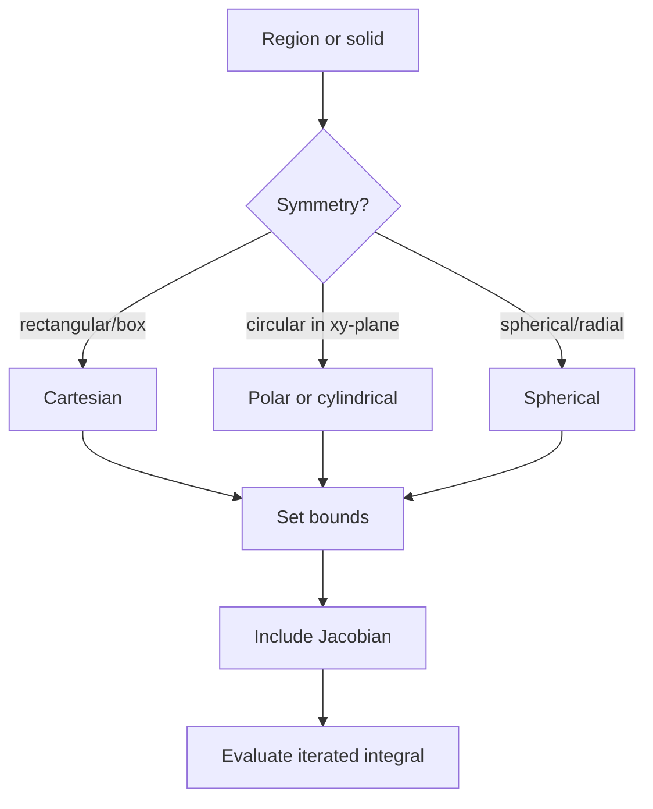

# Multiple Integrals

Multiple integrals extend accumulation to regions in the plane and solids in space. A double integral adds contributions over area. A triple integral adds contributions over volume. The same slice-and-sum idea from single-variable integration remains, but the geometry of the region becomes more important.

These integrals compute volume, mass, charge, probability, average value, and moments. They also prepare for vector calculus, where flux and circulation compare integrals over regions, surfaces, and boundaries.

## Definitions

The double integral of $f(x,y)$ over a region $D$ is

$$
\iint_D f(x,y)\,dA.
$$

If $f(x,y)\ge 0$, it represents volume under the surface $z=f(x,y)$ above $D$.

An iterated integral over a type I region

$$
D=\{(x,y): a\le x\le b,\ g_1(x)\le y\le g_2(x)\}
$$

is

$$
\int_a^b\int_{g_1(x)}^{g_2(x)} f(x,y)\,dy\,dx.
$$

A triple integral over a solid $E$ is

$$
\iiint_E f(x,y,z)\,dV.
$$

In polar coordinates,

$$
x=r\cos\theta,\qquad y=r\sin\theta,\qquad dA=r\,dr\,d\theta.
$$

In cylindrical coordinates,

$$
x=r\cos\theta,\qquad y=r\sin\theta,\qquad z=z,\qquad dV=r\,dr\,d\theta\,dz.
$$

In spherical coordinates,

$$
x=\rho\sin\phi\cos\theta,\quad
y=\rho\sin\phi\sin\theta,\quad
z=\rho\cos\phi,
$$

and

$$
dV=\rho^2\sin\phi\,d\rho\,d\phi\,d\theta.
$$

## Key results

Fubini's Theorem says that if $f$ is continuous on a rectangular region, then a double integral can be evaluated as an iterated integral in either order:

$$
\iint_R f\,dA
=
\int_a^b\int_c^d f(x,y)\,dy\,dx
=
\int_c^d\int_a^b f(x,y)\,dx\,dy.
$$

For nonrectangular regions, reversing order requires rewriting the bounds. This is often the hardest part of the problem.

The average value of $f$ over a region $D$ is

$$
f_{\text{avg}}=\frac{1}{\operatorname{Area}(D)}\iint_D f\,dA.
$$

Mass with density $\rho(x,y)$ over a lamina $D$ is

$$
m=\iint_D \rho(x,y)\,dA.
$$

Moments are

$$
M_x=\iint_D y\rho(x,y)\,dA,
\qquad
M_y=\iint_D x\rho(x,y)\,dA.
$$

The center of mass is

$$
\bar{x}=\frac{M_y}{m},
\qquad
\bar{y}=\frac{M_x}{m}.
$$

The Jacobian factor is essential in coordinate changes. Polar coordinates use $r$ because a small polar rectangle has area approximately $r\,dr\,d\theta$. Spherical coordinates use $\rho^2\sin\phi$ because the small volume element expands with radius and angle.

Symmetry can simplify multiple integrals. If a density or integrand is odd over a symmetric region, the integral may be zero. If the region and integrand are radially symmetric, polar, cylindrical, or spherical coordinates often reduce the algebra.

Changing the order of integration is a geometric skill. The original bounds describe the region in one slicing direction. To reverse the order, draw or describe the same region with the other variable as the outer variable. For a triangle, this often means solving a boundary line for the other variable. For regions bounded by curves, it may require splitting into pieces.

A double integral can also represent area:

$$
\operatorname{Area}(D)=\iint_D 1\,dA.
$$

A triple integral can represent volume:

$$
\operatorname{Volume}(E)=\iiint_E 1\,dV.
$$

These formulas are useful because complicated regions may be easier to measure by integration than by elementary geometry.

For probability densities, a nonnegative function $p(x,y)$ over a region has total probability

$$
\iint_D p(x,y)\,dA=1.
$$

Expected values are weighted integrals, such as

$$
E[X]=\iint_D x\,p(x,y)\,dA.
$$

This is the same center-of-mass idea with probability replacing physical mass.

Coordinate changes require both new bounds and the Jacobian. It is not enough to replace $x^2+y^2$ with $r^2$; the area element changes too. The factor $r$ in polar coordinates reflects the fact that equal angle increments cover larger arc lengths farther from the origin.

In spherical coordinates, convention matters. Here $\phi$ is measured down from the positive $z$-axis and $\theta$ is measured in the $xy$-plane. Some fields use a different convention, so formulas should always be matched to the notation in the problem.

Triple integrals require the same region-first thinking. A solid under a surface might be described by $0\le z\le f(x,y)$ over a base region $D$. A solid between two surfaces might use $g_1(x,y)\le z\le g_2(x,y)$. For cylindrical or spherical solids, the angular and radial bounds often describe the shape more simply than Cartesian inequalities.

The order of integration can change difficulty dramatically. An integral such as

$$
\int_0^1\int_x^1 e^{y^2}\,dy\,dx
$$

is hard in the given order because $e^{y^2}$ has no elementary antiderivative in $y$. Reversing the triangular region gives

$$
\int_0^1\int_0^y e^{y^2}\,dx\,dy,
$$

which is easier because the inner integral is with respect to $x$.

Moments of inertia are another application. For a lamina with density $\rho$, the moment of inertia about the $x$-axis is

$$
I_x=\iint_D y^2\rho(x,y)\,dA,
$$

and about the $y$-axis is

$$
I_y=\iint_D x^2\rho(x,y)\,dA.
$$

The extra squared distance factor weights mass farther from the axis more heavily.

Bounds should be checked by projecting the region. In a double integral, the outer bounds describe the shadow of the region on one axis. In a triple integral, one common approach is to project the solid onto a coordinate plane, describe that base region, and then give lower and upper bounds for the third variable.

## Visual

| Coordinates | Best for | Area/volume element |
|---|---|---|
| Cartesian $(x,y,z)$ | boxes, triangles, simple graphs | $dA=dx\,dy$, $dV=dx\,dy\,dz$ |
| Polar $(r,\theta)$ | disks, sectors, circles | $dA=r\,dr\,d\theta$ |
| Cylindrical $(r,\theta,z)$ | cylinders and vertical symmetry | $dV=r\,dr\,d\theta\,dz$ |
| Spherical $(\rho,\phi,\theta)$ | balls, cones, radial symmetry | $dV=\rho^2\sin\phi\,d\rho\,d\phi\,d\theta$ |



## Worked example 1: double integral over a triangle

**Problem.** Evaluate

$$
\iint_D (x+2y)\,dA
$$

where $D$ is the triangle bounded by $x=0$, $y=0$, and $x+y=1$.

**Method.**

1. Describe the region:

$$
0\le x\le 1,
\qquad
0\le y\le 1-x.
$$

2. Set up the iterated integral:

$$
\int_0^1\int_0^{1-x}(x+2y)\,dy\,dx.
$$

3. Integrate with respect to $y$:

$$
\int_0^{1-x}(x+2y)\,dy
=\left[xy+y^2\right]_0^{1-x}.
$$

4. Substitute $y=1-x$:

$$
x(1-x)+(1-x)^2.
$$

5. Simplify:

$$
x-x^2+1-2x+x^2=1-x.
$$

6. Integrate with respect to $x$:

$$
\int_0^1(1-x)\,dx
=\left[x-\frac{x^2}{2}\right]_0^1
=\frac12.
$$

**Checked answer.** The double integral is $1/2$.

## Worked example 2: polar integral over a disk

**Problem.** Evaluate

$$
\iint_D (x^2+y^2)\,dA
$$

where $D$ is the disk $x^2+y^2\le 4$.

**Method.**

1. Use polar coordinates because the region is circular:

$$
x^2+y^2=r^2,
\qquad
dA=r\,dr\,d\theta.
$$

2. The disk has bounds

$$
0\le r\le 2,
\qquad
0\le\theta\le 2\pi.
$$

3. Substitute into the integral:

$$
\int_0^{2\pi}\int_0^2 r^2\cdot r\,dr\,d\theta.
$$

4. Combine powers:

$$
\int_0^{2\pi}\int_0^2 r^3\,dr\,d\theta.
$$

5. Integrate in $r$:

$$
\int_0^2 r^3\,dr=\left[\frac{r^4}{4}\right]_0^2=4.
$$

6. Integrate in $\theta$:

$$
\int_0^{2\pi}4\,d\theta=8\pi.
$$

**Checked answer.** The value is $8\pi$. The extra factor $r$ in $dA$ is necessary; without it the answer would have the wrong geometry.

The answer can be checked using average value. Over a disk of radius $2$, the average value of $r^2$ is

$$
\frac{1}{\pi(2)^2}\int_0^{2\pi}\int_0^2 r^3\,dr\,d\theta
=\frac{8\pi}{4\pi}=2.
$$

So the integral equals average value $2$ times area $4\pi$, giving $8\pi$ again.

This example also shows why polar coordinates are natural for radial functions. The integrand $x^2+y^2$ and the region $x^2+y^2\le 4$ both simplify in polar form, so the only added complexity is the Jacobian factor $r$.

For a noncircular region, polar coordinates may make bounds harder rather than easier. The coordinate system should be chosen because it simplifies the region, the integrand, or both. A disk, annulus, sector, cone, sphere, or cylinder usually signals a polar-type coordinate system; a rectangle or box usually favors Cartesian coordinates.

Multiple integrals also support bounding estimates. If $m\le f(x,y)\le M$ on $D$, then

$$
m\,\operatorname{Area}(D)\le\iint_D f\,dA\le M\,\operatorname{Area}(D).
$$

This is useful for checking signs and approximate sizes before doing detailed computation.

For triple integrals, the analogous bound uses volume:

$$
m\,\operatorname{Volume}(E)\le\iiint_E f\,dV\le M\,\operatorname{Volume}(E).
$$

These estimates are not usually the final answer, but they catch errors such as missing Jacobian factors, reversed bounds, or impossible negative values for positive integrands before the calculation becomes too long to audit line by line with confidence later on.

They also help compare numerical approximations and exact answers reliably later too.

## Code

```python
def midpoint_double(f, ax, bx, ay_func, by_func, nx=200, ny=200):
    hx = (bx - ax) / nx
    total = 0.0
    for i in range(nx):
        x = ax + (i + 0.5) * hx
        ay = ay_func(x)
        by = by_func(x)
        hy = (by - ay) / ny
        for j in range(ny):
            y = ay + (j + 0.5) * hy
            total += f(x, y) * hx * hy
    return total

print(midpoint_double(lambda x, y: x + 2*y, 0, 1, lambda x: 0, lambda x: 1 - x))
```

## Common pitfalls

- Forgetting the Jacobian factor $r$ or $\rho^2\sin\phi$.
- Reversing order of integration without rewriting bounds.
- Describing a triangular or circular region as if it were a rectangle.
- Integrating in polar coordinates but leaving $x^2+y^2$ unchanged instead of converting to $r^2$.
- Using $\phi$ and $\theta$ inconsistently in spherical coordinates.
- Treating average value as the integral instead of dividing by area or volume.

## Connections

- [Applications of Integrals](/math/calculus/applications-of-integrals): multiple integrals generalize area, volume, mass, and average value.
- [Partial Derivatives and the Gradient](/math/calculus/partial-derivatives-and-gradient): surfaces integrated over regions are functions of several variables.
- [Vector Calculus](/math/calculus/vector-calculus): Green's and Divergence Theorems connect multiple integrals to boundary integrals.
- [Vectors and Geometry of Space](/math/calculus/vectors-and-geometry-of-space): coordinate geometry supports bounds and changes of variables.
