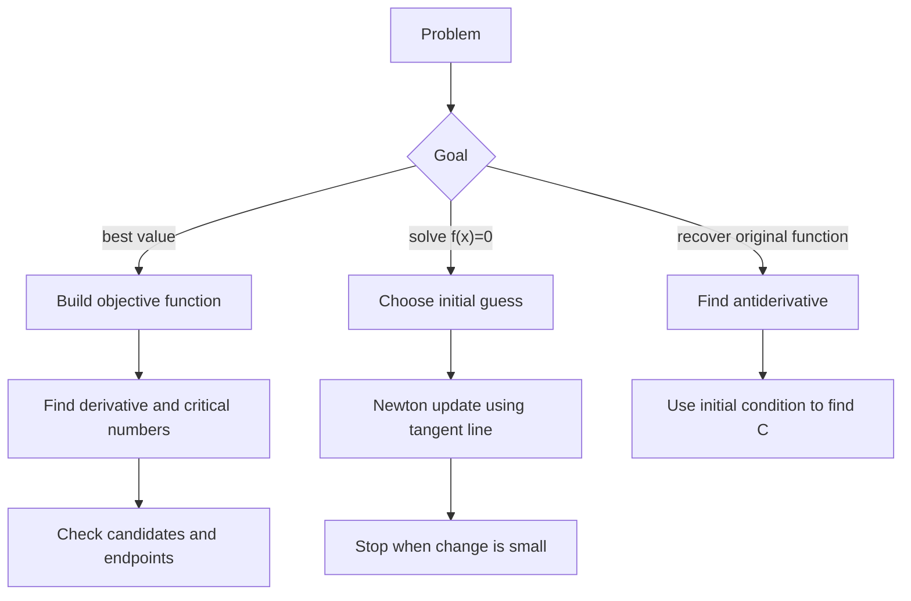

# Optimization Newton and Antiderivatives

Optimization uses derivatives to find the best value of a quantity under stated constraints. Newton's method uses tangent lines to solve equations numerically. Antiderivatives reverse differentiation and prepare the transition from derivative calculus to integral calculus. These topics are often taught near each other because all three depend on interpreting $f'$ as local linear information.


*Figure: Newton iteration uses local linearization to turn calculus into a fast root-finding algorithm. Image: [Wikimedia Commons](https://commons.wikimedia.org/wiki/File:Newton_iteration.svg), Oleg Alexandrov and Pbroks13, public domain.*

The shared habit is to turn a problem into a function, then use derivative information carefully. In optimization, zeros of $f'$ identify candidates. In Newton's method, $f'$ determines a tangent-line correction. In antiderivatives, knowing a derivative pattern lets us reconstruct a family of original functions.

## Definitions

An optimization problem asks for an absolute maximum or minimum of an objective function, often on a specified interval or under a constraint. Critical numbers and endpoints are candidates for extrema.

Newton's method approximates a solution of

$$
f(x)=0
$$

by repeatedly applying

$$
x_{n+1}=x_n-\frac{f(x_n)}{f'(x_n)}.
$$

The formula is obtained by taking the tangent line at $x_n$ and using its $x$-intercept as the next approximation.

An antiderivative of $f$ is a function $F$ such that

$$
F'(x)=f(x).
$$

The general antiderivative is written

$$
\int f(x)\,dx=F(x)+C,
$$

where $C$ is an arbitrary constant. The constant is necessary because functions differing by a constant have the same derivative.

Initial value problems choose the constant from a condition such as $F(a)=b$. For example, if $v(t)$ is velocity, then position is an antiderivative of velocity, and an initial position determines the constant.

## Key results

The closed interval method for optimizing a continuous function on $[a,b]$ is:

1. Find critical numbers in $(a,b)$.
2. Evaluate $f$ at the critical numbers and endpoints.
3. Compare the resulting values.

Continuity on a closed interval guarantees that absolute extrema exist by the Extreme Value Theorem. The derivative does not find endpoints directly, so endpoints must be checked separately.

For constrained optimization, the first challenge is often modeling. If a quantity depends on two variables, use the constraint to express one variable in terms of the other. Then optimize the resulting single-variable objective on its meaningful domain.

Newton's method comes from the tangent line

$$
L(x)=f(x_n)+f'(x_n)(x-x_n).
$$

Set $L(x)=0$ and solve:

$$
0=f(x_n)+f'(x_n)(x-x_n)
$$

so

$$
x=x_n-\frac{f(x_n)}{f'(x_n)}.
$$

The method can converge very quickly when the starting guess is close to a simple root and $f'(x)$ is not near zero. It can also fail, cycle, or jump away from the desired root when the tangent line is nearly horizontal or the starting point is poor.

Basic antiderivative rules reverse derivative rules:

$$
\begin{aligned}
\int x^n\,dx &= \frac{x^{n+1}}{n+1}+C \quad (n\ne -1),\\
\int \frac1x\,dx &= \ln|x|+C,\\
\int e^x\,dx &= e^x+C,\\
\int \cos x\,dx &= \sin x+C,\\
\int \sin x\,dx &= -\cos x+C.
\end{aligned}
$$

The antiderivative of acceleration is velocity, and the antiderivative of velocity is position. Constants of integration correspond to initial velocity and initial position.

Optimization modeling usually follows a repeatable workflow. First identify the objective, such as area, volume, cost, time, or distance. Then identify constraints, such as fixed perimeter, fixed volume, or geometric relationships. Use the constraints to reduce the objective to one independent variable whenever possible. Finally determine the domain from the context before differentiating. A correct derivative of the wrong objective function does not solve the problem.

The second derivative test is often efficient in optimization, but it is not the only justification. If the objective is continuous on a closed interval, comparing candidate values is decisive. If the objective is a quadratic with negative leading coefficient, its graph opens downward and its vertex is a maximum. If a derivative sign chart changes from positive to negative, the first derivative test proves a local maximum even when the second derivative is unavailable.

Newton's method is local. Near a simple root, the number of correct digits often roughly doubles at each step, a property called quadratic convergence. Far from the root, the tangent line may point to an irrelevant region. For functions with multiple roots, flat tangents, or discontinuities, a bracketing method such as bisection may be slower but more reliable. A practical numerical workflow often combines methods: bracket a root first, then use Newton's method once a good starting value is known.

Antiderivatives should always be checked by differentiating the result. This is the simplest way to catch missing constants, wrong powers, and sign errors in trigonometric antiderivatives. For instance,

$$
\frac{d}{dx}(-\cos x)=\sin x,
$$

so $\int \sin x\,dx=-\cos x+C$. The sign is not a convention; it is forced by differentiation.

## Visual



| Task | Derivative role | Required caution |
|---|---|---|
| Optimization | $f'=0$ gives interior candidates | endpoints and domain matter |
| Newton's method | tangent slope gives correction | avoid $f'(x)\approx 0$ |
| Antiderivatives | reverse known derivative rules | include $+C$ |
| Motion recovery | integrate acceleration or velocity | initial conditions set constants |

## Worked example 1: optimize area with fixed perimeter

**Problem.** A rectangle has perimeter $40$ meters. Find the dimensions that maximize its area.

**Method.**

1. Let length be $x$ and width be $y$. The perimeter constraint is

$$
2x+2y=40.
$$

2. Solve for $y$:

$$
x+y=20
\quad\Rightarrow\quad
y=20-x.
$$

3. Write the area as a function of one variable:

$$
A(x)=xy=x(20-x)=20x-x^2.
$$

4. Determine the meaningful domain. Since both dimensions are positive,

$$
0<x<20.
$$

5. Differentiate:

$$
A'(x)=20-2x.
$$

6. Set $A'(x)=0$:

$$
20-2x=0
\quad\Rightarrow\quad
x=10.
$$

7. Then

$$
y=20-10=10.
$$

8. Check that this gives a maximum. Since

$$
A''(x)=-2<0,
$$

the area function is concave down, so the critical point is a maximum.

**Checked answer.** The maximum-area rectangle is $10$ m by $10$ m, a square. Its area is $100$ square meters.

## Worked example 2: Newton's method and an antiderivative

**Problem.** Use Newton's method to approximate $\sqrt{10}$ by solving $x^2-10=0$, starting with $x_0=3$. Then find the position $s(t)$ if acceleration is $a(t)=6t$, velocity satisfies $v(0)=4$, and position satisfies $s(0)=1$.

**Method for Newton's method.**

1. Let

$$
f(x)=x^2-10,
\qquad
f'(x)=2x.
$$

2. Newton's update is

$$
x_{n+1}=x_n-\frac{x_n^2-10}{2x_n}.
$$

3. Starting with $x_0=3$:

$$
x_1=3-\frac{9-10}{6}=3+\frac16=\frac{19}{6}\approx 3.1667.
$$

4. Next iteration:

$$
x_2=\frac{19}{6}-\frac{(19/6)^2-10}{2(19/6)}.
$$

Compute

$$
\left(\frac{19}{6}\right)^2=\frac{361}{36},
\qquad
\frac{361}{36}-10=\frac{1}{36}.
$$

Thus

$$
x_2=\frac{19}{6}-\frac{1/36}{19/3}
=\frac{19}{6}-\frac{1}{228}
\approx 3.1623.
$$

**Method for antiderivatives.**

1. Since $a(t)=v'(t)=6t$,

$$
v(t)=\int 6t\,dt=3t^2+C.
$$

2. Use $v(0)=4$:

$$
4=3(0)^2+C
\quad\Rightarrow\quad
C=4.
$$

So

$$
v(t)=3t^2+4.
$$

3. Since $v(t)=s'(t)$,

$$
s(t)=\int(3t^2+4)\,dt=t^3+4t+D.
$$

4. Use $s(0)=1$:

$$
1=D.
$$

**Checked answer.** Newton's method gives $\sqrt{10}\approx 3.1623$ after two iterations. The motion functions are

$$
v(t)=3t^2+4,
\qquad
s(t)=t^3+4t+1.
$$

Both parts can be checked directly. For Newton's method,

$$
(3.1623)^2\approx 10.0001,
$$

so the residual is small. For the motion functions,

$$
s'(t)=3t^2+4=v(t),
\qquad
v'(t)=6t=a(t).
$$

The initial conditions also check:

$$
v(0)=4,\qquad s(0)=1.
$$

These checks are not optional bookkeeping; they confirm that the constants and the numerical approximation match the original problem.

The same checking habit applies to optimization. After finding a candidate, substitute it back into the original constraint, not only the reduced formula. In the rectangle problem, $x=10$ and $y=10$ give perimeter $2(10)+2(10)=40$, so the dimensions satisfy the constraint. If a candidate produced a negative length or violated a physical restriction, it would have to be discarded even if it came from $f'(x)=0$. The derivative finds candidates; the original problem decides which candidates are admissible, meaningful, and useful.

That final interpretation step is where calculus returns to the applied question and its original units, constraints, and purpose.

Without it, optimization is only algebra and symbolic exercise.

## Code

```python
def newton(f, fp, x0, steps=5):
    x = x0
    for _ in range(steps):
        x = x - f(x) / fp(x)
    return x

root = newton(lambda x: x*x - 10, lambda x: 2*x, 3.0, 4)
print(root)

def position(t):
    return t**3 + 4*t + 1

for t in [0, 1, 2]:
    print(t, position(t))
```

## Common pitfalls

- Forgetting to check endpoints in closed-interval optimization.
- Optimizing a formula outside the domain allowed by the physical problem.
- Assuming every critical point is a maximum or minimum without a sign or second derivative check.
- Using Newton's method when $f'(x_n)=0$ or nearly zero.
- Stopping Newton's method without checking whether $f(x_n)$ is actually small.
- Omitting the constant $C$ in an indefinite integral.
- Using an initial condition for velocity to determine the position constant, or vice versa.

## Connections

- [Applications of Derivatives](/math/calculus/applications-of-derivatives): optimization uses derivative tests from curve analysis.
- [Implicit Differentiation and Linearization](/math/calculus/implicit-related-rates-linearization): Newton's method is repeated tangent-line approximation.
- [Definite Integrals and the Fundamental Theorem](/math/calculus/definite-integrals-fundamental-theorem): antiderivatives become evaluation tools for definite integrals.
- [Integration Techniques and Improper Integrals](/math/calculus/integration-techniques-improper-integrals): more advanced antiderivative methods extend the basic rules.
